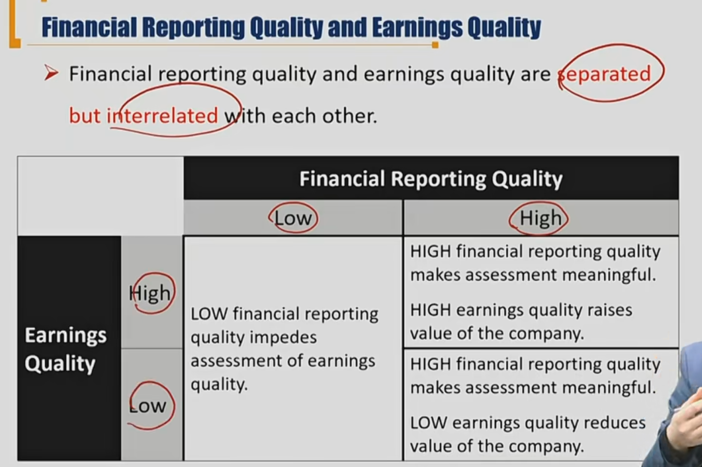
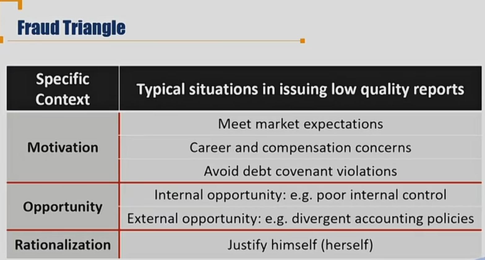
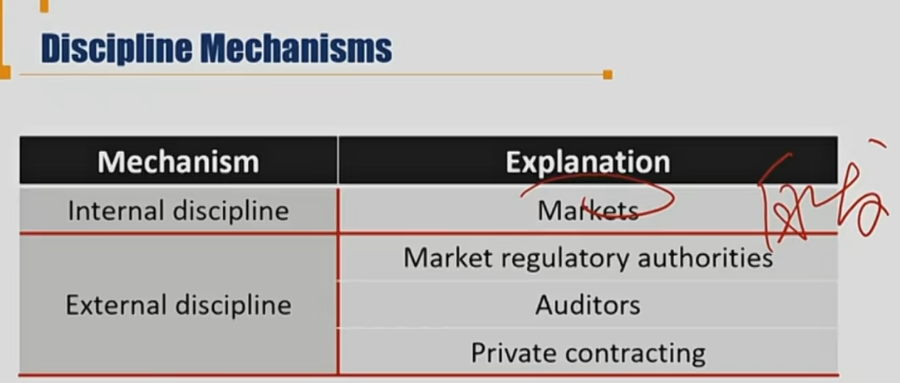
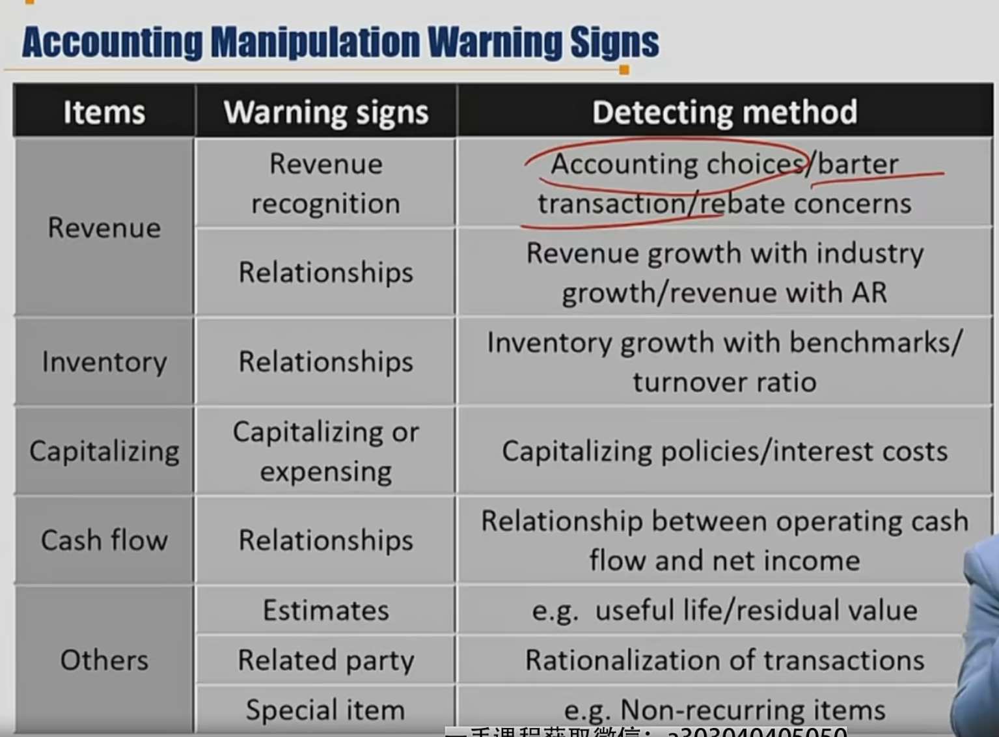
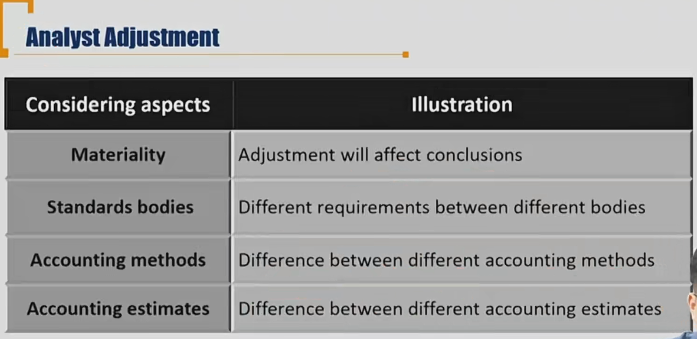
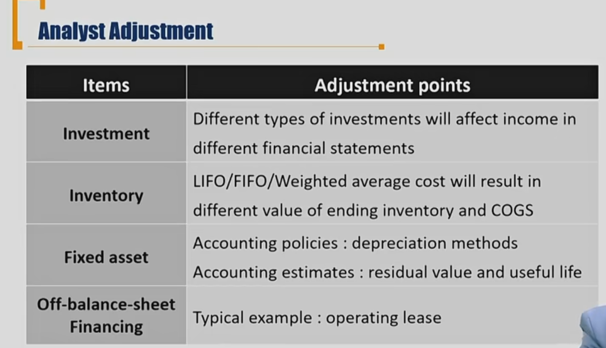

## 1、Financial reporting quality

#### Reporting quality and earning quality

- Financial reporting quality 镜子清不清晰
  - High quality reporting
    - provides decision-useful information:
    - relevance and faithful representation
- Earning Quality 照镜子的人美不美
  - High quality earnings
    - provides sustainable and adequate return判断的维度：盈利**可持续**、**充足的**（和asset、行业发展匹配）

#### Quality Spectrum

Fictitious transaction 虚构交易

earnings management盈利管理，抓住会计准则漏洞等

#### Conservative vs Aggressive

Aggressive Accounting

- 提前确认收入\延后确认费用
- 增加当期利润，但当期的高利润不具有持续性

Conservative Accounting

- 延后确认收入/提前确认费用
- 减少当期利润，是的未来利润有所增长
- 依旧是有偏差的

不是说越保守就越好，越准确才越好。

| Capitalize                                  | vs   | Expense                    |
| ------------------------------------------- | ---- | -------------------------- |
| Longer useful life of fixed assets          | vs   | shorter useful life        |
| Higher estimates of salvage values 残值更高 | vs   | lower estimates            |
| Smaller valuation allowance on DTA          | vs   | larger valuation allowance |

#### Fraud Triangle欺诈三角形

舞弊对于三个要素缺一不可：动机、机会、借口（rationalization）。Justify himself，自我安慰。

#### Discipline Mechanisms 约束机制

内部和外部约束。

#### Accounting Manipulation Warning Signs

barter transaction：以物易物

rebate concerns: 返点交易，回扣

revenue with AR：大部分都是应收账款

rationalization of transactions：交易合理化（比如和关联方交易）

non-recurring items：非经常性项目

## 2、Financial Statements Analysis Applications

#### Pro-Forma 预测未来收益

#### Assessing Credit Risk - 4C，判断信用风险

Capacity还款能力, Collateral抵押物, Covenants保护, Character还款意愿

#### Credit Scoring

- Scale and diversification
- Operational efficiency
- Margin stability
- Leverage

#### Equity Investment Analysis

| Item             | Illstration                                                  |
| ---------------- | ------------------------------------------------------------ |
| Analysis methods | Top-down analysis宏观到微观；bottom-up analysis.             |
| Investor types   | **Growth investors**成长型投资者: high earnings growth; **Value investors**价值型投资: relatively low share price; **Market-oriented investors**: intermediate |

#### Analyst Adjustment

站在CFA角度调整，按照自己分析的目标去调整。

materiality: 重要性原则

表外融资 off-balance-sheet financing