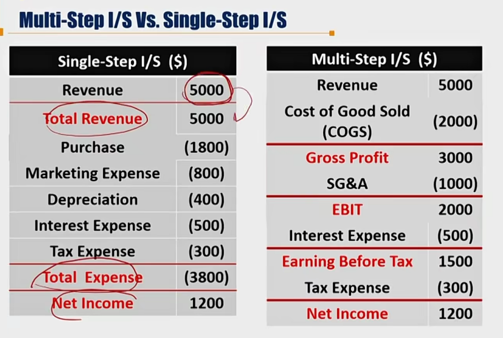
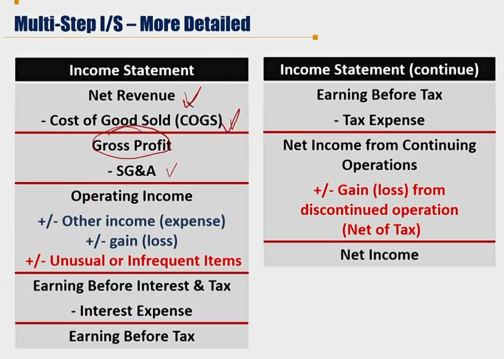
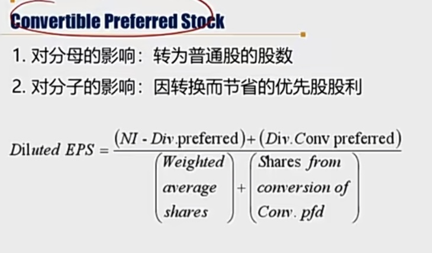
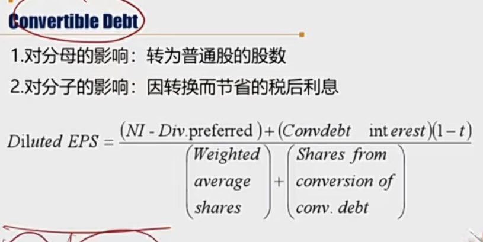
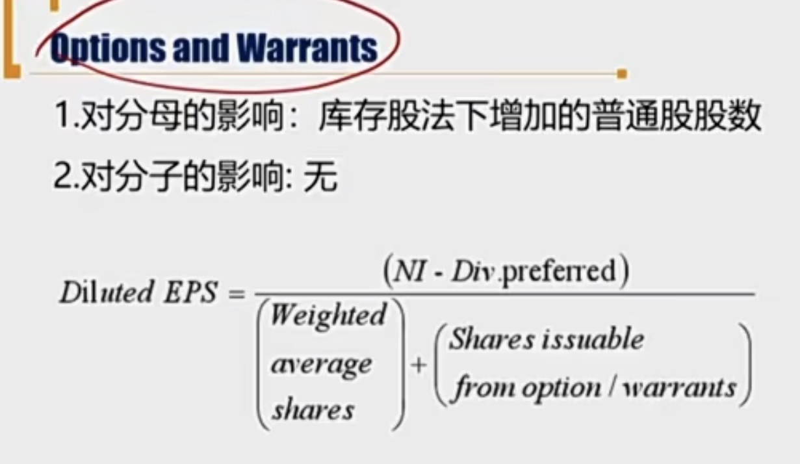
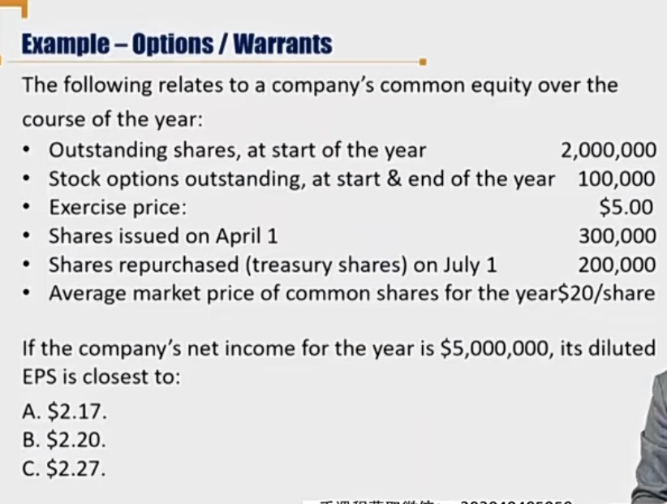

# V3-M3 Income Statement

### 1）Components and Format

**Net Income** = **Revenues** + Other Income + Gains 							前两个主营业务，后面一个是偶发利得

​					**\- ordinary expenses** - other expense - losses				前两个主营业务，后面一个是偶发损失

​					*\+/- gain(loss) from unusual or infrequent Items*（非经常性）

​					*\+/- gain(loss) from discontinued operation*（停业经营）								

分类方法：

1. 前两行是recurring item，后两行是non-recurring Item 非经常性项目

2. 前三行是continued项目，第三行是discontinued 项目（停业项目）

收益对应费用（业务相关），利得对应损失（偶发性）。

- Revenues are the amounts charged for the sales of goods or services in the ordinary activities of a business.
  - Revenue adjusted for estimated discounts（rebates折扣，返点要扣除） is **net revenue**.
- Expenses reflect outflows, depletions of assets.
  - Expenses are grouped together by their **nature or function**. 费用按照nature和function区分

#### Multi-Step I/S vs. Single-Step I/S

一般都用Multi-Step

SG&A: Selling, General and Administrative Expenses. 营销管理费用

by nature：单步法中的科目，例如Depreciation（放在多步法的COGS、SG&A中）

by function: 多步法中的科目，例如COGS（包含单步法的depreciation）

上面是简化的多步法。

#### 更加详细的多步法 

#### Non-recurring items

- Unusual or infrequent items(**continuing operations**)
  - Reported "**above the line**" (指的是在EBT之前，**税前列支**)and presented on a pretax basis
    - impairment, write-offs, write-downs(**资产的减值**)
    - Restructuring costs资产重组
    - Gain / Loss from the sale of assets/ business**处置资产、业务线**
    - 火灾都算continuing operation
- Discontinued operation(presented on **net of tax**（税后列支））
  - When a company disposes of or establishes a plan to dispose of one of its component operations and will have no further involvement in the operation（比如将要出售的子公司的收入，计入discontinued operation）:（注意区分下面两个record）
    - **During the phaseout period**（淘汰期）: Any loss or gain should be recognized in the **discontinued operations**要卖的业务条线运营过程中产生的gain or loss记在discontinued operations，税后列支
    - **On the actual disposal date**（真正卖的那天）: any loss or gain on the sale of the business should be recognized in **the unusual or infrequent items(above the line)**。真正卖掉该业务条线所产生的G/L，计入unusual or infrequent items中。（复习，上面的Unusual的第三点：G/L from the sale of assets/business)
  - Reported "below the line"

### 2）General principles of Revenue/Expense Recognition

#### Revenue Recognition - General Principles

##### Accrual method of accounting 权责发生制

- Revenue is recognized when it is earned and expenses are recognized when it is incurred.
- Accrual accounting does not necessarily coincide with the receipt or payment of cash.

#### Expense Recognition - General Principles

- A general principle of expense recognition is **matching principle**（匹配性原则，指的是**时间上的匹配**： 同时）**重要**
  - COGS，确认销售收入的**同时**，结转已售商品成本，体现匹配性原则（注意unearned revenue或者deferred revenue的情况，在确认收入的时候，在结转成本）
  - Depreciation and amortization（折旧和每期的利润对应匹配）
  - Doubtful account（收不回来的应收账款，呆账和对应的应收账款匹配）
  - Warranties（保修费用，和对应的销售收入同时确认，匹配）
- Period expenses期间费用: cannot be directly tied to revenue generation, should be expensed in the period incurred. 无法和对应的销售收入匹配的情况，计入期间的费用即可。
  - Administrative cost. 行政管理费用（SG&A）

#### Aggressive accounting & conservative Account 激进和保守

- Aggressive accounting policies means increase the assets, revenue and decrease liabilities and expense. 激进=>提升Asset, Revenue，减少liabilities, expense. **注意，都是会计准则允许的范围内的操作。**
  - Earlier revenue recognition => aggressive
  - Later expense recognition => aggressive
  - Later revenue recognition => conservative
  - Earlier expense recognition =>  conservative

比如，完工时确认收入vs. 根据进度确认收入

### 3）Five Steps in Recognizing Revenue 五步法简单了解

1. Identify the contracts with a customer. 识别与客户定义的合同。
2. Identify the performance obligations in the contract. 识别厂商的履约义务。
3. Determine the transaction price. 确定交易价格（含折扣，如果交易价格不确定，确定为厂商最有可能收到多少钱）。
4. Allocate the transaction price to the performance obligations in the contract. 将交易价格分配到单项履约义务。比如按照公允价格，分摊整体交易价格到单项履约义务上（售出的商品）。
5. Recognize revenue when (or as ) the entity satisfies a performance obligation（商品控制权转移）. 完成其中一项履约义务时确认收入。（比如，分批交货）

一些要点：

- 区分履约义务有两点：1客户可以单独从商品单独或借助已有资源收益，商品明确可区分。2、从合同中单独区分分开单项服务或商品。
- 可以按照完工进度确认收入(consideration：a payment or reward)
- 可变对象要有估计，确认可以收到的时候才计入该对象。（比如，如果两年内完工，合同约定奖金二十万。只有建造商有充分证据确认肯定可以两年内完工，才可以确认收入。）

- 履约义务的修正，对应的成本、交易价格等都要进行调整

- 全额法确认收入：每一笔费用都进行确认，净额法确认收入：轧差后列示（NI / Sales会更高）
- Revenues are reported gross（全额法） if the Company is acting as a Principal（主要责任人） and net（净额法） if the COpany is acting as an Agent(代理人)

### 4）Basic Earnings Per Share 重点

EPS is the most commonly used corporate profitability performance measure for **publicly-traded firms**针对已上市公司

- Basic EPS
- Diluted EPS

A **simple capital structure**（基本资本结构） contains no potentially dilutive securities.

- Firm reports only basic EPS

A **complex capital structure**(复杂资本结构) contains potentially dilutive securites.（涉及可转债等）

- Firm must report both basic and diluted EPS.

#### Basic EPS

Basic EPS =

 (NI - Dividend for preferred stock) / weighted average number of common shares outstanding

- Weighted average number of common share **outstanding**(发行在外的，不包括回购的股票)
  - new issue, repurchase is **weighted** by time(days or months一般是月份)增发需要加权平均
  - stock dividend/split is **not** weighted by time, instead it should **adjust the number of common share which exist before the stock dividend or split**（追溯调整）. Eg. 3-for-2 split: two shares split to three shares。（3-for-2意思是2股拆成3股，如果是1-for-2,表示2股并成1股）
  - 10% stock divident = 11-for-10，10股拆成11股，原来股数乘1.1. For example, if a company issues a stock dividend of 5%, it will pay 0.05 shares for every share owned by a shareholder.

- 例子：

  - 1月1号有1000股，12月1号增发500股：分母=1000\*12/12+500\*1/12

  - 1月1号1000股，5月1号拆股1拆2，分母不变
  - 1月1号1000股，7月1日增发1000股，12月1号一股拆两股：
    - 窍门：**拆股前的股份，进行追溯调整**（因为时间对拆股没有影响）
    - 调整后，1月1号，有2000股，7月1号2000股
    - 则，年末的时候分母=2000\*12/12+2000\*6/12=3000股

  - 1月1号1000股，6月1号一股拆两股，7月1号增发1000股：
    - 调整后，1月1号2000股，7月1号增发1000股（拆股后面的不变）
    - 则分母=2000\*12/12+1000\*6/12=2500股

  - 1月1号本来有1000股，3月1号增发600股，五月1号2-for-1，七月1号回购400股，10月1号10% stock dividend:

  | Date     | Common Stock       | Adjustments                | Subtotal |
  | -------- | ------------------ | -------------------------- | -------- |
  | Jan 1st  | 1000 outstanding   | 1000\*2\*1.1\*(12/12)=2200 | 2200     |
  | Mar 1st  | 600 new issue      | 600\*2\*1.1\*(10/12)=      | 1100     |
  | May 1st  | 2-for-1 split      |                            |          |
  | July 1st | 400 repurchase     | -400\*1.1\*(6/12)          | -220     |
  | Oct 1st  | 10% stock dividend |                            |          |

  所以，分母=2200+1100-220=3080

### 5) Diluted Earnings Per Share 稀释后每股盈利，重点

#### Diluted EPS

- Dilutive securities **decreases EPS** if（假如行使了权力，假想的情况） exercised or converted into new common stock
  - Convertible preferred stock 可转换优先股
  - Convertible debt 可转债
  - Stock options / Warrants 期权（看涨期权）或权证
- Anti-dilutive securites（反稀释） **increase EPS** if exercised or converted into common stock. (Don't include such security in the computation of dilutive EPS)（排除掉反稀释的部分）
- **Diluted EPS can not be higher than Basic EPS.** 稀释后必须比原来的EPS小

#### Convertible Preferred Stock

分子：减所有优先股，加回所有可转换的优先股

一个anti-diluted 的例子

Orange Company's net income for 2004 was \$7,600,000 with 2,000,000 shares outstanding. The average share price in 2004 was \$55. Orange had 10,000 shares of eight percent \$1,000 par value convertible preferred stock outstanding since 2003. Each preferred share was convertible into 20 shares of common stock. Orange Company's diluted earnings per share(Diluted EPS) for 2004 is closet to :

优先股红利=1,000\*10,000\*8%=800,000

分子=7,600,000 - 800,000 + 800,000.  所有优先股都可转换，所以分子相当于没有减。

分母 = 2,000,000 + 10,000\*20=2,200,000

所以，初步算的Diluted EPS是3.45

**但是，我们必须验算EPS是否大于Diluted EPS:**

EPS = (7,600,000-800,000) / 2,000,000 = 3.4 < 3.45，

所以这是anti-diluted的情况，故Diluted EPS = 3.4

#### Convertible Debt

- Convertible Debt Interest 需要乘（1-Tax Rate)。
  - NI = EBIT - I - T，先减利息再减税。多交利息，减少了EBT，从而可以减税。所以不用给债券利息时，虽然多了EBT，但是多交了税EBT \* t。

Golden Service Inc. had net income \$1,250,000, and pays **non-convertible** preferred sotck dividend \$120,000. The company had a weighted average of 500,000 common shares outstanding during the year. There was \$750,000 of 8% convertible bonds outstanding, convertible into a total of 60,000 shares. Assuming the tax rate of 30 percent, calculate Golden Service'd diluted EPS:

Answer:

calculate the numerator: 1,250,000 - 120,000 + 750,000 \* 8%(1-30%)=1,172,000

denominator:500,000 + 60,000 = 560,000

算出来是，2.093。别忘了核算anti-diluted

1250000-120000/500000=2.26，所以diluted EPS是2.09

#### Options and Warrant

期权和权证

#### Treasury Stock Method for Options and Warrants

- Funds received from the exercise of the options would be used to **hypothetically repurchase** shares in the market at the **average market price**. 期权被行权后，公司收到的现金要被假定从市场中重新回购股票，注意是以**全年的平均价格回购**
  - shares issuable from options/warrants = 行权后股数 - 行权获得的现金 / 全年平均股价
- The net increase in the number of shares: the difference between the number of **shares issued** and the number of shares **hypothetically repurchesed.** 分母增加数等于期权行权的增发股数减去假设回购的数量。

Procedure:

1. 计算weighted average common shares: 

2,000,000\*12/12+300,000\*9/12-200,000\*6/12=2,125,000

2. calculate basic EPS. 计算basic EPS: 5,000,000 / 2,125,000

3. 计算diluted EPS:

   5,000,000 / (2,125,000 + 100,000 - 5 \* 100,000 / 20)

4. 验算小于basic EPS得到最终的 diluted EPS. 

如果期权执行价格 < 全年平均价格，计算的diluted EPS肯定比basic EPS小。

#### Earnings Per Share 总结

记得算完后要对比basic EPS

### 6）Analysis of Income Statement & Comprehensive Income

#### Common size Income Statement

- Express each income statement item as **a percentage of sales**. 利润表中的项目都表示为销售收入的百分比。

- Used to analyze changes in cost structure, profitability and company's strategies. 可以横向和其他公司，纵向和以往期间比较。

#### Comprehensive Income

**Comprehensive Income**

- Comprehensive Income综合收益 includes both **net income** and **other comprehensive income**.

CI = NI + OCI

**Other Comprehensive Income**

- Foreign currency **translation** gains and losses
- Adjustments for minimum pension liability(DB Plan) 养老金精算假设变动（actuarial精算）
- **Unrealized** gains and losses from **cash flow hedging** derivatives.
- **Unrealized** gains and losses from **available-for-sale** securities. 可供出售金融资产，注意是为实现收益（不是trading securites）
- Valuation surplus for long-lived asset(IFRS only)

Dividend不会影响OCI，而是作为NI的一部分。

- **CI = OCI + NI**
- **Begin. Equity + CI - Dividend = End. Equity**

### 错题

5. 看清是net revenue

7. Some related costs require specific accounting treatment under the new standards. In particular, **incremental costs of obtaining a contract and certain costs incurred to fulfill a contract must be capitalized under the new standards** (i.e., reported as an asset on the balance sheet rather than as an expense on the income statement). If a company had previously expensed these incremental costs in the years prior to adopting the converged standard, all else equal, its profitability will initially appear higher under the converged standards. 资本化某些成本，在新准则下，盈利变高。

13, 14 

17. diluted BPS 分母是**weighted** average shares

24。**Begin. Equity + CI - Dividend = End. Equity**
