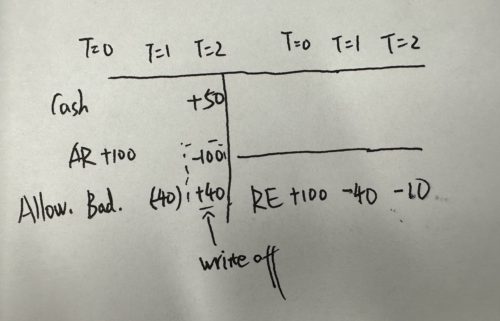
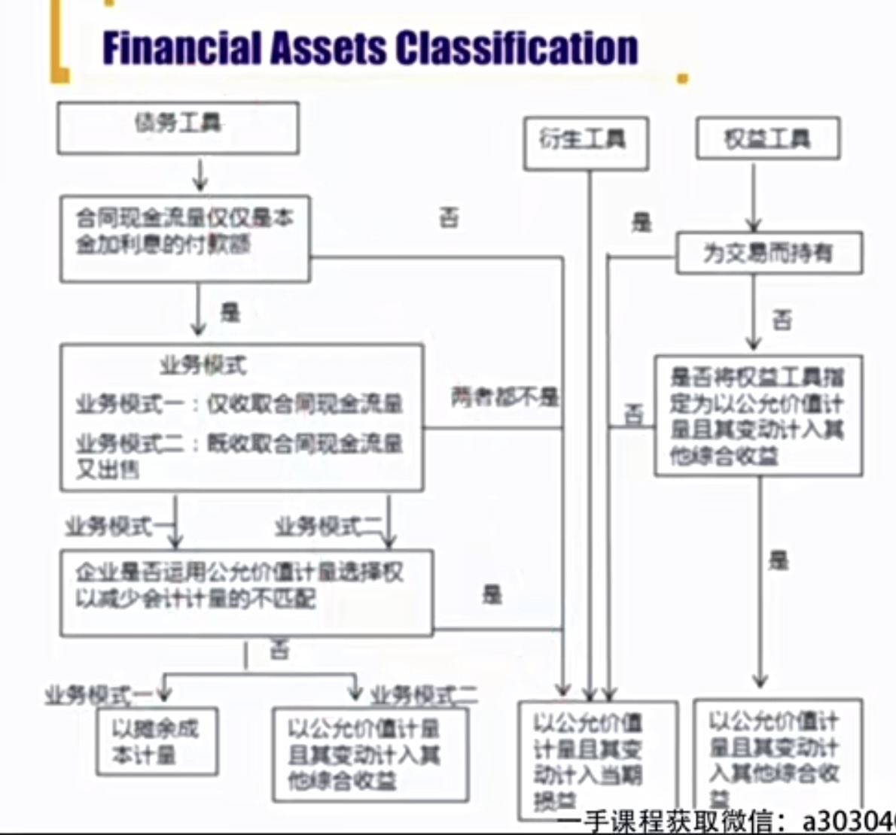
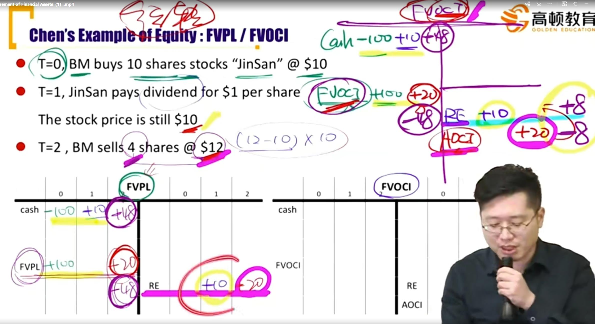
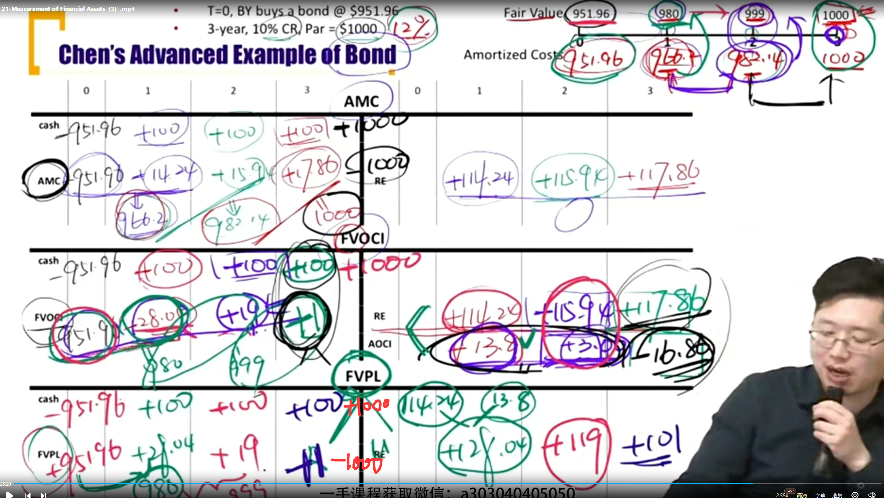

# 2）V3-M4 B/S

### 1) Components and Format of B/S

**Assets**

- Provide probable future economic benefits controlled by an entity as a result of previous transactions.
- 被企业控制、经济利益流入、可靠计量
- Current and Non current assets(long term assets)

**Liabilities**

- Obligations owed by an entity from previous transactions that are expected to result in an outflow of economic benefits in the future.
- Current and non current liabilities(long term liabilities)

**Equity**

- Residual interest in assets that remains after substracting a firm's liabilities.

#### Current Assets

- Current assets are held for the purpose of trading or expected to be sold, used up, or otherwise realized in cash within **one year** or **one operating cycle** of the business, whichever is greater. 区分current asset按照在一年和一个营业周期的最大值。

  - Cash and cash equivalents 现金
  - Account receivable 应收账款（AR）
    - A **contra account**（备抵账户） is **allowance for bad debts**（坏账准备）：在资产端列示，作为应收账款收不到时的的准备。

  

  - Inventory
    - **Unsold** units of product on hand
  - Short-term **marketable** securities 短期能够卖掉的金融资产

#### Non-current Asset

- **Non-current assets** are **not** expected to be sold or used up within **one year** or one **operating cycle** of the business, whichever is **greater**.
  - Property, Plant, and Equipment(PPE)
    - A contra account（备抵账户） is **accumulated depreciation**（累积折旧）
    - Net PPE = PPE - A. Dep.
  - Intangible assets
    - Patents, trademarkets, copyright and **goodwill**（商誉）
    - A contra account is **accumulated amortization**（注意商誉属于无形资产，但是**不摊销**，只减值（impariment））
    - tangible 和 intangible 都是在non-current asset的范围内
    - 摊销对于无形资产，折旧对于固定资产来说，其实本质相同
  - Long-term investment 长期投资
  - Deferred tax assets DTA 递延所得税资产

分类：

- Identifiable Asset
  - current asset
  - non-current asset
    - tangible asset
    - intangible asset
- Non-identifiable asset

#### Liabilities

- Liabilities are creditors' claims on the company's resource.
  - Accounts payable (应付账款)
  - Unearned revenue 
    - Cash received in advance whereas the revenue will be recorded on future income statement.
  - Accrued expense 先确认了费用，但是钱没有付出去
    - Cash paid later whereas the expense is recorded now.
  - Tax payable 
    - Taxes accrued during the past year but not yet paid.

  上面四个都是current liabilities

  - Long-term debt
    - Current portion of long term debt. （注意这个current portion是current liability，也就是一年内要还的债务的部分（本金）。比如房屋贷款分每年偿还，未来一年要还一部分本金和利息（注意利息是在利润表中））
  - Deferred tax liabilities **DTL**

补充：contingent liabilities或有负债，不在资产负债表中，有可能在notes或者MD&A。有可能形成的负债，不如被人起诉，有可能要赔钱。（good will 计算有涉及）

#### Measurement of Financial Elements 计量属性

也就是资产负债表中的数字用什么规则记录。

| Measurement                      | Explanation                                                  |
| -------------------------------- | ------------------------------------------------------------ |
| Historical cost                  | The amount originally paid for the asset                     |
| Amortized cost摊余成本           | Historical cost adjusted for amortization of discount / premium. |
| Current cost（Replacement cost） | The amount the firm would have to pay today for the same asset.重新置办一遍，要多少钱 |
| (Net) Realizable value           | The amount for which the firm could sell the asset.(sell price - cost to sell) |
| Present value                    | The discounted value fo the asset's expected future cash flows |
| Fair value                       | The amount at which two parties in an arm's-length transaction would exchange the asset.(Willingness Knowledgeable, Unrelated) |

> “Arm's length” is an expression which is commonly used to refer to transactions in which two or more unrelated and unaffiliated parties agree to do business, acting independently and in their self-interest.

#### Owners' Equity(Net asset)

- Owners' equity is the residual claim on a company's resources(E = A - L).
  - Capital 股本（1元1股），对应additional paid-in-capital
  - Additional paid-in-capital（资本公积）
    - Capital in excess of par。募集的钱超过股本的钱，如发行100股，10元/股，股本1元/股。则资本溢价，资本公积就是900元。（如”10转10“，就是从APIC转到capital中）
  - Treasury stock库存股(**No voting right, no dividend**)（属于回购的股票，这个是备抵科目，是个**负数**）（比如增发股票100元，cash+100，Capital和APIC+100，然后回购股票100元时，cash-100，Treasury stock-100）
    - treasury stock = issue share - outstanding share
    - Stock repurchased by the firm but **not yet retired**未被注销（可以用来未来员工股权激励等）
  - Retained earnings(**NI - Dividend**) 留存收益，和净利润产生勾稽关系
  - Accumulated other comprehensive income(AOCI)
  - Minority Interest 少数股东权益

### 2）Analysis of Balance Sheet

- A balance sheet can be used to assess a firm's liquidity, solvency, adn ability to make distributions to shareholders.对股东的分配能力
  - From the firm's perspective, liquidity is ability to meet its short-term financial commitments.
  - Solvency is the ability to meet the company's long-term finnacial obligations.
- Common size of B/S
  - Item in the balance sheet in percentage in **total Asset** (总资产里的百分比)
  - 可以分析Asset中流动和非流动占比，可以观测负债和所有权益比重。

### 3） Classification of Financial Asset金融资产

#### Financial Assets

- Financial assets are a company's investments in **stocks** issued by another company or its investments in the **notes**, **bonds**, or **other fixed-income instruments** issued by another company(or issued by a government entity)

#### Previous Standard 划分标准，老准则

1. Held for trading 为了交易而持有
2. Available-for-sale 可供出售，也不一定卖。
3. Held-to-maturity 持有至到期

#### Current Standard 当前标准，划分方法其实和旧标准有区别

1. Financial assets are measured at amortized cost(AMC) 以摊余成本计量
2. Financial assets are measured at fair value through other comprehensive income(FVOCI)以公允价值计量且其变动计入其他综合收益
3. Financial assets are subsequently measured at fair value through profit or loss.（FVPL） 以公允价值计量且其变动计入当期损益的金融资产

#### Classification

- **Debt** instruments are measured at **amortized cost**, **FVOCI**, or **FVPL**

- **Equity** instruments are measured at **FVPL** or **FVOCI**

### 4) Measurement of Financial Assets

- All financial assets are measured at **fair value** when **initially** acquired(which will generally be equal to the cost basis on the date of acquisition). 初始获得金融资产时，以公允价值计量。
- **Subsequently**, financial assets are measured at either **fair value** **or amortized cost**. 之后，按照公允价值或者摊余成本计量。

#### General principles of measurement

**Subsequently** 的计量：

|                        | FVPL               | FVOCI                          | AMC                |
| ---------------------- | ------------------ | ------------------------------ | ------------------ |
|                        | (held for trading) | (available-for-sale)           | (held-to-maturity) |
| Carrying value账面价值 | fair value         | fair value                     | amortized cost     |
| Realized G/L           | net income         | net income                     | net income         |
| Unrealized G/L         | net income         | **other comprehensive income** | **not available**  |

- 注意FVOCI的unrealized才计入OCI，realized计入NI.

关于Realized 和Unrealized G/L的分类:

|                | Equity                                           | Bond                                                         |
| -------------- | ------------------------------------------------ | ------------------------------------------------------------ |
| Realized G/L   | Dividends                                        | **Interest Revenue**（ 不是coupon! 因为coupon应该是cash flow in） |
| Realized G/L   | RCG(Realized Capital Gain)                       | RCG                                                          |
| Unrealized G/L | UCG(Unrealized capital gain浮盈浮亏，还没卖股票) | UCG                                                          |

- 本期利息收益（Interest Revenue）=期初摊余成本 \* 实际利率

Example:

- 最后FVOCI的时候，需要将AOCI结转到RE，8块钱的浮盈变为RCG。

#### Measurement of AMC

- Effective rate method 实际利率法
  - 实际利率：实际利率一经确定，不能轻易改变（除非重大信用风险变动）
  - 在利润表确认的是Interest Revenue = 期初摊余成本 \* 实际利率
  - 摊余成本：
    - BASE法则：期初+增加-减少=期末（Begin + Add + Subtract = End）
    - 期初摊余成本 + Interest Revenue - Coupon payment = 期末摊余成本
    - 或者用计算器，计算 
  - 实际利率=coupon rate，平价发行
    - 实际利率 < coupon rate，溢价发行
    - 实际利率 > coupon rate，折价发行
  - 平价发行，利息收益等
    - 溢价发行时，利息收入小于coupon，并且逐渐减小，下降的速度逐渐变快
    - 折价发行时，利息收入大于coupon，并且逐渐变大，变大的速度逐渐变快
    - Interest Expense = 期初摊余成本 乘以 实际利率
    - $\Delta$ Interest Expense = （期末 - 期初） 乘以实际利率 = （Intereset Expense - Coupon Payment） 乘以实际利率
    - 通过上面判断利息的变动
- 例子

注意债券使用FVOCI计量时，使用公允价值计量，而不是amortized cost

### 错题本

3、4、8、9、10、15、16

- good will difference between the purchase price paid for an acquisition and the **fair value** of the acquired
