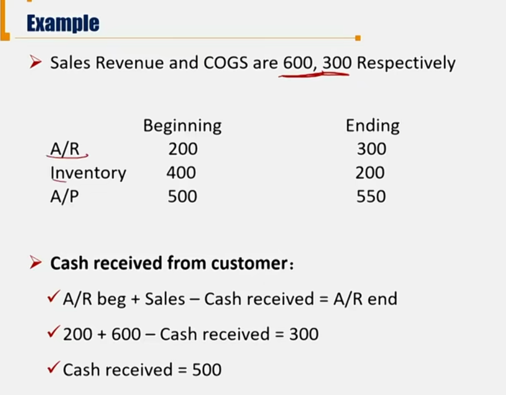
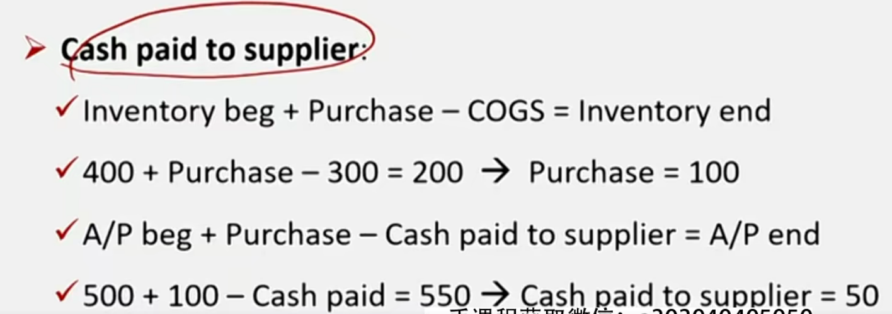
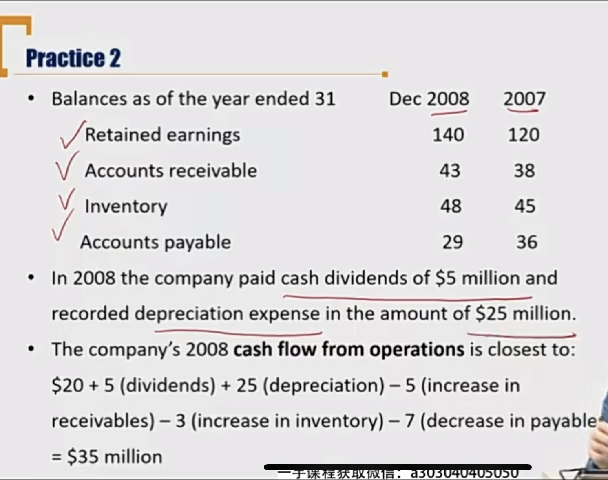

# V3-M5 Cash Flow Statement

Cash Flow的着重点在编制CFO，CFI，CFF

### 1）Cash Flow classification under GAAP and IFRS

#### Components and Format

- Information about a company's **cash receipts** and **cash payments during** an accounting period.
  - 收付实现制、时间段概念
- Information on the CF/S come from **two sources**
  - Income statement items
  - Changes in current balance sheet accounts 流动资产、流动负债

CFO + CFI + CFF = **Change in cash balance for the current year** 

**Change in cash balance for the current year**  + Beginning cash balance 

= Ending Cash Balance

- Cash flow from operating activities(CFO)
  - Include the company's **day-to-day activities** that create revenues and other activities that affect a firm's net income. 日常经营
- Cash flow from investing activities(CFI) 投资性现金流
  - Consists of activities of purchasing and selling **long-term assets** and **other investments**, **exclude** any securities considered cash equivalents and securities held for dealing or trading purposes. 购买长期资产（固定资产），其他长期股权投资（为了控制其他公司买了其他公司股票等），（排除掉交易目的的金融资产）
- Cash flow from financing activities (CFF) 融资性现金流
  - Include financing activities of **obtaining** or **repaying capital**。融资行为，发债券，发股票，还债券本金等。

#### US GAAP 更有可能考

##### CFO under US GAAP

Cash flows from **operating activities** cash flows resulting from major business of company.

| Inflows                               | Outflows                                                     |
| ------------------------------------- | ------------------------------------------------------------ |
| Cash received from customers          | Cash paid to suppliers                                       |
| **Interest received**                 | **Interest paid**                                            |
| **Dividend received**                 | Cash expenses paid for ordinary business(salaries, taxes, advertising...) |
| Sale proceeds from trading securities | Acquisition of trading securities                            |

- 注意，Dividend paid在US GAAP下时**CFF out**！
- 交易性金融资产，也属于CFO

##### US GAAP CFI

Cash flows from investing activities

cash flows resulting from acquisition and disposal of long-term asset and other investment

| Inflows                                                      | Outflows                                  |
| ------------------------------------------------------------ | ----------------------------------------- |
| Sale proceeds from PP&E intangible assets                    | Acquisition of PP&E, intangible assets    |
| Sale proceed from **non-trading** securities                 | Acquisition of **non-trading** securities |
| **Principal** received from loans made to others都是对于投资方而说（把钱借给别人，收回本金） | Loans made to others（把钱借给别人）      |

- 借别人钱（CFF in），还钱CFF out

##### CFF under US GAAP

Cash flows resulting from transactions that affect firm's capital structure

| Inflows                                                | Outflows                                 |
| ------------------------------------------------------ | ---------------------------------------- |
| Principal amounts of debt issued(发行债券，向别人借钱) | Principal paid on debt（还钱还本金）     |
| Proceeds from issuing shares（发行股票，融资）         | Payment to repurchase shares（回购股票） |
|                                                        | Dividends paid to shareholders           |

上面的借款分为两方

投资方来说：借钱出去（CFI out），收到还款（CFI in）

融资方来说：收到贷款进来（CFF in），还款出去（CFF out）

#### US GAAP vs. IFRS

| Items                              | US GAAP | IFRS            |
| ---------------------------------- | ------- | --------------- |
| Interest **received** （flow in ） | CFO     | CFO or **CFI**  |
| Dividends **received** (flow in )  | CFO     | CFO or **CFI**  |
| Interest **paid**(flow out)        | CFO     | CFO or **CFF**  |
| Dividends **paid**(flow out)       | **CFF** | CFO or **CFF**  |
| Taxes paid(flow out)               | CFO     | CFO, CFI or CFF |

IFRS 可以让企业选择。税收里，看税收的基础属于什么业务。

### 2) Calculation of CFO in Direct Method

#### Methods to calculated cash flow

- CFO calculation

  - Direct method: begin at the top of the income statement and identify cash inflows and outflows.

  - Indirect method: begin at the bottom of the income statement with net income and make necessary adjustment. 间接法只会涉及到CFO的计算。

- CFF/CFI calculation: direct method

| Cash received from customers | Beginning A/R(应收账款) + Revenue - Cash received = Ending A/R |
| ---------------------------- | ------------------------------------------------------------ |
| $-$ Cash paid to suppliers   | Beginning A/P（应付账款） + **Purchase** - **Cash paid** = Ending A/P |
|                              | Beginning Inventory + **Purchase** - COGS = Ending Inventory |
| $- $ Cash paid to employees  | Beginning wage payable + Wage expense - **Cash Paid** = Ending wage payable |
| $- $ Interest Paid           | Beginning interest payable + Interest Expense - Cash Paid = Ending Interest Payable |
| $ - $ Taxes paid             | Beginning tax payable + ***taxable income \* tax rate*** - **cash paid** = ending tax payable |
| = CFO                        |                                                              |

- 主要原理BASE公式：Begin + Add - Subtract = Ending

- A/P: account payable
- 采购（Purchase） 不是会计科目，是中间变量。需要通过Inventory和COGS计算出来。
- taxable income \* tax rate 不能用tax expense替代，这两者不相等(refer to Tax Module)
  - Tax expense = tax payable + $\Delta$DTL - $\Delta$DTA
  - 这里用的是Taxable payable，实际交给税务机关的税
- 一般考cash paid to suppliers或received from customers

### 3) Calculation of CFO in Indirect Method

| Net Income                                                   | I/S items |
| ------------------------------------------------------------ | --------- |
| $+$ **Non Cash Charge**(NCC非现金支出) (eg. depreciation, amortization) | I/S items |
| $+/-$ **non operating items** (eg. gain from sailing the old machine) | I/S items |
| $-$ Increase in current **asset** account (e.g. A/R, Inventory注意，是这里是增量，是时间段数) | B/S items |
| $+$ Increase in current **liability** accounts(e.g. A/P, Tax payable) | B/S items |
| = CFO                                                        |           |

- NCC：depreciation 上升，expense增加，NI下降。所以要获得CFO，需要加上depriciation
  - NCC包括DTL，DTA对tax expense的影响，从而影响NI
  - +depreication + $\Delta$DTL - $\Delta$DTA
- Non operating items删去非经营性活动产生的利润（处置资产等）
- current资产上升，CFO下降（反），需要减去对应的$\Delta$ current asset
- current负债上升，CFO上升（正），需要加上对应的$\Delta$ current liability
  - 比如A/R和A/P. 如果AR上升，表示别人欠了更多钱。需要在NI中加回。
  - current liability调整CFO不考虑应付股利，因为dividend payable算作CFF（US GAAP）
  - current liability不考虑current portion of long-term liability，因为也是CFF
  - 记住：-$\Delta$ Current asset + $\Delta$ Current Liability （和DTL和DTA一个符号）

Example 1

Net Income \$100,000，Increase in accounts receivable 12,000, Increase in accounts payable \$9,000, depreciation and amortization \$8,000

CFO = 100,000 - 12,000  + 9,000 + 8,000 = 105,000

Example 2

### 4）Calculation of CFI

#### Sources of CFI

- Long-lived assets 长期资产
  - Cash used in purchase PPE and other intangible assets
  - Cash received from sale of PPE and other intangible assets
- Non-trading securities 非交易性金融资产
  - 注意交易non-trading securities期间中产生的dividend 或者 interest received在US GAAP中是CFO

#### CFI calculation

CFI = inflow - outflow

处置固定资产的计算，核心思路是BASE法则：

- 对于inflow，就是卖资产获得的钱（selling revenue）

- Selling revenue - NBV disposal = Gain/Loss

- 处置资产的Net book value：注意是NBV，要减去折旧

  - NBV disposal = Gross disposal(原值) - accumulated depreciation disposal - impairment disposal

- 对于outflow，就是购买资产的purchase，同理，利用BASE法则，对所有固定资产的Net book value进行求解

  - 初始 + 增加 - 减少 = 期末值

  - NBV total beg. + Purchase - (NBV disposal + depreciation expense + impairment) 

    = NBV total end.
    
    - 这里的depreciation expense和impairment是total的折旧和减值
    - 也就是NBV total的变动，包括购买资产、处置资产、资产折旧和减值

- 联系上面的公式，计算出CFI = inflow - outflow = Selling revenue - purchase

##### Example 1

A company sold a machine. Income statement shows 0.5 million gain from selling old machine and 4 million depreciation cost. The balance sheet costs:

|                          | 2012 | 2013 |
| ------------------------ | ---- | ---- |
| Machine Original Cost    | 12   | 19   |
| Accumulated Depreciation | (5)  | (7)  |

**During the year, company pay 10 million for new machine.**

1. How much did the company received from selling the old machine?
2. What is the CFI for this year?

Anwser:

根据Base 法则：

NBV total end. = NBV total begin. + Purchase - (NBV disposal + depreciation + impairment)

即19 - 7 = (12 - 5) + 10 - (NBV disposal + 4)所以，处置资产的NBV=1

所以，根据selling revenue - NBV disposal = Gain/Loss，得到

selling revenue = 0.5 + 1 = 1.5。所以，第一问卖资产得到1.5million现金，所以第二问的

CFI = inflow - outflow = selling revenue - purchase = 1.5 - 10 = -8.5million

##### Example 2

The company sold a machine. Income statement shows 0.5 million gain from selling old machine and 4 million depreciation cost. The balance sheet shows The same as Example 1.

What is the CFI for this year? 

这题缺少了purchase，所以要从关系等式中求：

19 - 7 = 12 - 5 + Purchase - (NBV disposal + 4)

所以，Purchase = NBV disposal + 9。

另外selling revenue = 0.5 + NBV disposal

CFI = inflow - outflow = selling revenue - Purchase = 0.5+NBV diposal - (9 + NBV disposal) = -8.5

所以CFI为-8.5 million。

所以，可以绕过处置资产的Net Book Value，求出CFI：

- CFI = Gain/Loss - Dep. Expense - $\Delta$NBV total

### 5) Calculation of CFF

Step 1: Review long-term debt and stock

- Increases supply cash and decreases use cash

Step 2: Dividend Paid。 先求Dividend declared，然后求Dividend paid

- Dividend payable end = Dividend payable beg. + Dividend declared（本期宣告发放） - **Dividend paid**（实际发放）
- 用下面求出Dividend declared:
- Retained Earning end = Retained earning beg. + Net Income - Dividend declared（宣告股利）

要注意，US GAAP下的dividend paid是放在CFF中核算

##### Example

Net income 1000

|                            | 2012 | 2013 |
| -------------------------- | ---- | ---- |
| Beginning Retained Earning | 500  | 1000 |
| Dividend Payable           | 300  | 200  |

How much cash dividend paid during 2013?

R/E Beg. + NI - Dividend declared = R/E end.

Dividend Declared = 500

所以：Dividend Payable end. = Dividend Payable Begin. + Dividend Declared - Dividend Paid

Dividend Paid = 300 - 200 + 500 = 600

### 6) Analysis of cash flow

Examine the major sources and uses of cash

- Operating Cash Flow CFO
  - An indication of the company's earning quality盈利质量，一般用CFO和Net Income比较。
- Investing Cash Flow CFI
  - Increasing **capital expenditures**, a use of cash, is usually an **indication of growth**.
- Financing Cash Flow CFF 
  - The nature of company's capital sources 资本结构
  - Cash requirement for debt repayments, share repurchase , or dividend payments.

#### Common size CF/S

有两种common size 分析方法：

-  Show each item as a percentage of Revenue
  - Cash flow statment account / Revenue
- Show each inflow as a percentage of total inflows; show each outflow as a percentage of total outflows
  - Cash inflow / Total cash inflows
  - Cash outflow / Total cash outflows

### 7) Free Cash Flow

自由现金流不是财务报表内的内容，是一种分析工具

Free cash flows are the cash flow **available for distribution**可供分配的 after fulfilling all **obligations**(operating expenses and taxes) and without impacting on the future growth plans of the company(**working capital**营运资本) and (**fixed capital**固定资产）不影响未来的增长计划

- Free cash flow to firm(FCFF): cash available to **creditors and shareholders** after all operating expenses and necessary investments have been made.归公司使用的现金流（股东+债权人）
- Free cash flow to equity(FCFE): cash available to **common** **stockholders** after all borrowing costs(principal and interest) have bee paid from FCFF.归股东使用的现金流（股东）

#### FCF Formulas

- FCFF = NI + NCC - WC Inv. - FC Inv. + Interest Exp. \* (1 - Tax rate) 

这里注意：NI + NCC - WC Inv. = CFO 

回顾之前的CFO的间接法，NI + NCC +/- 折旧 - $\Delta$ CA + $\Delta$CL(反、正)=CFO，假设这里没有折旧，那么由于WC Inv = $\Delta$CA - $\Delta$CL，CFO = NI + NCC - WC Inv.

- FCFF = CFO - FC Inv. + Interest Exp. \* (1 - Tax Rate)

注意上面利息费用需要把税的部分扣减。下面是股东使用的现金流，利息是股东付给债权人，所以FCFE要扣减利息费用，另外再加上进今年新借的钱。

- FCFE = FCFF -  Interest Exp. \* (1 - Tax rate) + Net debt borrowing

- FCFE = CFO - FC Inv. + Net debt borrowing

  - NI: Net income

  - NCC: non cash charges(depreciation and amortization)

  - FC Inv.: Fixed capital investment(net capital expenditure)

  - WC Inv.: Working Capital Investment

  - Net Debt Borrowing: Debt Issued - Debt Repaid
