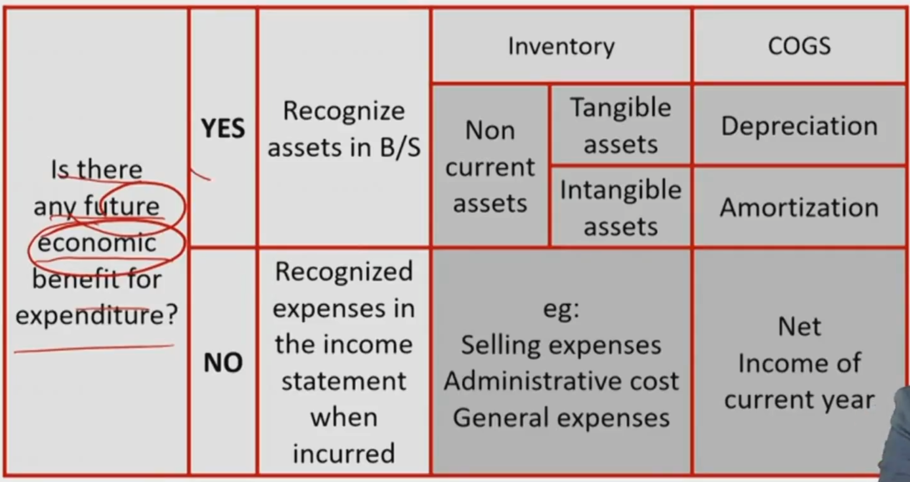
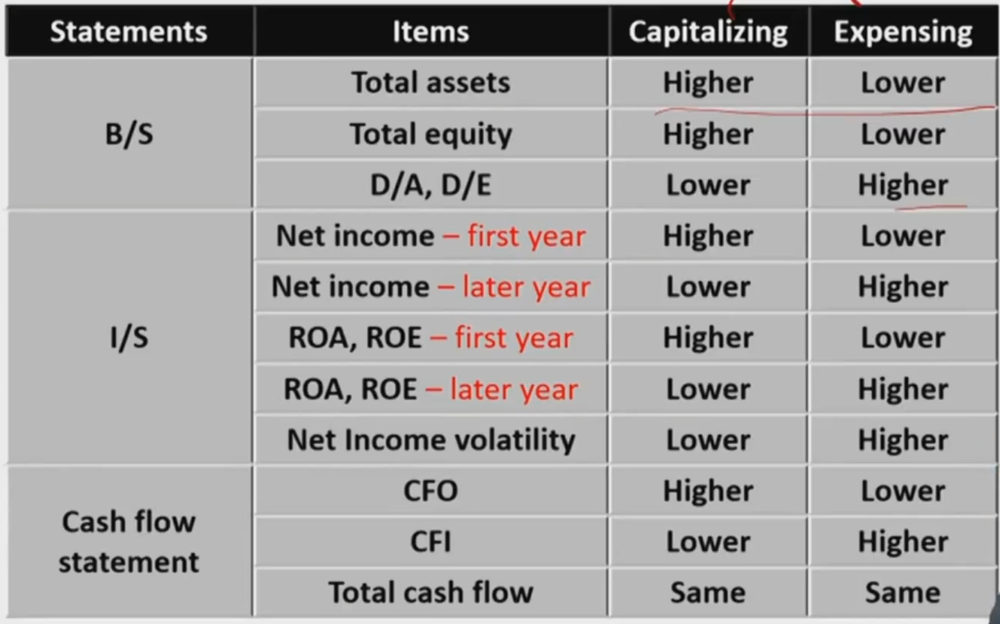
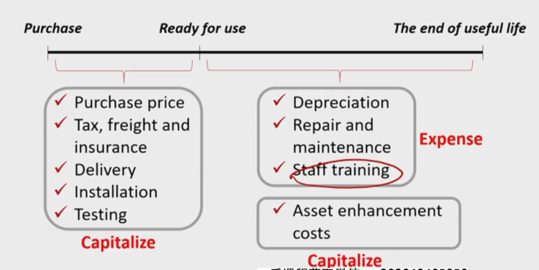
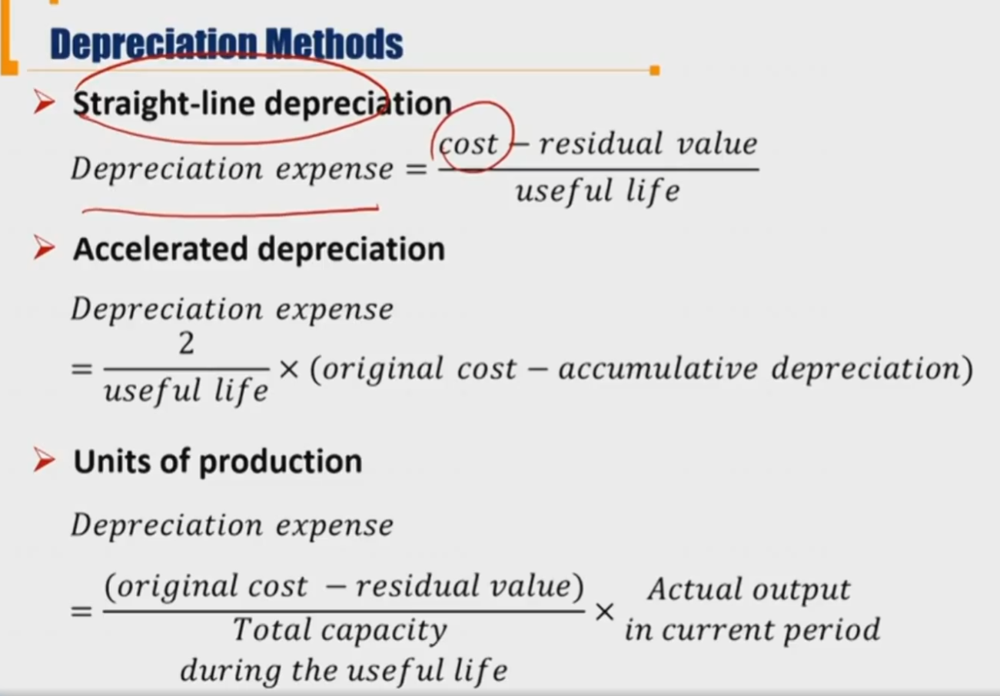
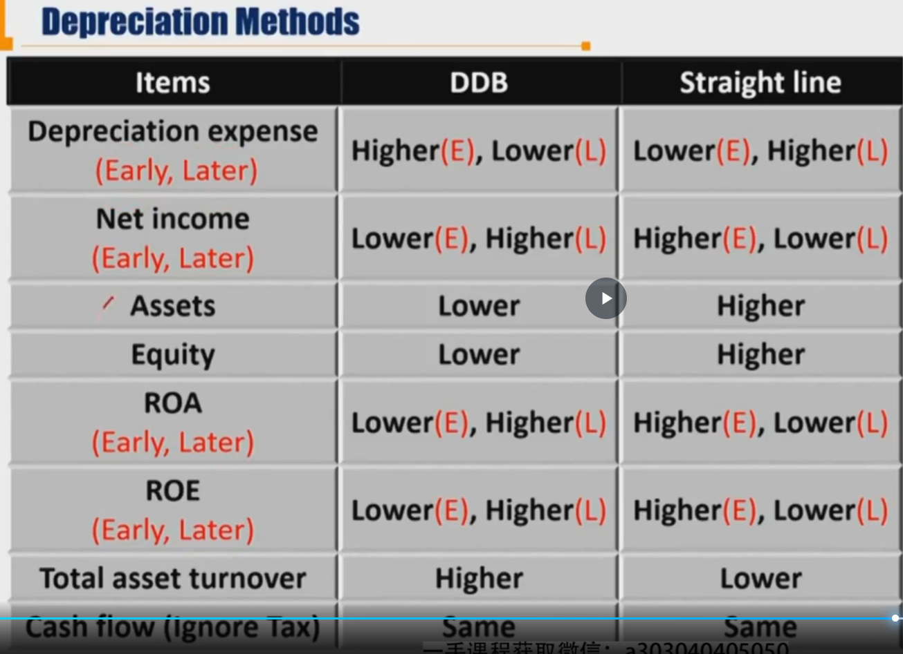

# V3-M6 Long-lived Asset

### Capitalizing vs. Expensing

Capital as an asset on B/S

Expenses on the I/S

- asset capitalized today will be expense in the future

(only Long-lived asset) Cash Flow Statement:

- Capitalized expenditures are classified as CFI(investing)
- Expensed expenditures are classified as CFO(operating)

注意：存货，capitalized and expense all recorded as CFO(operating)

会在未来带来收益，才能称作asset，关键看是否带来未来经济利益

资本化和费用化的影响

****

Equity时间点数，Net Income时时间段数。一开始Net Income资本化高，所以一直都是Equity高。

NI volatility 净利润波动率，费用化所有的支出都集中在第一年，所以波动性高。

ROA, ROE反应盈利趋势，和NI走势一致。

#### Cost of Tangible assets

only costs necessary for the machine to be ready for use ca be capitalized。只有可以使用时就可以资本化

其中要注意asset enhancement costs（大修，寿命提高，效率提高等）是资本化，

repair and maintenance（小修小补）是expense。

staff training是expense。

#### Capitalizing interest costs 利息费用资本化

- 分类
  - 对于constructing an asset for company's **own use** 产生的interest, 先capitalize 为 PPE，然后随着时间折旧depreciation
  - 对于constructing an asset to **sell**, capitalize 为inventory，然后卖出的时候作为COGS的一部分

during construction period, incurred interest **must** be capitalized as that asset's cost.

- 资本化interest，不在NI = EBIT - I - T的（I）中。但是计算EBIT / I的Interest coverage的时候，需要考虑资本化的interest

IFRS, interst income earned from temporary investment of borrowed fund can be deducted from capitalized interest.

借来的钱投资，扣减资本化利息。

- IFRS/US GAAP, capitalized interest expenditures are classified as CFI(investing) 

- expensed interest: CFO/CFF under IFRS, CFO under US GAAP

##### 对指标的影响

资本化的时候，逐年摊销capitalized interest（记在EBIT之前）

费用化interest时，第一年把利息支出全部当作interest expense，后面的年份不再涉及interest expense。

所以对于利润表的interest expense：第一年，利息费用化导致interest expense低；第二年往后，由于利息资本化的利息折旧在EBIT之前，所以不对interest Expense产生影响。EBIT - I = EBT; EBT - T = NI

- 对于CFI、CFO
  - 现金流发生都是在第一年。资本化利息当成CFI，所以CFI流出更多，先低后高
  - 同理，CFO在资本化利息时先高后低。

|                                                       | Capitalized interest | Expense Interest |
| ----------------------------------------------------- | -------------------- | ---------------- |
| NI                                                    | 先高后低             | 先低后高         |
| EBIT                                                  | 一直低               | 一直高           |
| Interest Expense                                      | 先低后一样           | 先高后一样       |
| Interest Coverage Ratio = EBIT / Interest趋势和NI一样 | 先高后低             | 先低后高         |
| CFI                                                   | 先低后一样           | 先高后一样       |
| CFO                                                   | 先高后一样           | 先低后一样       |

$$
\frac{EBIT}{I}=\frac{NI+I+T}{I}=\frac{NI+T}{I}+1=\frac{EBT}{I}+1=\frac{NI/(1-TaxRate)}{I}+1
$$

EBIT正比于（趋势相同）NI/I。

- Implication for analysis: treat as normal interest
  - For interest coverage ratio, analyst should include both the capitalized interest portion and the expensed portion
  - If a company is depreciating interest that it capitalized in a previous period, income should be adjusted to eliminate the effect of that depreciation.

### Intangible Assets

Purchased, patents etc

internally develop 内生 R&D cost

 unidentifiable intangible asset 不可辨认，Goodwill

#### Research&Development

Research: IFRS&US GAAP should be expensed as incurred研发阶段的风险较高，都当作支出

Development开发阶段

IFRS：Expensed as incurred except for certain criteria are met: technical feasibility of completing the intangible assets.开发阶段如果技术可行，可以资产化

US GAAP：expensed as incurred except for cost of software develop

- software under US GAAP
  - for sales: expensed as incurred，once technological feasibility is established , can be capitalized和IFRS一样。
  - for own use: expensed as incurred, can be capitalized if the project will be completed and the software will be used as intended.

|             | IFRS                                         | US GAAP                                                      |
| ----------- | -------------------------------------------- | ------------------------------------------------------------ |
| Research    | expenses                                     | expense                                                      |
| Development | 技术可行前（technical feasibility），Expense | 除了软件开发，expense                                        |
|             | 技术可行后，capitalize                       | 软件开发，如果拿出去卖，和IFRS一样；如果自己用，看软件是否未来会完成（probable that the project will be completed），如果不是则expense否则capital |

goodwill=total cost to purchase the target company - fair value of acquiree's net identifiable assets

- net identifiable assets = fair value of identifiable assets - fair value of the liabilities and contingent liabilities 可辨认资产公允价值-负债和或有负债（或有负债是有可能发生的负债，收购时必须要考虑，比如被收购方有10%可能输掉某个官司，要赔偿100万）
- 或有负债contingent liabilities披露在notes里

被收购方的可辨认净资产公允价值：

- 不包括被收购方本来已有的商誉

If the purchase price less than the fair value of acquiree's net identifiable assets, it's called **bargain purchase**买便宜了. any gain from bargain purchase is recognized in I/S. 买便宜了，在利润表里体现。

### Depreciation Method

三种折旧方法

- 注意：DDB分母是useful life，总的useful life；Units of production，右边的因子是实际的产出。

不同折旧方法引起的指标变动：DDB双倍折旧法， Straght line 直线折旧法

- ROA和ROE**趋势**和NI一样

- allocation of depreciation expense:

  - COGS -> gross profit margin

  - SG\&A -> affect operating expense

- longer useful life and higher residual value brings lower depreciation expense and higher net income

- Estimation of residual value:

​		IFRS: downward or upward

​		US GAAP: only downward

- Amortization 摊销

finite useful life intangible asset 才摊销

不进行摊销时（indefinite useful life)每年一次减值测试impairment tested

### Impairment of Long lived Asset 长期资产减值

- Held for use->减值测试 impairment test（出现了减值迹象的时候做）
  - 每年一次的减值测试：商誉goodwill，未达到使用状态的无形资产，使用寿命不确定的无形资产

- Held for sale 持有待售的固定资产
  - 划分为持有待售那天需要做减值测试
  - 账面价值carrying value = cost - accumulative depreciation > fair value - cost to sell
    - 这里不是NRV=预计销售价格-cost to sell(存货inventory公式)。因为长期资产很难快速定价。
  - 不再需要折旧 no depreciation from reclassification on.

#### IFRS held for use impairment

impairment happened if: 

carrying value of assets 账面价值 > **recoverable amount** 可回收金额 = 

​	**max**(fair value - selling cost, Value in use(PV of future cash flow))

减值金额就是上面两者的差

#### US GAAP held for use impairment

两步法：先确定要不要减值，然后确定减值多少

Step one: impairment test

carrying value of assets > undiscounted future cash flows generated by assets. **没有折现**的未来现金流 所有CF cash flow相加

Step two: impairment loss

carrying value - fair market value **or** PV of future CF，账面价值减公允价值，如果没有公允价值，取未来现金流的现值

#### Inventory impairment:

IFRS: carrying > NRV(Net realized value) = 预期售价 - cost to sell

GAAP: carrying value   > market value = [NRV, NRV - profit]中的replacement cost

#### Reversals of impairment of long-lived asset

- US GAAP:

held for use: recoveries not allowed

held for sale: recoveries are allowed, limited to the previous impairment loss.

- IFRS:

allowed to be reversed (except for goodwill), limited to previous impairment loss.

#### Inventory reversals of impairment

IFRS: allowed, **US GAAP: not allowed**

减值对指标影响

- 进行了减值，以后的摊销就会少，所以future income会上升
- 最后的cash flow是不考虑所得税的影响

### Reporting Model 计量模型

US GAAP: historical cost 可以用历史成本计量

IFRS:

Investment property: historical cost(容易核算), fair value（更好反映市场价值）

other long-lived asset: historical cost, **revaluation model**重评估模型

#### History cost IFRS, US GAAP

long-lived assets on the balance sheet are reported at amortized cost = original cost - accumulated depreciation（累计折旧） - impairment charges

#### Fair Value Model （IFRS）

只有IFRS和**投资性房地产**

investment property: for earning rental, capital appreciation or both. 出租或者增值的投资性放资产

Using fair value model:

- fair value
- any gain or loss arising from a change in the fair value of the investment property is recognized in profit and loss. 公允价值变动反映在利润表里。
- don't depreciate the assets。**不用减值折旧**，在公允价值里已经体现了折旧。折旧体现在利润表。公允价值的变动带来的损益都体现在利润表。

#### Revaluation Model (IFRS)

carrying amounts of long-lived assets are the **fair values** at the date of revaluation（重评估日，一般为12月31日）, and should consider accumulated depreciation and amortization.  同样，fair value中已经包含了折旧和摊销，不需要在fair value再减depreciation。但是，和fair value model 不一样，需要考虑折旧，这里折旧是在利润表中记载。所以利润表中包含了depreciation expense 和剩余的公允价值变动带来的gain /loss。

比如：100块设备，第一年折旧10，公允价值是85.

在fairvalue模式下，公允价值变动-15，全部以公允价值变动计入G/L，进入留存收益RE（-15）

在revaluation model模式下，利润表先计提折旧-10，然后计提公允价值变动损益-5，然后一起进入RE(-15)（殊途同归）（当然，只有损失才能计入I/S，收益需要计入OCI）

loss record in I/S,  gain recored as OCI(Other Comprehensive Income) 其他综合收益（surplus，加在OCI时先要冲销原来在I/S的损失）

- If the fair value initially increase after purchase, the difference between the fair value and purchase cost should be reported in revaluation surplus as OCI in equity. 记在OCI

- Subsequent decrease in fair value should write-off the revaluation surplus recorded previously first until zero and then go to income statement. 如果有损失，先冲销原来的surplus

- If the fair value initially decrease after purchase the decrease should be reported as losses in Income statement. 下跌先记在损益表内。

- Subsequent increase in fair value should reverse the losses recorded previously first and then, any amount in excess of the losses previously recorded should go to revaluation surplus as OCI inequity. 公允价值上升，先冲销原来的loss，然后记在OCI

- When an asset is retired or disposed of, any related amount of revaluation surplus included in equity is transferred directly to **retained earnings**. 留存收益。处置资产的时候，OCI还有价值，记在retained earning，不会经过I/S利润表。

  注意：$\Delta$ Retain earning = NI - dividend .这里的retain earning 不是从NI过来，所以retain earning不是会计恒等式。 

### Disposal of longlived asset 处置长期资产

if a long-lived asset is sold

- A G/L of disposal the difference between cash proceeds and book value of the asset sold at the time of sale, should be reported in income statement. 处置资产的损益记录在I/S.

if a long-lived asset is abandoned。直接丢掉资产

- A loss, the book value of disposed long-lived assets at the time of abandoned, should be reported in income statement. 记录一条损失。

If a long-lived asset is exchanged

- A G/L is reported at fair value of the asset given up(or fair value of asset newly acquired) 。交换资产。入账以自己给出的资产的公允价值计算。比如一台电视机换对方一个洗衣机。电视账面10￥，公允价值15￥，洗衣机账面9￥，公允价值14￥。那么账面记录入账一台洗衣机15￥，记录损益+5￥。如果放弃的资产没有公允价值，那就求其次，用得到的资产的公允价值。

### Disclosure requirements

#### For PPE

- IFRS:
  - measurement bases
  - depreciation method
  - useful lives( depreciation rate) used
  - gross carrying amount and accumulated depreciation at the beginning and end of the period
  - reconciliation of the carrying amount at the beginning and end of the period
  - disclosures of restrictions on title
  - pledges as security of PPE
  - contractual agreements  to acquire PPE
  - if **revaluation model** is used:
    - the date of revaluation
    - details of how the fair value was obtained
    - the carrying amount under the cost model
    - the revaluation surplus
- US GAAP:
  - depreciation expense for the period
  - the balances of major classes  of depreciable assets
  - accumulated depreciation by major classes or in total
  - a general description of the depreciation method(s) used in computing depreciation expense with respect to the major classes of depreciable assets.

#### Intangible Assets

- IFRS:
  - whether  the useful lives are indefinite or finite
    - If Finite:
      - useful lives (or, equivalently, the amortisation rate) used
      - the amortisation methods used
      - the gross carrying amount and the accumulated amortisation at the beginning and end of the period
      - where amortisation is included on the income statement
      - a reconciliation of the carrying amount at the beginning and  end of the period
    - If Indefinite:
      - carrying amount of the asset
      - why it is considered to have an indefinite life.
      - restrictions on title
      - pledges as  security of intangible assets
      - contractual agreements to acquire intangible assets
    - If revaluation model is used:
      - the date of revaluation
      - details of how  the fair value was obtained
      - the carrying amount under the cost model
      - the revaluation surplus must be disclosed.
- US GAAP:
  -  the gross carrying amounts  and accumulated amortisation in total and by major class of intangible assets
  - the  aggregate amortisation expense for the period
  -  the estimated amortisation expense  for the next five fiscal years

#### Disclosure about Impairment losses

- IFRS:
  - for each class of assets the amounts of impairment losses
  - reversals of impairment losses recognised in the period
  - where  those are recognised on the financial statements
  - in aggregate 
    - the main classes of assets affected by impairment losses
    - reversals of impairment losses
    - the main events and circumstances leading to recognition  of these impairment losses and reversals of impairment losses
- US GAAP: （在美国会计准备，held for use的资产没有reversal of impairment loss）
  - a description of the impaired asset
  - what led to the impairment
  - the method  of determining fair value
  - the amount of the impairment loss
  - where the loss is  recognised on the financial statements

## 错题本

7.  注意，Net Income变了，留存收益变了，equity也要随之变动。

35. 记得IFRS，在PPE减值的时候，比的是carrying amount 和 recoverable amount 可回收金额

40. IFRS不要求披露PPE的acquisition dates，要求披露useful lives和amount of disposals
41. IFRS不要求披露intangible asset 的 fair value, 要求impairment loss和amortization rate 
42. US GAAP要求披露long-lived intangible asset的estimated amortization expense for the next five fiscal years, 不存在减值的撤销reversal of impairment losses. IFRS要求披露useful lives，是否finite还是infinite和其他related details.

46. 公司从fair value 转为cost 或者revaluation model，当investment property 转为PPE时。
47. IFRS，当用cost model for investment properties时，需要披露useful lives。当用fair value model时，需要披露method for determining fair value, reconciliation between beginning and ending carrying amounts of investment property.

课本习题的：7，8，9，10，33，34，35，36，39，40，41，42，45，46，48

