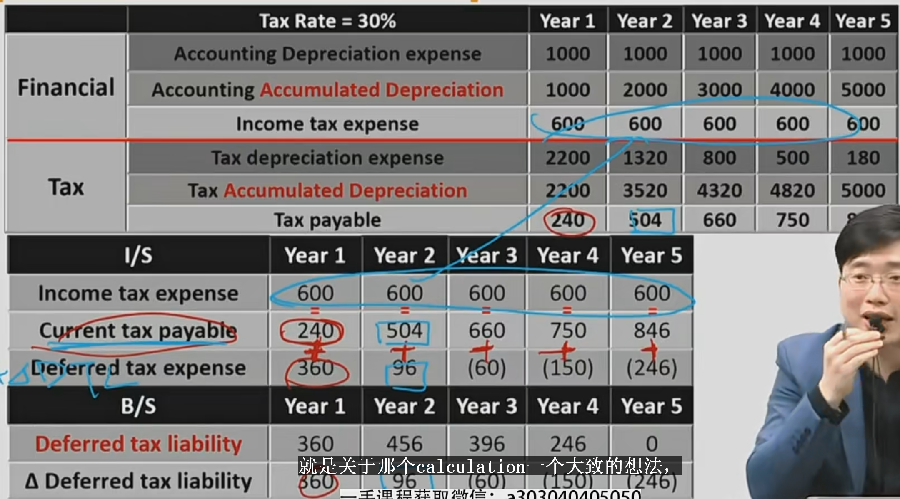
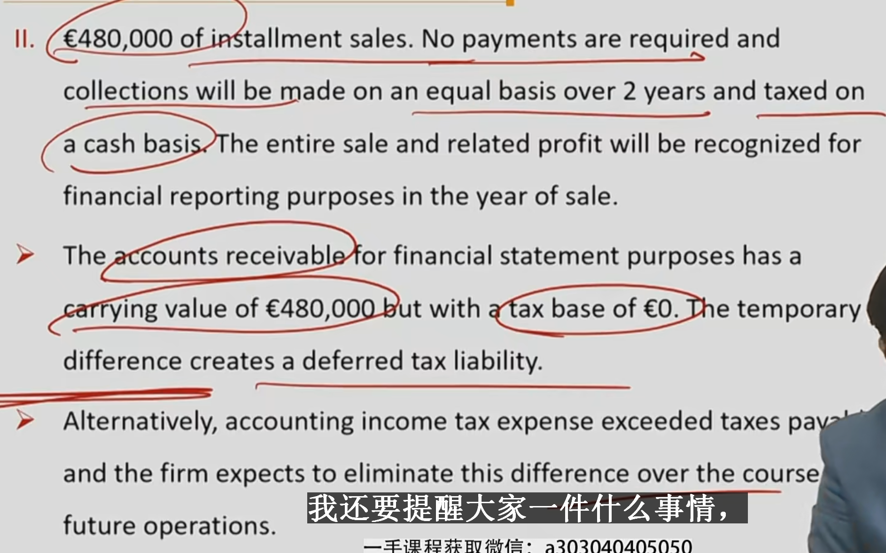
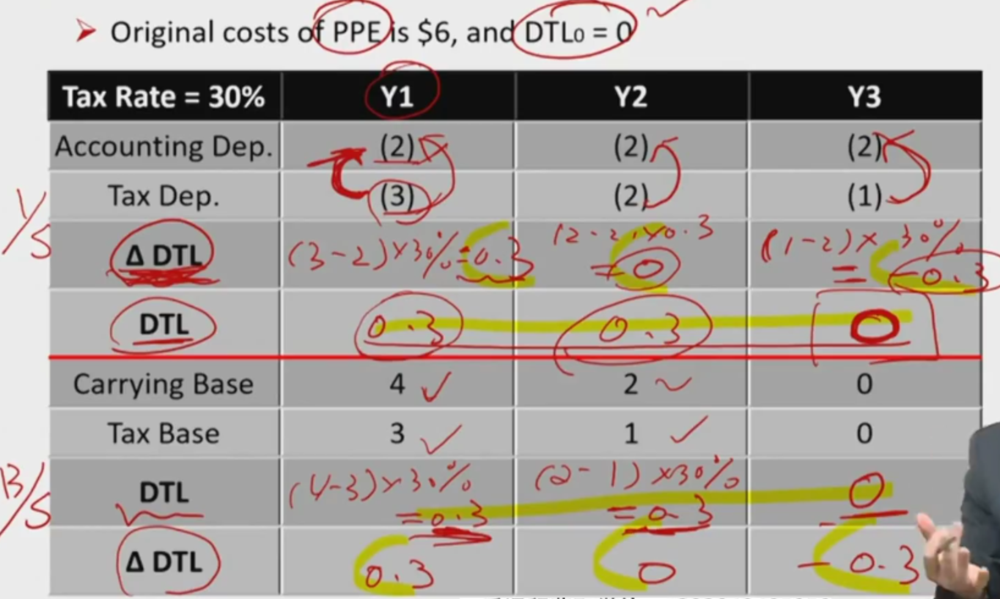
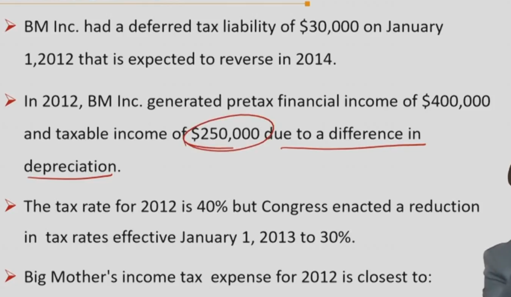
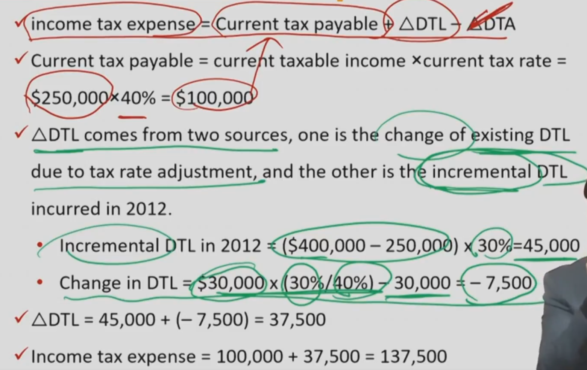
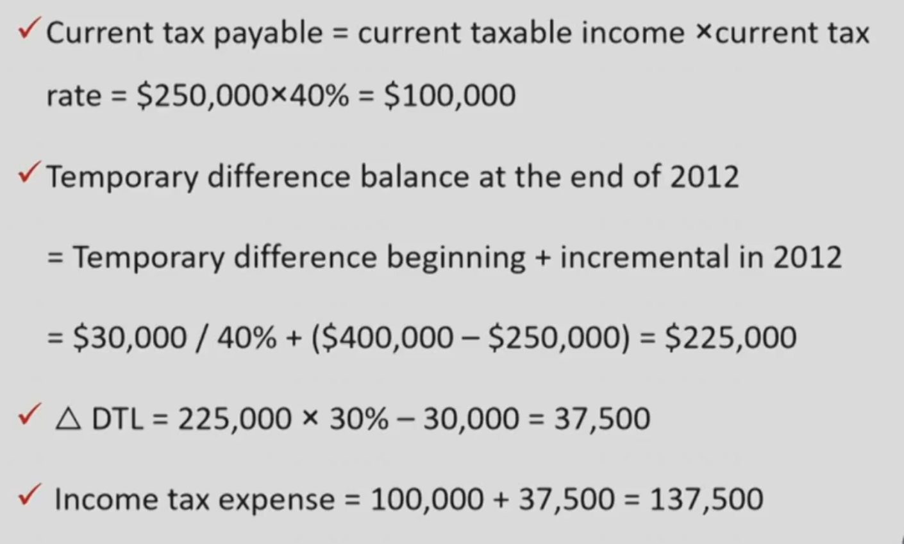

# V3-M7 Income Tax

### Financial Reporting & Tax Reporting 重要

| Income statement       | Tax Return                                                   |
| ---------------------- | ------------------------------------------------------------ |
| Revenue                | Taxable Revenue 部分收入不用交税（国债利息，为实现收益）     |
| - Expense              | - Deductible expenses 可抵扣费用，某些能不抵扣（比如行政罚款） |
| EBT Earning before tax | Taxable Income 应纳税所得                                    |
| - Income Tax Expense   | -> Current Tax Payable，当期应纳所得税根据应纳税所得额算出   |
| Net Income             |                                                              |

**所得税费用不一定等于EBT*t，如果有暂时性税会差异，或者没有差异的时候，才有，Tax Expense = EBT * tax rate。**

也就是说，如果有永久性差异，tax expense 不等于 EBT \* t

Accounting基于谨慎性原则，税务Tax基于现金Cash原则。Tax and account are two different system.

财务人员算出EBT，提交税务机关，税务机关计算current tax payable，然后财务人员才继续计算net income

#### Deferred Tax Items

Source of difference 税会差异，利润表和纳税申报表的差异

- Temporary difference /Timing difference-> deferred tax items（股票涨跌、等**，暂时性差异导致递延所得税项目**）
  - deferred tax liability, deferred tax asset
- permanent differences 永久性差异 （国债豁免税务等）
- Deferred tax liability DTL
  - a liability caused by temporary differences. 将来多交税。应纳税
- Defered tax asset DTA
  - an asset caused by temporary differences. 将来少交税。可抵扣
- Both DTLs and DTAs are presented on the B/S. （Not Netted **不可以轧差**，特殊，养老金轧差）

同一笔业务的可抵扣还是应纳税所得税差异，是累计的概念，有可能暂时一年多交或少交税。但是累计有应纳税，就是负债。 

#### Tax reporting

Taxable income = taxable revenue - tax deductible expense

taxes payable = taxable income $\times$  Tax rate

income tax paid = actual cash outflow for income tax(Actual cash outflow for tax in CFS)

#### Financial reporting

- pretax income(accounting profit) = Earning before tax (EBT)
- **income tax expense = taxes payable + $ \Delta$ DTL- $\Delta$ DTA 重要**
  - 时间段数：expense，所以是DTL和DTA需要使用$\Delta$, 期末量减去期初量
  - 真金白银交给税务机关的钱， current tax payable = taxable income * Tax rate

- 应纳税所得和可抵扣所得乘的是未来的税率

### Effective Tax Rate & Statutory Tax Rate 实际税率和法定税率

Taxes payable  = Taxable income $\times$ Tax Rate( this is statutory tax rate法定所得税)

暂时性差异时，EBT算出来的和使用DTL和DTA算出来的一样。存在永久性差异时，NI != EBT - Tax Expense. 比如国债收入不交税。

存在permanent differences时候，实际税率和法定税率不一样。以为豁免或者抵扣了部分应税额度

- Tax payable = taxable income $\times$ 法定税率
- Tax Expense = Tax payable + $\Delta$DTL-$\Delta$DTA （利润表中的等式）

- Tax Expense = EBT $\times$ 实际税率， 先算出Tax expense，倒推出effective tax rate

- 需要披露法定税率和实际税率的差异 tax disclose

### Tax Base & Carrying Value 计税基础和账面价值 重要

计税基础和账面价值之间有差异$\iff$ temporary differences暂时性差异$\implies$ DTA, DTL

#### Tax base

- Tax Base
  - **Tax base of asset**资产的计税基础: amount deductible(扣除) for tax purposes in future periods as economic benefits are realized
  - **Tax base of liability**负债的计税基础: the carrying value of the liability minus any amounts that will be deductible on the tax return in the future.（一般考试的时候是0）
- Permanent differences
  - tax base and carring value will be the same
- Timing differences
  - tax bases and carrying value will be different

#### Tax Base and Accounting Base of Assets

- Depreciable Asset
  - accounting base = original cost - accumulated accounting depreciation - impairment
  - tax base = original cost - accumulated tax depreciation(没有减值，体现税法的根据现金计算的思路)
- Research in R&D
  -  accounting base (**Expensed as incurred**) = zero(research 阶段都费用化）
  - tax base(**capitalized**) = original cost - accumulated amortization
- Account receivable
  - accounting base = invoiced amount - allowance for bad debt 
  - tax base = invoiced amount(**do not recognize allowance**, 体现了根据现金计算，出现了坏账，税务机关不认)

#### Tax Base and Accounting Base of Liabilities

- Customer advance 客户预付款
  - accounting base(accrual accounting)accrual account(权责发生制)
    - unearned revenue treat as a liability
  - tax base(cash accounting)
    - revenue is recognized no liability arise->**zero** 考试里就是0
- warranty liability 保修责任
  - accounting base(accrual accounting)
    - a liability is recognized for future obligation
  - tax base(cash accounting)
    - recognize an expense when cash outflow incurred->**zero** 考试里就是0

#### Determine DTA/DTL

**此表重要！！**

| Items     | carrying value > tax base | carrying value < tax base |
| --------- | ------------------------- | ------------------------- |
| Assets    | DTL                       | DTA                       |
| Liability | DTA                       | DTL                       |

e.g. In one liability, carrying value > tax base. according to definition:

tax base of liabilit = carrying value - 可抵扣 $\implies$ 未来可抵扣资产 > 0 $\implies$ 产生DTA

**Tax loss carrying forward** also results in a DTA.  之前的亏损可以抵扣掉现在的盈利，抵税产生DTA。（亏损弥补）

例子：

尽量用tax base 和carrying value去判断DTL还是DTA

### Calculations重要

#### Calculation of deferred tax items

- Determine deferred tax amount (I/S approach 利润表法)
  - 先算taxable income 和EBT的差异，确定 ($\Delta$DTL, $\Delta$DTA)，然后再求DTL和DTA
  - Identify the difference b etween **taxable income** and **accounting profit** for the year
  - If the difference is timing difference, changes of DTA or DTL ($\Delta$DTL, $\Delta$DTA)is generated.
- Determine deferred tax amount(B/S approach 资产负债表法，更推荐用这种方法)
  - Identify the difference between **accounting base** and tax base for every asset and liability items on the B/S. 对比账面价值和计税基础
  - calculate the DTA and DTL ending balance  based on the difference。直接算时间点数。
- 利润表中都是时间段数，所以算出来是Delta时间段数。B/S是时间点概念，所以算出来是时间点数DTL DTA。

例子1:

例子2:(advanced)如果税率发生变动，要在变动年进行DTL调整

original cost of PPE is \$6,  DTL_0 is 0, Tax rate change from 30% to 40% at the year Y2.

|                         | Y1                   | Y2                                    | Y3             |
| ----------------------- | -------------------- | ------------------------------------- | -------------- |
| accounting depreciation | (2)                  | (2)                                   | (2)            |
| tax depreciation        | (3)                  | (2)                                   | (1)            |
| $\Delta$DTL             | (3-2)$\times$30%=0.3 | 1）(2-2)*30%=0; 2) adjust 0.4-0.3=0.1 | (1-2)*40%=-0.4 |
| DTL                     | 0.3+0=0.3            | 0.3/30%*40%+0=0.4                     | 0.4-0.4=0      |
| carrying value          | 4                    | 2                                     | 0              |
| tax base                | 3                    | 1                                     | 0              |
| $\Delta$DTL             | 0.3-0=0.3            | 0.4-0.3=0.1                           | 0-0.4=-0.4     |
| DTL                     | (4-3)*30%=0.3        | (2-1)*40%=0.4                         | (0-0)*40%=0    |

notice: tax base of asset: 剩余可以折旧（扣除）的价值.

在第二年，税率发生变动，I/S方式计算时，需要对旧的DTL进行税率调整。调整完后，再重新计算当年的$\Delta$DTL。所以，推荐用B/S方法计算。

#### Calculation of tax expense

income tax expense = tax payable+dDTL-dDTA

### changes in statutory income tax rate

income tax expense = tax payable+$\Delta$ DTL-$\Delta$DTA
tax payable = taxable income * current tax rate

- current tax payable, the ending balance of DTL or DTA are both calculated at the end of each fiscal year
  - current tax payable should use the current tax rate. 应纳税额用今天的税率
  - calculate DTL and DTA should use future tax rate that expected to apply when the asset is realized or the liability settled. 递延项目用未来税率（未来才交税）
- DTA or DTLending = Temporary difference ending $\times$ new tax rate
  - when the tax rate changes, temporary difference(ending计税基础tax base和账面价值的暂时性差异) **does not change**, but the DTA ending or DTL ending will change with the tax rate. **暂时性差异不变，未来税率变，DTL和DTA也会随之改变**
  - $\Delta$ DTL and $\Delta$ DTA is generated
- 税率上升，是否tax expense一定上升？**不一定**
  - tax expense = tax payable + $\Delta$DTL - $\Delta$DTA
  - DTL = (carry value - tax base) $\times$ Tax rate （这个Tax rate 是未来的tax rate）
  - 税率上升，有两种情况：
    - 当今税率current tax rate和未来税率future tax rate都上升
      - 这种情况：taxpable 上升，DTL和DTA都上升，而且current and future tax假设都上升一个倍数，那么tax expense 就肯定会上升。
    - 当今税率不变，未来税率上升：
      - tax payable 不变，DTL和DTA上升，那么，取决于暂时性差异(timing difference)的不同$\Delta$DTL - $\Delta$ DTA有可能是正数也有可能是负数，所以tax expense有可能上升，也有可能下降。

An example:

方法一：

把全年的$\Delta$DTL拆成两块，一个是存量DTL，一个是新增DTL

把年末暂时性差异拆成2个，一个是原来的DTL造成的暂时性差异，一个是新增的暂时性差异。

### Income tax analysis(重要)所得税分析

#### Recognition of DTA

DTA 不应该过高，影响tax expense，和资产， DTA减值，净利润降低。

- DTA should be assessed at every balance sheet date to see whether the deferral will be recovered entirely 
- The carrying value of DTA should be reduced to the expected recoverable amount by increasing the amount of **a contra account (备抵科目) valuation allowance**  under **US GAAP**. 通过备抵账户进行减值。如果公司对外来预期悲观，那么可以对DTA通过备抵账户进行减值，调低Net Income
- If any subsequent recovery of the deferral is expected to realize(future earning power is expected to increase), reduction of **valuation allowance** is **allowed** under **US GAAP**. 恢复 US GAAP允许转回

- A valuation allowance reduces a deferred tax asset

  -  Net DTA = DTA - valuation allowance(计价备抵)

- Allowance is based on likelihood that the asset（DTA） will not be realized(e.g. no taxable income expected公司对未来预期惨淡，未来没有那么多应税收入。DTA在未来能够扣减的前提是未来要交足够的税)

- Valuation allowance can be used to manipulate income: 可用来操纵净利润：

  | Valuation Allowance计价备抵 | Net DTA  | Tax Expense | Net Income | Equity   |
  | --------------------------- | -------- | ----------- | ---------- | -------- |
  | Increase->                  | Decrease | Increase    | Decrease   | Decrease |
  | Decrease->                  | Increase | Decrease    | Increase   | Increase |

#### Recognition of DTL

- If DTL is to be reversed: Treated as true liability. 如果realized，未来还清。
- If DTL is not likely to reversed: Treated as equity 转为权益。Liability一直扩大，还不清了。

#### Classification

- GAAP:
  - can be current or non current on B/S. 1年内转回的是current ，其他non current.
- IFRS: DTA and DTL are non current on B/S

Is Income Tax Expense is always be listed on I/S?

不一定。AFS(avaliable for sale 记在OCI中，tax expense也在OCI扣减)