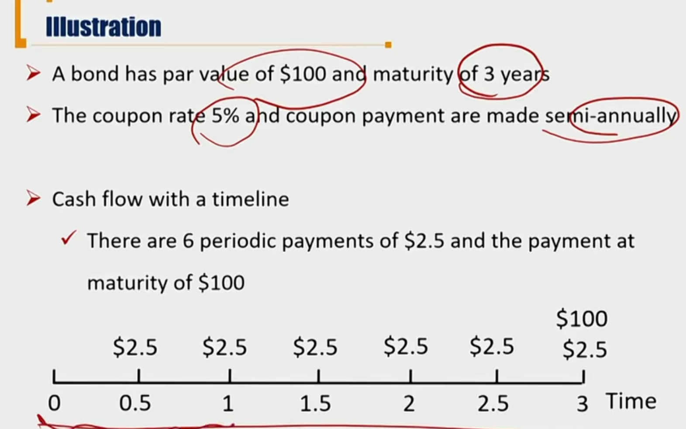

# R1 Basic Features

最重要：Fixed-Income Risk and Return

Fixed Income 包括债券和优先股，”固定收益“是相对其他投资品，并不等于现金流完全确定。

- 债券的本质
  - A kind of securities 一种有价证券
    - 存在买卖关系：Investor/Buyer(Bondholder)  vs. Issuer / Seller
    - 存在一级市场和二级市场
    - 市场风险
  - creditor-debtor relationship 借贷关系
    - Lender/Creditor（借钱，投资的一方） vs. Borrower/ Debator（欠钱的一方）
    - 存在抵押物Collateral
    - 信用风险

#### Issuer/Borrower 发行债券方

发行债券的主体

- **Supranational organization 超国家机构**， such as World Bank
- **Sovereign(national) governments** 国家（国债）, such as China and Sinagpore
- **Non-sovereign(local) governments** 地方政府, such as state of California
  - 城投债.
  - 国债、地方债还款来源主要是税收等。国债还可以印钞票还债。
- **Quasi-government entities**准政府债, not a direct obligation of a country's government or central bank, such as agencies that are owned by government.
  - 比如美国房地美，房利美，被政府背书。
- **Companies**, divided into those issued by financial companies and those issued by nonfinancial companies, such as corporate issuers.

#### Maturity 期限

- Maturity vs. Tenor / Time to maturity
  - maturity是期限
    - 部分债券可以展期，那maturity也有可能是变量
  - tenor是剩余期限，是变量
  - maturity和tenor不一样。比如3年前发行了10年期债券，tenor是7，maturity是10
- Money market securities 货币市场证券
  - maturity one year or less
  - 根据的是maturity划分，不是tenor
- Capital market securities 资本市场证券
  - maturity more than one year
  - 注意：在财报会计中，是根据tenor划分长期负债（非流动负债）和流动负债
- Perpetual bond 永续债券
  - no stated maturity date，没有明确的到期时间

#### Par Value/Face value/maturity value/redemption value

- The amount that the issuer agrees to repay the bondholders on the maturity date. 
  - 到期一次性还本金
- par value 是站**在最后时间点**看。如果到期前还了一部分本金，需要折现到到期日。

#### Coupon 利息

- Coupon is the amount of interest payments
  - **Annual coupon  = coupon rate \* par value**
  - Coupon rate / nominal rate is the interest rate that the issuer agrees to pay each year until the maturity date. 年化利率，按照每年计算
  - 这里和Interest Income / Expense的概念不一样
    - Interest Expense = 期初摊余成本 \* 实际利率
    - Coupon payment = par value \* coupon rate
- Coupon frequency
  - Coupon payments  may be made annually, **semi-annually**, quarterly, or monthly, etc.
  - 先按照年利率乘以par value, 然后在一年内按照付息频率均分。在实务中，半年付息一次的最多。
- **Zero-coupon bond/pure discount bond**: a bond pays no interest prior to maturity
  - 零息债券肯定折价发行

####  Currency Denomination

- **Dual-currency bonds 双币种债券**
  - Make coupon payments in one currency and pay the par value at maturity in another currency.
  - Coupon一个币种，Par Value一个币种. 币种提前固定，无法选择。
  - 比如外国公司在本国开设子公司，一开始缺少本国货币现金，先用外币还利息。到期后，公司产生足够现金，用本国货币还本金。
- **Currency option bonds 外汇期权债券**
  - Give bondholders the right to select one of two currencies for each payment in which they want to receive. 债券**买方**可以选择币种。
  - Can be viewed as 啊combination of a single-currency bond plus a foreign currency option. 相当于单一货币债券+货币期权组合

