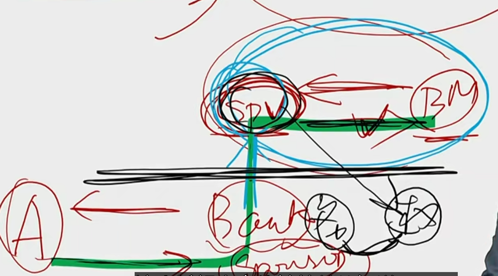
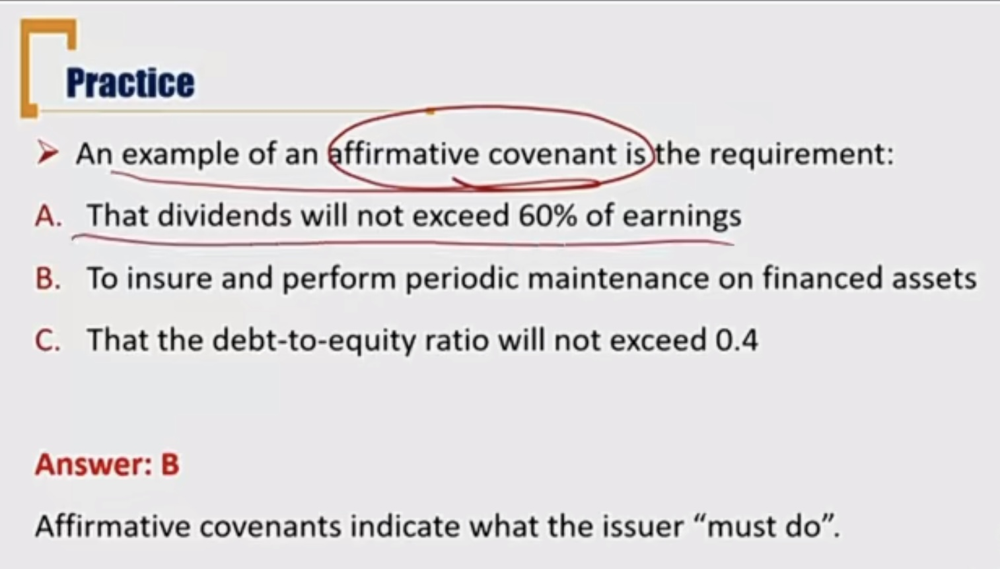
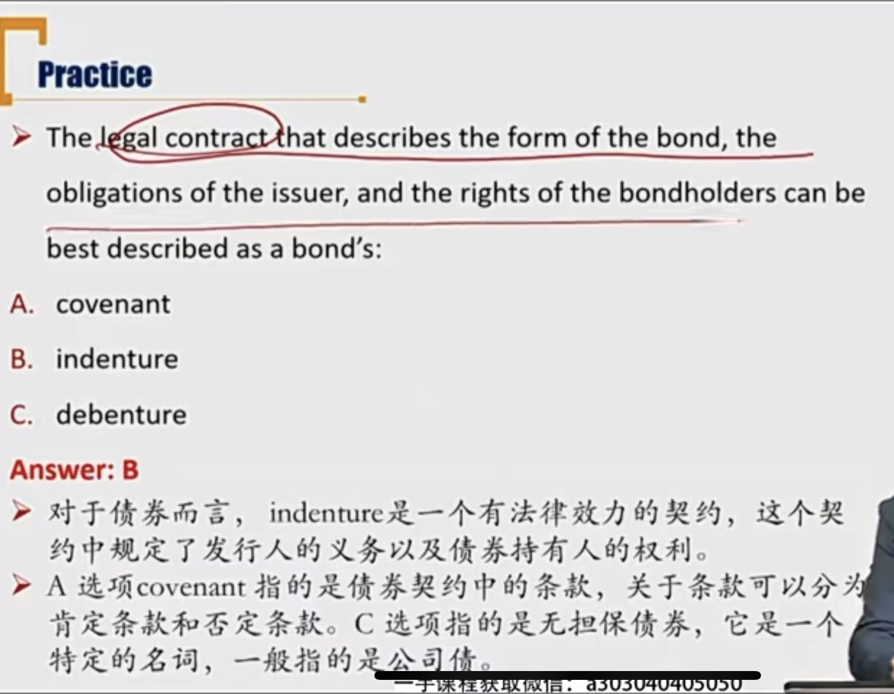

# R2 Bond Indenture/Trust Deed债券契约

- The legal contract that describe the form of bond, the obligations of issuer, and the rights of bondholders. 债权人权利，债务人义务。规定下面五个方面
  - Legal identity of the bond issuer and its legal form
    - 规定债券发行人身份，是谁发债
  - Source of repayment proceeds
    - 规定还款来源。比如国债：财政收入、印钞；地方政府：财政收入
    - 公司：正常经营现金流、未来现金流、借新还旧
  - Collateral & asset-backed
    - 抵押物
  - **Credit enhancements**
    - 信用增强机制
  - **Covenants**
    - 条款，契约是整个债券义务，条款是细分义务。
    - affirmative、negative条款

### 1）Legal identity of the bond issuer and its legal form

- The issuer is identified in the indenture by its legal name
  - Supranational organizations 超主权
  - Sovereign government 主权国家
  - Non-sovereign governments 非主权，地方政府
  - Quasi-government entities
  - Companies

- Securitization 证券化
  - **Securitized bond结构化债券** is issued by a separate legal entity which is called **special purpose entities(SPEs，美国)  / special purpose vehicles(SPVs，欧洲) 特殊目的实体**
    - 结构化，就是债券分层，偿付顺序有优先级等。
    - 银行为了发行证券化产品，成立SPV/SPE特殊目的实体，通常是合伙企业等。
  - SPEs/SPVs is **bankruptcy remote**破产隔离 because the transfer of assets by the sponsor is considered a legal sale: once the assets have been securitized, the sponsor no longer has ownership rights。银行把应收账款卖给SPV，应收账款不再属于银行，SPV和银行法律隔离。从而保护了购买证券化产品的投资者的权益。

### 2）Source of repayment proceeds 还款来源

- Supranational bond:
  - repayment of previous loans 收回贷款用来还贷款
  - paid-in capital（实收资本） from its members
- Sovereign bonds: 
  - tax revenues 
  - print money
- Non-sovereign government debt
  - general taxing authority 
    - 国债的税是归宿中央政府，地方税归属地方税收
  - cash flows of the project funded
    - 贷来的钱投资的项目产生的现金流
  - special taxes or fees
    - 上面的general taxing authority是所有州都可以收的税，特殊税收是某个州单独制定的税收。
- Corporate bonds
  - cash flow from its operations （CFO）
  - 其实CFI和CFF也可以
- Securitized bonds
  - cash flow from underlying financial assets 

### 3）Collateral 抵押物

- A way to reduct alleviate credit risk and **decreases yield** 

  - 抵押是为了：降低信用风险，**降低了收益率**（注意）

  - Secured bonds 担保债券: backed by assets or financial guarantees pledged to ensure debt repayment in case of default

    - 有资产作为抵押，或者第三方担保（financial guarantee）
    - 所以，secured bond不一定有抵押物。

  - Unsecured bonds 无担保债券: have **no** collateral, bondholders have only a general claim on the issuer's assets and cash flows

    - 完全靠发行人的支付承诺
    - unsecured bonds yield比secured bonds更高

  - **Debentures** （美国：unsecured bond, 英联邦国家：secured bond）
    - 可以理解为普通的一个bond
    - a type of bond or other debt instrument that is unsecured by collateral
    
  - Secured bond背后的资产的分类：
  
  | Types of bond                             | Collateral backing             |
  | ----------------------------------------- | ------------------------------ |
  | Collateral trust bonds 担保信托债券       | Financial assets（股票债券等） |
  | Equipment trust certificates 设备信托债券 | Equipment or physical assets   |
  | Mortgage-backed securities （MBS）按揭    | Mortgage loans                 |
  
  - Collateral trust bonds背后是金融资产
  - MBS，背后的抵押物是**住房贷款**，而不是“住房”。按揭贷款（ mortgage loan)的抵押物才是房子。(房子-> mortgage loan->MBS)

### 4）Asset-backed

- **Asset-backed security** 资产支持证券
  - Mortgage-backed security
  - others
- **Covered bond** 资产担保债券
  - convered bond has **lower** credit risk than ABS. 
  - 所以相比于ABS来说，covered bond 收益率更低，价格更高。
  - ABS信用风险比Covered bond 更大：
    - 因为SPV存在（bankrupcy remote），在ABS的sponsor破产清算时，ABS的债主不能对sponsor主体资产清算
    - 另一方面，covered bond可以更换底层资产，ABS由于有SPV存在，无法更换

### 5）Credit enhancement 信用增强 \*\*\*

前面说到的抵押物、ABS其实都是信用增强

- Variety of provisions used to reduce the credit risk and decrease the bond's yield.
  - 风险高，收益高。风险收益成正比
- **Internal credit enhancement** 内部信用增强
  - 靠内部产品结构增强信用
  - **Subordination**结构化债券: 
    - waterfall structure 瀑布式结构，后面的付息现金取决于上游的现金。
    - tranches付息时的现金流分层，按照不同优先级别付息。先保证部分优先投资者的利息，再付其他优先者的利息。
  - **Overcollateralization**超额抵押: 
    - 抵押更多资产，提高抵押物价值
    - post more collateral than is needed to obtain or secure financing
  - **Reserve accounts(cash reserve/excess spread)储备账户（现金储备/利差储备）:** 
    - cash reserve: 提前准备现金储备还钱
    - excess spread: waterfall structure中，上游资产赚的利息，留下一部分作为储备。
      - 比如A->bank->B，A给Bank5%利息，bank留下更多利息作为储蓄，剩下的再给B。
      - **more cash flow received from the assets** used to **secure the issue** than **the interest paid to investors**
      - 从资产受到的现金流中，用更多的现金作为储蓄保证债券每期付息，用更少现金作为利息付给投资人。
- **External credit enhancement**
  - 靠外部第三方增强信用
  - **Surety bond**履约保证债券:
    - reimburse investors for any losses incurred if the issuer defaults, by *a insurance company*. 由保险公司提供偿付担保，补足缺少的付息。 
  - **Bank guarantee**银行保函: same as surety bond but by a bank。银行担保，补足缺少的付息。
  - **Letter of credit 信用证**: 
    - promise to **lend** money to issuing entity for any cash flow shortfalls.
    - 银行担保，借钱给债务人补足缺少的付息（这里和surety 不一样，是借钱给债务人）。
    - surety bond: 保险公司补足利息给债权人
    - bank guarantee: 银行补足利息给债权人
    - letter of credit: 银行借钱给债务人
  - **Cash collateral account现金担保账户**: issuer **borrows** the credit enhancement amount and invests the amount in highly rated short-term commericial paper.
    - 第三方提前借一笔钱给债务人（发行方）作为储蓄金，可用来投资低风险金融资产。
    - Mitigate third-party(or counterparty) risk 减少第三方风险（第三方和发行方有关联）

reimburse 赔偿

### 6）Covenants \*\*\*

- Legally enforceable rules that borrowers and lenders agree on at the time of a new bond issue
  - 在发行债券那一刻就规定更好的义务（不是发行后补充）。
  - 一般covenants都是针对borrower规定义务
  - pari passu是covenant一种，表示borrower/issuer必须要同等对待这个债券和其他发型的主要债券；cross-default类似，一个违约，表示所有都违约
  - **Negative covenants:**(can not) 不可以做
    - Restrictions on asset sales
    - Restrictions on additional borrowings
  - **Affirmative covenants**: (should do) 应该做
    - Timely payment of principal and interest
    - Maintain financial ratios

- 注意表述，同一个affirmative内容换一个表述，就有可能是negative。关键看表述是应该做还是不能做。

- covenant和indenture的区别。