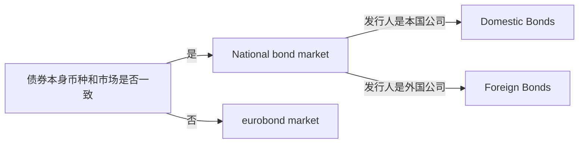
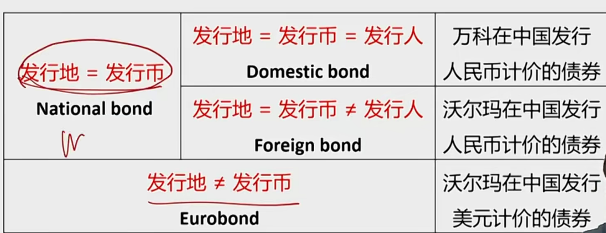
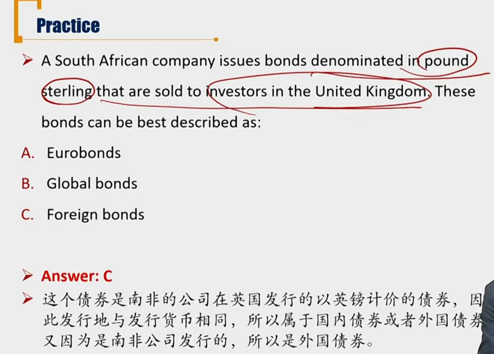

# R3 Legal regulation and tax

### 1) sectors of bond market

围绕币种进行债券市场分类：债券的币种、债券发行的市场环境、发行人

先研究债券币种和市场使用的币种：

- **National bond markets**本币债券市场: include all the bonds issued and traded in a specific country, and denominated in the currency of that country。债券币种和市场币种一致。
  - 再考虑发行人币种（公司所在国家）：
  - **Domestic bonds**: issued by entities that are incorporated in that country
  - **Foreign bonds**: issued by entities that are incorporated in another country(Yankee/panda/Samurai/kangaroo bonds)
    - 熊猫债券，外国公司在中国发行以人民币计价的债券
- **Eurobond market**欧洲债券市场: issued outside the jurisdiction of any single country and can be denominated in any currency。债券币种和市场币种不一致。
  - Eurobonds: issued and traded on Eurobond market
  - 了解：Eurodollar，欧洲美元。美苏冷战时期在欧洲流通的美元。

- 所以，外国债券foreign bonds实在本国市场发行

- 欧洲日元债券：不在日本境内交易的，以日元计价交易的债券

- **Global bond markets**:全球债券市场 consist of national bond markets and eurobond market.
  - **Global bonds**全球债券: issued simultaneously in the eurobond market and in at least one domestic bond market
  - 全世界发行债券，是对于欧洲债券和本币债券市场的统称。

### 2）Legal and regulatory consideration

#### Bearer bonds不记名债券

- Does not keep records of who owns the bonds, only the clearing system knows who the bond owners are
- **Most Eurobonds are bearer bonds.**
  - 大部分欧洲债券都不记名.

#### Registered bonds 记名债券

- Ownership is recorded by either name or serial number
- **Most domestic and foreign bonds are registered bonds**
  - 本地债券和外国债券大都是记名债券
- Some investors may **prefer** bearer bonds to registered bonds, possibly for tax reason.

### 3) Tax consideration

收益分为现金收益（买卖）和资本利得（收利息）,两种收益的税率通常不一样。一般认为Tax_capital_gain < Tax_interest

#### Interest 

- The income portion (interest) is generally taxed at the ordinary income tax rate.
- Tax-exempt securities are exception.
  - 国债**利息**免税。但是低买高卖炒作国债获得的资本利得要交税。

#### Capital gain or loss

- Capital gains are usually taxed at a **lower** rate than ordinary income
- In some countries, there is a different tax rate for long-term and short-term capital gains

#### Original issue discount(OID) bonds 原发折扣债券

- A portion of the discount form par at issuance is treated as taxable interest income each year.
- There is no additional capital gains tax liability at maturity
- OID和零息债券不一样
  - OID：征税按照利息征税，把利息税分摊到每一年。没有资本利得税。
  - 零息债券是征收资本利得税。

