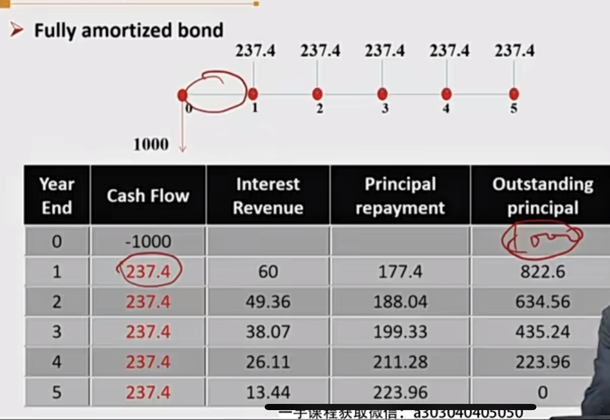
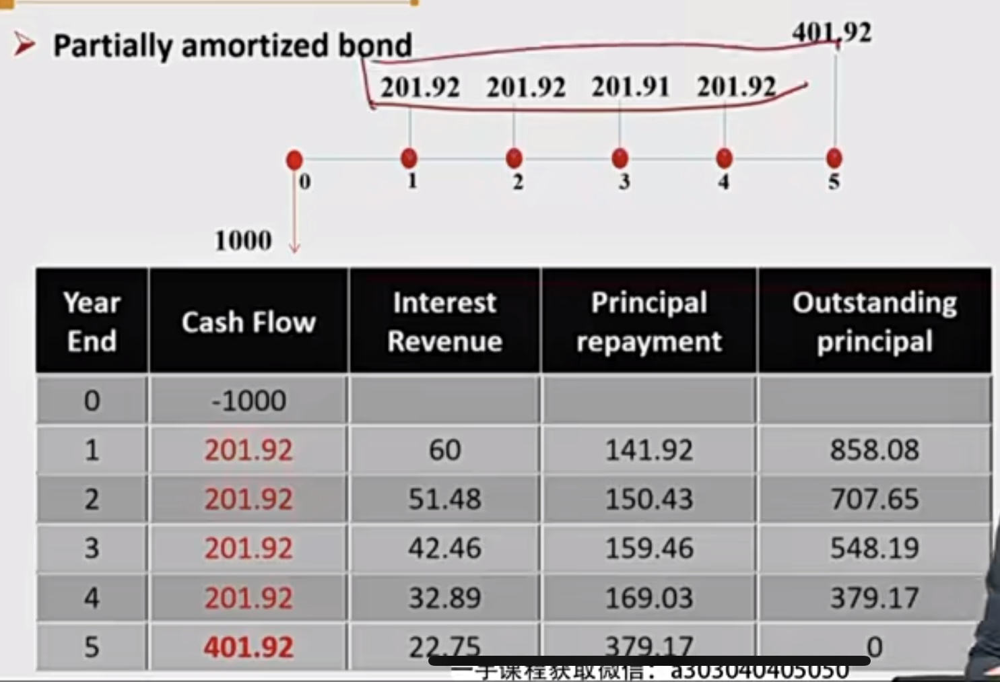
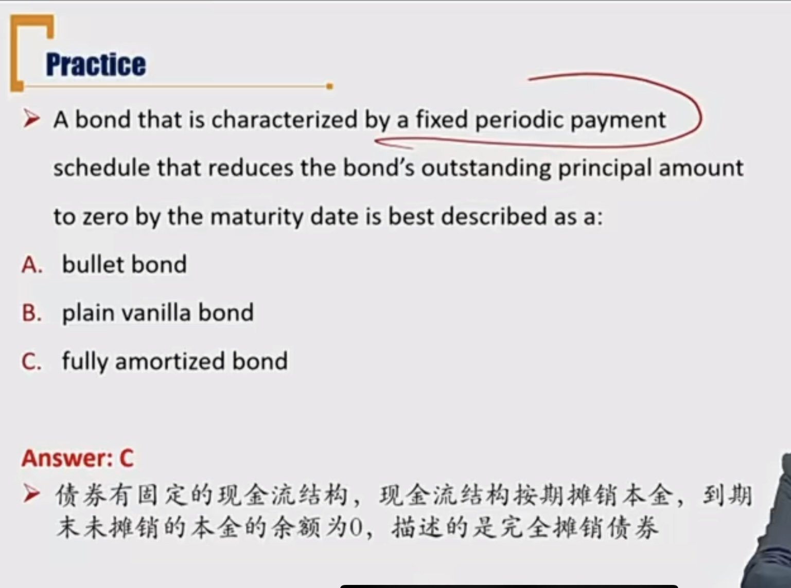

# R4 Cash Flow Structure of Principal Repayments

 本金的现金流模式

### 1）Plain Vanilla Bond / Conventional Bond

- **Conventional bond**'s periodic interest payments and principal is paid at maturity.
  - 传统型债券：本金到期一次性还清
  - Bullet bond
    - 现金流几乎集中在某一个时刻。一般考试默认子弹型债券，默认现金流集中在最后到期的一刻。但也有可能发生在债券存续期间。
  - **Balloon payment**: A large, lump sum payment that is a higher dollar amount than the regular periodic payment。
    - 现金流最大的时刻，信用风险最大。最大的一笔现金流
    - payment包括interest和principal，这里是现金流的概念，并不区分利息和本金。
    - 不一定conventional bond才有balloon payment。Bullet bond和balloon payment是一组对应的概念。

### 2）Amortizing Bond 摊销型债券

- **Amortizing bond** has a periodic repayment schedule of principal
  - 本金分期偿还，叫做摊销型债券
  - 不存在coupon rate的概念
  - **Fully amortized bond**: has a schedule that reduces outstanding principal to zero by the maturity date. 最后一期本金恰好全部还光。
    - 这种情况类似等额本息还款，每期都有Interest Revenue和Principal payment，所以不存在coupon rate的概念，
  - **Partially amortized bond**: only a portion of the principal is repaid by the maturity date.
    - 最后一期本金没有还光，需要追加一笔金额还完本金。
    - **Balloon payment risk**。如果最后一期还款金额较大，投资者会在最后一期承担较大的信用风险。
  - Fully amortized bond例子：

- partially amortized bond例子

### 3）Sinking Fund Provision 偿债基金条款

- bullet bond 比 amortized bond 的 reinvestment risk再投资风险更低。bullet bond在债券期间，不会收到本金，本金一直在产生利息。但是amortized bond在期间都会收到本金，收到的本金需要重新找投资机会，这时候市场上的利率已经不确定。
- 但另一方面，bullet bond的信用风险比amortized bond 高。因为现金流集中在某一点（balloon payment）.

- 偿债基金条款，让bullet bond  改为 amortized bond，降低信用风险

#### sinking fund provision

- **Sinking fund provision** refers to an <u>issuer's plans</u> to set aside funds over time to <u>retire the bond</u>, retire amount is based on the provision.
  - retire bond 赎回债券

- Example
  - BM issues a 10-year bond with a par value of \$100 million. The bond has a sinking fund provision, which requires that BM retires \$20 million of the principal every year beginning in the sixth year. 第6年开始，每年赎回20million的本金。

- Advantage: **less credit risk **信用风险低
- Disadvantage: **more reinvestment risk **再投资风险更高
  - When will the reinvestment **loss** take place?
    - 损失不等于风险。风险是不确定性，损失是确认已经发生的。偿还了本金那一刻，投资收益比原债券的收益率更低，那就是发生了损失，这时候产生了reinvestment loss.
- **Doubling option/accelerated sinking fund**: allow company（发行方） to redeem twice the amount required by the sinking fund provision. 提前还款的权利
  - 当外部的市场利率在下跌的时候，债券发行人会形式Doubling option, 提前还款。因为可以从市场上借更低成本的资金，把原来的借款还回去，降低资金融资成本。
  - 借新还旧，借更便宜的资金，还贵的资金。
  - 市场利率下跌，有利于市场上融资方，借钱的一方。