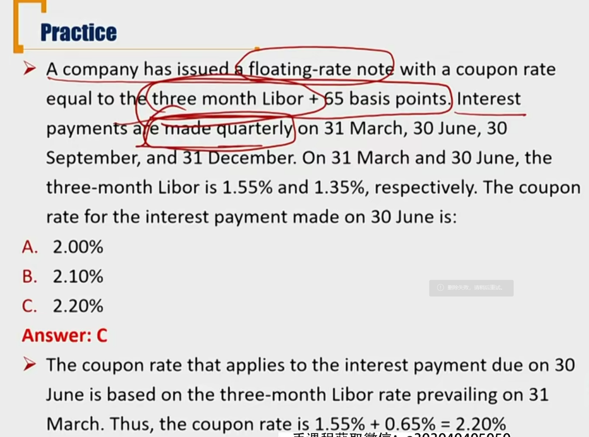
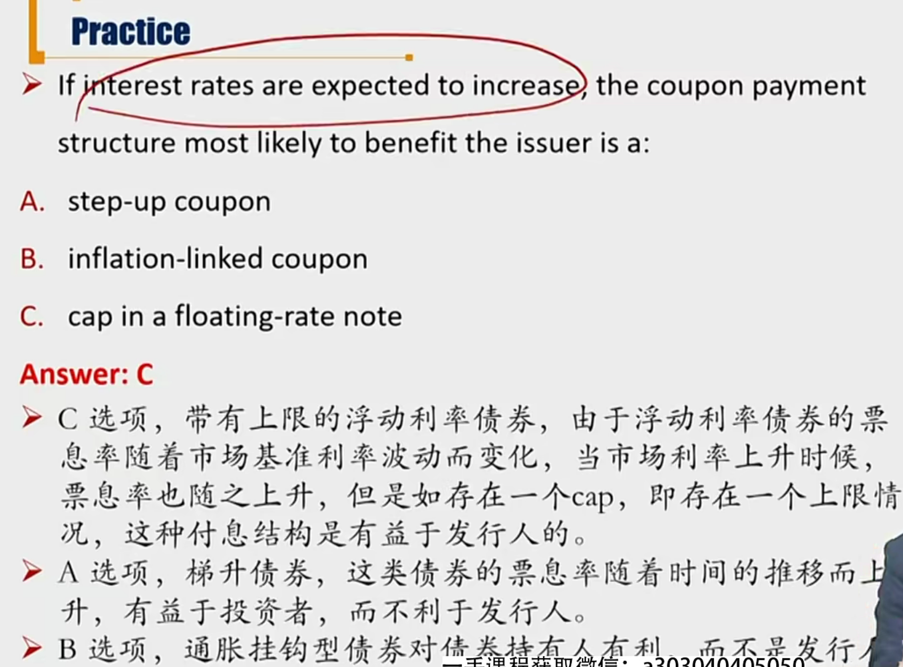

# R5 Cash Flow payment of Coupon Payment \*\*\*

Coupon payment = par value \* coupon rate

Coupon分为可变和不可变

### 1) Fixed Rate Coupon Bonds

- Fixed rate coupon bond pays a fixed periodic（有可能半年一次） coupon over a specified time to maturity
  - e.g. plain vanilla bond/ conventional bond
  - conventional bond：两层含义，coupon确定、本金最后一期一次偿还

### 2）Set up Coupon Bond 梯升型债券

- **Step-up coupon bond's** coupon increases by specified margins at specified dates
  - 比如coupon每年递增
  - 为什么会有递增的票息？
    - 发行人发行债券后的短期内资金比较紧张
    - 票息递增，促使永续债发行人在后期赎回债券。（在实务中常看到）
- **May** have a **call option** 
  - If the <u>new higher coupon rate</u> is larger than the <u>market yield of the call price</u>, then the issuer will prefer to call back the bonds.
  - call option: coupon rate比YTC还高时，发行人在债券到期前可以把债券赎回。
  - call option：发行方有权赎回，put option：投资方有权回售
  - call option有利于发行方
  - call price：发行方赎回债券的价格

### 3）Floating rate notes 浮动票息 \*\*

- Floating-rate notes do not have a fixed coupon, and coupon rate is linked to an external reference rate, such as **LIBOR**伦敦同业拆借利率.
  - 浮息债券，票息参考某个标准MRR，market reference rate
  - **Coupon rate = reference rate + quoted margin(spread)**
  - spread:基差
  - BPS，基点，base point:0.01%，万分之一
- Almost all FRNs have quarterly coupons
- Reference rate reset periodically, quoted margin is usually constant
  - **Variable-rate note**: the spread is not fixed
- Coupon payments are **paid in arrears**: based on previous period's reference rate. \*\*
  - 重要：每次付息时参考的利息，是**前一期**的利息
  - 比如quarterly paid ：6月31号支付的利息，用的是3月31号计算的利息。

- 上面例题中，coupon rate是年化coupon rate，假如par value是1000，则需要支付的coupon payment是1000\* 2.2%/4，需要除以4.
- FRNs may include a **floor** or (and) a **cap** FRN可能会有floor 和cap的特征
  - **Floor** prevents coupon from falling below a specified minimum rate
    - 保护投资人，避免过低利息
  - **Cap** prevents coupon from rising above a specified maximum rate
    - 保护发行方，避免太高利息
  - When a floating-rate security has both a upper limit(cap) and a lower limit(floor), the feature is called a **collar**
    - 这里的cap和floor针对的是coupon rate，而不是reference rate
- **Inverse or reverse FRN**(inverse floater) 逆向浮息，和reference反向变动
  - **Coupon rate = -reference rate + quote margin**
    - 实际上有个floor，不能<0
  - Leveraged inverse floaters & Deleveraged inverse floaters
    - leveraged: coupon rate = -2 \* reference rate + quote margin
    - deleveraged: coupon rate = -0.5 \* reference rate + quote margin

### 4) Index linked Bonds 指数挂钩债券 \*

- **Index-linked bond**'s coupon payments are linked to a specific index
  - **Inflation-linked bonds**: coupon payments are linked to a inflation index(CPI, PPI)
    - 常见是和通货膨胀率挂钩
- Different structure of **inflation-index bonds**
  - **Interest-indexed bonds**: coupon rate is adjusted for inflation while the principal value remains unchanged
  - **Capital-indexed bonds**: coupon rate remains constant, and principal value is increased by the rate of inflation
    - E.g. Treasury inflation Protected Securities(TIPS)
  - Capital-indexed bonds和interest-index bonds相比，capital-indexed bond 对投资者提供更多的保护。因为par value调高，也影响了coupon payment. 相当于同时影响了最后支付的principal和coupon。但是Interest indexed bonds只能影响coupon.
  - **Index-annuity bonds**: fully amortizing with the periodic payments directly adjusted for inflation or deflation. 
    - 摊销型债券，根据通胀实时调整年金数
  - **Index zero-coupon bonds**: the payment at maturity is adjusted for inflation

- 对于vanilla bond来说，通胀对投资者不利，未来收到的利息不值钱了。所以对债券发行方有利。
- **Treasury inflation protection securities(TIPS)**
  - Treasury: 代表美国财政部发行，不仅在通货膨胀风险上有优势，还有很低的信用风险。
  - Principe protected (change with inflation)
  - Coupon rate does not change
  - Coupon will change(because principal change)
  - At maturity:
    - If adjusted par value(per bond) is greater than \$1,000 at maturity, the holder receives the adjusted par value as the maturity payment
    - If the adjusted par value is less than \$1,000, holders receive \$1,000 at maturity as this is the minimum repayment amount. 如果通缩，par value以\$1,000作为floor面值。
      - 但是，计算coupon的时候，还是用通缩后的par value进行计算。比如最后一期，通缩-5%.则还本金还是1000元。但是计算coupon的时候，还是按照950\*coupon rate计算。

### 5) Other Coupon Structures

- Deferred coupon bonds/ split coupon bonds 递延债券

  - Pays **no coupons** for its first few years, may pay a higher coupon for the remainder of its life
    - 前几年不付coupon（和set-up coupond bond 对比，一般和初期财务压力有关）
  - **Zero-coupon bond** can be thought as an extreme form

- **Payment-in-Kind(PIK)** coupon bonds 实物支付债券

  - Payments may be physical assets or financial assets.
    - 按照市场价格market value抵债
  - Allows the issuer to pay interest in the form of additional amounts of the bond issue rather than as a cash payment
    - These bonds have higher yields because of a lower perceived credit quality from cash flow shortfalls or high leverage of the issuing firm
    - 新发债券还债，一般有更高的YTM（和coupon rate对比）。因为credit quality变低，并且企业杠杆更高。

- **Credit-linked coupon bonds**

  - Coupon changes when the bond's credit rating changes
  - Rating decrease leads to high coupon rate, which may result in futher deterioration of the credit rating

- **Equity-linked notes(ELN)** 股权挂钩债券

  - No peridoic interest payments
  - Final payment based on the reutrn of an equity index 取决于股票指数

  - Typically principal **protected** if no default
    - 跟涨不跟跌，本金收到保护。除非发生信用风险。
    - Can be thought of as a zero-coupon bond plus a **call option** on the equity index
  - ELN的条款对投资者有利