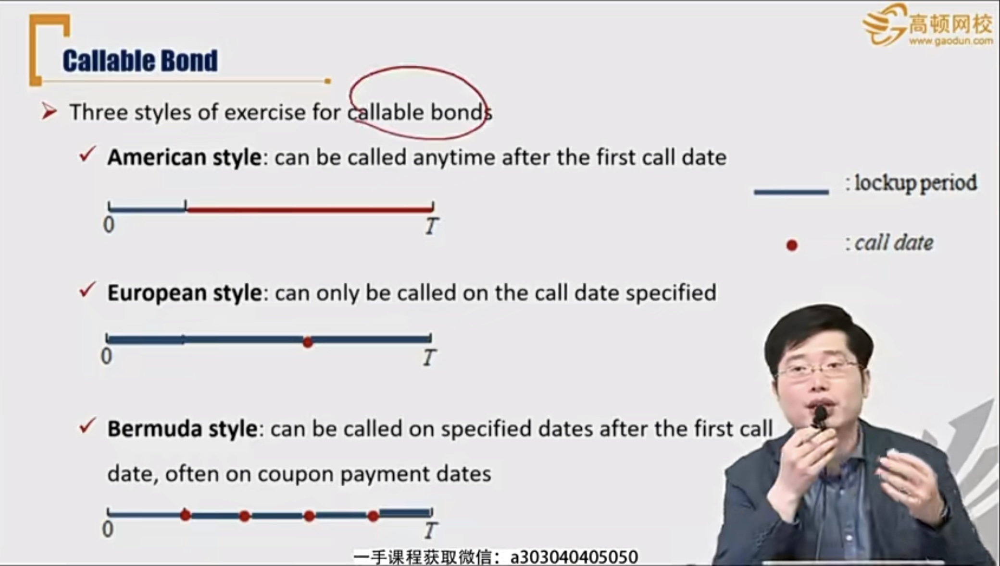
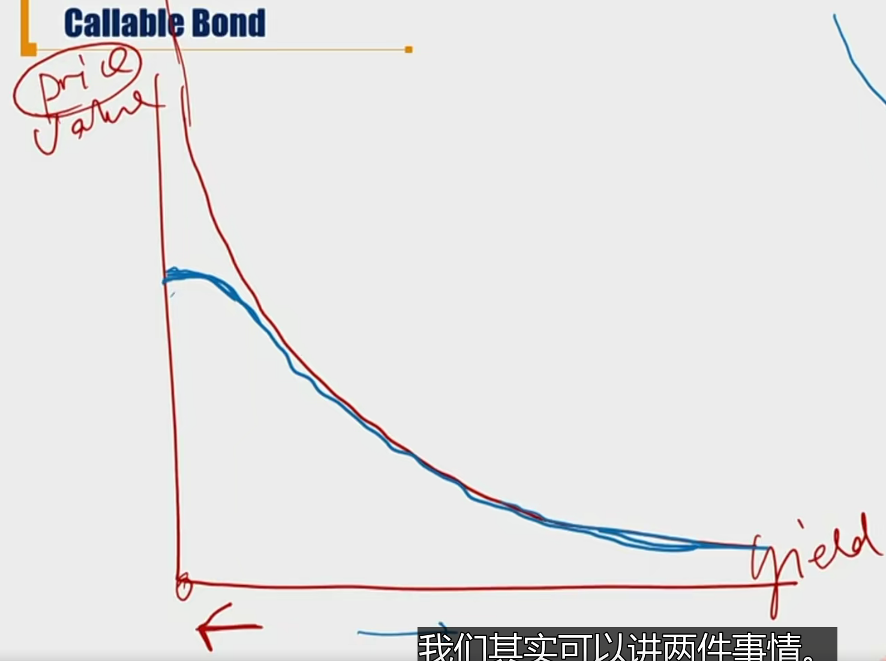

# R6 Bonds with Contingency Provisions \*\*\*

带“或有条款”的债券

- Callable可赎回(发行人)， Putable可回售（投资人）， Convertible可转换
- 复习：callable preference stock, putable preference stock

#### Contingency Provision 或有条款

- Contingency provision is the clause that allows for some action if the event or circumstance does occur

- Embedded option 内嵌型期权
  - Contingency provision in indenture for bonds, provide issuers or bondholders the right, but not the obligation, to take some action
  - Callable bonds: 给发行方权利，赎回
  - Putable bonds：给投资人权利，回售
  - Convertible bonds：给投资人权利，转换为股票

#### Callable Bond

- Callable bond gives the **issuer** the right to redeem **all or part of the bond** before the specified maturity date.
  - **Call price**：the price to redeem the bond
    - Call premium: the amount by which the call price is above the par.
    - call price 一般提前设定好不变；或者约定好每一期的赎回价格。
    - 一般call price要么溢价、要么平价，很少折价赎回
  - first call date: 允许提前赎回的第一天。
  - first par call date: the date at which the issue is first callable at par value
    - 允许以面值提前赎回的第一天。注意这两个date的区别
  - call protection period
    - The call protection period prohibits the issuer from calling a bond early in its life and is often added as an incentive for investors to buy the bond. 
- Example
  - A 20-year bond was issued on 2010 Jan 1st.
  - The **first call date** is 2015 Jan 1st, and the call price is \$105
  - The call price declines by \$1 a year till it reaches \$100 on 2020 Jan 1st
    - (**the first par call date**)
- 另外，callable bond 有权利还部分本金（par value）。这里换的是对应的本金部分，所以call 行使后，对应的后面的coupon也要根据减少后的本金调整。

- Three styles of exercise for callable bonds
  - American style: can be called anytime after the first call date
  - European style: can only be called on the call date specified
  - Bermuda style: can be called on specified dates after the first call date, often on coupon payment dates百慕大，一会可以行权，一会又不可以，像百慕大的船，一会消失一会出现。
  - 美式期权对债券发行方有利。

- Call provisions are **beneficial** to the **issuer**
  - Can protect issuers against **decline in interest rate**
  - 比如欧式期权，行权的时候，比较call price和未来的coupon + principal折现。折现时，市场利率越低，未来要给的钱越多。所以投资人会决定行权。
  - 利率下行的时候，方便借新还旧
- Investors face more **reinvestment risk**
  - 投资者提前收到本金，由于市场利率下跌，本金遭受再投资风险。
  - 所以，对投资者不利的债券的价格需要折价发行
- The callable bond will have **higher yield** and **lower price**
  - **V_callable_bond = V_straight_bond - V_call_option**
  - V是在0时刻债券的价格，callable bond价格比vanilla更低。
  - Price和yield成反比。
  - 另一个角度：风险更高，收益更高。（reinvestment risk）
- The price appreciation of callable bond is **limited**
  - 普通的债券，利率下跌，价格就一直在涨
  - 但是callable bond，利率下跌会导致发行方call back the bond，所以价格上涨有限制。

****

蓝色是callable bond，红色是straight bond，两条线得差就是call option price.

蓝色线得上线，就是call price.

- Question
  - V_call_option，是value 也是cost。
    - value代表债券定价角度，cost代表是融资成本呢得角度
  - Callable bond vs sinking fund provision
    - sinking fund provision是发行方义务，和callable本质不一样
  - callable bond 中的callable和call option的区别（两个）
    - 对于callable bond 来说call权内嵌不可交易
    - 如果是call option，行权时，买价<=市价；如果是callable bond，由于债券价格存在上限call price，所以债券市场价格<=call price，也就是赎回的价格call price >= 市价。这一点区别要注意。
- Make-whole call provision: the call price is **not fixed** but included a lump-sum(总金额) payment based on the **present value** of the future cash flows the bondholder will not recive if the bond is called early
  - 赎回时的call price不是提前固定，而是call price = 未来现金流的现值
  - 这种条款下，利率降低，不会刺激发行方提前call back bond
  - The call price is then unlikely to be lower than the market value of the bond
  - Make-whole provision does not have an upper limit on the bond value when interest rates fall
    - 因为不受利率影响，所以价格没有上限，利率下降，价格就会上升。

#### Putable Bond

-  Putable bond gives the **bondholders** the right to sell the bond back to the issuer at a pre-determined price on specified dates.
  - Put price: the price to sell back the bond
- Put provisions are **beneficial** to the **investors**
  - Can protect investor against **increase in interest rate**
- THe putable bond will have **lower yield** and **higher price**
  - **V_putable_bond = V_straight_bond + V_put_option**
- Putable bond has a floor feature
- Question:
  - 和put option区别：
    - 1）权利不能交易；
    - 2）putable bond行权时，由于putable债券存在floored价格限制，回售的债券价格>=put price; 但是put option行权时，卖出的股票市场价格<= strike price
  - callable putable bond，双方同时是义务方和权利方。

|                  | Callable                                    | Putable                                |
| ---------------- | ------------------------------------------- | -------------------------------------- |
| option权利方     | issuer                                      | bondholder                             |
| obligation义务方 | bondholder                                  | issuer                                 |
| 行权选择         | A < PV(未来的coupon+principal)，行权        | B > PV, 行权                           |
|                  | 市场利率下行，PV越高，行权可能性更高        | 利率上升，PV更低，行权可能性更高       |
|                  | 发行人借新还旧，投资人承受reinvestment risk | 投资人可以重新投资，发行方需要重新融资 |
| 定价             | Vcallb = Vsb(straight bond) - Vco           | Vputb = Vsb + Vpo                      |
|                  | 因为条款对发行人有利，价格需要调低          | 条款对投资人有利，需要调高价格         |
|                  | yield callable > yield sb                   | yield putable < yield sb               |
| 性质             | 价格有上限capped，上限是call price          | 价格有下限floored，下限就是put price   |

- 通过对比具体的option 判断权利大小，从而判断债券价格
  - 美式权利 > 百慕大权利 > 欧式权利
  - callable美式期权价格 < Bermuda <  callable 欧式
  - putable美式 > Bermuda > putable 欧式

