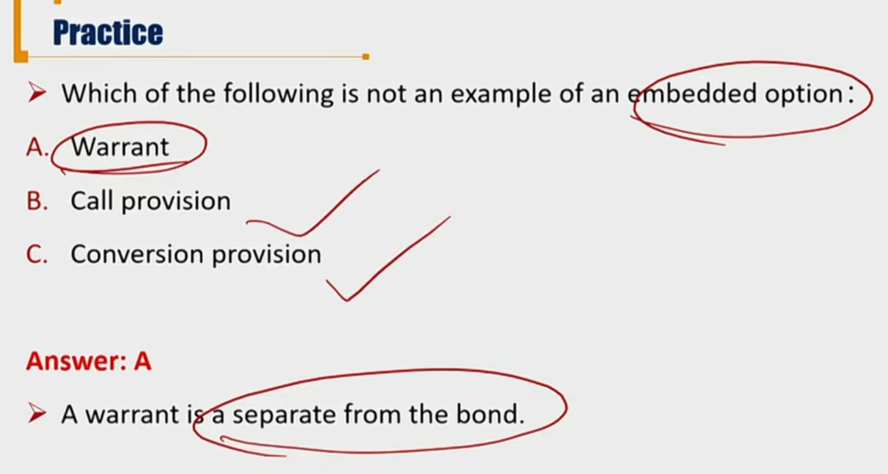
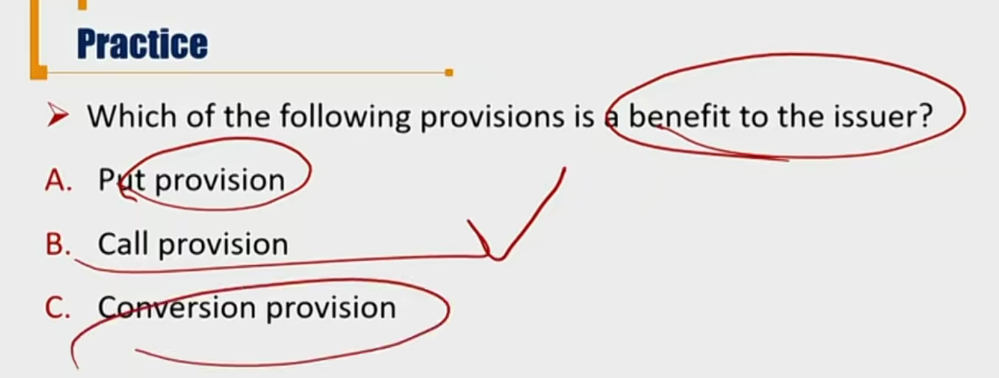

# R7 Convertible Bond

可转换债券，可转债，权利在债券持有方bondholder。

债券：1）是一种security;2）代表债权债务关系。

可转债行权时，security性质还存在，债权债务关系变为股权关系。

#### Convertible Bond

- Convertible bond gives **bondholder** the right to exchange the bond for a specified number of common shares in issuing company. 

  - Hybrid security with both debt and equity features.
  - 混合筹资工具，转股前，同时具有债券和股票的属性。

- Conversion provisions are **beneficial** to **bondholder**

  - 1. If share prices increase, bondholders can exchange the bond for a specific number of shares of issue company
    2. If share price decrease, bondholders can stilll receive coupon and principal payment of the straight bond

- Investors will as **lower yield**, and pay **higher price**

  - **V_convertible_bond = V_straight_bond + V_call_option_on_equity**

  - 价格加上看涨期权价格

##### Question

1. Are conversion provisions only beneficial to bondholders?

   对issuer来说，有利好也有利空：

   - 没有了支付债券利息的义务，降低了财务负担。支付dividend不是公司义务。
   - 转股后，outstanding share增加了，摊薄了EPS，影响了老股东的利益。

2. Which one is correct?

   - V convertible bond  = V straight bond + V call option **on equity**
   - V convertible bond  = V straight bond + V put option **on bond**
   - 两个公式都对。第一个是对于股票的看涨期权，第二个是债券的看跌期权。

3. Is the following formula correct? 

   - V convertible bond  = V straight bond  + V call option on equity + V put option on bond❌
   - 错误。不可以重复添加权利价格。

- **Conversion ratio**: the number of common shares each bond can be converted into
- **Conversion price** = bond par value / converstion ratio
  - 转换价格和bond的market price没有关系，conversion price在可转债发行的时候就已经确定
  - 可以理解为，每一股对应的面值时多少
- **Conversion value** = market price of stock \* conversion ratio 
  - 转换价值，代表每一张可转债代表的股票总市值。

- Conversion parity 
  - 这里的convertible bond's price=market price。（和conversion price不一样！）
  - 比较的是，债券bond的市值和转换后的股票总市值
  - **At parity**: conversion value = convertible bond's price
  - **Above parity**: conversion value > convertible bond's price
  - **Below parity**: converison value < convertible bond's price
- converison premium = bond price - conversion value
- Question:
  - When will the bondholder convert the bond, below or above parity?
    - 一般认为above parity才会转换。但是也要实际考虑conversion value - convertible bond'price，差价没有足够吸引投资者。
    - 同理，below parity一般不转换，但也不是一定不转换。比如投资者看好对公司的未来，持有的是欧式可转债，及时行驶了转换权利。

#### Callable Convertible Bond 可赎回可转债

- **Callable convertible bond** is the convertible bond inclued a call provision
- **The call option is for issuer, and the convertible option is for bondholder.**
  - call权是发行方的，convertible是持有方的.
  - 并且，一方行权时，另一方需要履行义务。
- Some investors may prefer higher coupons than uncertain dividend, so early conversion may not be the first choice for them
  - call option是发行方用来制约、强制持有方行驶convertible转股的方式，因为发行方有可能不想持续支付coupon
  - Callable convertible bond help the issuer to force the bondholders to convert their bonds into common shares before maturity
  - 显然，这种情况对于投资者不利，所以价格更便宜，yield更高。
  - Callable convertible bonds have to offer a **higher yield** and sell at a **lower price** than other wise similar non-callable convertible bond
    - 但是，lower price不是简单的减去V_call_option，因为决定call 和 convertible行驶权利的时候，不是简单的加减，而是零和博弈，要考虑对手方的决策。

#### Contingency Provisions

- **Contingency convertible bonds** (CoCo's) 或有可转换债券
  - It can convert to common equity **automatically** if a specific event occurs
  - 这里的convertible **不是持有方的权利**，而是某个事件发生后自动发生转股
  - 比如，资本充足率跌到8.1%，CoCo's自动转股，增加资本，增加资本充足率（巴塞尔协议）
- **Bond with warrants** 
  - warrant权证分为认股权证call、认沽权证put
  - It entiles the holder to buy the underlying stock of the issuing company at fixed exercise price until expiration date
  - Warrant is an **attached option** rather than an embedded option
    - 不是内嵌型的权利。投资者相当于拿到了bond和warrant
  - The bondholder can buy the share at the fixed exercise price and still hold the bond.
  - The bond with warrants can be more attractive.

