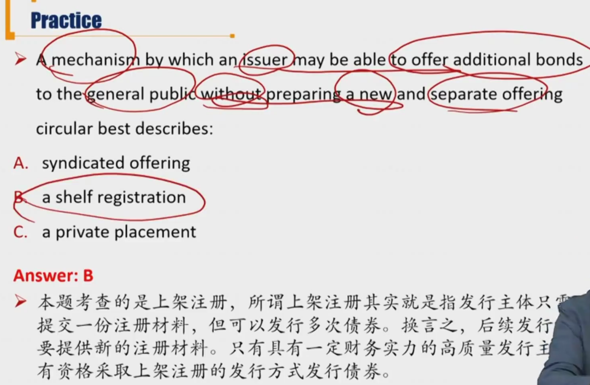

# R2 Primary market and Secondary Market

#### Issuance of Bonds

- Primary bond market

  - Markets in which issuers first sell bonds to investors
  - 公募：向会公众发行；私募：限定投资者范围
    1. **Public offering** 公开发行: any member of the public may buy the bonds
       - Underwritten offering包销
         - 中介兜底
       - Best efforts offering代销
         - 发行方承担发行风险
       - Auction拍卖
       - Shelf registration
    2. **Private placement**私募发行： only a selected group of investors may buy the bonds

  - Public offering融资成本更高，需要披露更多信息。

- **Public offering**
  - **Underwritten offering**: the investment bank(underwriter) guarantees the sale of the bond issue at an offering price, and takes the risk associated with selling the bonds. 包销下，投行承担风险更大，会要求更多回报，发行费用更高。
    - **Syndicated offering**: a group , or syndicate, of investment banks underwrite the issuance. 几个投行一起发行。
    - **Grey market**("when issued" market): Some bonds are traded prior to the offering date. 正式发行前，部分债券已经发生过交易（比如抵债）
  - **Best efforts offering**: the investment bank only serves as a broker（代理人） and sell  the bond issue for a commission. 代销只是赚佣金，风险更低，commission更低
  - **Auction**: an issuing mechanism that involves bidding and helpful for price discovery.
    - 价格越报越高，利率越报越低。美国国债就是拍卖形式发行。
    - 中标利率以下的利率报价都成交。
    - 拍卖形式考虑了多方利益，这种模式有助于价格发现。
    - Commonly used by issuing government debts 一般政府债券采取这种形式
  - **Shelf registration** 上架注册: issuer prepares a single, all-encompassing offering circular that describes a range of future bond issuances, all under the same document. 
    - circular 通告、通令
    - 一次审批，分批发行。减少发行时的手续时间。
    - Issue bond over time when issuer needs to raise funds and fee

#### Trading of Bonds

- **Secondary bond market**

  - markets in which existing bonds are subsequently traded among investors

  1. **Organized exchange** 
  2. **OTC markets**
     - Dealers will post bid and ask price
     - 做市商提供流动性，赚取bid ask spread

- **Settlement**交割：the process that the bonds are passed to the buyer and payment is received by the seller交割发生在交易之后，交易是达成一致意见。
  - Corporate bonds: third trading day after trade date(T+3)
  - Government bonds: the next trading day after the trade date(T+1)
  - Money market securities: on the day of trade date
  - 这里的交易日指的是工作日。