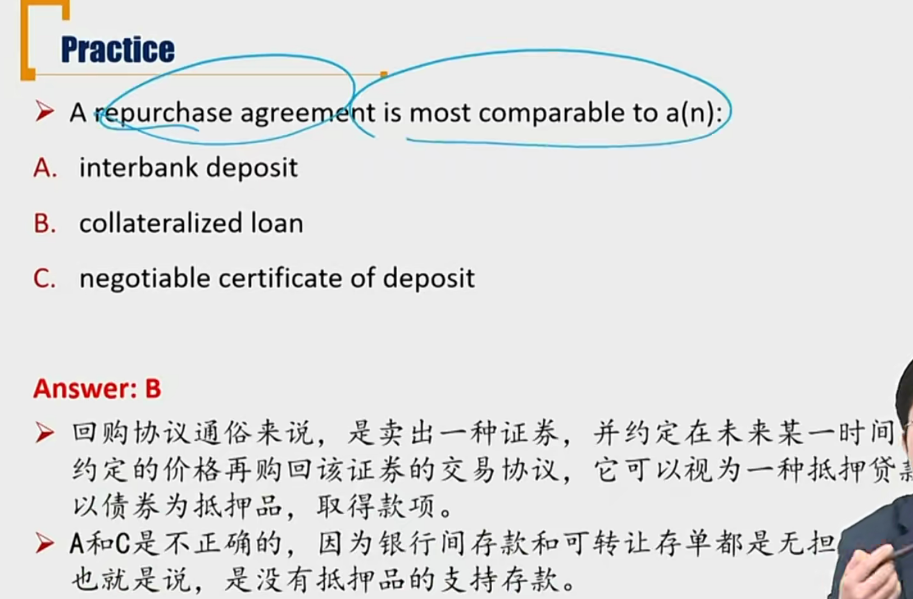

# R5 Short-Term Funding & Repurchase Agreements \*\*

#### Retail Deposits 零售存款

零售指个人存钱

- 活期存款**Demand deposits/Checking accounts**: available to customer on demand, and typically pay no interest
  - checking accounts（支票）
  - 理论认为货期存款不支付利息
- 定期存款**Saving accounts:** pay interest but do not offer the same transactional convenience as demand deposits
  - 到期支取，支付利息
- 货币市场账户（余额宝）**Money market account**: offer money market rates of return and depositors can access funds at short or no notice
  - An intermediate between demand deposit and saving accounts depositor
  - 流动性小于活期、大于定期

#### Short-Term Wholesale(批发) Funds 

这里批发指客户时大机构客户。（比如同业客户）

- **Central bank funds** 中央银行
  - banks with reserve surplus loan money to banks with reserve shortage
  - 准备金不够的银行向准备金充足的银行借钱
- **Interbank funds **银行间市场
  - loans between banks
- **Large-denomination（大额） negotiable（可协商） certificates of deposit(CD，存单)**
  - 大额可转让存单
  - CD represents a specified amount of funds on deposit for a specified maturity and interest rate
  - Negotiable CD（可转让CD） allows any depositor(initial or subsequent) to sell the CD in the open market prior to the maturity date. 可以在二级市场转让

#### Repurchase Agreement (Repo)回购协议\*\*

回购方卖掉债券同时，签订协议，未来再买回债券。实质就是把债券作为抵押，进行贷款。

回购关系，在法律上是买卖关系。在实质上，是借贷关系。

- The sale of a security with a simultaneous agreement by the seller to buy it back at an agree-on price(repurchase price) and future date (repurchase date)
- In practical, a repo can be viewed as a collateralized loan
  - Overnight repo隔夜回购：the term is one day
  - Term repo期限回购: the term is more than one day
  - Repo to maturity到期回购: the term is until the final maturity date
- **Reverse repurchase agreement/ Reverse repo**
  - 逆回购：先买债券，未来卖。
    - 央行逆回购：释放流动性 
  - 回购：先卖，再买

##### Repo Rate \*\*\*

- Repo rate: the interest rate implied by two prices
  - T=0，p1 卖出，T=1p2买回。那就是repo rate = (p2 - p1) / p1，如果是30天回购等，还要转化为年华。
- The repo rate is **higher** when \*\*
  - Repo term is **longer**
  - Credit quality of the collateral security is **lower**
  - Collateral security is **not** delivered to the lender
  - Collateral security is in **low** demand or **high** supply\*
    - 供过于求，意思是抵押物比较便宜，所以repo rate要高
  - Interest rate for alternative sources of funds and **higher**
    - 替代利率越高，回购利率越高

##### Repo margin/haircut \*\*\*

- **Repo margin/haircut 价差:** The difference between the market value of the collateral security and the value of the load
  - margin就是p2 - p1
- The repo margin is **higher** when, 和上面的repo rate的逻辑一致
  - Repo term is **longer**
  - Credit quality of the collateral security is **lower**
  - Credit quality of the borrower is **lower**
  - Collateral security is in **low** demand or **high** supply