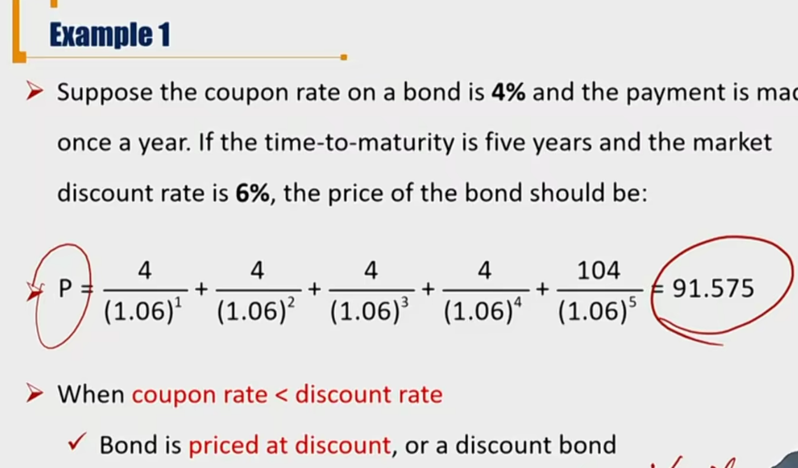
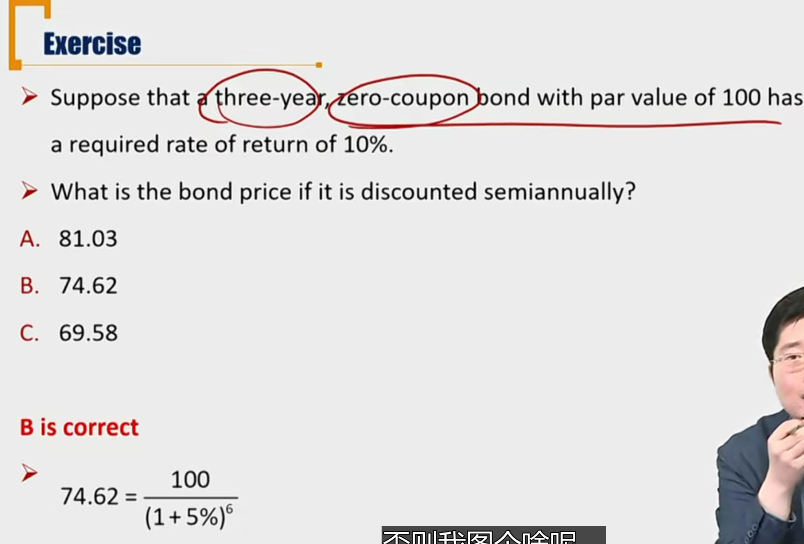

# R1 Pricing Bond with a Single Discount Rate

 

价格不等于价值。当有假设市场是公开透明的，交易是公允时，价值才等于价格。

未来现金流DCF折现，算出来的是**价值**。但是能够引导投资者进行交易的是**价格**。

#### Bond Price

假定市场公允，市场信息对称，没有任何交易成本，Bond price =bond value

- Bond Value is the present value(PV) of the promised cash flows

  - If the market price is fair and have no arbitrage opportunity, then the market price should equal to the intrinsic value
  - **Market discount rate**
    - discount rate used in the PV calculation
    - the required rate of return (required yield) by investors given the risk of the bond ivnestment

- $$
  P = \sum_{t=1}^{n}\frac{C_t}{(1+r)^t}+\frac{Par}{(1+r)^n}
  $$

##### Discount rate 和 coupon rate关系

- coupon rate > discount rate, 债券溢价发行, priced at premium
- coupon rate = discount rate, 债券平价发行, priced at par
- coupon rate < discount rate, 债券折价发行, priced at discount

