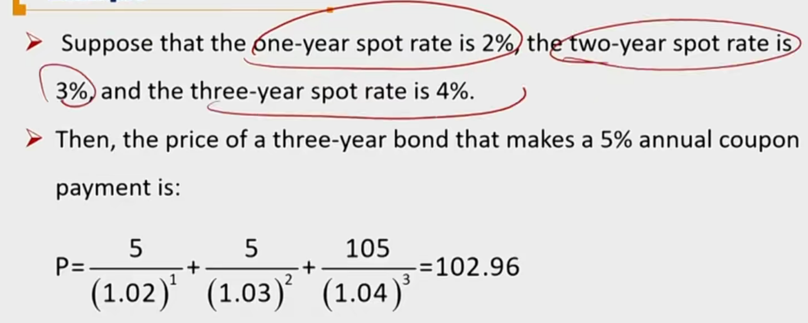

# R2 Spot Rates \*\* 即期利率

spot rate 是债券估值的benchmark，即期利率包含两层意思：

1) 即期利率，起算点在今天。对比远期利率：起算点在未来
2) 即期利率来源于zero coupon rate

##### Spot Rates

- The **spot rate** is the dicount rate of a single future cash flow such as zero-coupon bond
- **Spot rates**($s_n$) are also named as **zero rates**($Z_n$ = n  years zero rates)
  - Spot rates reflect the yields on **zero-coupon bonds**

#### Pricing Bonds with Spot rates

对比上节课，pricing bond with single discount rate

- Use a sequence of spot rates that correspond to the cash flow dates to calculate the bond price
  - A more fundamental approach to pricing bond, and it is the "no arbitrage price"
  - 这里相当于构建了若干个零息债券，拼成了一个vanilla bond

$$
P_0 = \sum_{i=1}^{n}\frac{C_i}{(1+s_i)^n}+\frac{Par}{(1+s_n)^n}
$$

- 一个技巧，一般现金流最大的一个时间点（ballon payment）对现值影响最大，那一期的spot rate也最重要。
- 另外，这里的即期利率**不考虑** 信用风险。
- 注意：如果是年化的即期利率s，只产生半年利息，那么有两种计算方法，两种结果近似
  - CP / (1 + s) ^ 0.5
  - CP / (1 + s/2) ^ 1

#### Spot rate Curve

- The spot rate curve or spot curve is the graph of the relationship between **spot rates** and **maturity**. 横坐标到期日，纵坐标spot rate
  - It reflects the **term structure** of spot rates
- As the time passes, the spot curve **changes** continuously
  - 即期利率曲线每天都在变化
- 拓展：一般市面上只有半年期、一年期的零息债券。一般通过利用国库券，bootstrap法算出1.5年期后面的即期利率。