# R3 Yield to Maturity \*\*\*

#### Yield to Maturity \*\*\*

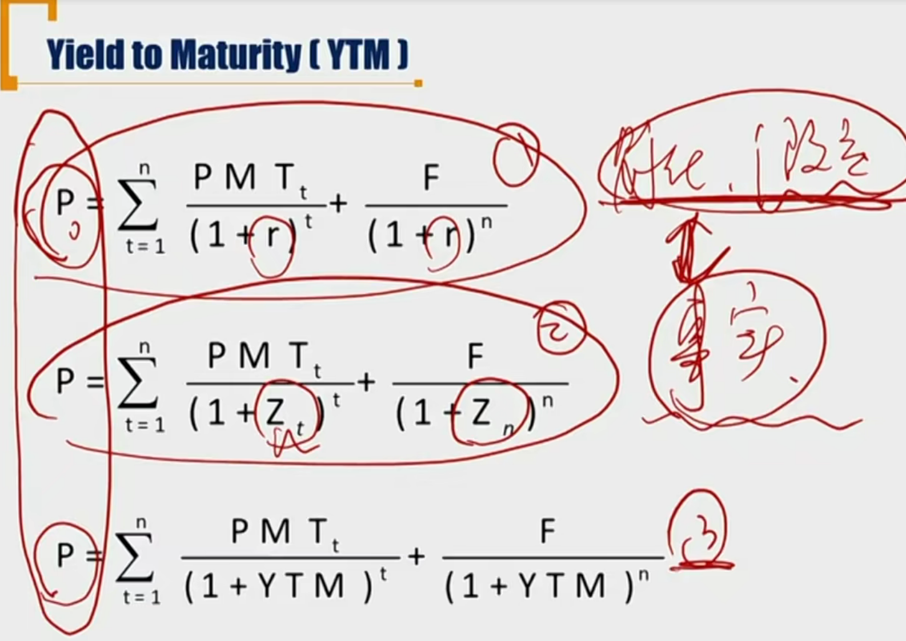

- 首先，上面三种情况，都是假定市场公允。
- single discount rate是假定了一个固定的discount rate，求出当前的price
- Spot rate折现法是根据事实上的spot rate curve上的数据，把已有的债券拆成若干个零息债券，算出债券的价格。
- 上面两种都是由已知的或者假设的市场利率，推出当前的价格。但是最后一种YTM本质逻辑不一样（虽然形式上和single discount rate公式一模一样），YTM是已知债券价格，和已有的每期现金流，求出预期的一个回报率。是站在预期的角度看discount rate.
- YTM is the **internal rate of return**（IRR） of on the cash flow, it reflects the **implied market discount rate**.

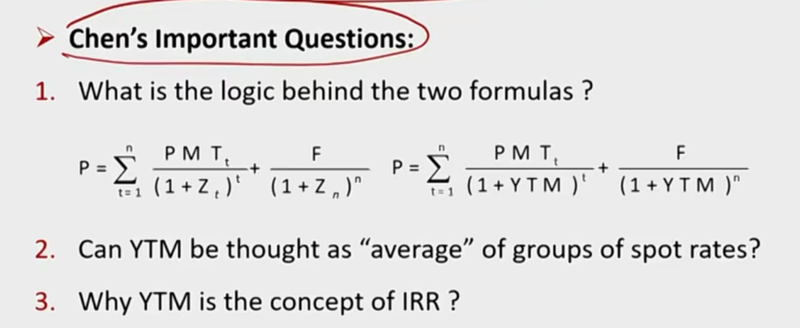

回答：

1）spot rate折现逻辑从右到左，已知市场的spot rate，求债券价格；而右边的YTM公式，逻辑是从左到右，已知债券价格，求右边的YTM

2）本质上，YTM就是spot rate的某种”平均数“，并且，由于ballon payment对price影响最大，所以YTM会偏向ballon payment对应的spot rate.

3）IRR是假设NPV= 0 ，也就是已知债券P，把P挪到等号右边，进行求解得到的利率。YTM和IRR本质逻辑一样。

##### 一些需要注意的性质

1）YTM和P成反比

2）YTM只是预估的回报率，到期时可能不一定。

3）一般要求求的YTM是年化利率。关于年化利率r，有两种计算方法：

1. CF / (1 + 年化) ^ 年
   $$
   \frac{C_{0.5}}{(1+r)^{0.5}}+\frac{C_{1}}{(1+r)^{1}}+\frac{C_{1.5}}{(1+r)^{1.5}}
   $$
   
2. CF / (1 + 期间收益率) ^ 期 (一般采取这种)

$$
\frac{C_{0.5}}{(1+r/2)^{}}+\frac{C_{1}}{(1+r/2)^{2}}+\frac{C_{1.5}}{(1+r/2)^{3}}
$$

- 可以看到有些题目，需要用默认的1000 par value

#### Bond Price and Yield

- A bond's price and TYM are **inversely** related
- A bond will be priced at a discount (premium) to par value if coupon rate is less(more) than its YTM
  - At premium: coupon rate > TYM 溢价发行
  - At par coupon rate = YTM 平价发行
  - At dicount: coupon rate < YTM 折价发行

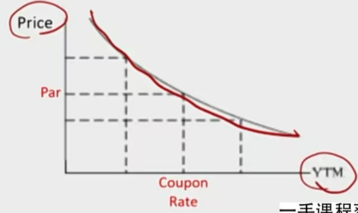

- 注意曲线是凹曲线，和债券久期的凸度有关？

####  Tips from Accounting

- **Constant-yield price trajectory**
  - Illustrates the change of bond carrying value over time if the yield keep constant
  - **"Pull to par" effect**: if no default, bond price approaches par value as its time-to-maturity approaches zero

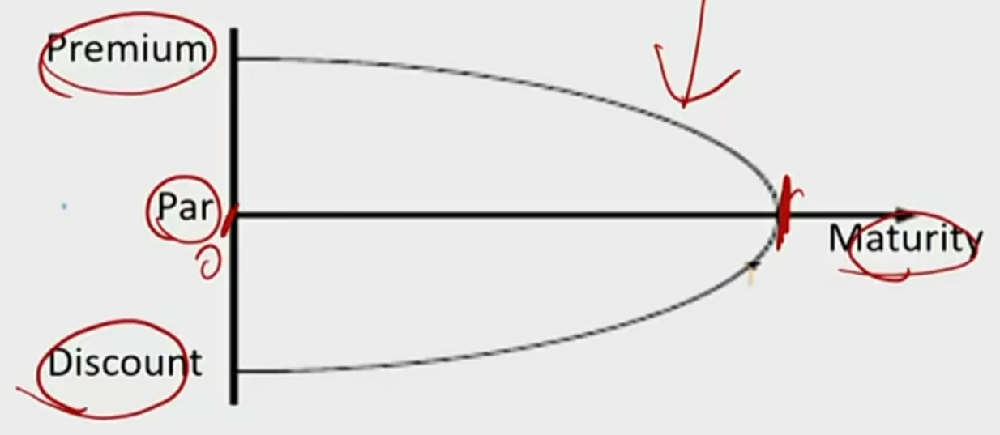

- 曲线上代表的是：债券的内在价值value；摊余成本；carrying value

Question: What is the market price for the secondary market price?

- value不一定是价格. 在不考虑违约风险，价格围绕价值波动，最后回归到par值。离到期日越远，波动性越大。

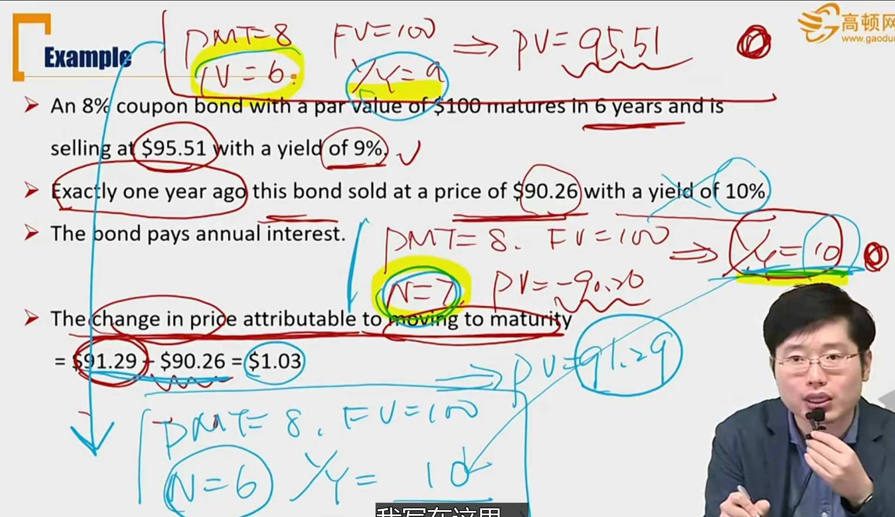

- 题目问的是因为maturity减少导致的价格减少，也就是不考虑YTM改变。
- 这里实际上在阐述一个逻辑：在T=0时刻，根据价格可以算出来一个YTM，之后根据市场价格波动，YTM在实时变化。这里和会计记账逻辑不一样。在T=0时刻，实际利率一经确定不会轻易修改。所以，加入题目中，是去年开始发行债券并且开始记账，那么effective rate=10%不会改变，但是YTM因为市场价格变动，从10%变为了第二年的9%。
- 什么时候持有到期时，真实回报率和YTM一致，涉及到下面的三个假设

#### Assumptions for YTM \*\*\*

- If the investor's actual return is just equal to YTM, there are **three** critical assumptions for YTM: \*\*\*重要
  1. **The issuer makes full and timely coupon and principal payments**。没有信用风险
  2. **The investor hold the bond until maturity** 持有到期
  3. **The investor is able to reinvest coupon payments at YTM**。 现金流都按照YTM再投资（不仅仅是coupon）

Question:

- What if the reinvestment rate is higher or lower than YTM?

  - 高了就actual return 高于YTM

- How to prove these assumptions?
  $$
  P_0(1+YTM)^n=C1(1+YTM)^{n-1}+C2(1+YTM)^{n-2}...
  $$

- Which asssumptions can be relaxed and how?

  - 第2点可以。提前卖掉的话，按照上面的amortization cost的价格卖出，再按照YTM的reinvestment return rate再投资，也可能获得YTM的到期实际收益率。

#### Sources of Return

1. Receipt of the promised **coupon and carrying value of principal payments** on the scheduled dated.
   - 注意这里是本金的carrying value。
2. **Reinvestment** of coupon payments
3. Potential **capital gains or losses** on the sale of the bond prior to maturity
   - Capital gain or loss = sales price - carrying value
   - 提前卖掉的时候，capital gain的计算需要减去carrying value

比如：900块买入，50coupon，两年期，末尾par value1000元

第一年末的carrying value是940元。第一年末卖掉债券卖了950块，那么sources of return:

1)coupon和本金的carrying value：50+940

2)capital gain or loss = 950-940

- 注意：如果是卖掉部分的债券，capital gain就是减去对应部分的carrying value.

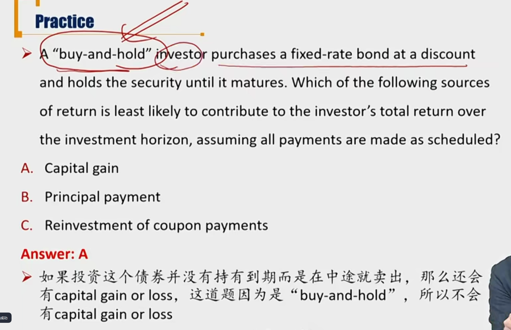

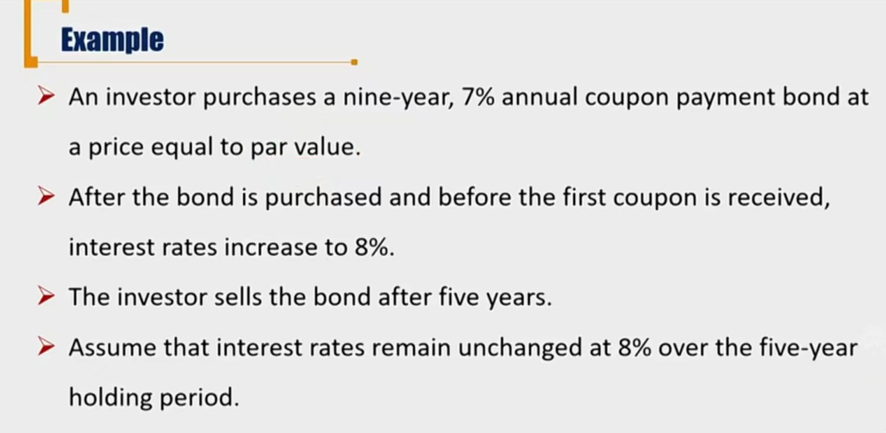

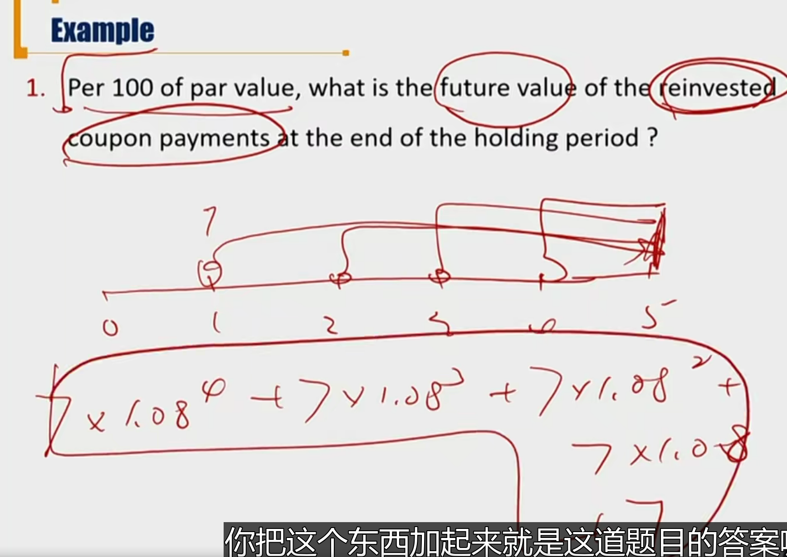

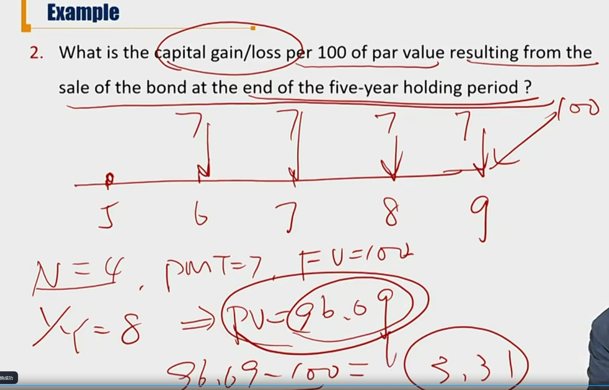

- 如果题目不告诉卖价，就是假定以公允价值卖出。

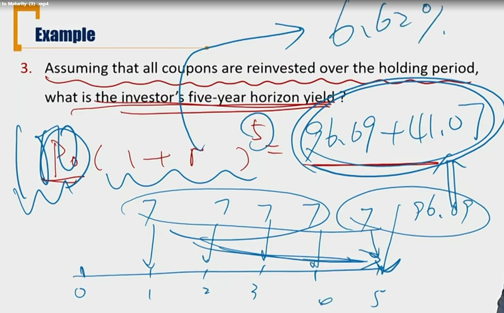

- 这里市场利率上涨，好处是coupon 再投资价值变高；坏处是卖出的价格变低。总的影响导致收益率变低。

## 2、Other Yield Measures

#### Yeild Measures for Fixed-Rate Bonds

- Yield measures typically are **annualized**
  - For bonds maturing in more than one year, yields typically are **annualized** and **compounded**.  年化且复利
  - Yield on instruments maturing in one year or less typically are **annualized** but **not compounded**(simple interest basis). 短期债券收益率是年化，但是用单利
- 如果付息周期小于一年，已知在付息周期比如半年的利息是r,有两种计算年化利率的方法：
  - BEY: bond equivalent yield 单利
    - 年化利率=2 \* r
  - EAR: effective annual rate 复利
    - 年化利率=(1+r)^2-1

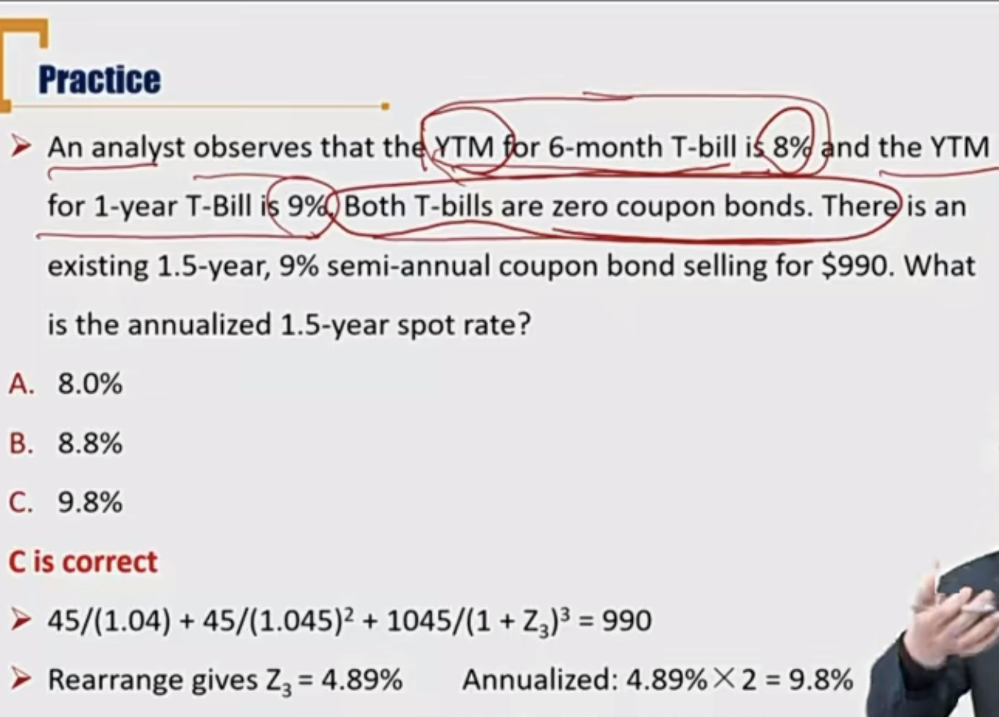

- 这一题，要注意第一年用了BEY的话，第二年也是需要同步BEY

#### Yield Measures for Fixed-Rate Bonds

- **Street convention yield**
  - Street 指华尔街
  - the IRR on cash flow assuming the payments are made on the scheduled dates, and **neglect** weekends and holidays.
  - 不考虑周末和假期
- **True yield**
  - the IRR on the cash flows using the **actual** calendar of weekends and holidays
  - True yield never higher than street convention yield
  - true yield <= convention yield

#### Yield Measures for floating-rate bonds

- Coupon rate = reference rate +/- quoted margin
  - Quoted margin: the specified yield spread over the reference rate, that compensate investor for the difference in the credit risk of the issuer and that implied by the reference rate.
  - Quoted margin: 报价价差
- Required margin/Discount margin0
  - 要求价差：required rate of return = reference rate +/- required margin
  - if quoted margin  > required margin, FRNs will be priced at premium溢价发行
  - if quoted margin  = required margin, FRNs will be priced at par 平价发行
  - if quoted margin  < required margin, FRNs will be priced at discount折价发行

#### Yield measures for Money Market Instruments货币市场工具\*

货币市场工具（小于等于1年）的一般报价方法，需要记忆不同产品按照不同方法报价。

- **Discount yield** (e.g., **commercial paper, T-bills**)折扣率

$$
PV = FV \times (1-\frac{Days}{Year}\times DR)
$$

$$
DR=\frac{FV-PV}{FV}\times \frac{Year}{Days}
$$

- **Add-on yield**(e.g., LIBOR, bank CD rates, repo rates)附加率，如果不是货币市场工具一般是用这种

$$
PV(1+\frac{Days}{Year}AOR)=FV
$$

$$
AOR=\frac{FV-PV}{PV}\frac{Year}{Days}
$$

- Both discount basis and add-no yields in the money market are quoted as simple annual interest and can be based on a 360-day or 365-day basis(**Bond equivalent yield** for **money market security yield** stated on a 365-day add-on rate basis)

  - $$
    BEY = \frac{FV-PV}{PV}\frac{365}{Days}
    $$

  - BEY用于货币市场工具报价时，用365年的add-on yield

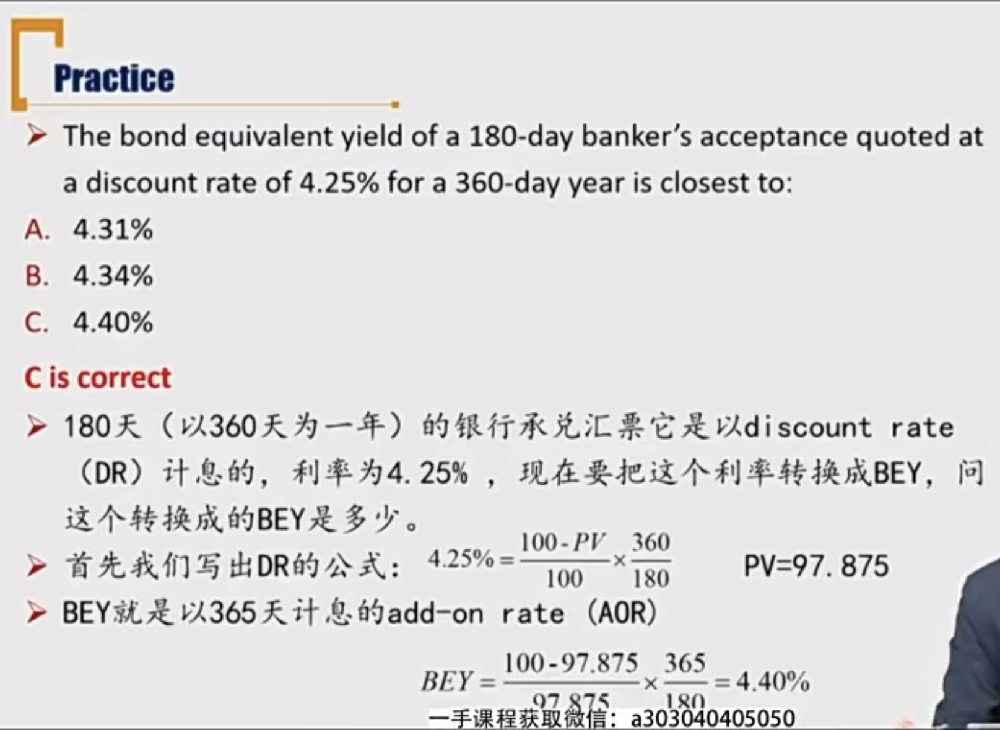

- **Current yield**(income or interest yield)
  - The sum of the coupon payments received over the year divided by the flat price.
    - 全年收到的coupon / 当前的债券报价
    - coupon rate不变，付息频率的变化，对current yield没有影响
  - Example: the current yield of a 2% seminannual coupon bond priced at 95 is 2/95=2.11%

| Bond selling at |                                                 |
| --------------- | ----------------------------------------------- |
| Par             | coupon rate = current yield = yield to maturity |
| Discount        | coupon rate < current yield < yield to maturity |
| Premium         | coupon rate > current yield > yield to maturity |

这里的current yield只考虑了interest。加上本金amortization的考虑，就成了simple yield

- **Simple yield**
  - The sum of annul coupon payment plus straight-line amortization of discount or premium, divided by the flat price.

- **Par bond coupon rate/Par rate**

  - 调整coupon rate使得债券在现有的spot rate下，定价等于面值
  - The coupon rates for bonds of various maturities that would result in bond prices equal to their par values

  $$
  Par = \frac{PMT}{(1+s_1)}+\frac{PMT}{(1+s_2)^2}+...+\frac{PMT+Par}{(1+s_n)^n}
  $$

  - Par rate = PMT / Par
  - a sequence of YTMs such that each bond is priced at par value.
  - par rate有两种理解形式：
    - 1）如果priced at par时，本来就是平价发行，求出的YTM=coupon rate，就是对应的par rate.
    - 2）标准定义：按照已有的spot rate，令价格等于par，推出coupon rate就是par rate

- **Yield to Call**

  - The IRR on cash flows assuming the embeded call option is exercised.

  - 假设callable 行权算出来的YTM

- **Yield to first call**
  - Assuming the embedded call option is exercised at the first call date
- **Yield to second call**...
- **Yield to worst**
  - The lowest of the sequence of yields-to-call(YTC) and the yield-to-maturity(YTM)

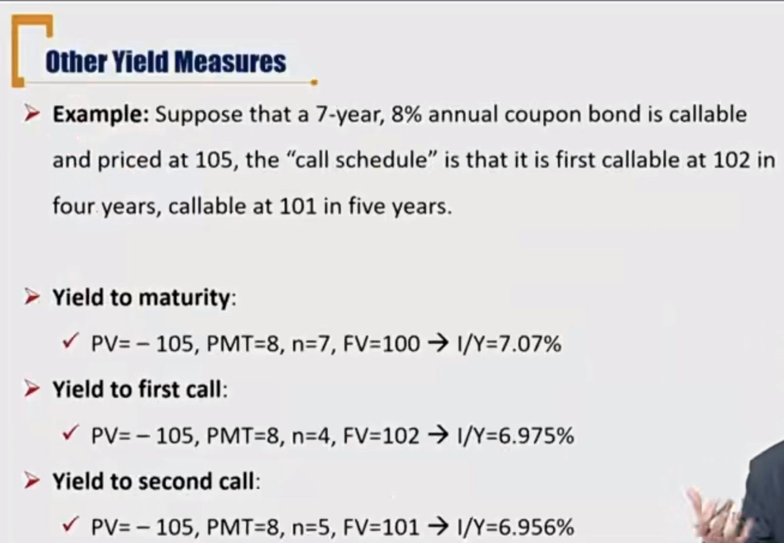
