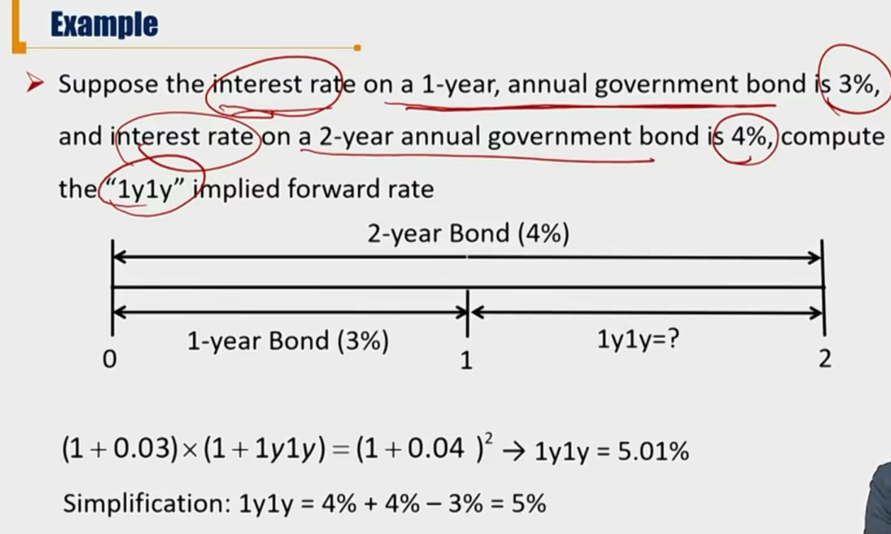
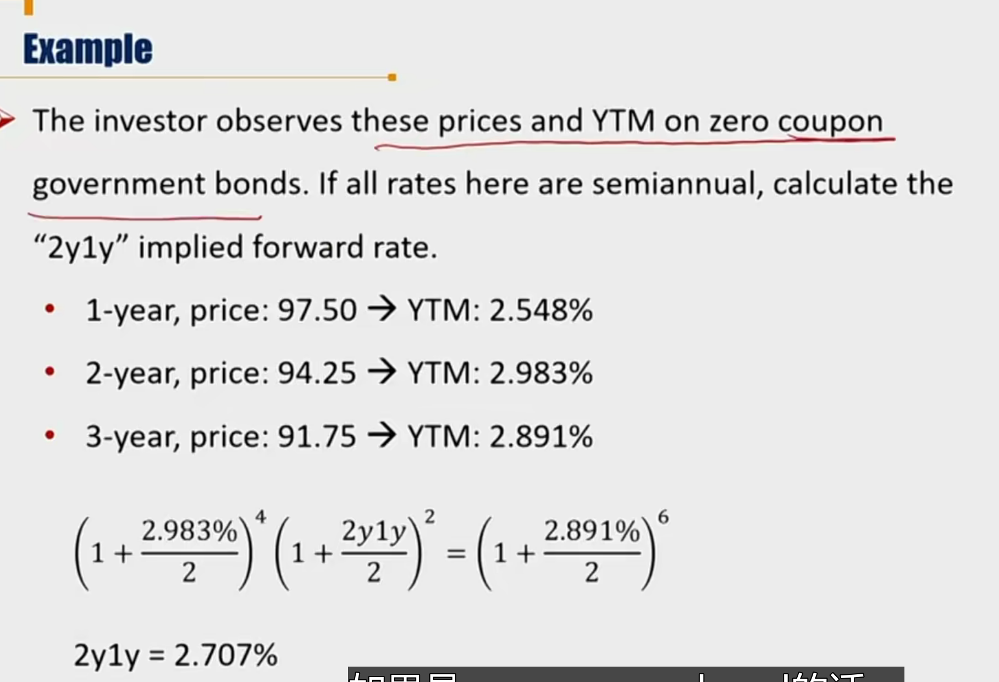
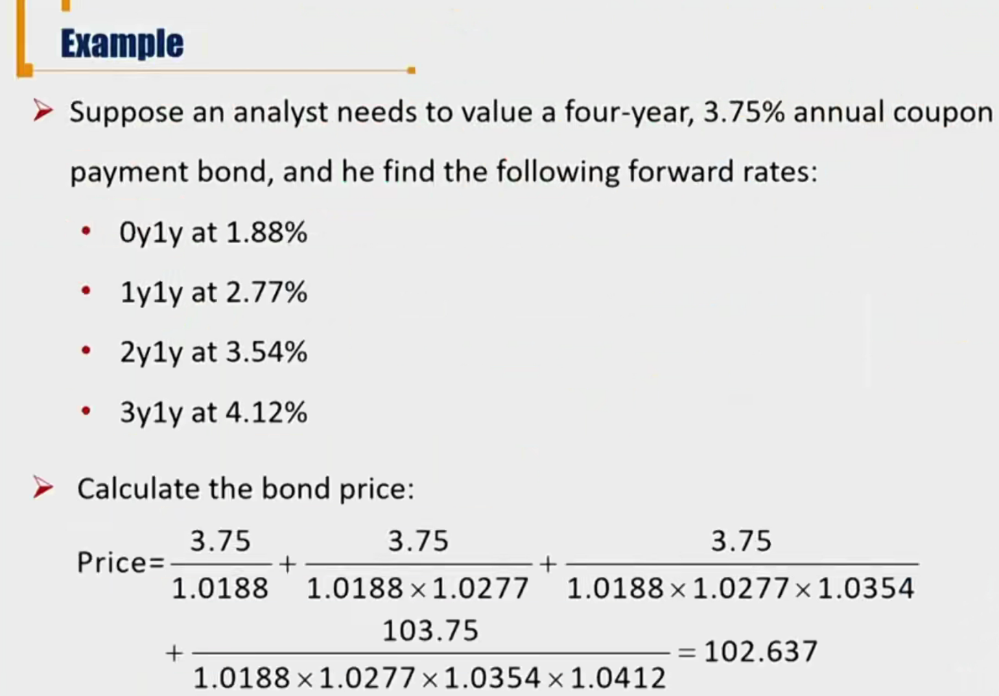
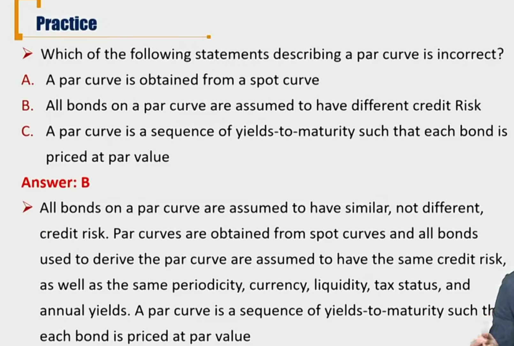

# R4 Forward Rates \*\*\*

Tasks:

Calculate spot rates from forward rates, forward rates from spot rates, and bond price using forward rates

Define and compare the yield curves.

#### Forward Rates

- **Forward market** 远期市场
  - Agreement to the terms for the transaction is **on the trade date**, but delivery 交割 of the security and payment for it is deferred to **a future date**
- **Forward rate** is the inte2rest rate on a bond or money market instrument traded in a forward market
  - "2y5y" means "the two year into five-year rate": the first number 2 refers to when to start the forward contract and the second number 5 refers to the tenor期限。

#### Relationship between Forward Rates and Spot Rates

- **Implied forward Rates**(**IFR**, forward yields) 隐含远期利率
  - A break-even reinvestment rate that are calculated from spot rates

$$
(1+z_A)^A\times (1+IFR_{A,B-A})^{B-A}=(1+Z_B)^B
$$

- $IFR_{A,B-A}$ is a forward rate that starts in period A and ends in period B, its tenor is (B-A) periods("Ay(B-A)y")
- 这里假定没有套利机会。
- 隐含远期利率体现了spot rate curve的重要性。对于给定了一个spot rate curve，任意一个远期利率都可以通过IFR公式求出。
  - 比如知道了一年spot rate，以及三年spot rate。我们假定两种投资方式不存在套利机会：
    - 1）第一年投资s_1，第2、3年投资1y2y的远期利率的理财产品
    - 2）第1、2、3年都投资s_3理财产品
  - 则，$(1+s_1)^1(1+r)^2=(1+s_3)^3$

- 有一种简化方法：$Az_A+(B-A)r=Bz_B$，能得到近似解。(1+x)^n=1+nx+o(x)
- 对于半年付息一次的债券，需要用BEY方法（参考R3 YTM）

#### Pricing bonds with forward rates

- Forward rates can be used to value a bond in the same as spot rates because they are interconnected
- Discount bond cash flows one period by one period with forward rates

$$
BondValue=\frac{CF_1}{1+s_1}+\frac{CF_2}{(1+s_1)(1+1y1y)}+...\frac{CF_T}{(1+s_1)(1+1y1y)...(1+(T-1)y1y)}
$$

按照无套利假设，spot rates可以用任意组合的远期利率代替。

#### Maturity Structure of Interest Rates

期限结构：利率期限大小和利率关系. 这里考试不作重点。重点是spot rate curve

- Sport curve/zero curve
  - a sequence of YTMs on zero-coupon bonds

- Forward curve
  - a series of forward rates, each having the **same** tenor
    - forward curve上，tenor一样，1y1y, 2y1y在一条曲线上（2y1y不在）
- Yield curve 
  - the relation between YTMs and maturity
- Par curve/ par rate curve
  - a sequence of YTMs such that each bond is priced at par value, and is obtained from a spot curve
  - 横坐标是maturity，纵坐标是对应的根据spot rate计算出来的不同期限的par rate
- Forward curve和yield curve和par curve都可以从spot rate 推导

- 注意B选项：par curve上所有点都有同样的credit risk。因为credit risk反应在要求回报率上。如果par curve上两个债券的credit risk不一样，要求回报率不一样，那么spot rates也不一样，那就是从两个不同的spot rate推导出来。