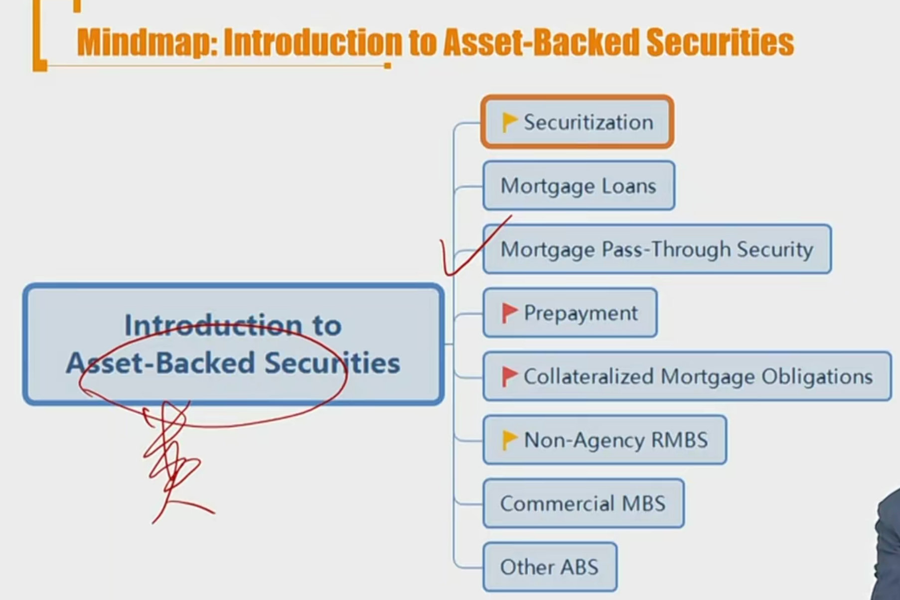
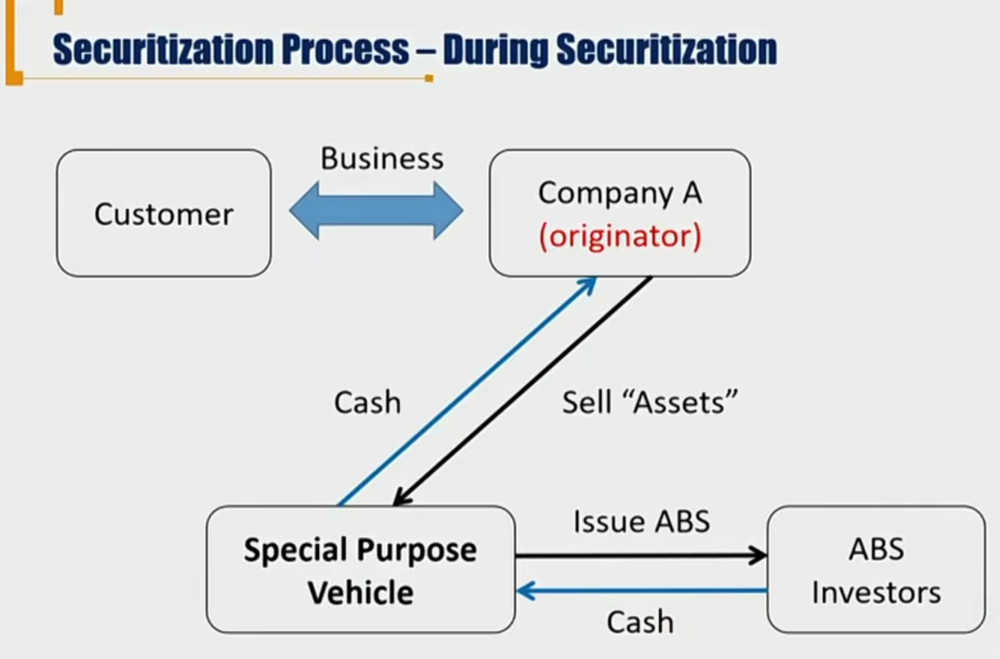
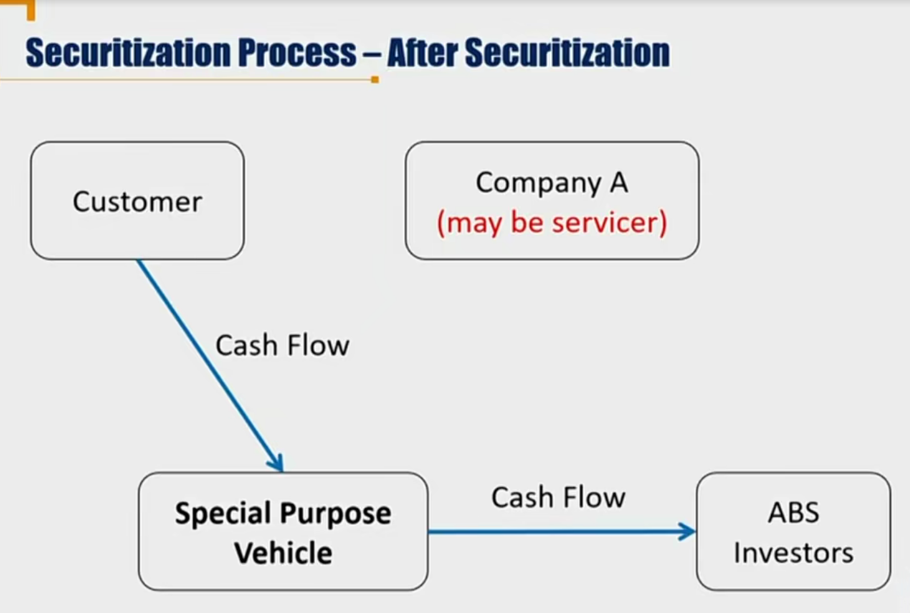
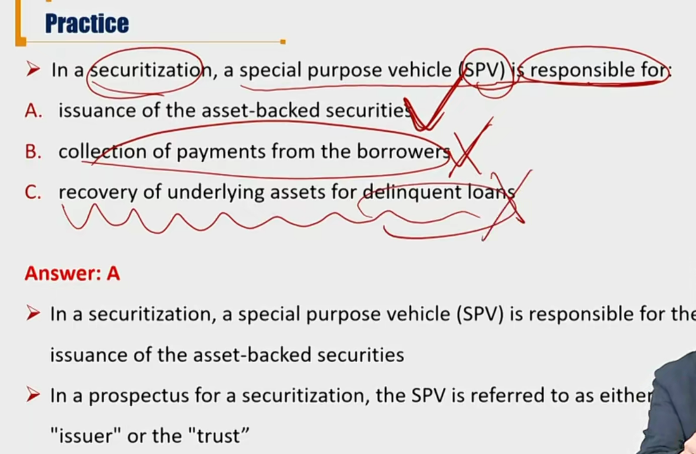

银行期限错配：存款期限短，贷款期限长。

ABS模式中的pass-through转手模式

- 转手收益，把backed asset的现金流转移到ABS
- 转移提前还款风险，reinvestment risk

ABS中涉及到SPV，资产打包转移到SPV，”出表“

# R1 Securitization

#### Introduction of ABS

- **Asset-backed security(ABS)**
  - Securities backed or collateralized by a pool of assets(资产池)
  - **Securitized assets**: assets used to create ABS, including mortgage loans, automobile loans汽车贷款, and receivables应收账款.
- **Mortgage-backed security(MBS)**
  - MBS is an asset-backed security, but often refers to securities backed by high-quality real estate mortgages. 按揭贷款支持证券。
  - 美国市场里80%，大部分的ABS都是MBS。
  - 在中国实务中，MBS却占比较少，因为房贷业务比较优质，利用SPV证券化需要出表。国内小额消费信贷和不良贷款较多。

#### 证券化T=0时

- ABS是由SPV发行。originator是company A(银行)。（发起人）
- sell assets指卖断。

#### 证券化T>0时

- SPV风险隔离，company A破产后，asset现金流不会被清算，不受影响。
- SPV其实是空壳公司，仅仅起到风险隔离作用。平时的现金流管理、催债等（servicer），都由originator负责。
- Custormer的还款，法律上属于SPV

#### Securitization Process

- Move assets from the owner of the assets into a special purpose vehicle(SPV, SPE, SPC), then issue ABS backed by cash flows of the asset.
  - SPV buys the assets and **issues ABS**, and is a **bankruptcy-remote vehicle.**
    - 注意，SPV发行ABS，起到破产隔离作用。
  - SPV plays a pivotal role in the securitization process in terms of protecting the rights of creditors investing in ABS.
    - SPV保护了ABS investor

#### Benefits of securitization

- Due to **disintermediation** (脱媒):
  - 脱媒指的是脱掉了原本发放贷款、吸收存款（投资）的媒介作用
  - Lower funding cost of borrowers
    - 银行不是用自身现金流做借贷业务，资金来源更多，借款成本降低
  - Enhance the risk-adjusted return of investors（针对投资人）
    - 获取更高回报率
- Increase the **liquidity** of financial asset
  - asset 指的是按揭贷款，ABS的底层资产
- Allows investors to achieve better **legal claims** on the underlying
  - 指的是底层标的资产更安全，有破产隔离
- Allows investors to access asset classes **matching** their risk, return, and maturity profiles that are otherwise not directly available(**Tranching**)
  - 结构化满足不同的投资者对风险、回报率要求