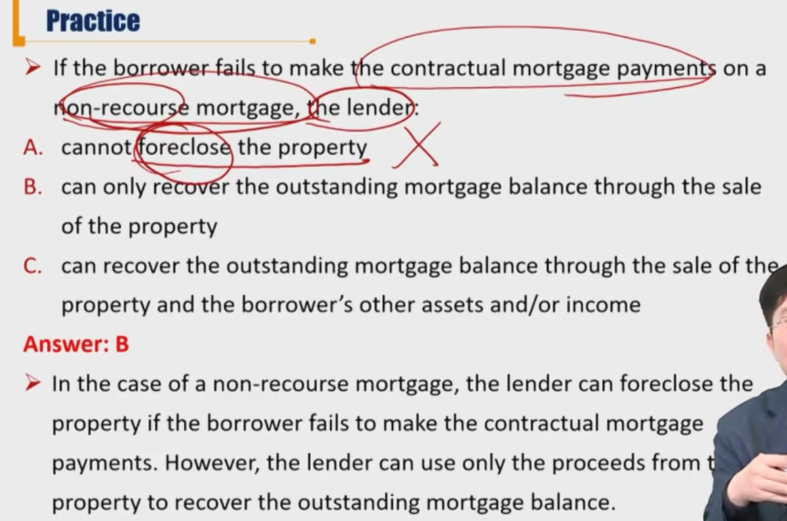

# R2 Mortgage Loans 按揭贷款

Describe types and characteristics of mortgage loans

#### Mortgage loan

- Loan secured by the specified real estate property that obliges the borrower to make a predetermined series of payments to the lender. 每一期的现金流提前确定
- **Foreclosure**(丧失抵押品的赎回权): allow the lender to take possession of the mortgaged property and then sell it in order to recover funds if the borrower defaults. 债务人违约，债权人有权处置抵押品
- **Loan-to-value ratio(LTV)**
  - 贷款 / 抵押品价值
  - the ratio of the amount of the mortgage to the property's value
  - Lower LTV->more borrowers' equity->less likely to default->more protection for the lender

- The interest rate on a mortgage loan is called the mortgage rate or contract rate.
  - **Fixed rate**: the mortgage rate remains the same during the life of the mortgage.
  - **Adjustable or variable rate**: the mortgage rate is reset periodically.
  - **Initial period fixed rate**: mortgage rate is fixed for some initial period and is then adjusted.
  - 美国大部分是Fixed rate
- **Amortizing loans**: the amortization of a loan means the gradual reduction of the amount borrowed over time. 房贷都是摊销形式
  - **Fully amortizing loan**, the sum of all the scheduled principal repayments during the mortgage's life is such that when the last mortgage payment is made, the loan is fully repaid
  - **Partially amortizing loan**, the sum of all the scheduled principal repayments is less than the amount borrowed(last payment called **balloon**)
- **Interest-only mortgage**: no scheduled principal repayment is specified for a certain number of years.
- **Prepayment option** 提前还款权：
  - entitle the borrower to repay all or part of the oustanding mortgage principal prior to the scheduled due date that the principal must be repaid
  - **Repayment penalty**: stipulate monetary penalty when a borrower prepays within a certain time period
- **Prepayment risk**
  - the uncertainty that the cash flows will be different from the scheduled cash flows due to the borrowers' prepayment

- **Recourse loan有追索权的贷款**：
  - The lender has a claim against the borrower for the shortfall between the oustanding balance and the procedds received from the sale of the property. 抵押物拍卖后，不足以抵消已有的贷款，银行有权向债务人追索剩余本金。
  - Less likely to default
- **Non-recourse loan** 无追索权
  - The lender cannot claim borrower's personal assets except for collateral property
  - More likely to default

