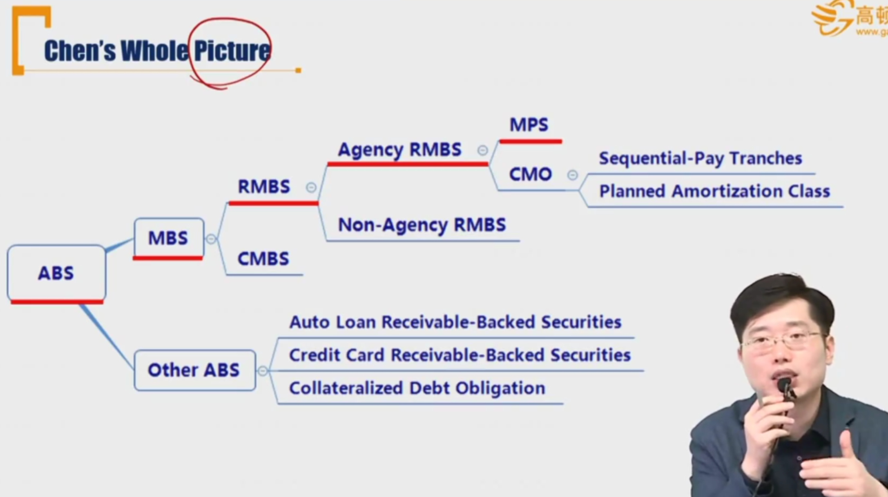
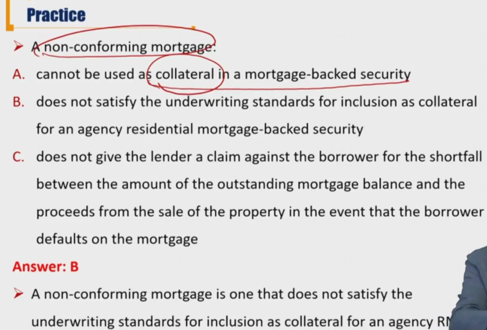
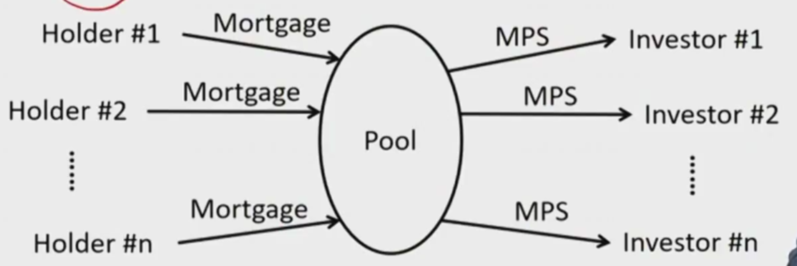

# R3 Mortgage Pass-Through Security (抵押转手债券

RMBS: residential MSB, CMBS: commericial MBS

Agency RMBS：类政府机构发放的：房利美，房地美，吉利美

Non-Agency RMBS：投行

MPS：是agency 发行的，没有做结构化的MBS

CMO：做了结构化的MBS

#### Residential MBS(RMBS) 居民住房抵押贷款支持证券

- RMBS are backed by a pool of residential mortgage loans

1. **Agency RMBS**: guarranteed by a federal agency(Ginnie Mae) or by either of the two government-sponsored enteerprises(GSE, i.e. Fannie Mae and Freddie Mac)
   - Ginnie Mae carry the full faith of US government
   - The two GSEs do not carry the full faith of US government, but are condsidered with high credit quality
   - 理论上，Agency RMBS不考虑信用风险
2. **Non-agency RMBS**: issued by private entities and are not guarantee by a federal agency or a GSE.
   - Non-agency RMBS需要考虑信用风险

- **Conforming mortgage** 标准住房贷款
  - Loans that satisfy the underwriting standards for inclusion as collateral for an **agency RMBS**
    - Maximum size of the loan
    - Maximum loan-to-value ratio
    - Loan documentation and insurance required
    - 也就是能够纳入agency RMBS的，只能是标准住房贷款
- **Non-conforming mortgage 非标准住房贷款**
  - Loans that fail to satisfy the underwriting standards

#### Mortgage Pass-Through Security(MPS)

- MPS is a security created when one or more holders of mortgages form a pool of mortgages and sell shares or participation certificates in the pool.
  - 这里的pass through，不仅转移了资金（return），也转移了风险（reinvesment risk等）

- **Waterfall** 瀑布式结构: the structure adopted in a securitization transaction

- **Weighted average coupon rate(WAC)**
  - weighting the mortgage rate of each mortgage loan in the pool
  - 资产池中的贷款利率进行加权平均（一般是贷款本金余额作为权重）
- **Pass-through rate（net interest, net coupon)**
  - the coupon rate theat investors receive
  - Mortgage rate on the underlying pool **less** the service and insurance fee. 
  - 投资MBS的投资人收到的coupon rate，需要减掉originator的服务费
- **Weighted average maturity(WAM) **\*
  - weighting the remaining number of months to maturity for each mortgage loan in the pool
  - 对资产池中的贷款剩余期限进行加权平均（按照剩余本金）， WAM会随着时间不断缩减。
- **Weighted average life(WAL)** \*
  - The convention-based average time to receipt of all principal repayments(**scheduled principal repayments** and **projected prepayments**)
    - 银行根据历史数据，判断资产池中的贷款的提前还款的情况。
  - Gives investors an indication of how long they can expect to hold the MBS before it is paid off.
    - 投资者根据WAL决策持有MBS持有时间

#### summary

agency RMBS vs. non agency RMBS

MPS: WAC, WAM, pass-through rate, 