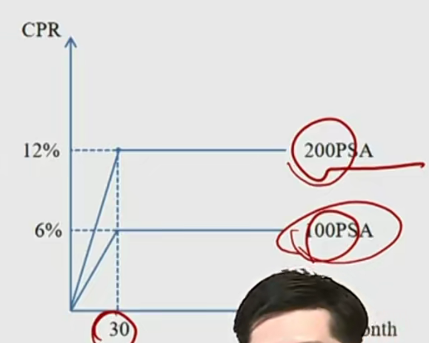
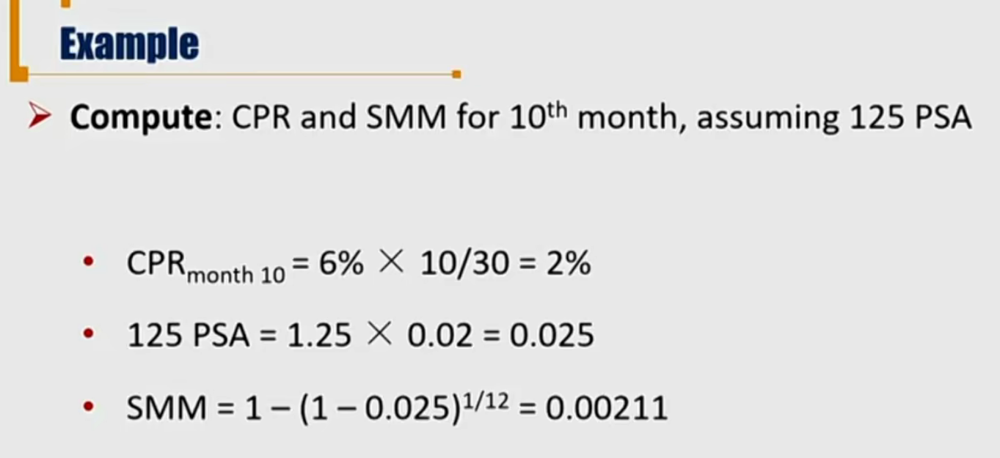
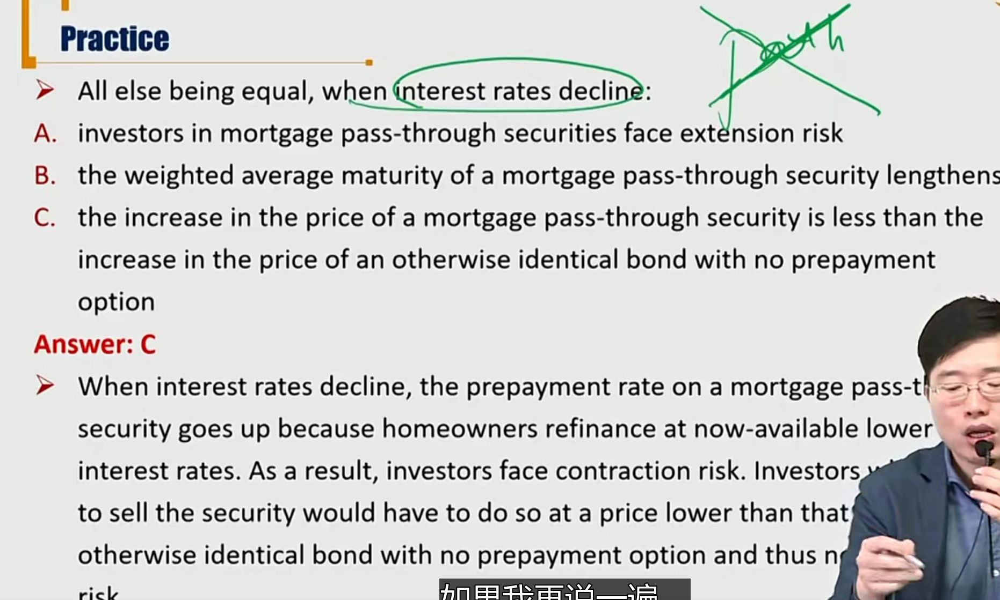

# R4 Prepayment \*\*\*

提前还款

#### Prepayment

- The **scheduled** reduction of outstanding principal is referred to as **scheduled amortization**. 
  - 按照计划摊销本金
- A borrower can pay an amount **in excess of the monthly required payment**, which is called prepayments.
  - 提前还本金
- The ability of the borrower to prepay results in **prepayment risk** 
  - 两方面：再投资风险、本金提前还导致利息减少
  - 根据pass through, 这些风险都转移到了MBS投资者
  - Prepayments **reduce the amount of interest** the lender（其实是MBS投资者收到的coupon减少） receives over the life of the mortgage and cause the principal to be repayment sooner
  - The **reinvest return** for the MBS investor may be lower
  - 一般来说，资产池中的每份贷款提前还款概率都不一样，需要分开讨论。但是为了理论研究方便，一般统一建模，设定一个统一的benchmark进行分析。

##### Measurement of prepayment rate

- **Single monthly mortality(SMM) rate** 每月提前还款率
  - A **monthly** measure of prepayment rate
- **Conditional prepayment rate(CPR)**  每年的提前还款率
  - Corresponding **annualized** rate of prepayment rate
  - A CPR of 6% means that approximately 6% of the outstanding mortgage balance at the beginning of the year is expected to be prepaid by the end of the year

$$
SMM = 1 - (1 - CPR)^{1/12}
$$

$$
(1-SMM)^{12}=1-CPR
$$

- **Monthly prepayment = SMM \* (mortgage balance - scheduled principal payment)** 
  - = SMM \* (月初的未还的本金 - 本月计划还的本金)
  - 通过上式可以计算SMM
- **PSA prepayment benchmark**
  - A monthly series of CPRs by Public Security Association(PSA), assuming prepayment rates are low for newly originated mortgages and then speed up as the mortgages become seasoned(season指贷款过了几个月).
  - The benchmark is said to be 100 PSA: CPR increases by 0.2% per month up to months
  - Slower or faster rates are referred to as some percentage of PSA. 可以按照百分比方所

- PSA：0-30个月线性增长，100PSA中，CPR增长到6%.

#### Factors Affecting Prepayments\*\*

1. **Prevailing mortgage rates** 当前的贷款利率水平

- **Spread** between current mortgage rates and original mortgage rates
  - 当前的房贷利率和原来的利率的利差
  - Most important factor，当前的利率是最重要的因素
  - **When rates fall, refinancing increases**
    - 当利率下跌，提前还款的情况增加。

- **Path of mortgage rates**
  - **refinancing burnout**
    - burnout 用光了。意思是虽然现在利率比较低，但之前出现过更低的情况。之前的提前还款，refinancing已经在之前更低的利率的时候还款还掉了。
  - Know as "**path dependence**"（路径依赖，指的是利率的路径）
  - Implication: **cannot value MBS with the binomial model**
    - MBS存在路径依赖，所以不能用二叉树模型

2. **Housing turnover 房产周转率**

- Increases as rates fall 利率越低，房产周转率越高,因为利率越低的话：
  - Housing becomes more affordable
  - More refinancing/prepayments
- Increases as economic activity rises 
  - Personal income increases -> more refinancing / prepayments

3. **Characteristics of underlying mortgages**

- **Seasoning**: Prepayments increases as loans season (modeled by PSA)
- Property location. Prepayments are faster in some locations.

#### Prepayment Risk \*\*\*

-  prepayment risk

  1. **contraction risk**: when interest rates decline, the security will have a shorter maturity because home owners refinance at now available lower interest rates**缩期风险**

  2. **extension risk**: when interest rates rise, fewer prepayments will occur, and the security becomes longer maturity（相对于WAL来说longer）. **扩期风险**

     注意：WAM：30年，WAL：26年。那么28年还款，就是extension risk。但是如果是32年还款，那就是违约风险。

     也就是，缩期风险和扩期风险，都是提前还款风险。本质是提前，不是违约。

#### Important Tips

- Is MBS the same as callable bond and why?
  - 提前还款prepayment其实可以理解为callable bond的call 权，但是存在差异：
  - 1）callable bond一般都是bullet bond，MBS为摊销模式，等额本息，每期还款金额差不多。
  - 2）MBS的call option的不确定性更大。体现在提前还款计划不一定，但是callable bond的call price一开始被确定。
- 注意，MBS存在call option，所以图像和callable bond一样，存在一个上限，**并且图像存在凹凸性变换**（回顾callable bond的call price上限）。所以：如果利率下跌，MBS上升速度比普通的bond要慢。看下面的例题。
- 考试就把MBS理解为callable bond就可以。

