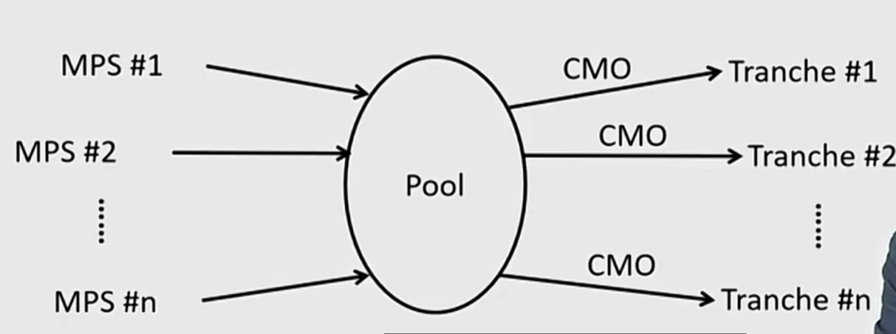
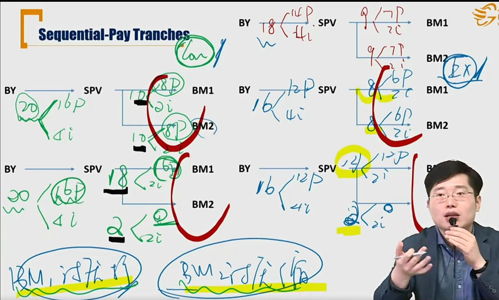
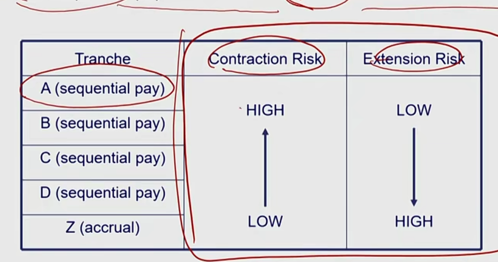
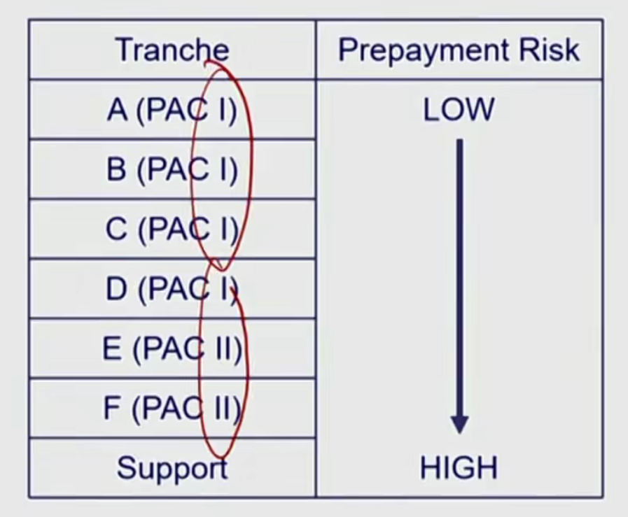
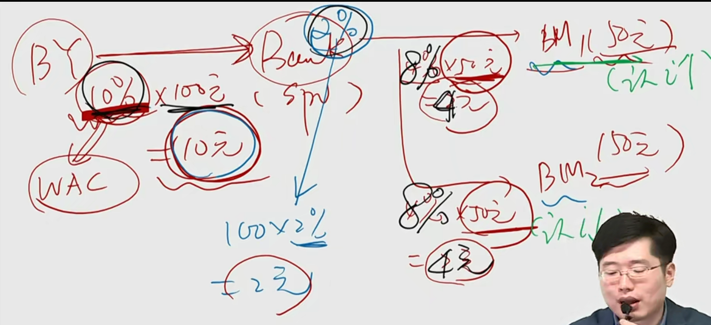
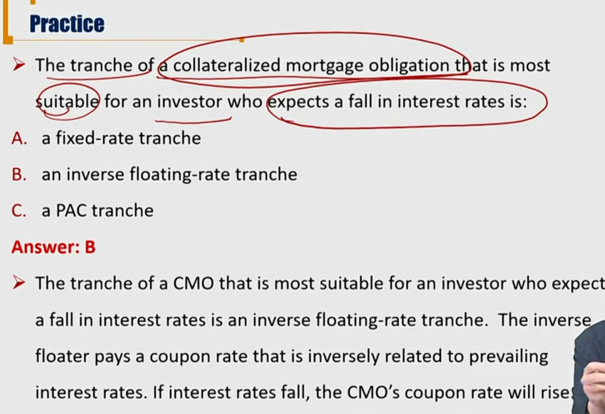
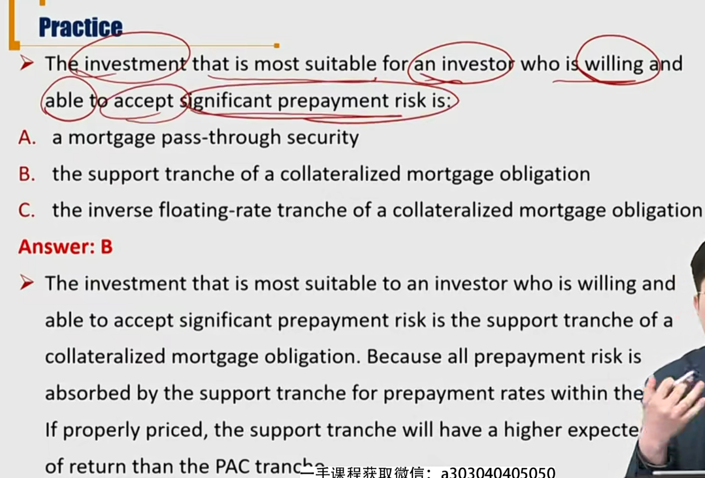

# R5 Collateralized Mortgage Obligations \*\*\*

担保抵押债券。

风险打包、分层、重新分配，本质上只是银行（ SPV）给到MBS投资者现金流的重新分配，并没有增加或者减少总风险，也即是，这个过程，总风险不变。

#### Collateralized Mortgage Obligations

- **Collateralized mortgage obligations(CMO)**
  - Securities that **redistribute** the cash flows of mortgage-related products to various tranches. 对现金流进行再分配。现金或风险**没有**增加或减少
  - Backed by mortgage pass-through security(MPS) 背后是MPS，多了一个分层再分配

#### Sequential-Pay Tranches 顺序支付

- **Sequential-pay tranches**: each class of bond(the tranches) would be retired sequentially
  - Both tranches receive **interest payments** at a specified coupon rate 利息都一样
  - all **principal payments** are directed to Tranche A until it is completely amortized
  - **principal payments** would then accrue to Tranche B until it was fully amortized and the underlying pool was exhausted. 
  - 支持贷款的利息按照coupon rate分配，但是本金部分按照tranche顺序分配。最后一个tranche收完钱后，资产池也还干净了。
- Z-tranche or accrual tranche 
  - last tranche to receive principal
  - does not receive current interest until the other tranches have been paid off
  - Tranche Z在开始阶段连利息都不收
- 下图中，
  - 右上角红色，是最早预期的支付方式
  - 左边绿色，是contraction risk缩期风险
  - 右边蓝色，是extension risk扩期风险
  - 每期还款金额影响的都是本金，利息没有影响
  - 最下面一行，是做了结构化处理后的现金流
    - 利息还是照常50%分配，对本金进行分层支付tranche
    - 比如下图中，先消耗大妈1的本金，大妈2不拿本金

  - 考试不考计算3

- 注意：提前还款，都是还本金。
- Contraction and extension risk **still exist** with sequential-pay tranches structure, but they have been **redistributed** to between the tranches
  - The short tranches, which matures first, offer more protection against extension risk
    - 越前面的tranches更少extension risk
  - The long tranches provide relatively more proctection against contraction risk
  - Z-tranche has little contraction risk, but with the highest extension risk

- Each sequential pay CMO tranche has **mix** of contraction and extension risk

- 根据tranche对contraction risk和extension risk进行了再分配，但是总的prepayment risk没有变化。

#### Planned Amortization Class Tranches

- **Planned amortization class(PAC) tranches** offer greater predictability of the cash flows as long as the prepayment rate is within a specified band(collar).
  - 还款人在一定的提前还款速率范围内（collar），能够保持现金流的可预测性（extension risk and contraction risk较低）
  - Have limited(but not complete) protection against both extension risk and contraction risk. 被保护需要满足两个条件：1）support tranche没有耗尽；2）还款的CPR在一定的collar
    - If the prepayment rate belongs to the collar, the PAC tranches would receive the payments as schedule. 提前还款在collar内，PAC tranche能够收到预期的计划现金流
- **Support tranches/companion tranches** absorb the prepayment risk first, and expose investors to greater prepayment risk.
- 也就是，support tranche给PACtranche提供保护（保护PAC Tranche免受extension and contraction risk）。所以，PAC结构的债券，优先保证了PACtranche稳定的本金和利息，然后剩余的prepayment或者是少还的prepayment，由support tranche承担。可见，还的越快，support tranche消耗得越快，所以到了债券末期，无法为PAC tranche提供保护；还得越慢，PAC也要承担一定得extenstion risk。
  - 所以，存在effective collar，在这个提前还款速率区间内，support tranche才能提供有效的保护。

- The certainty of PAC bond cash flow comes at the expense of increased risk to the support tranches
  - When prepayment speeds fall and prepayments decrease, the support tranche has significantly more extension risk
  - When prepayment speeds rise and prepayment increase, the support tranche has significantly more contraction risk
- The extent of prepayment risk protection provided by a support tranche increases as its par value increases relative to its associated PAC tranche. support tranche的**本金**越多，对PAC tranche提供的保护越多。

- **PAC II tranche**
  - The support tranche for a PAC I tranche that has a PAC shchedule of principal repayments
  - PAC II tranches have higher prepayment risk(and average life variability ) than PAC I tranches
    - PAC II为PAC I提供保护，PAC II被Protection保护
  - But PAC II tranches have more prepayment protection (and less average life variability  than support tranches)
- PAC/supoort structure: Redistributes contraction and extension risk.

#### Floating-Rate Tranches 浮息分层结构

- Floating-rate tranches are contructed by a **floater** and **an inverse floater**** combination from any of the fixed-rate tranches in a CMO structure.

- 有一个需要注意的地方：假设资产池中的coupon（WAC）是10%，银行拿走2%服务费，这时候，假设有两个人投资了没有tranched的MBS，那么每个人拿到的收益率是8%（而不是4%）。

- 但是，如果在floating rate tranches。第一个人拿到LIBOR，第二个人拿到16%-LIBOR（记得是16%，而不是8%）
- 利息下降，inverse floater 有利；利息上升，floater有利

#### Summary

三种结构化，sequential, panned amortization class, floating-rate tranches

显示中还有很多种CMO

