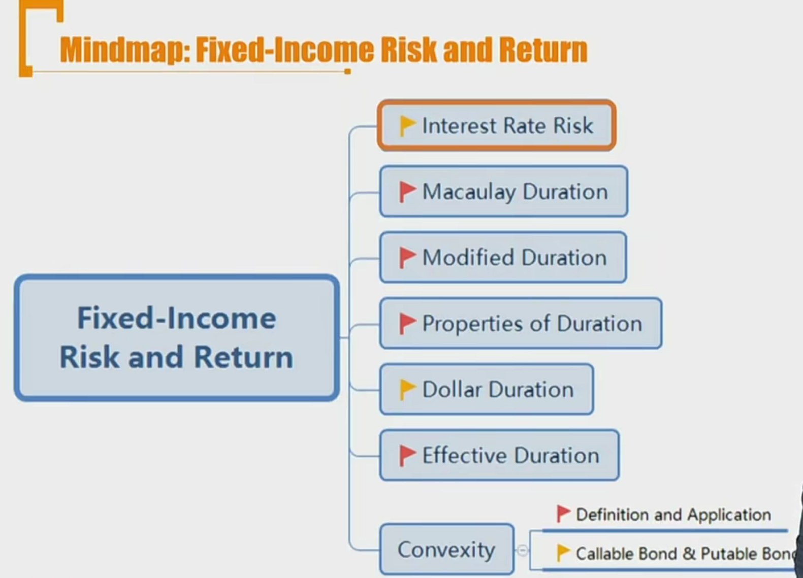

# R1 Interest Rate Risk

risk:

- market risk: 
  - prepayment risk
  - secondary market
  - interest risk
    - valuation risk
    - reinvestment risk
- credit risk
- operating risk 操作风险

#### Sources of Return

1. Promised coupon and principal payments
   - 对应credit risk
2. Reinvestment of coupon payments
   - market risk
3. Capital gain or loss on the sale of bond prior to maturity
   - Capital gains/losses arise if a bond is sold at a price **above/below its constant-yield price trajectory**
   - **Carrying value**: the price on the constant-yield price trajectory at that time, is the purchase price plus/minus the amortized amount of the discount/premium.
   - market risk

#### Interest Rate Risk

- **Interest rate risk** on fixed-rate bond investment is the risk that interest will change which affects the **reinvestment** of coupon payment and the **market price** if the bond is sold prior to maturity. Interest Rate risk 分为以下两种风险：

1. **Coupon reinvestment risk:** uncertainty about income from reinvesting coupon payments
   - (Return) Increase when interest rates go up
   - (Return) Decrease when interest rates go down
   - 考虑reinvestment risk的时候，担心利率下跌，因为利率下跌，再投资收益更小
2. **Market price risk**: uncertainty about bond price
   - （Bond price）Decrease when interest rates go up
   - (Bond price) Increase when interest rates go down
   - 考虑market price risk的时候，担心利率上涨，因为利率上涨，导致价格下跌。

两种风险怎么判断哪个更大？

- 投资期限越长（持有债券的时间越长），coupon reinvestment risk占主导
- 投资期限越短，market price risk更大，因为距离到期日更远，需要进行更多未来现金流折现

##### **暴露的风险敞口，和持有期限相关**

- Two investors holding the same bond(or bond portfolio) can have different **exposures敞口** to interest rate risk if they have **different investment horizons**. 一样的债券，持有期限不同，面临的风险敞口不一样。investment horizon持有期限
- **Market price risk** matters more, when the investor has a **short-term** investment horizon.
  - Horizon yield is **negatively** related with interest rates.
- **Coupon reinvestment risk** matters more, when the investor has a **long-term** investment horizon.
  - Horizon yield is **positively** related with interest rates.

- 债券的价格走势围绕着理论价值波动，越接近maturity，价格会回归至价值。所以说，投资期限越长，收到的market price risk就会越小。但是投资期限越长，coupon需要再投资更长时间，所以coupon reinvestment risk就会更大。
  - 所以，短期期限投资，市场价格风险占主导风险：
    - interest rates上升，市场价格下跌，所以horizon yield下跌，(negatively related）.
  - 长期期限投资，再投资风险占主导因素：
    - interest rates 上升，再投资收益上升，所以horizon yield上升，(positively related).

