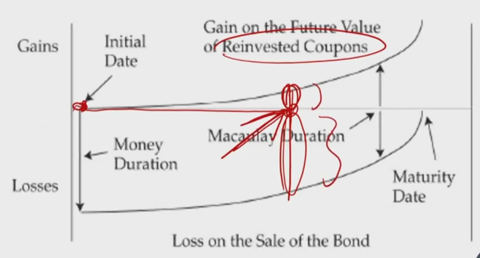
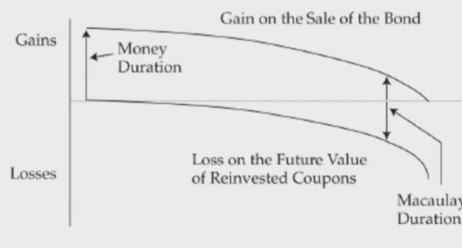

# R2 Macaulay Duration 久期 \*\*\*

平均回流时间，每期现值为权重，对时间求加权平均。

#### Macaulay Duration

- **Macaulay duration** is the weighted average time to receipt of the bond's promised payments, where the weights are the shares of the full price that correspond to each of the bond's promised future payments
  - 注意这里是full price实际交易价格
    - 复习：flat price是报价，不考虑当期的应计算利息。full price是实际交易价格，考虑accrued interest. 计算方法：折现计算上一期PV，通过复利计算full price，通过单利计算accrued interest, 最后full price - accrued interest = flat price

$$
MacDur = \frac{\sum_{t=1}^nt\times PVCF_t}{\sum PVCF_t}
$$

- MacDur is measured in terms of time periods.

#### Question

- What is the unit of Macaulay duration? 麦考利久期的单位
  - unit is year.
- What is the sign of Macaulay duration?
  - Macualay duration都是正号，大于零
- Amortization bond vs bullet bond vs zero-coupon bond
  - zero-coupon bond：mac duration = maturity
  - bullet bond：靠近maturity
  - amortization bond: 在1/2 maturity前面一点

#### Important

- Macaulay duration relects the investment horizon for which coupon **reinvestment risk** and **market price risk** **offset** each other.
  - 投资期限等于Mac duration时，再投资风险等于市场价格风险。！
  - 投资期限<Mac Duration时，价格风险占主导。
  - 投资期限>Mac duration时，再投资风险占主导。
  - Assumption: There is a **one-time** "**parrallel shift**" in the yield curve that occurs before the next coupon payment date.
    - Mac Dur上风险抵消的成立条件是：利率曲线只能在下一次coupon支付前只能发生一次**平行移动**（平行移动的幅度不大）

#### Interest Rate Risk & Investment Horizon

- When interest rates rise:

  加息，债券价格下跌。在mac dur的时候，再投资的收益=价格损失

- When Interest fall:

- When investment horizon > Macaulay duration
  - **Reinvestment risk dominates**** market price risk
  - Investors's risk is to lower interest rates投资者的主要风险是利率降低
- When investment horizon = Macaulay duration
  - Reinvestment risk **offsets** market price risk
- When investment horizon < Macaulay duration
  - **Market price risk dominates** reinvestment risk
  - Investor's risk is to higher interest rates. 投资者的主要风险是高利率

#### Duration Gap

- **Duration gap** is bond's Macaulay duration minus investment horizon
  - Mac dur - 投资期限 
  - 注意定义
- When duration gap > 0
  - market price risk dominates reinvestment risk
- When duration gap = 0
  - market price risk offsets reinvestment risk
- When duration gap < 0
  - reinvestment risk dominates market price risk
