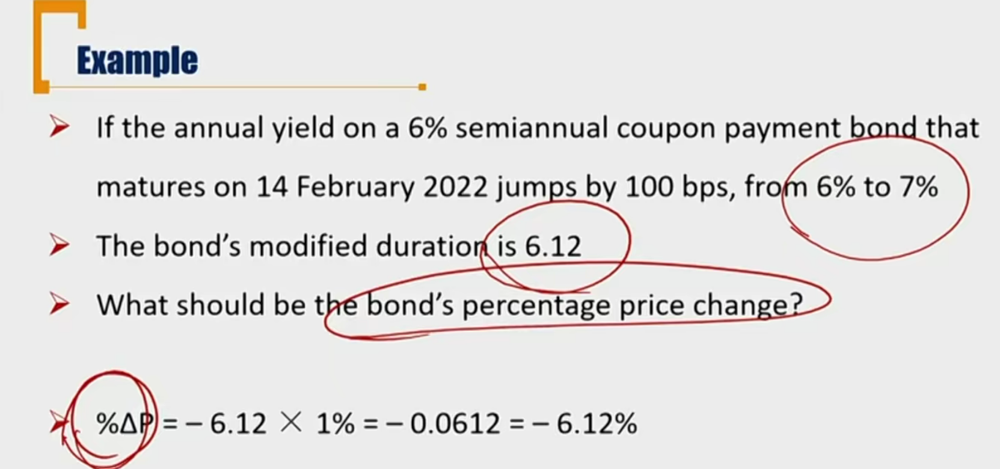
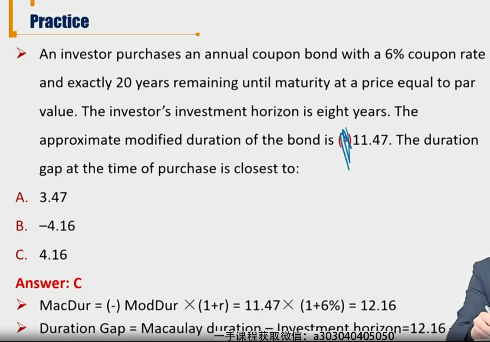
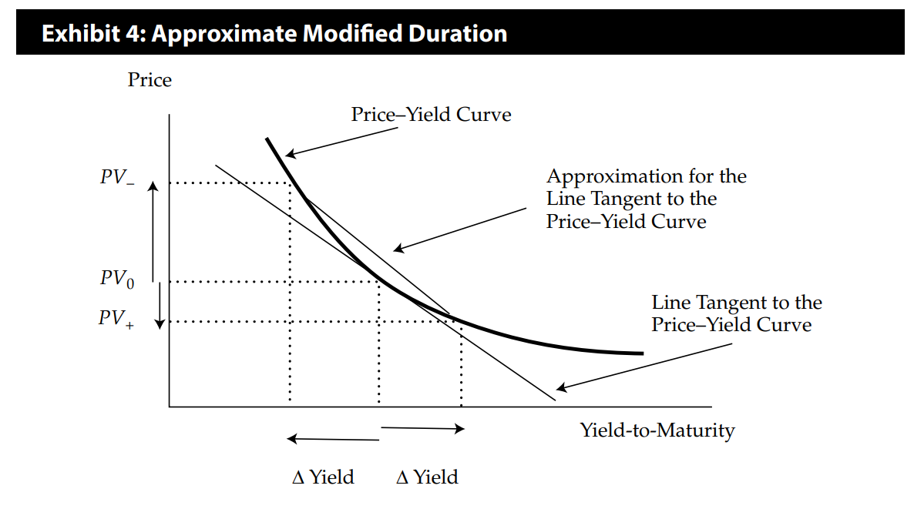
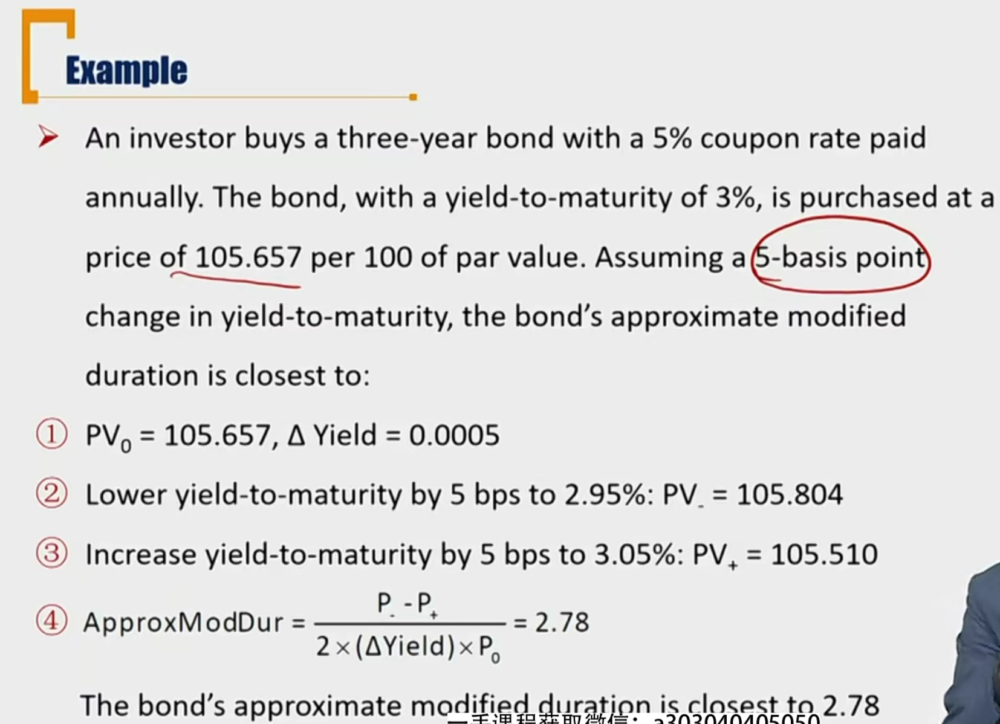

# R3 Modified Duration \*\*\*\*\*

更多的考虑market price risk，衡量的是价格风险的大小

#### Modified Duration

- **Modified duration** is a formula that expresses the measurable change in the value of a security in response to a change in interest rates.
  - 利率风险对债券价格风险的计量，利率变动的时候，债券价格变动的相对幅度（%）
  - 这里衡量利率时，市场利率水平和YTM的概念一样。
  - Modified duration is used to determine the **percent change of a bond's price** when there is a **100-basis-point(1 percent) change in its YTM**. (这里的price是full price交易价格)
  - Modified duration follows the concept that interest rates(YTM) and bond prices move in **opposite directions**. 注意利率和价格反向变动。
  - 比如ModDur = 5，利率变动1%，价格变动5%。

#### **Tips**

- ModDur的定义式，分母是利率变动的绝对值，分子是价格变动的相对值

$$
ModDur = \frac{\Delta p/p}{\Delta r}
$$

​	注意，下面是$\Delta r$，而不是$\Delta r / r$，因为利率自带百分号。利率变动1%，表示的是利率的绝对值变动了1%。

- What is the unit of ModDur?

自带百分号。要理解本质是利率变动绝对值1%，价格相对变动ModDur%.

比如利率从1%变动到2%，则价格下跌ModDur%。

- What is the sign of ModDur?
  - ModDur定义式上就是小于0。但是习惯性省略掉了负号。这里隐含了一个利率和价格反向变动。

#### Estimate

- ModDur provides **linear estimate**(线性估计) of the percentage price change for a bond given a change in its YTM

$$
\%Price \approx - ModDur \times \Delta Yield
$$

- 这里的约等于涉及到凸度的知识。利率上涨和下跌幅度一样时，可能价格变动幅度不一样

#### Example

#### Important Question

- What is the relationship between Macaulay Duration and Modified Duration?

$$
ModDur = -\frac{MacDur}{1+r}
$$

证明：
$$
ModDur = \frac{\Delta p/p}{\Delta r} = \frac{1}{p}(\frac{\Delta p}{\Delta r})
$$
令$\Delta r->0$
$$
ModDur = \frac{1}{p}(\frac{dp}{dr})
$$

$$
p=\frac{c_1}{1+r}+\frac{c_2}{(1+r)^n}+...+\frac{c_n+par}{(1+r)^n}
$$

对p求导，得到ModDur和MacDur的关系。一般r比较小，数值上，ModDur和MacDur比较接近。

- Why is it called Modified Duration?
  - 是通过MacDur修正得来

- What is the MacDur for perpetuity bond?永续债券的MacDur？

对于永续债券：
$$
p = \frac{c}{1+r} + \frac{c}{(1+r)^2}+...=\frac{c}{r}
$$
先求修正久期：
$$
ModDur = \frac{1}{p}\frac{\Delta p}{\Delta r} = \frac{r}{c}\frac{-c}{r^2}=-\frac{1}{r}
$$
所以，永续债券的MacDur
$$
MacDur=\frac{1+r}{r}
$$

- Do different perpetuity bonds have the same MacDur?

从上面式子可以看出，不同的永续债的MacDur只受到r的影响。所以同样市场利率水平下，不同的永续债的MacDur一样。

#### Approximation

- Approximate modified duration: an alternative approach to calcualte modified duration

$$
ApproxmateModDur=\frac{P_{-}-P_{+}}{2\Delta Yield \times P}
$$

- 其实用P-和P+的平均数，估计$\Delta P$。带入定义式，求得估计式。

。

- Question
  - What is the differece with $\frac{1}{p}\frac{\Delta p}{\Delta r}$？
    - 定义式种体现的时微积分的思想。用平均数估计微分。
    - 可以通过调节估计式中$\Delta yield$，逼近真实的定义式。

- **Approximate Macaulay duration**
  - ApproxMacDur = ApproxModDur \* (-)(1+r)

- 这里的$\Delta Yield$按照真实数字代入，也就是0.0005.(0.05%, 5basis-point)

