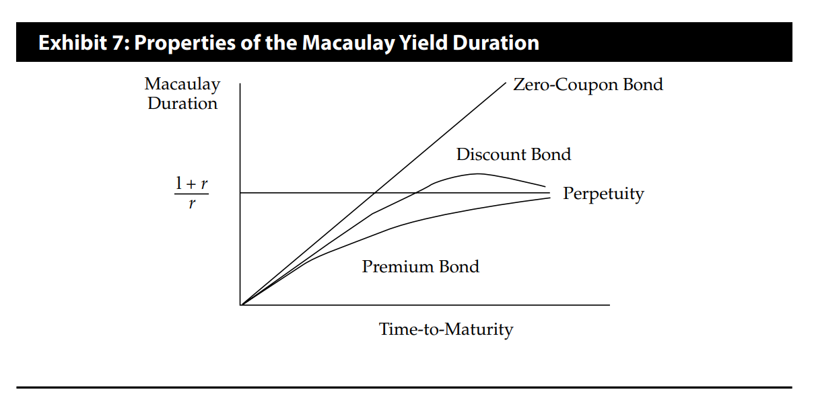
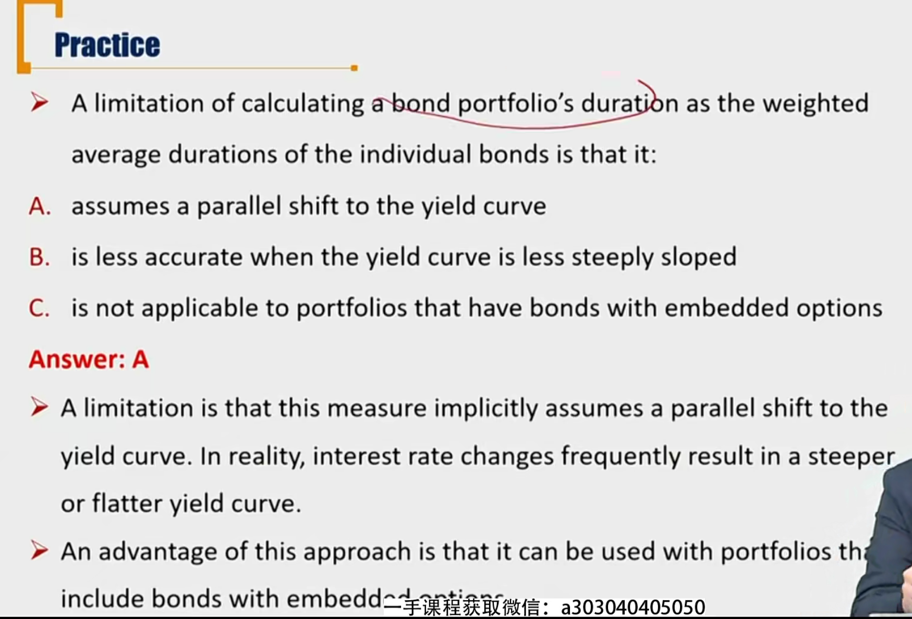

# R4 Properties of Duration

#### Important Tips

- How can we interpret duration?
  - Duration is a **weighted average time** (in years) until cash flow will be received
    - MacDur
  - Duration is the approximate **percentage change in price** of 1% change in yield
    - ModDur
  - Duration is the slope of the price-yield curve at the bond's current YTM?(the first derivative of the price-yield curve with respect to yield一阶导数)
    - 斜率仅仅是美元久期，但是可以通过斜率推断久期的大致变动趋势。也就是美元久期和MacDur、ModDur变动趋势一致。

#### Properties of Bond Duration \*\*\*必考

这里的 duration包括MacDur和ModDur

- **Longer** time-to-maturity usually leads to **higher** duration
  - 考虑MacDur，结论很显然
- **Higher** coupon rate leads to **lower** duration
  - 考虑MacDur，coupon越多，平均回流时间越靠前。所以久期越小
- **Higher** yield-to-maturity leads to **lower** duration
  - 考虑曲线上，yield越大，斜率（美元久期）越小，也就是MacDur、ModDur越小

- 对于永续债券，Maturity变化的时候，MacDur不变
- 对于折扣债券，上涨有个拐点。
- 对于久期，zero-coupon > discount > premium
- 上面的图中，考虑的YTM都是一样的。

#### Term structure of yield volatility 收益率的波动率的期限结构

波动率期限结构斜向下

- The relationship between the volatility of bond YTM and time-to-maturity
  - Longer term bond yields often tend to be less volatile, resulting in a **downward-sloping** term structure of yield volatility.
  - 短期债券的YTM波动率更大，因为受到更多短期因素影响：比如政策、节假日等
  - 但是长期的YTM，一般都高于短期的YTM。
- The bond price changes are products of two factors:
  - the impact from the change in the YTM(ModDur)
  - the number of basis points in the YTM($\Delta Yield$)
- **Shorter-term bond** may have **more** price volatility than a longer-term bond because of higher yield volatility.
  - 价格变动百分比由两个因素相乘：ModDur、收益率变动幅度$\Delta Yield$
  - 收益率变动幅度和收益率的波动率相关。
  - 债券期限越短，YTM波动率越大，所以$\Delta y$有可能越大。
  - 所以有可能因为短期债券的YTM波动率比长期债券大，所以短期债券的**价格波动率**有可能比长期债券大。
  

#### Bond Portfolio Duration \*\*

- Two methods to calculates the portfolio duration:

1. Method 1: "as a whole"根据定义式算出整个投资组合的ModDur
   - Theoretically correct but difficult to use in practice. 

2. Method 2: the weighted average of the individual bond durations  久期加权平均
   - Portfolio duration = w1D1 + w2D2 +  ... + wnDn
     - 权重就是价值比值（市值权重）
   - Limitations: **implicitly assume a parallel shift in the yield curve**（YTM-Term curve）
     - 其实就是估计每一个债券的Duration的时候，对于每一个D_i，分母上的$\Delta yield$相等。也就是测算每个债券的ModDur时，每个债券的YTM变动相同。
     - 复习：Macaulay Duration上，再投资风险和价格风险相等的点的判断，也是假定平行移动。

- 含权久期一般用effective duration
- 另外，对于久期加权平均法，是一个结构式，可以用不同的久期，MacDur，ModDur，Effective Dur代入。