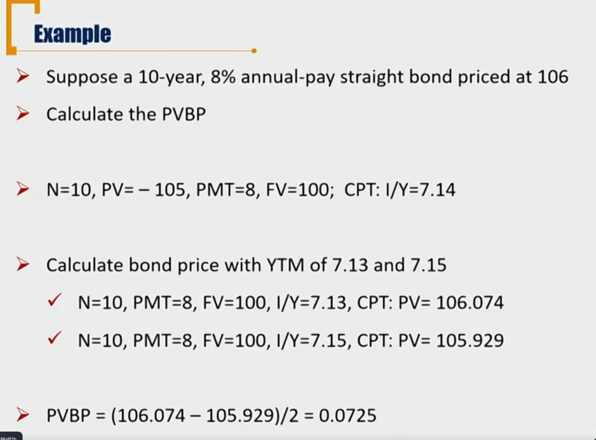

# R5 Dollar Duration 美元久期 \*\*

Calculate and interpret the money duration of a bond and price value of a basis point(PVBP)

#### Money Duration / Dollar Duration

- Money duration / dollar duration is a measure of the **price change in units of currency** given a change in its YTM. 数学定义式

$$
DollarDur = \frac{\Delta p}{\Delta r}
$$

- 注意分子和ModDur不一样。代表Yield-Price 曲线上的斜率。

##### Question:

- What is the difference / relationship between dollar duration and modified duration ? 
  - DD = D \* p
  - 这里是数学定义式，实际计算时，需要注意ModDur包括一个百分号。比如P = 100元，D = 5，则美元久期DD = 100 \* 0.05 = 5 
  -  所以这样写也是对的：$DD = D \times p \times 0.01$
- Whether is the price used here full pricer or flat price?
  - 用的是Full price

- What is the dollar duration of the bond portfolio?
  - method1:manage portfolio as a whole:
    - $DD_p = D_p \times P_{portfolio}$
  - method2: average
    - $DD_p = DD_1+DD_2+...+DD_n$
    - 注意和普通久期不一样，但是不用加权平均 
    - 证明：

$$
DD_p = D_p \times P_{portfolio} \\
=\sum_i(w_iD_i)\times P_{portfolio} \\
=\sum_i(w_iP_{portfolio})D_i=\sum_i P_iD_i=\sum_i DD_i
$$

- There is a bond portfolio and its duration and dollar duration is $D_1$, $DD_1$.  Now we adds another bond into them and form a new portfolio, and the new duration and dollar duration is D2, DD2.
  - What is the relationship between D1 and D2?
    - D1和D2的大小关系，取决于新加进去的bond的价值和久期大小。
  - What is the relationship between DD1 and DD2?
    - 因为不用加权平均，所以可以确定DD2更大。

#### Price Value of a Basis Point(PVBP)

- Price value of a basis point(PVBP, DV01) is the money change in full price of a bond when its YTM changes by **one basis point(0.01%)** 变动一个基点的时候，价格变动多少。

  1. PVBP = P \* D \* 0.01%

     - 定义式：P\*D是美元久期（包括了一个%的单位，意思是利率变动1%，价格变动多少）。
     - 转换成PVBP的时候，需要除以100. 

  2. **PVBP = (P\_ - P+) / 2**

     - 估计式，用直线估计曲线上的变动。一般通过这个式子求PVBP
     - P_ and P+ are the full prices calculated by decreasing and increasing the YTM by **one basis point**. 变动一个基点，计算价格的平均变动幅度。
     - 注意：这里的P\_和P+是变动一个基点的时候，计算出来的。这和ModDur的估计式不一样，ModDur计算时候，P\_和P+是根据自己选取的$\Delta yield$ 的价格变动。

     例题：重要

- 这里需要注意，这里的YTM变动一个基点都是针对年化收益率来说。
- 如果半年付息一次。那计算P_和P+的时候，需要在年化YTM变化一个基点，然后再除以2，然后再计算对应的P。