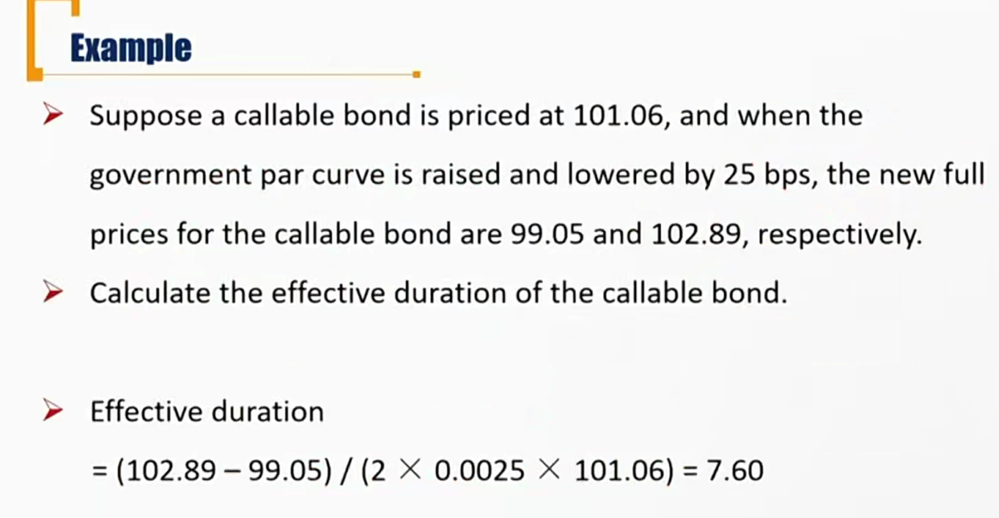
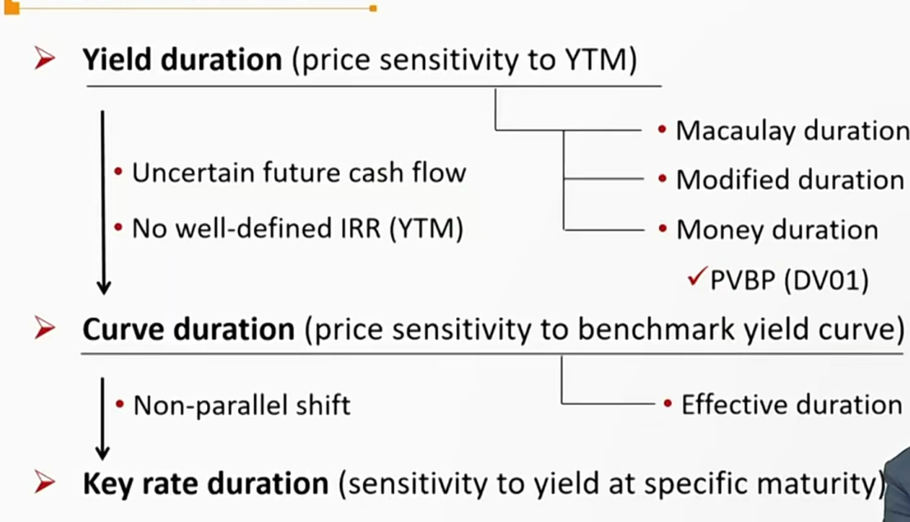
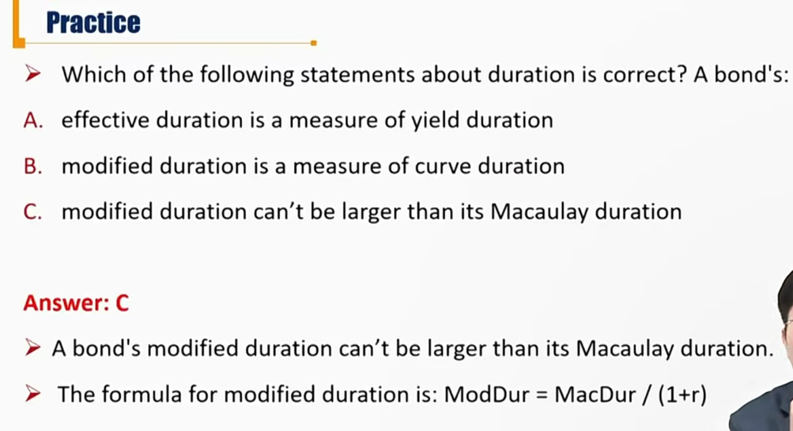

# R6 Effective Duration

#### Question

- For callable / putable bond, are Modified duration and Macaulay Duration still suitable?

  不适用。（convertible bond也一样）。期限不确定

#### Duration

- **Yield duration** 收益率久期: sensitivity of bond price to the bond's own **YTM**
  - 是一个期限-收益率点计算得来
  - Macaulay duration
  - Modified duration
    - Money duration, price value of a basis point(PVBP)
- **Curve duration**: sensitivity of bond price to a **benchmark yield curve**
  - 针对含权的债券，用利率曲线计算久期
  - In practice, the government par curve is often used
  - Effective duration is a curve duration statistic
  - 有效久期是收益曲线久期之一

#### Effective Duration

- Effective duration reflects the sensitivity of bond's price to a change in a **benchmark yield curve**

$$
EffDur = \frac{P_{-}-P_{+}}{2\Delta Curve\times P_0}
$$

- Measures interest rate risk in terms of **a parallel shift** in the benchmark yield curve($\Delta curve$)
  - 重要：衡量的是利率曲线的平行移动
  - 复习：平行移动出现过的知识点
    - MacDur上，reinvestment risk=market price risk，一个前提就是利率曲线只能小幅平行移动一次。
    - ModDur中对于portfolio的ModDur计算中，假定了利率曲线平行移动。
- Used for **bonds with embedded option** due to uncertain future cash flow and absence of well-defined IRR(YTM)
  - 针对含权债券都只能用有效久期
  - 另外，普通债券也能用有效久期

- 注意：分母下的$\Delta curve$是单向的变动幅度，和ModDur的计算一样。
- 当利率曲线平行变动1%的时候，价格变动7.6%

#### Key Rate Duration/Partial Duration

- Key rate duration is a measure of a bond's sensitivity to a change in the benchmark yield curve **at a specific maturity segment**
  - 在现实中，一般利率曲线移动都不是平行的。但是只要我们关注的部分是平行移动的即可。
  - Key Rate Duration就是只考虑一部分的曲线。
  - Useful to identify "**shaping risk**" for a bond
    - e.g. the yield curve becoming steeper or flatter
    - shaping risk：发生非平行移动的风险。
  - Useful to measure bond's sensitivity to **nonparallel shift** of the benchmark yield curve

#### Summary for Duration

#### Analytical Duration and Empirical Duration 考纲新加

- The approach taken before to estimate duration using **mathematical formulas** is often referred to as **analytical duration**.比如之前的计算的各种久期。
- **Empirical duration** uses **historical data** in statistical models that incorporate various factors affecting bond prices.依靠历史数据经验得到的久期。
- Analysts must consider the **correlation between benchmark yields and credit spreads** when deciding whether to use empirical or analytical duration estimates.
  - 如何选empirical 和 analytical duration，需要考虑bench mark和credit spread 的correlation. 
  - For a government bond with little or no credit risk, we would expect analytical and empirical duration to be similar because benchmark yield changes largely drive bond prices. 
    - 对于政府债券来说，没有credit spread, 数值上两者接近。
  - Interactions between benchmark yield changes and spreads would tend to offset each other, particularly during stressed market conditions, making empirical duration significantly **lower** than analytical duration.
    - 特别是经济恶化的时候，政府需要宽松货币政策，需要降低利率。所以benchmark 降低，另外信用环境恶化，credit spread升高。所以两者互相反向（offset）
    - 通常这种情况下，会导致empirical duration比analytical duration要低。

