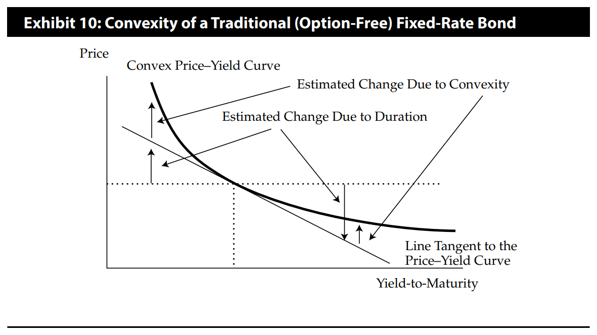
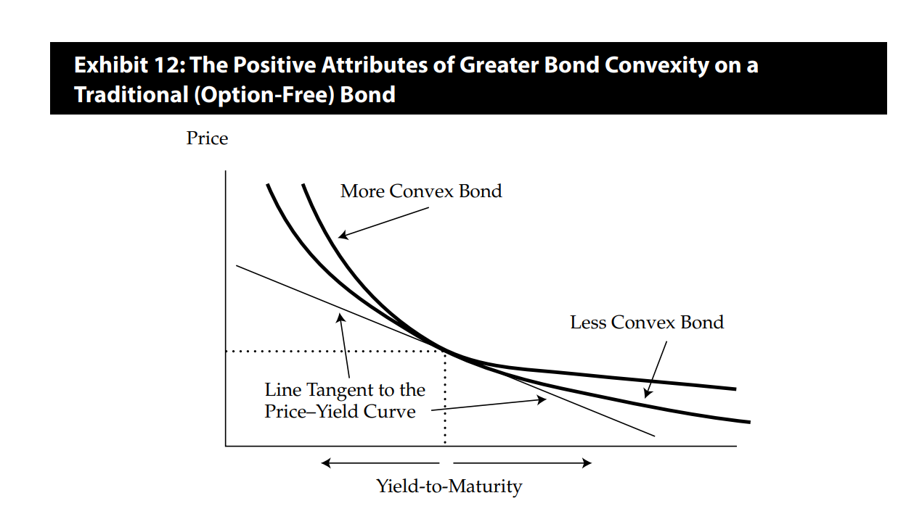
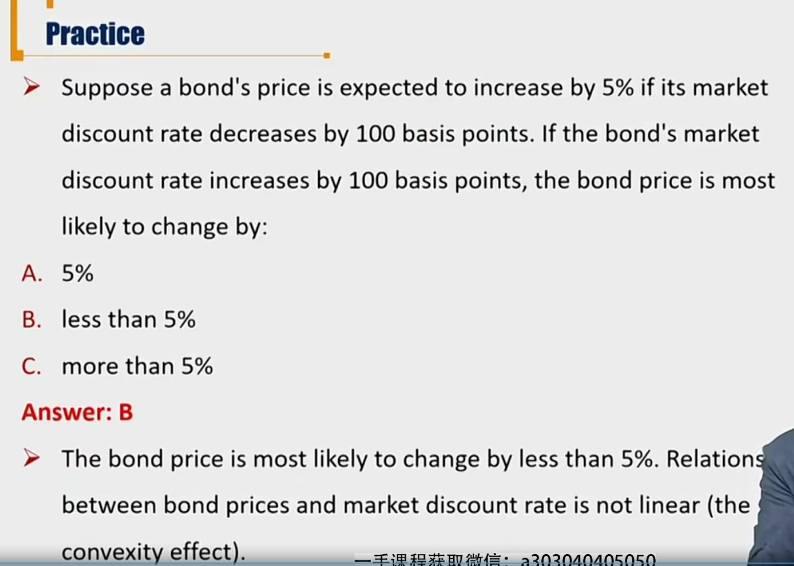
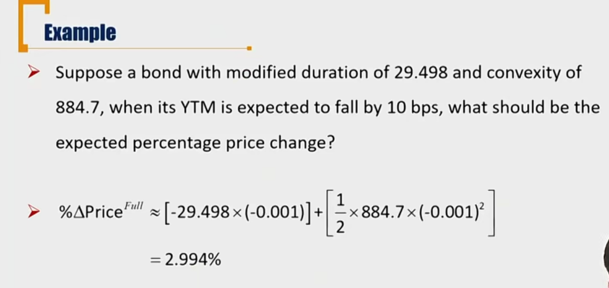
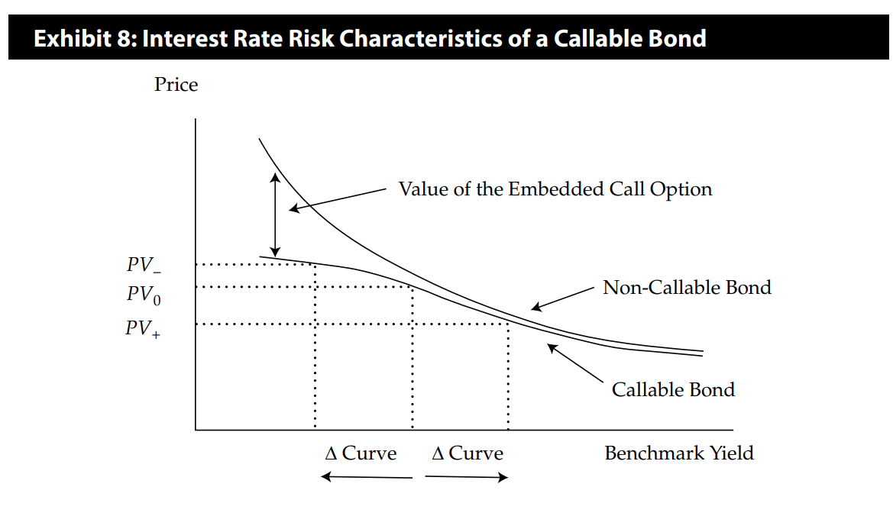
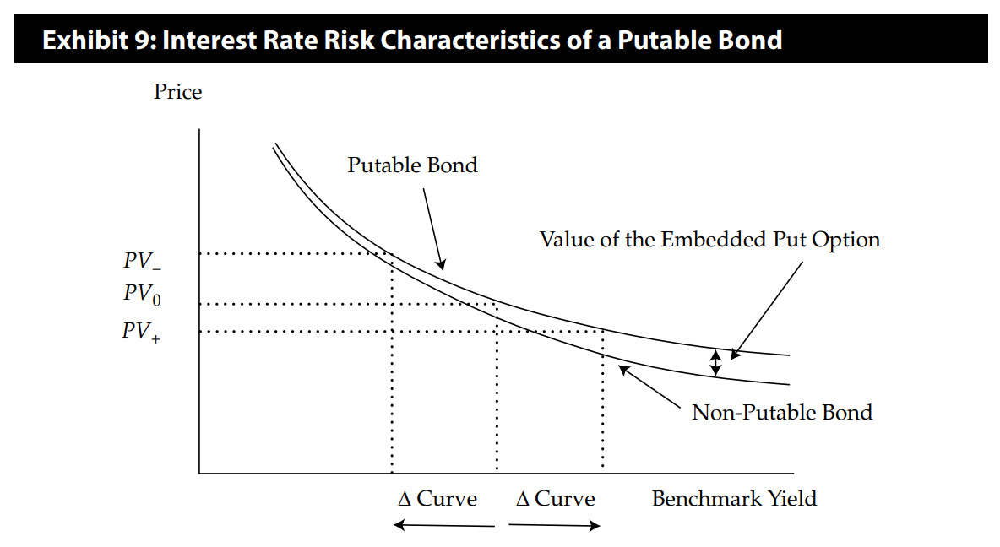
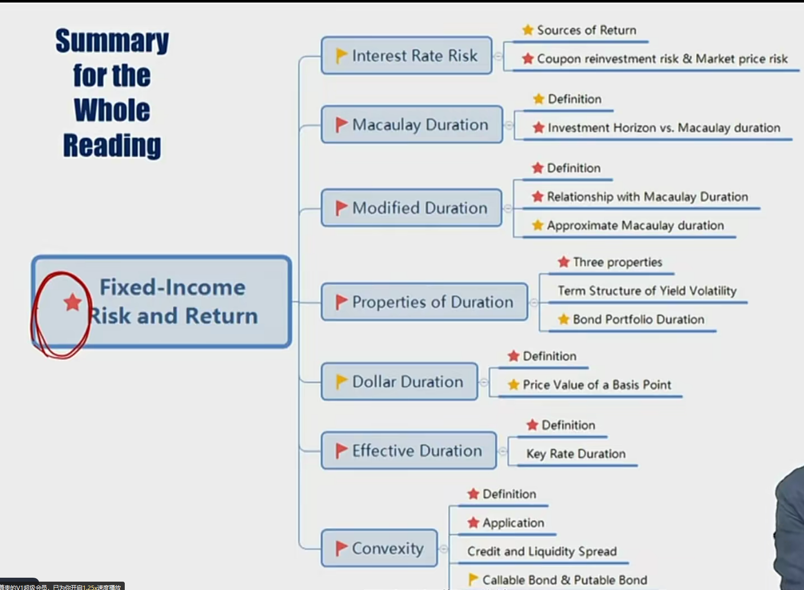

# R7 Convexity 凸度

- Calculate and interpret approximate convexity
- Explain how changes in credit spread and liquidity affect bond yield-to-maturity and price.

#### Definition and Application

对于凹凸性，这里是二阶导数大于零，叫做凸。

#### Convexity

- The more curved the price-yield curve, the **worse** the **only-duration-based estimate** of the price change. 债券价格-收益率曲线越凸，用久期估计的价格变动效果更差。

- 上面直线是用久期估计。利率下降还是下跌，都需要向上修正。（Estimate change）

- 根据曲线形态，显然凸度越大，对投资者越有利。（涨的多，跌的少）

- Benefits of greater convexity
  - The more convex bond **outperforms** the less convex bond in both bull(rising price) and bear(falling price) markets
    1. For the same decrease in YTM, the more convex bond **appreciates** **more** in price
    2. For the same increase in YTM, the more convex bond **depreciates less** in price
  - If the positive attribute is priced in, the more convex bond would have a higher price and a lower YTM. 如果把这个凸性考虑在定价中，越凸的债券通常越贵，YTM越低。

- convex时，利率变动幅度相同，利率下跌时，价格变动更大（上涨）
- concave时，利率变动幅度相同，利率上升时，价格变动更大（下跌）

#### Important Illustration 1

久期和凸度的计算方法比较：

| Duration                                                  | Convexity                                                    |
| --------------------------------------------------------- | ------------------------------------------------------------ |
| 1. "first-order" effect of the price-yield curve          | 1. "second-order" effect of the price-yield curve            |
| $(-)D=\frac{1}{P}\frac{dP}{dy}$                           | $C=\frac{1}{P}\frac{d^2P}{dy^2}$                             |
| 2. Approximate Duration                                   | 2. Approximate Convexity                                     |
| $ApproxModDur=\frac{P_{-}-P_{+}}{2\Delta Yield \times P}$ | $ApproxCon=\frac{P_{-}+P_{+}-2P_0}{(\Delta Yield)^2 \times P_0}$ |
| 3. Effective duration                                     | 3. Effective convexity                                       |
| $EffDur=\frac{P_{-}-P_{+}}{2\Delta Curve \times P}$       | $EffCon=\frac{P_{-}+P_{+}-2P_0}{P_0(\Delta Curve)^2}$        |

##### Mathematical Derivation

根据泰勒展开式，对$p(y)$，进行泰勒展开，p价格，y利率
$$
p(y)-p(y_0)\approx p'(y_0)(y-y_0)+\frac{1}{2}p''(y_0)(y-y0)^2\\
\Delta p=\frac{dp}{dy}\Delta y+\frac{1}{2}\frac{d^2p}{dy^2}(\Delta y)^2\\
$$
两边同时除以p，得到
$$
\frac{\Delta p}{p}=-D\Delta y+\frac{1}{2}C(\Delta y)^2
$$
上面这个式子，就是在久期对价格变动上，针对凸度的修正。后面加的项是一个正数，体现的是向上修正。

#### Important Illustration 2 重要，凸度的泰勒展开

- Duration provides **linear estimate** of the percentage price change for a bond given a change in its YTM

$$
\%\Delta Price \approx -ModDur \times \Delta Yield
$$

这里是在YTM变动很小的时候对价格变动的一个线性估计。实际上，对于一般存在凸度的债券，需要再添加一个修正。也就是上面的泰勒展开的二次项

- The estimate of percentage change in bond's full price can be improved by **adding convexity adjustment**
  - The convexity adjustment is **always positive** when convexity is positive.
  - 这里需要注意，第一项的正负号问题，必须为负号。（从利率和价格的反向变动关系理解）

$$
\%\Delta Price^{Full}\approx (-ModDur \times \Delta Yield) + \frac{1}{2}\times Convexity \times (\Delta Yield)^2)
$$

- 注意带入的10bps是数值0.001。算出来的也是数值0.0299，也就是2.99%

##### Question

- Whether the convexity adjustment gives us the exactly the true picture of the bond?

其实估计准不准确，就看泰勒展开后面的项是不是0.

- 从修正的公式来说，不管利率上涨下跌，向上修正的幅度都是一样。但实际上，这两个修正不是一样，所以从这个角度说，凸度的调整并没有完全准确调整。

##### Credit and Liquidity Spread

YTM = benchmark + spread，这里只考虑spread

- The YTM on a corporate bond is composed of a government benchmark yield and a spread over that benchmark
  - A change in the bond's YTM can originate in either component or a combination of the two
- Bond' spread has two major components
  - Premium for credit risk 信用风险补偿
  - Premium for lack of liquidity 流动性补偿
- The impact on a bond's value of a change in spread:

$$
\%\Delta Price_{Full} \approx (-ModDur \times \Delta Spread) + \frac{1}{2}\times Convexity \times (\Delta Spread)^2
$$

#### Important Illustration 3

- 复习Money Duration
  - MoneyDur = ModDur \* FullPrice
  - $\Delta P_{Full} = (-)MoneyDur \times \Delta Yield$

- Money convexity
  - 仿照money duration的逻辑
  - MoneyCon = Convexity \* FullPrice
  - 把上面的凸度泰勒估计式子两边乘以p即得到：
  - $\Delta P_{Full} = (-MoneyDur \times \Delta Yield) + \frac{1}{2}\times MoneyConvexity \times (\Delta Yield)^2$

- 对于投资组合的久期和凸度
  - $D_p = \sum_i w_iD_i$
  - $C_p = \sum_i w_iC_i$
    - 投资组合的凸度是各个债券的凸度的加权平均

#### Important Illustration 4

定性特征

- The factors that lead to **greater** <u>duration</u>
  - **Longer** time-to-maturity
  - **Lower** coupon rate
  - **Lower** yield-to-maturity
    - 这个从p-y曲线理解
- The factors that lead to **greater** <u>convexity</u> 和久期一样。
  - **Longer** time-to-maturity
  - **Lower** coupon rate
  - **Lower** yield-to-maturity
- For bonds **with same duration**, the one that has the **greater dispersion** of cash flows has the **greater** <u>convexity</u>.
  - **久期相同的情况下**，现金流越分散，凸度越大。
  - e.g. bullet bond凸度比较小

## Callable Bond & Putable Bond 的凸度问题

针对含权债券，适合用effective Duration(curve Duration)，并且含权债券的effective duration都比普通债券小。

#### Callable Bond

- Embedded call option leads to **lower effective duration**, especially **when interest rates are low**, due to shorter expected life.
  - due to shorter expected life：用这种表述，因为对于含权债券，yield duration并不适用，所以不能说MacDur更短。
  - 对于含call option的债券，考虑下面两个维度：
    - 债券的平均寿命：由于利率低时，会被issuer主动赎回，所以肯定平均寿命低于普通bond
      - 对于一般债券来说，平均寿命代表Macaulay Duration
    - 债券的斜率：从下面图可以知道，YTM低时，斜率变小，所以斜率肯定小于普通bond
      - 对于一般债券来说，斜率代表Dollar Duration，而且Dollar Duration的变动可以认为和ModDur相同
  - 从上面两个yield duration的维度来看，类比到curve duration，可以得到callable bond的effective duration一定比普通债券**小**，特别是利率低的时候。
- Callable bonds often have **negative convexity(concavity)**, especially **when interest rates are low**.
  - 三个维度理解这个图像：
    - V_callable = V_static - V_call_option. 对于YTM下降的时候，V_call_option上升
    - Callable 存在cap，就是call price
    - call option 的Effective Duration < 普通债券的effective Duration。这个有效久期的小于逻辑可以类比到yield Duration=>ModDur=>Money Duration=>曲线的斜率上。

#### Putable Bond

- Embedded put option leads to **lower** effective duration, especially **when interest rates are high**, due to shorter expected life.
  - 逻辑和callable bond 类似，通过expected life、斜率对比。
  - putable bond的有效久期比普通债券久期更低。
- Putable bonds often **have higher positive convexity**, especially **when interest rates are high**.
  - 同样时三个维度：
    - V_putable = V_static + V_option。利率上升时，V_option上升。
    - Putable 存在floor，floor price.
    - 凸度上，putable的规律，和callable逻辑类似。putable bond的Effective Duration比普通债券小。
  - callable凸度会发生改变，putable一直是convex.

