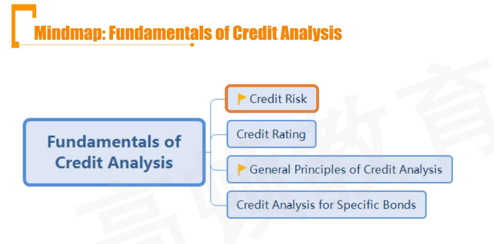
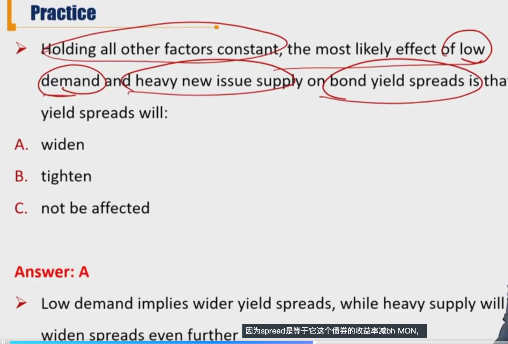

# R1 Credit Risk

信用风险不是考试重点

Describe credit risk and credit-related risks affecting corporate bonds

Describe seniority rankings and potential violation

#### Credit Risk

将来谁有可能遭受损失，谁就有信用风险。也就是说，“borrower/bondholder 有信用风险”。这种说法是才对的。

- Credit risk is the risk of loss resulting from the borrower(issuer of debt) failing to make **full** and **timely** payments of interest and/or principal.
  - 全额、按时、利息和本金
- 预期损失**Expected loss = Default probability \* Loss severity**
  - Default risk /default probability: the probability that a borrower default
  - Loss severity/loss given default: the portion of a bond's value(including unpaid interest) an investor loses
    - 已知违约的时候，损失多少。（考虑违约的时候处置抵押物等）
    - **Loss severity = 1 - Recovery Rate**

#### Credit Related Risk

信用风险还包括基差风险，信用评级恶化风险，流动性风险。流动性风险，比如市场价格发生暴跌，可能是市场意识到发债主体存在信用风险。

- **Spread risk** is the risk of yield premium to "default-risk-free" bonds, such as U.S. Treasury bonds. spread的变化反映的风险包括信用风险+流动性风险。
  - **Credit migration risk/downgrade risk**: bond issuer's creditworthiness deteriorates, or imgrates lower, causing the yield spreads wider and the price lower。信用恶化带来的风险。
  - **Market liquidity risk**: the price at which investors can actually transact buying or selling may differ from the price indicated in the market. 流动性风险。市场上的价格是流动性好的产品报出来，成交的时候和这个价格有偏差证明存在流动性风险。
- Relative to a comparable, default-free bond, yield spread is composed of the credit srpead and liquidity premium
  - **Yield spread = credit spread + liquidity preimum**

#### Yield Spread

- Factors that influence the level of yield spread
  - Credit cycle 信用周期
    - 信用扩张期，银行乐于贷款，利率下降
  - Broader economic conditions
    - 宏观经济环境
  - Financial market performance overall, including equities
  - Broker-dealers' willingness to provide sufficient capital for market making
  - General market supply and demand

- Lower quality issuers typically experience greater spread volatility
  - 信用差的发行人，spread波动率较大
- Return impact from spread changes is driven by two main factors
  - modified duration
  - magnitude of spread change
- For small spread change
  - $Return\ impact \approx - ModDur \times \Delta Spread$
- For larger spread change
  - $Return\ Impact \approx (-ModDur \times \Delta Spread) + \frac{1}{2}Convexity\Delta Spread ^2$

- 其实return impact就是$\Delta p/ p$

#### Seniority Ranking

- Seniority Ranking refers to the priority of payment, or priority of claims. 债券在破产清偿顺序上的排序。
  1. First Lien Loan
  2. Senior Secured debt
  3. Senior Unsecured debt
  4. Senior subordinated debt
  5. subordinated debt
  6. junior subordinated debt

- 但是实际清偿比例，会因为实务中的处理不一样。
- Priority of claims is not always absolute
- Potential violation of seniority ranking
  - All impaired claimants get to vote to confirm the plan of reorganization. 投票重组
  - There may be disputes in reorganization, and resolution of these disputes takes time and incurs expenses
  - To avoid the time, expense, and uncertainty over disputed issues, the claimants have a strong incentive to negotiate and compromise.

- **Pari Passu**
  - 这个概念意思是同一个层级的债券，清偿的时候按照出资比例相同对待（不考虑tenor等因素）
  - All creditors at the same level of the capital structure are treated as one class.
  - The provision is referred to as bonds ranking pari passu("on an euqal footing") in right of payment.