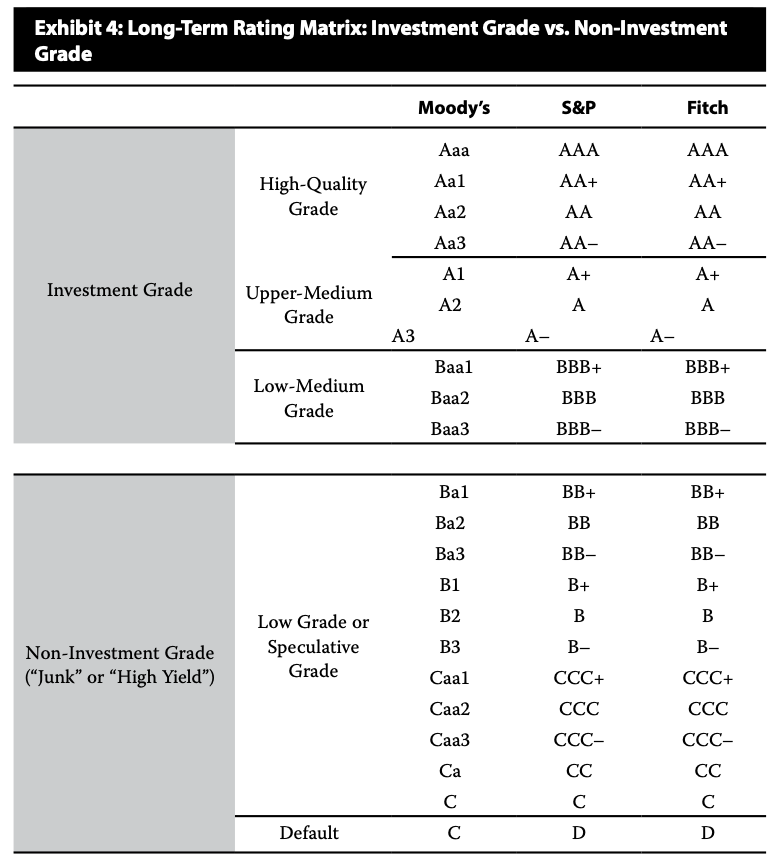

# R2 Credit Ranking

信用评级

#### Credit Rating

- There are three major credit rating agencies: Moody, S&P, and Fitch

- 在实务中，结合当前评级和评级展望分析债券。
- Rating agencies will typically privide both **issuer and issue ratings**, particularly as they relate to corporate debt. 发行人评级、债项评级。通常是公司债需要区分这两个评级。
  - **Issuer rating**: address an obligor's overall creditworthiness
  - **Issue rating**: specific financial obligations of an issuer and take into consideration such factors as ranking in the capital structure(e.g., secured or subordinated，是否抵押等)

#### Notching 评级微调

把发行人评级应用到排序中间的债项(一般是senior unsecured debt)，然后进行上下微调。

- Credit ratings on issues can be moved up or down form the issuer rating
  - Issuer credit rating usually applies to its **senior unsecured debt**
- Notching is less common for highly rated issuers than for lower-rated issuers
  - For lower-rated issuers, higher default risk leads to significant differences between recovery rates of debt with different seniority rankings, leading to more notching.
  - 低评级的发行人，notching必要性、notching幅度更大。

#### Credit Rating

- Risks in relying on agency ratings
  - Credit ratings can be very dynamic
  - Rating agencies are not infallible(绝对可靠的) 评级机构道德风险
  - Other types of so-called idiosyncratic（独特的） or event risk are difficult to capture in ratings. 难以包括特殊事件风险，比如董事长人格缺陷等。
  - Ratings tend to lag market pricing of credit
    - 评级滞后于现状

#### Cross fail provision 交叉违约条款

对其他债券违约了，视同对本债券违约。

- When a company defaults on one of its serveral outstanding bonds, provisions in bond indentures may trigger default on the remaining issues as well.