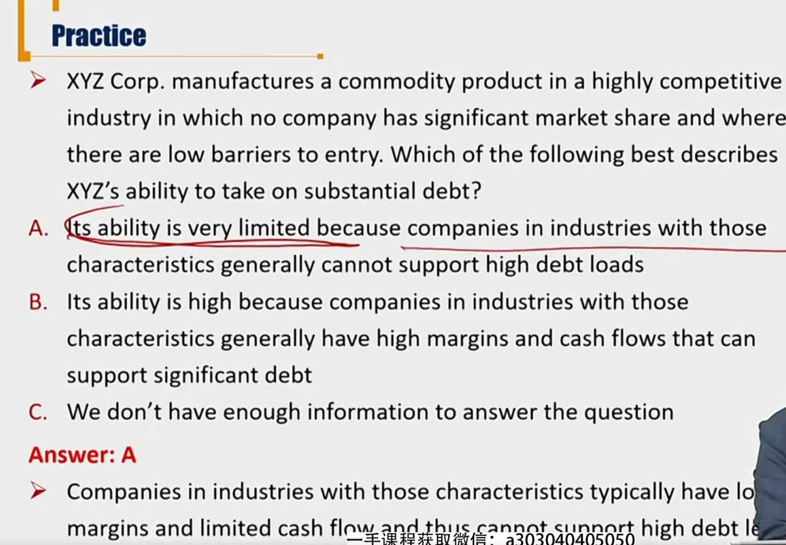

# R3 General Principles of Credit Analysis

Explain the 4 Cs of traditional credit analysis

#### Traditional Credit Analysis-4Cs analysis

如何评估信用风险

- **Capacity** 还款能力
  - Ability of the borrower to make its debt payments on time
- **Collateral** 抵押物
  - The quality and value of the assets supporting the issuer's indebtedness
- **Covenants** 条款条约
  - The terms and conditions of lending agreements that the issuer must comply with.
- **Character** 管理水平
  - The quality of management

##### Capacity analysis

- Industry structure, Porter's five forces model（复习）
- Industry fundamentals 行业基础面，朝阳行业，夕阳行业
- Company fundamentals 公司基本面
- Competitive position 核心竞争力
- Track record / Operating history 过去的经营历史
- Management's strategy and execution 管理战略
- Ratios and ratio analysis 财务报表比率
  - Profitability and cash flow(e.g. EBIT, EBITDA)
    - The higher the better
  - Leverage(e.g., debt/capital, debt/EBITDA)
    - The lower the better
  - Coverage(e.g., EBITDA/interest, EBIT/interest)
    - The higher, the better

#### Collateral analysis

- Only when the default probability rises to a sufficient level do analysts typically consider asset or collateral value.
  - 只有第一还款来源capacity不够，才考虑质押物。不要本末倒置。
  - collateral 要关注value和liquidity
- The key point is to assess the asset value relative to the issuer's level of debt(seniority ranking) 不同级别债券要求的抵押物不一样

- Other factors to be considered
  - Intangible assets 公司有没有无形资产
  - Amount of depreciation relative to capital expenditures
    - 注意抵押品的折旧金额。将折旧和资本支出进行比较，判断有没有更新设备PPE
  - Equity market capitalization
    - 股权质押。特点：市值波动性大，需要盯市。而且需要流动性。（股票停牌风险等）

#### Covenants analysis 条款契约

- Strong covenants protect bond investors, and weak covenants pose additional risks to bond investors
  - Affirmative covenants: obligated to do something
  - Negative covenants limited in doing something

#### Character analysis

- Assessment of the soundness of management's strategy
- Management's track record in executing past strategies, particularly if they led to bankruptcy or restructuring
- Use of aggressive accounting policies and/or tax strategies
- Any history of fraud or malfeasance: a major warning flag to credit analysts
- Previous poor treatment of bondholders.之前对债权人的逃债等。

