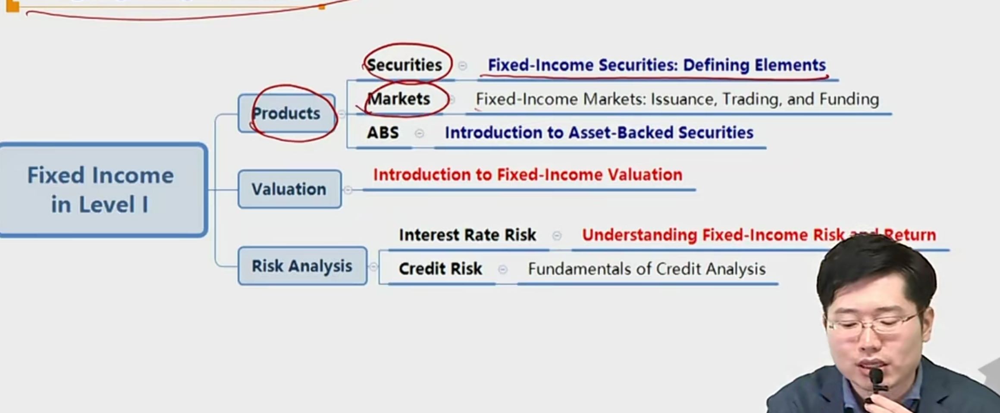

# R4 Credit Analysis for Specific Bonds

Explain special considerations when evaluating the credit of high yield, sovereign, and municipal debt issuers and issues.

#### High Yield Debt 垃圾债

- The higher risk of default means more attention must be paid to recovery analysis(or loss severity 关注抵押物), and is more in-depth with the following special considerations:
  - Greater focus on issuer liquidity and cash flow
  - Detailed financial projections 更详细的财务指标分析
  - Detailed understanding and analysis of the debt structure 债券结构，优先劣后
  - Understanding of an issuer's corporate structure
  - Covenants
  - Equity-like approach to high yield analysis
    - 因为高风险，所以高收益债券可以用权益工具去分析

#### Sovereign Debt 国债

- Two key issues for sovereign analysis are:
  - Government's **ability** to pay
  - Government's **willingness** to pay
- Credit of sovereign debt in its local currency is always at least as good that in foreign currency, due to the sovereign's ability to "print money" to repay debt within its own economy.
  - at least as good至少一样好
- Important considerations in sovereign credit analysis:
  - Political and economic profile
    - Institutional effectiveness（机构投资者比重） and political risk
    - Economic structure and growth prospects
  - Flexibility and performance profile政策灵活程度，政策表现
    - External liquidity and international investment position
    - Fiscal performance, flexibility, and debt burden
    - Monetary flexibility

#### Municipal Debt 市政债券 地方政府债券 \*

- Usually can be classified as general obligation(GO) bonds and revenue bonds
  - **GO bonds**: unsecured bonds issued with the full-faith and credit of the issuing government, and supported by the taxing authority of the issuer
    - Credit analysis of GO bonds has some similarities to sovereign debt analysis, but have no ability to use monetary policy
  - **Revenue bonds**: issued for specific project financing(e.g. toll roads, bridges, airports)
    - Higher risk than GO bonds because they are dependent on a single source of revenue. Revenue bond收入来源唯一，不能用税收。
    - 风险比go bonds 更高

- Credit analysis of revenue bonds is a combination of project analysis and financial analysis around the project
  - Project analysis: need, economic base, projected utilization
  - Financial analysis: similar to corporate bond analysis
    - **Debt service coverage ratio(DSCR)**: a key credit metric, the higher the DSCR, the stronger the creditworthiness.
      - 分子是能还款的金额，分母为所要还款的金额。越高越好。

