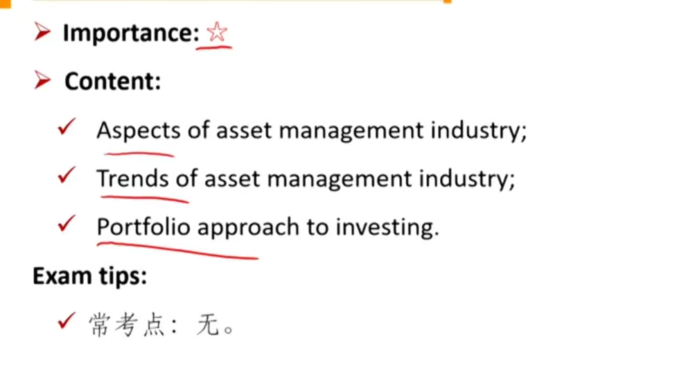
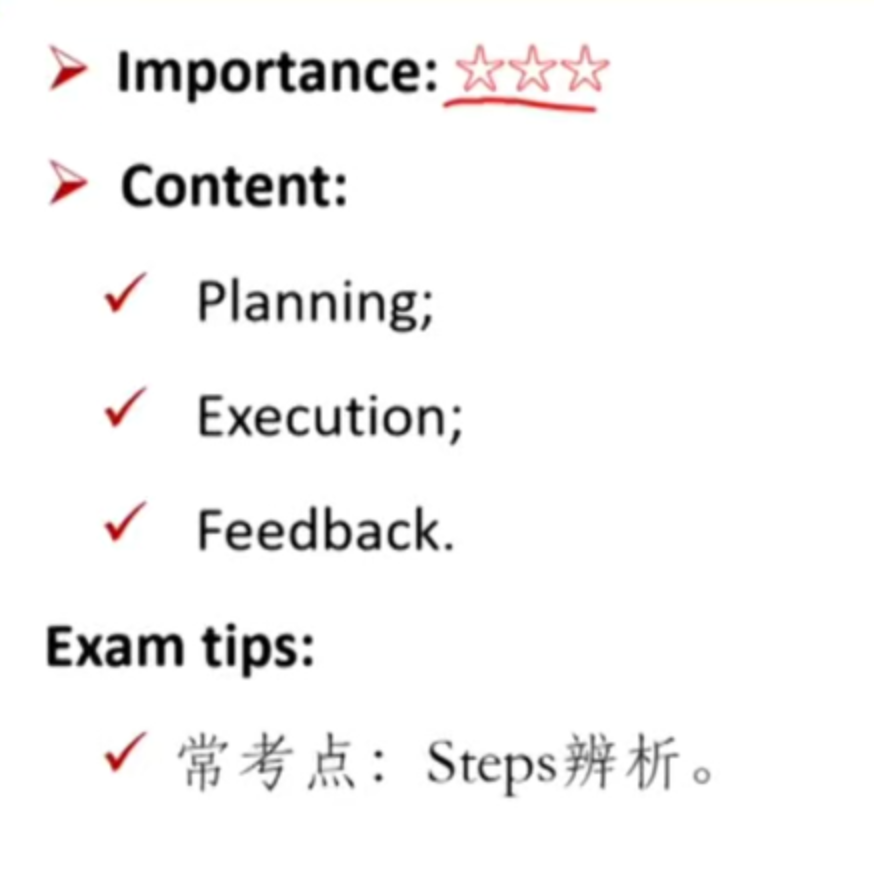
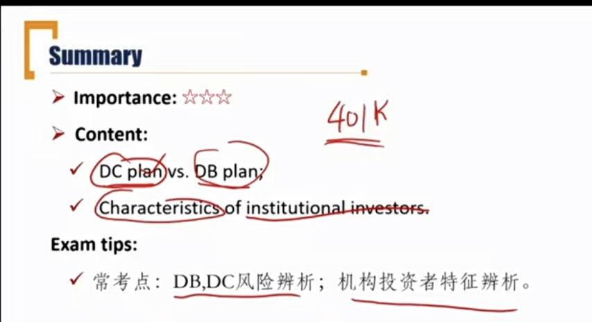
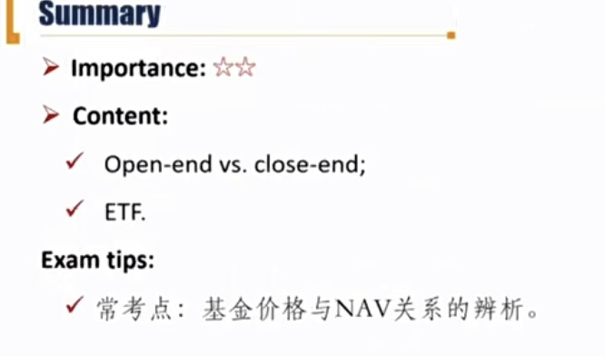

# M1 Overview

## Asset Managment Industry and Portfolio Approach

Describe aspects of the asset management industry

describe the portfolio approach to invest

#### Asset Management Industry

##### Aspects of asset managment industry

- Buy-side vs. Sell-side firm
  - An asset manager is commonly referred to as a buy-side firm, while a sell-side firm is a broker/dealer.
- Active vs. Passive management
  - The volume of active management considerably exceeded passive management.
  - 80%主动，20%被动
- Traditional vs. Alternative asset managers
- Privately owned vs. Publicly traded asset managers.
  - Majority of asset management firms are privately owned.

##### Trends of asset management industry

- Growth of passive investing
  - Concentrated in equity strategies, e.g. ETF investing
- Big Data in investment process
  - Advanced statistical and machine-learning techniques.
  - New sources of data. e.g. social media data.
- Robo-advisers in wealth management industry 智能投顾
  - Lower fees
  - Growing demand from "mass affluent" and younger 市场下沉，需求增加
  - New entrants. e.g. insurance company, technology firms.

#### Portfolio Approach

##### Portfolio approach to investing 站在组合的角度进行投资

- Evaluating individual securities in relation to their contribution to the risk and return of the whole portfolio.
  - Portfolio **diversification** helps investors avoid disastrous investment outcomes
  - Portfolio diversification also generally offer equivalent expected returns with lower overall volatility of returns, which means the risk is reduced. 分散化可以**降低波动性**，而且**不降低回报**。

## Portfolio Management Process

Describe the steps in the protfolio management process

#### Sptes in portfolio management process

- **Planning**
  - Understanding the clients' objectives and constraints 了解客户的目标和约束
  - Developing the investment policy statement(**IPS**) 重要，投资都按照IPS开展
    - The benchmark should be specified in IPS for evaluation
    - IPS should be reviewed and updated regularly.

- **Execution**

  - Asset allocation各类资产权重
  - Security analysis
  - Portfolio construction and trade exectutions

- **Feedback**

  - Portfolio monitoring and rebalancing
    - 比如股价大涨，导致allocation变化，所以需要rebalancing

  - Performance evaluation and reporting

## Types of Investors

Describe types of investors and distinctive characteristics and needs of each

Describe defined contribution and defined benefits pension plans

#### Types of investors

- **Individual investors**
  - Individuals
  - Defined contribution(DC) pension plan
- **Institutional investors**
  - Defined benefit(DB) pension plan
  - Endowments and foundations
  - Banks
  - Insurance companies
  - Sovereign wealth funds
    - 主权财富基金，贸易顺差产生的贸易盈余等。挪威主权财富基金（最大），CIC，华安公司等。

#### Individual Investors

##### Defined contribution pension plan DC plan

- Individuals makes specified contributions to pension plan
- The benefits are not guaranteed, and individuals accept the investment risk and rewards.
- 个人做投资决策，风险和收益个人承担。

#### Institutional Investors

##### Defined benefit pension plan (DB Plan)

- Employers obligate to pay specified amount to their employees after their retirements
- The benefits are defined, and employers accept the investment risk. 
  - 雇主承担风险。benefits由员工的工资、工龄等决定。
  - 大趋势是DB Plan越来越少

- **Characteristics and needs**:
  - **Investment time horizon:** typically long
  - Income needs: varies by employees' age
    - 满足退休员工的可预期的cash需求
  - **Liquidity needs**: typically low
    - 满足不可预期的cash 需求（资产快速足额地变现）
  - **Risk tolerance**: typically high
    - 和liquidity needs相反。因为liquidity需求小，不着急变现，所以更加能承受短期内的价值下跌。
    - 注意，养老金的风险承受能力较**高**

##### Endowments & Foundations 慈善基金（属于非盈利机构）

- To maintain the real(inflation-adjusted) capital value of the fund while generating income to fund the objectives of the institution.
  - 要保证满足慈善支出，并且追赶通胀。
  - 哈佛大学endowment等
  - 福特foundation等
- **Characteristic and needs:**
  - **Investment time horizon**:long (typically perpetual)
  - Income needs: to meet spending commitments
    - 一般会有spending rule，不能花钱波动太大。
  - **Liquidity needs**: low
  - **Risk tolerance**: high

##### Banks

- Accept deposits and extend loans, and earn a return on its reserves that exceeds the rate of interest it pays on its deposits.
- **Characteristics and needs:**
  - **Investment time horizon**: short
  - Income need: to pay interest on deposits
  - **Liquidity needs**: high
    - 储户提款不可预期
  - **Risk tolerance**: low

##### Insurance companies保险公司

- Investing the premiums in a manner to pay the claims
  - 用收到的保费进行投资
- **Characteristics and needs**:
  - **Investment time horizon**: 
    - long for life insurance companies; 寿险的投资期限比较长
    - short for property & Casualty(P&C) insurance companies 财产险的投资期限比较短
  - Income needs: typically low
  - **Liquidity needs**: high
    - 赔付不可预见，一旦发生赔付，资产需要需要马上变现
  - **Risk tolerance**: low

##### Summary of characteristics and needs \*\*\*

|                        | Time Horizon                 | Liquidity | Risk tolerance |
| ---------------------- | ---------------------------- | --------- | -------------- |
| DB Plan                | Long                         | Low       | High           |
| Endowment & Foundation | Long                         | Low       | High           |
| Banks                  | Short                        | High      | Low            |
| Insurance Company      | Long for life; Short for P&C | High      | Low            |

Problem:

下面哪一种类型公司不满足投资期限长，流动性低，风险承受能力高？B

A. Endowment

B. Life insurance

C. DB Plan

### Pool Investment

**Describe** mutual funds and **compare** them with other pooled investment products

#### Pool Investment

- **Mutual funds**
  - Open-end funds
  - Closed-end funds
- **Exchanged traded funds(ETF)**
- Separately managed accounts(SMA)
  - 专门请一个基金经理管理，单独管理。可以认为是直接持有基金所投资的股票
  - 基金信息对投资者更加透明
  - 根据投资者定制化
  - 需要较高资金量，门槛高
  - **无限责任**，比如杠杆交易造成亏损需要投资者偿还
- Hedged funds
  - 追求绝对收益
  - 通常使用较高杠杆
- Buyout funds 收购基金
  - 属于PE（Private Equity）
  - LBO（复习：另类投资中的leverage buyout）
- Venture capital funds
  - 属于PE（Private Equity）

##### Mutual Fund: Open-end Mutual fund

- Investors can buy and redeem the mutual fund shares at **net asset value(NAV)** 净值
  - Number of shares issued would increase as new investments are made, or decrease when withdrawn occur. 申购赎回不会影响原有per share NAV
  - Not fully invested as some cash kept for redemption
    - 需要留有部分现金应对赎回
  - Fee charged: management fees, upfront fees（前端费用，申购费）, redemption fees.

##### Mutual Fund: Closed-end mutual fund

- No new investments are accepted
  - Number of shares issued does not change
  - Investors can only liquidate the shares by selling them to other investors.
    - 在二级市场卖出
  - Traded at a **premium or discount to net asset value. **\*\*\*
    - 受到供给关系影响，可能溢价或者折价。
  - Could be fully invested.
    - 不用留有现金应对赎回。
  - Fee charged: management fees, upfront fees.

##### Classification of mutual funds

- By fees
  - No-load funds 申购赎回时不收费的基金
  - load funds 申购赎回时收费的基金
- By asset types
  - Money market funds
  - Bond funds
  - Stock funds
  - Hybrid/balanced funds

##### Exchanged-Traded Fund(ETF) \*\*

一级市场中：用股票（in kind实物）换份额，一级市场参与者都是大型机构（AP授权参与者）

二级市场中：机构拆分ETF份额，转卖给个人投资者。

- Traded like closed-end fund
- Price **tracking** net asset value
  - tracking意思是，在套利空间小于交易成本的范围内波动。
  - 复习：closed-end mutual fund也会偏离NAV，但是open-end 不会偏离
- Transaction costs are **lower** compared to mutual funds
- Dividends are paid out to shareholders
  - 传统mutual fund一般用来再投资
- Minimum required investment is smaller than that of index funds
- Tax advantages over index funds
  - 普通的基金赎回时会发生现金流。一个投资者赎回，基金经理需要卖股票，产生资本利得（capital gain）需要交税。这里交的税是基金去交，所以所有投资者收到影响。
  - 但是ETF是实物赎回，赎回时不会发生现金流，赎回的是现货。所以不涉及到税。
  - 也就是ETF不会有capital gain distribution.

