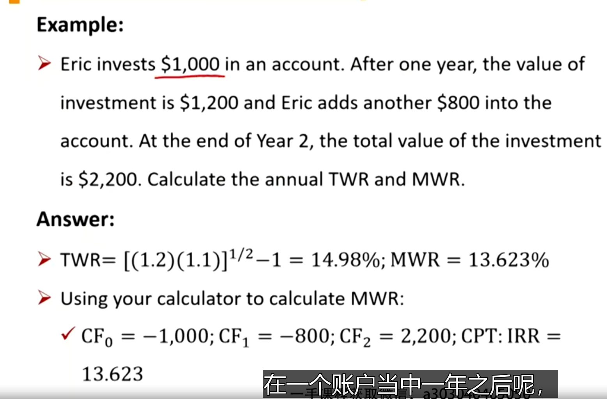
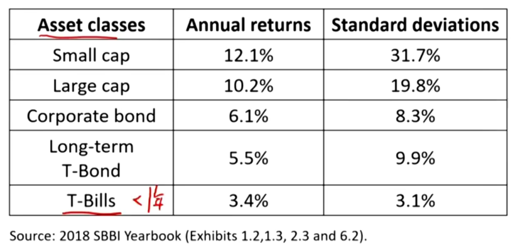
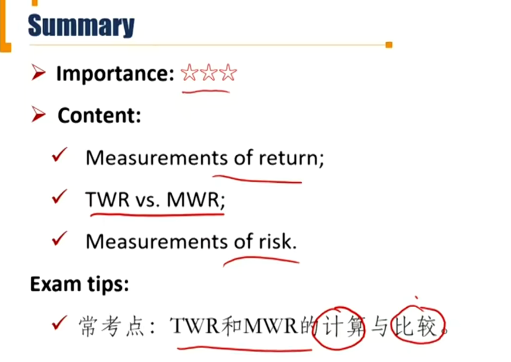

# R1 Measurement of Return and Risk

Calculated and interpret major return measures and describe their appropriate uses

Compare the money weighted and time-weighted rates of return and evaluate the performance of protfolios based on these measures

Calculate and interpret the mean, variance, and covariance (or correlation) of asset returns based on historical data.

#### Measurement of return

- **Gross return**: return before deducting management and administrative fees
- **Net return**: return after deducting management and administrative fees
- **After-tax return**: return after deducting tax liability 
- **Real return**: return after adjusting for inflation
- **Leveraged return**: return on investor's own money

- **Holding period return** 持有期收益率

  - Return earned from holding an asset for a single specified period of time

    - $R = (P_T+D_T)/P_0-1$

    - $P_T$期末资产价格，$P_0$期初资产价格，$D_T$是期末发生的income，比如dividend
    - 这里的持有期收益率不用年化！!!!
    - 对于大额追加投资，需要当成不同的持有期对待。（period）

- **Average Return(Arithmetic return)**
  - It is used to estimate the expected return of next **single period**
    - $R = \sum_{i=1}^n{R_i}/n$

- **Time-weighted return(TWR)**

  - The compound return that \$1 initially invested in the portfolio over a stated measurement period.
  - Used to calculated the compounding growth rate
    - $TWR=[\prod_{i=1}^{n}(1+HPR_i)]^{1/N}-1$

  - 注意，字母n表示投资期数，字母N表示年.比如0-0.5年，0.5~1.25年，1.25~1.5年，一共三期投资，所以TWR就是cbrt((1+HPR1)(1+HPR2)(1+HPR3))-1
  - 可以反映所有投资期间的收益率，但是没有考虑每一期的投资的金额。

- **Money-weighted return(MWR)**
  - MWR accounts for the timing and amount of all cash flows into and out of the portfolio
  - Similar to calculation of IRR
    - $\sum_{i=0}^{N}{CF_i/(1+MWR)^i}=0$
  - 和IRR的计算一样

#### TWR vs. MWR \*\*\*重要

- **Time weighted return**

  - Not affected by cash withdrawals or additions

- **Money weighted return**

  - Affected by cash withdrawals or additions

  - Assign more weights to the return of larger cash flows
  - If more funds to invest at an **unfavorable** time, MWR will tend to be **depressed**; if more funds to invest at a **favorable** time, MWR will tend to be **elevated**.
    - 牛市加投/熊市赎回，MWR>TWR
    - 牛市赎回/熊市加投，MWR<TWR.
      - 也就是说，做了正确的决定的时候，MWR就会高。比如08年股灾前卖掉了股票。
    - 在衡量基金经理的业务水平的时候，需要分情况讨论。比如，一个基金经理在熊市前赎回了股票，导致MWR>TWR。那么：
      - 如果是mutual fund，基金对持仓结构有一定要求，不能主动去减少股票持仓，那么大概率赎回的动作是因为投资者大量赎回而导致的，所以MWR不能准确评价基金经理的主观决策
      - 如果是private fund，基金经理属于主动赎回，此时用WMR评价是合理的。

#### TWR vs. MWR 

- **Time weighted return**
  - Periods can be any length between significant cash flows
- **Money weighted return**
  - Periods must be equal length:  use shortest period with no significant cash flows。用最小的period切分。

#### Measurement of risk

- Population variance & Standard deviation

$$
\sigma^2=\frac{\sum_{i=1}^{N}(X_i-\mu)^2}{N}\\
\sigma=\sqrt\frac{\sum_{i=1}^{N}(X_i-\mu)^2}{N}
$$

- Sample variance & standard deviation

$$
s^2=\frac{\sum_{i=1}^{N}(X_i-\bar X)^2}{N-1} \\
s=\sqrt\frac{\sum_{i=1}^{N}(X_i-\bar X)^2}{N-1}
$$

#### Return and risk of major aset classes

- There is a positive relationship between expected return and risk.
  - mean和deviation的相关系数>0

