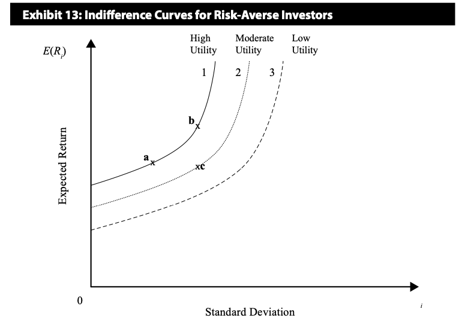
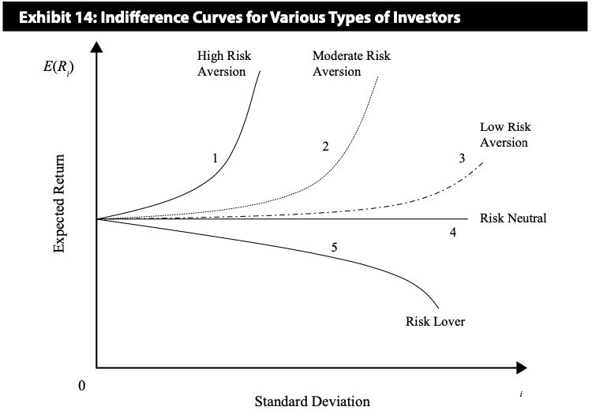
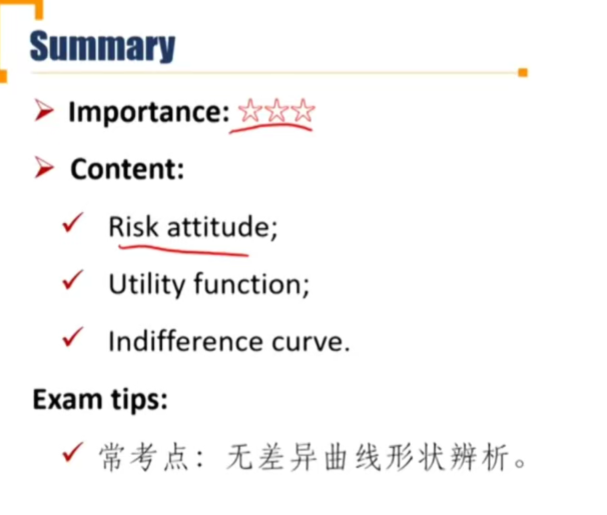

# R2 Utility Theory

**Explain** risk aversion and its implications for portfolio selection.

#### Risk aversion

- **Risk averse** 风险厌恶
  - Investors prefer less risk given certain expected return, and prefer higher expected return given certain risk.
- **Risk neutral** 风险中性
  - Investors are indifferent with the risk given certain expected return.
- **Risk seeking** 风险偏好
  - Investors prefer higher risk given certain expected return.

#### Utility Function 效用

- A measure of relative satisfaction that an investor drives from different investment portfolios. 收益减去风险，表示投资者获得的satisfaction

$$
U=E(R)-\frac{1}{2}A\sigma^2
$$

- A = a measure of risk aversion
  - A > 0, when investor is risk-averse
  - A = 0, when investor is risk-neutral
  - A < 0, when investor is risk-seeking.

- Utility theory helps us quantify the rankings of the investment choices using risk and return.

#### Indifference curve 无差异曲线

- Plots the combinations of risk-return pairs that an investor would accept to **maintain a given level of utility**.
- Defined by trade-off between expected return and risk.
- 往上倾斜，开口向上的抛物线

- **For risk-averse investors:** (大部分投资者都是风险厌恶)
  - The curves slope upwardly and getting steeper.
    - slope upwardly由风险厌恶导致：风险越高，收益越高。
    - getting steeper由收益边际效用递减导致，风险越高，每增加一单位风险，要求的回报要更高。
  - Higher utility corresponding to a more left or upward indifference curve. 越靠左的indifference curve效用utility越高，资产组合越优秀。（E(R)=U+1/2Asigma^2）

- The more risk-averse the investor, the steeper the curve
  - Risk lover和赌徒类似
  - 风险越厌恶，曲线越陡峭

