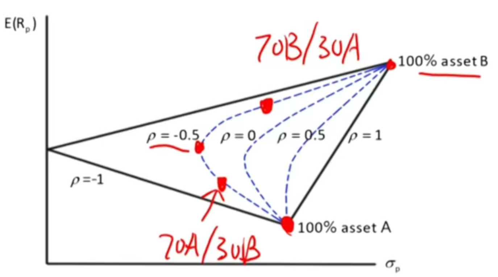
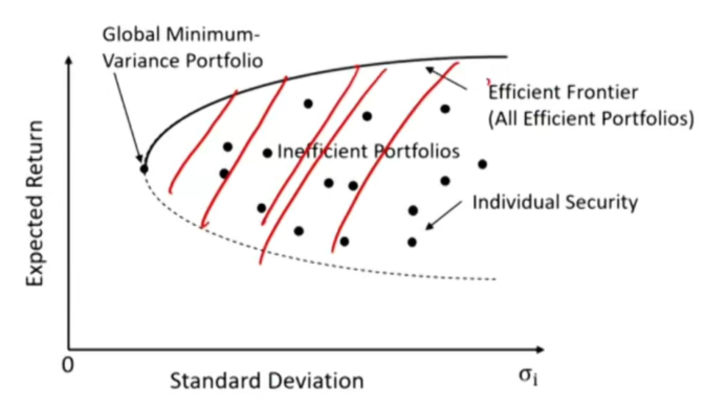
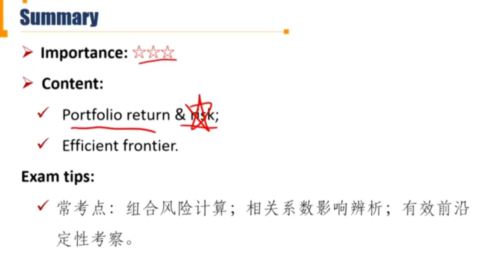

# R3 Efficient Frontier

**Calculate** and **interpret** portfolio standard deviation \*\*\*

**Describe** the effect on a portfolio's risk of investing in assets that are less than perfectly correlated.

**Describe** and **interpret** the minimum-variance and efficient frontiers of risky assets and the global minimum-variance portfolio.

#### Return of portfolio with two risky assets

- Return of portfolio can be measured as the weighted mean of returns of assets in the portfolio.

$$
R_p=w_1R_1+(1-w_1)R_2
$$

这里的$w_1$可以是负数，代表做空。

#### Risk of portfolio with two risky assets \*\*\*

$$
\sigma_p=\sqrt{w_1^2\sigma_1^2+w_2^2\sigma_2^2+2w_1w_2cov(R_1, R_2)}\\
\sigma_p=\sqrt{w_1^2\sigma_1^2+w_2^2\sigma_2^2+2w_1w_2\rho_{1,2}\sigma_1\sigma_2}\\
$$

- $w_1$一般按照market value计算权重。这个公式要注意协方差和相关系数的区别。

- 证明过程：

$$
\sigma_p^2=E[(R_p-\overline R_p)^2]=E[(\sum_i w_iR_i- \overline {\sum_{i}{w_iR_i}})^2]=E[(\sum_i(w_iR_i-\overline {w_iR_i}))^2]
$$

上面公式中，令$D_i=w_iR_i-\overline{w_iR_i}$
$$
\sigma_p^2=E[(\sum_i D_i)^2]=E[\sum_i D_i^2+2\sum_{i\ne j}D_iD_j]
$$
 我们有
$$
E[D_i^2]=w_i^2E[(R_i-\overline{R_i})^2]=w_i^2\sigma_i^2\\
E[D_iD_j]=w_iw_jE[(R_i-\overline{R_i})(R_j-\overline{R_j})]=w_iw_jcov(R_i,R_j)=w_iw_j\rho_{i,j}\sigma_i\sigma_j
$$
所以，得到下面公式
$$
\sigma_p^2=\sum_iw_i^2\sigma_i^2+2\sum_{i\ne j}w_iw_j\rho_{i,j}\sigma_i\sigma_j
$$
这个公式可以推出超过两个资产的portfolio的风险，比如500个asset，每个权重相等，每个方差都是0.1，**协方差**都是0.05。那么对于这个资产的方差就是$500\times (1/500)^2\times 0.1+2\times 249500\times 0.05\times(1/500)^2$

- **可见，影响portfolio的风险的重要因素往往不是每个资产本身的方差，而是资产之间的协方差。**

- **Covariance for population**

$$
cov(x,y)=\frac{\sum_{i}{(X_i-\mu _X)(Y_i-\mu_Y)}}{N}
$$

- **Covariance for sample**

$$
cov(x,y)=\frac{\sum_{i}{(X_i-\overline X)(Y_i-\overline Y)}}{N-1}
$$

- 由于协方差把样本的波动性也考虑进去，为了消除样本本身的波动性，只考虑两个变量的相关性，引入了correlation coefficient
- **Correlation for population** \*\*\* 大于-1小于1

$$
\rho_{x,y}=\frac{cov(x,y)}{\sigma_x\sigma_y}
$$

- **Correlation for sample**

$$
\rho_{x,y}=\frac{cov(x,y)}{s_xs_y}
$$

#### 相关系数如何影响组合风险

- If $\rho = 1$(perfectly correlated)

$$
\sigma_p=\sqrt {w_1^2\sigma_1^2+w_2^2\sigma_2^2+2w_1w_2\sigma_1\sigma_2}=w_1\sigma_1+w_2\sigma_2
$$

此时投资组合风险就等于资产风险加权平均。

- If $\rho < 1$(less perfectly correlated)

$$
\sigma_p=\sqrt {w_1^2\sigma_1^2+w_2^2\sigma_2^2+2w_1w_2\rho_{1,2}\sigma_1\sigma_2}<w_1\sigma_1+w_2\sigma_2
$$

- The portfolio risk of investing in assets that are less perfectly correlated is lower than the one with assets that are perfectly correlated. 可见，如果资产收益不变，相关系数变小的情况下，分散化投资（diversification）可以降低风险，但是不减少portfolio的收益。

- Portfolio risk decreases as the correlation coefficient between assets within the portfolio decreases

- 相关系数变小，风险变小

#### Efficient frontier of risky assets \*\*\*

- All attainable portfolios with risky assets. 每个资产代表一个点，连点成面，就是portfolio的可行集。

- **Minimum-variance frontier of risky assets**: the investment portfolios of risky assets that provide **minimum variance(the lowest risk)** given a certain level of return. 相同风险下，只会选择风险最小的，也就是上图中公最左边的线。
  - **Global minimum-variance portfolio**: the investment portfolio that has the lowest variance on minimum-variance frontier of risky assets.

- **Efficient frontier of risky assets** 有效前沿: the portfolios that not only provide the **lowest risk** given a certain level of return, but also offer the **highest return** given certain level of risk.
  - The investment portfolios on minimum-variance frontier that are above the global minimum-variance portfolio.
  - Portfolios above efficient frontier is not achievable, and portfolios below efficient frontier is un-efficient.
  - Also called Markowitz efficient frontier

