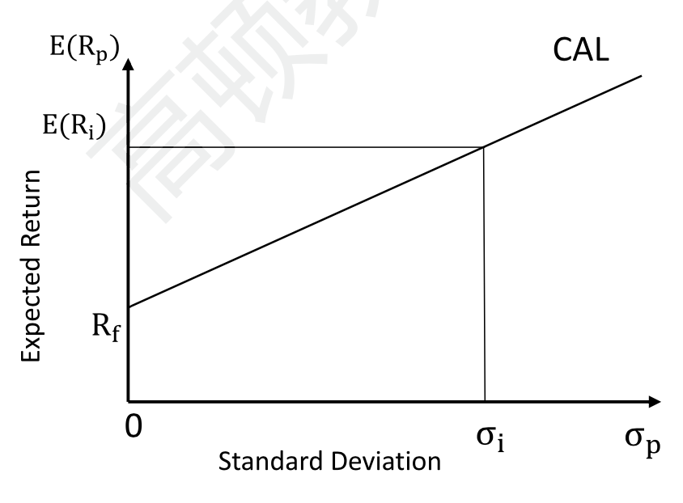
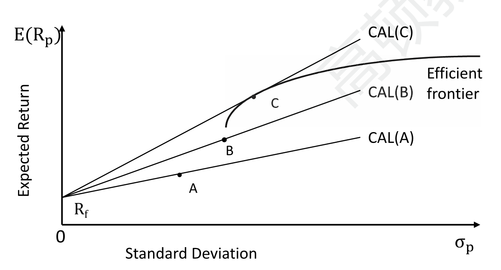
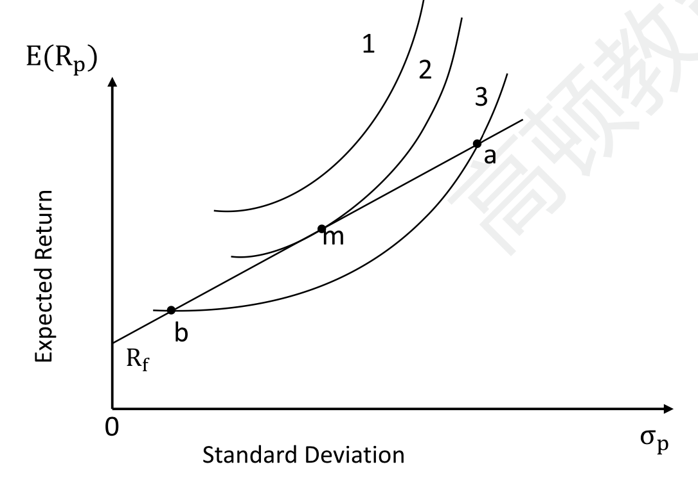
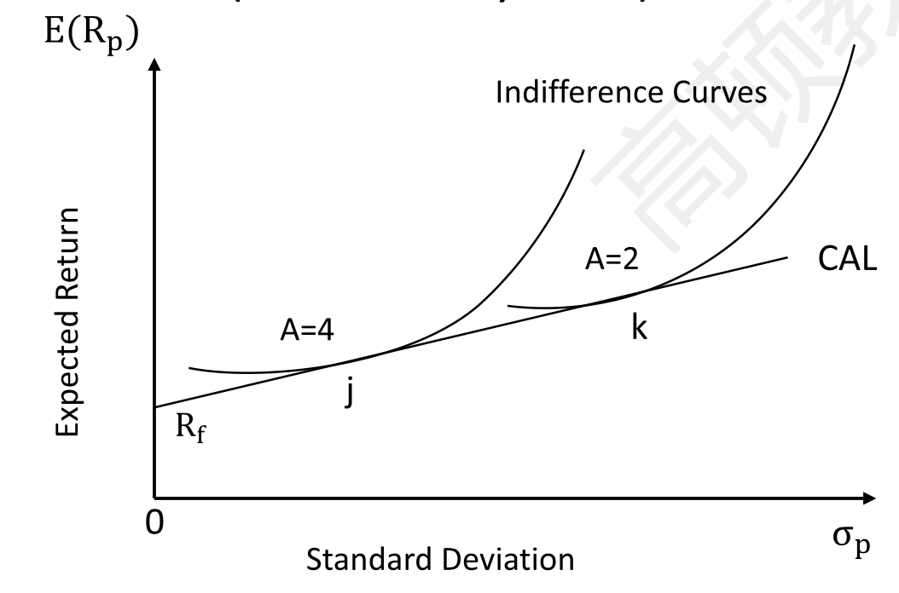
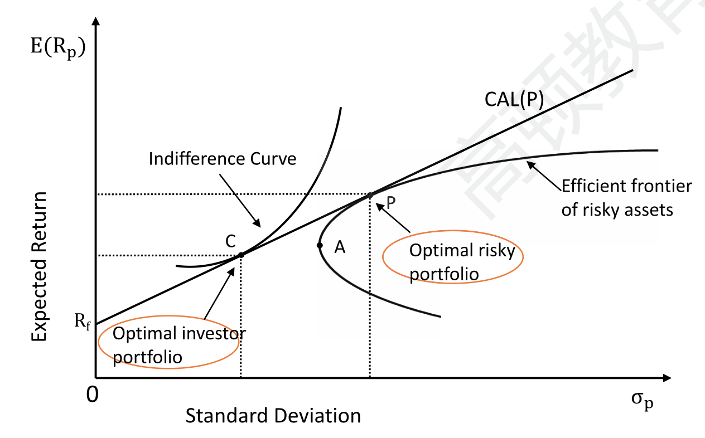
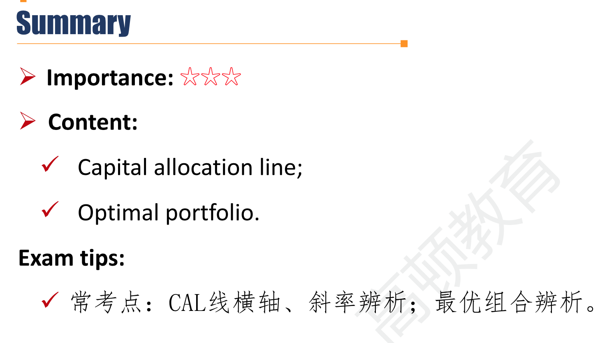

# R4 Optimal Portfolio Selection \*\*\* 

**Describe** the implications of combining a risk-free asset with a portfolio of risky assets

- 在efficient frontier上进一步考虑无风险资产

**Explain** the capital allocation line (CAL)

**Explain** the selection of an optimal portfolio, given an investor's utility(or risk aversion) and the capital allocation line.

#### Capital allocation line(CAL)

- The portfolios available to an investor through combining the risk-free asset with one risky asset.
  - $R_p=w_iR_i+w_{rf}R_{rf}$
  - $\sigma_p=w_i\sigma_i$
  - $E(R_p)=R_f+\frac{E(R_i)-R_f}{\sigma_i}\sigma_p$
    - 把第二个公式带入第一个公式即可以证明
    - **斜率是夏普比率**，截距是无风险收益率。
    - CAL图的$\sigma_p$可以超过$\sigma_i$，这时候代表无风险资产是空头，相当于借钱风险资产。也就是说$w_i$权重可以为负数。（这时候称为borrowing portfolio）相反，$\sigma_p$小于$\sigma_i$的时候，称为lending portfolio.

#### Selection among CALs

- The CAL with **highest** Sharpe ratio should be selected
  - It provides the highest utility among all CALs.
  - 斜率越大，相同风险程度下，提供更高的回报率
- The optimal CAL is **tangent** to efficient frontier of risky assets.

#### Optimal portfolio along CAL

- Investor should choose portfolio "m" to invest as it supplies the most satisfication(utility).

- More risk-averse investor A=4 will select portfolio "j" (less in risky asset), and less risk-averse investor(A=2) will select portfolio "k"(more in risk asset).
  - 更厌恶风险的投资者肯定更靠近左下（lending portfolio）

#### Optimal risky portfolio & Optimal investor portfolio

- The optimal investor portfolio is combined with the optimal risky portfolio and the risk-free asset.
  - 逻辑：1）各个风险资产组成Efficient frontier；2）和无风险资产搭配找到Optimal risky portfolio（最高夏普比率）；3）从P调整到C，获得结合无风险资产的最优的投资组合。

