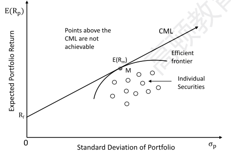
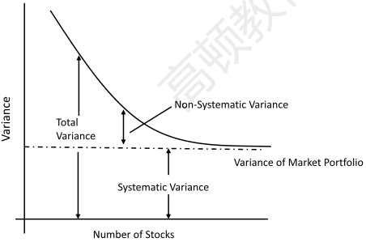
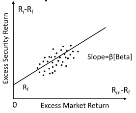
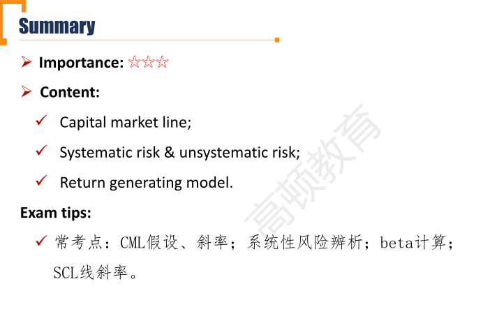

# R1 Capital Market Theory

Williom Sharpe, 兰德公司

**Explain** the capital market line(CML)

**Explain** systematic and nonsystematic risk

**Calculate** and **interpret** beta

**Explain** return generating models(including the market model) and their uses.

#### Capital market line(CML)

- Assuming all investors have a **homogeneous（同质的）expectation**:
  - All investor have identical efficient frontier of risky portfolio and identical optimal risky portfolio, which is the **market portfolio**.
  - 假设了每个投资者对资产的预期都一样
- Capital market line(CML) is a special CAL that includes all possible combinations of risk-free asset and market portfolio.
  - 用市场中所有asset进行组合
  - 得到的optimal risky portfolio点所构成的资产，是充分分散化、并且包含了所有risk的assets. 这种portfolio只存在于理论中，实际中只能用大盘指数尽量近似。
- CML is tangent to the efficient frontier at a point representing market portfolio

#### Systematic Risk & Unsystematic Risk

##### Systematic risk(Non-diversifiable risk/Market risk)

- Risk affects the entire market or economy, which **cannot** be avoided and is inherent in the overall market.
  - Caused by macro factors: interest rates, GDP growth, supply shocks.
  - Measured by covariance of asset return and return on the market portfolio, or Beta($\beta$) of the asset
- Investor would be only rewarded for bearing systematic risk.

###### Beta 计算 \*\*\*重要

- Beta($\beta$) can be used to measure the systematic risk of an asset, representing **how sensitive** an asset's return($R_i$) is to the market as a whole($R_m$).

$$
\beta_i=\frac{cov(R_i,R_m)}{\sigma_m^2}=\frac{\rho_{i,m}\sigma_i\sigma_m}{\sigma_m^2}=\rho_{i,m}\frac{\sigma_i}{\sigma_m}\\
\beta_m=\frac{cov(R_m,R_m)}{\sigma_m^2}=\frac{\sigma_m^2}{\sigma_m^2}=1\\
\beta_{portfolio}=\sum_{i=1}^{n}{w_i\beta_i}
$$

- 比如，某个资产的beta = 3, 市场（大盘）上涨1%，那么该asset上升3%。 beta低的资产，是防御性资产；beta高的资产，波动性比较大，承受市场风险（系统性风险）较大
- portfolio的权重按照market value市值进行加权

##### Unsystematic risk(firm-specific risks/event risk)

- Risk that can be reduced or eliminated by holding **well-diversified** portfolios
- Investor would **not be rewarded** for bearing unsystematic risk as it could be eliminated through diversification.
  - 这里假设了交易无摩擦，做分散化无成本。

##### Systematic risk & Unsystematic risk

- Systematic risk would not change while unsystematic risk would decrease as more diversification is made within the portfolio

#### Return generating Model 了解即可

##### Multi-factor Model

$$
E[R_i]-R_f=\sum_{k=1}^{K}\beta_{i,k}E[Factor\ k]
$$

- 一般第一个factor 是市场，是风险溢价，用$R_m-R_f$表示
- $\beta_{i, k}$ : the sensitivity of excess return on risk factor k.
  - Macroeconomic factors
    - e.g. GDP growth, inflation, consumer confidence
  - Fundamental factors
    - e.g. earnings, earnings growth, firm size, research expenditures
  - Statistical factors

##### Single-index model

$$
E[R_i]-R_f=\beta_i[E(R_m-R_f)]
$$

##### Market model

$$
R_i=\alpha_i+\beta_iR_m+e_i
$$

- market model是观测实时数据得到。通过SCL观测到现有的beta，再根据这个beta预测公司未来的表现

##### Security characteristic line(SCL)

- 斜率是beta，横坐标是市场的风险溢价$R_m-R_f$

