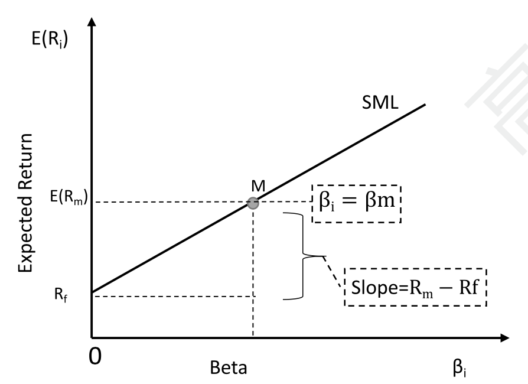
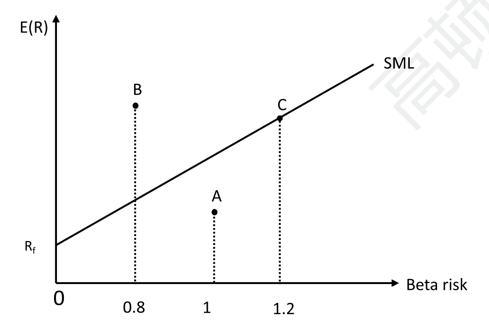
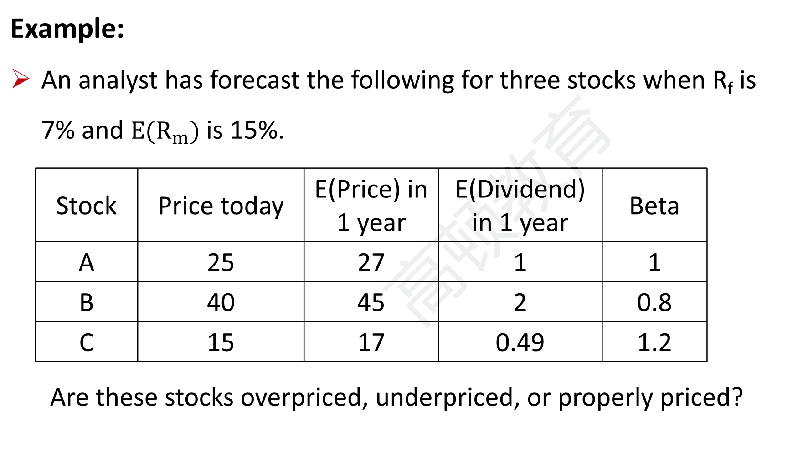
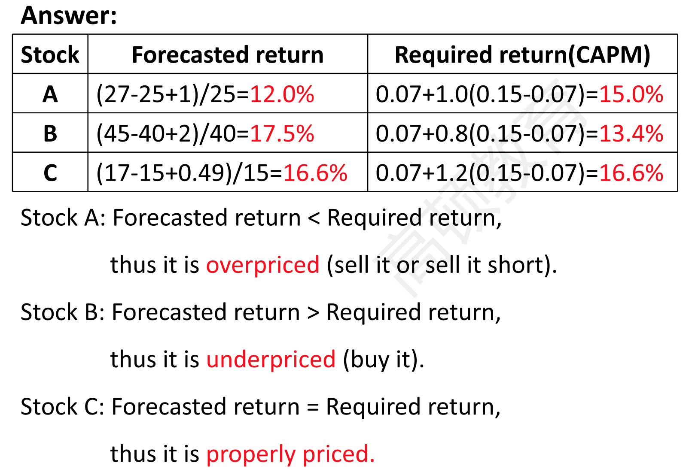
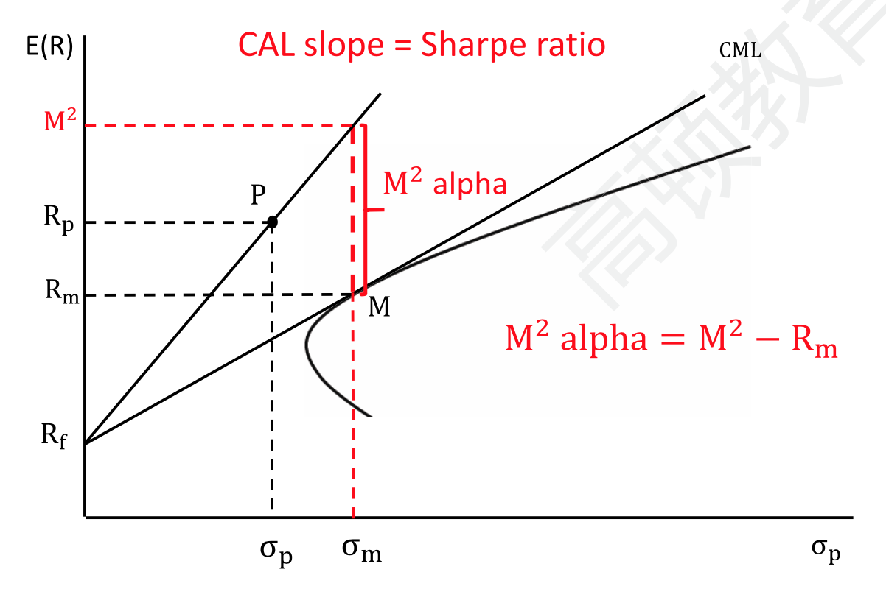
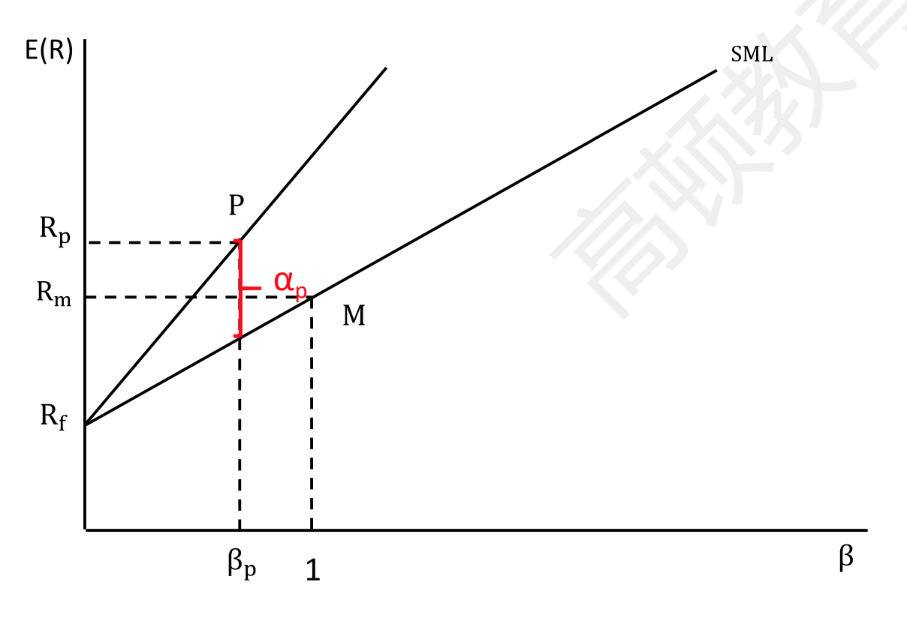
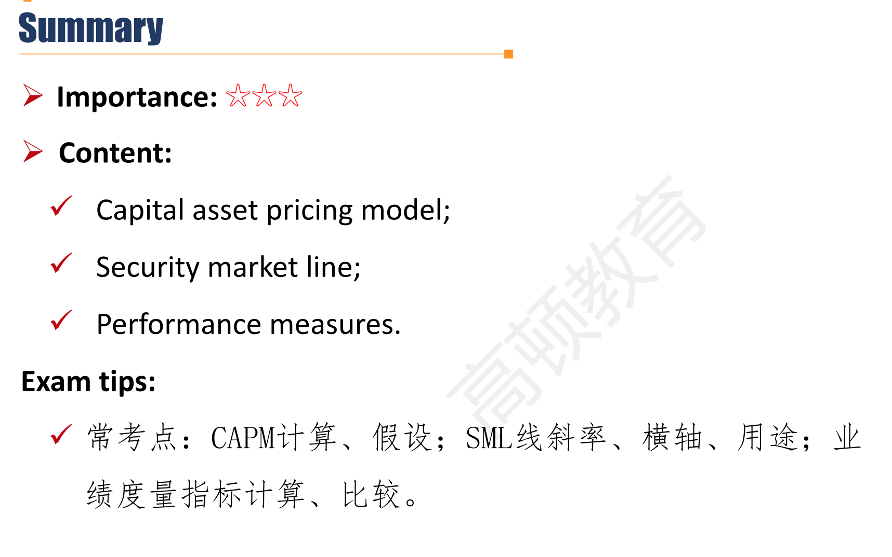

# R2 Capital Asset Pricing Model

**Explain** the capital asset pricing model(CAPM), including its assumptions, and the security market line(SML)

**Calculate** and **interpret** the expected return of an asset using the CAPM;

**Describe** and **demonstrate** applications of the CAPM;

**Calculated** and **interpret** the performance measures.

#### Capital Asset Pricing Model

##### CAPM \*\*\*

$$
E[R_i]=R_f+\beta_iE(R_m-R_f)
$$

- The expected returns (required return) of assets vary only by their systematic risk as measured by beta($\beta$)
- Expected return(required return) obtained from the CAPM is used for assets valuation by investors and capital budgeting to determine economic feasibility of projects.

- 注意：market risk premium/market excess return是$R_m-R_f$
- T-bill 是无风险收益率，大盘指数收益率是$R_m$

##### Assumptions of CAPM 六条假设\*\*\*

CAPM公式成立的前提，有两个大的方面：1）非系统性风险不产生收益；2）每个投资者有相同预期

- Investors are risk averse, utility-maximizing, rational individuals
- Markets are frictionless, including no cost and no taxes
  - 这里意思是交易无摩擦，可以无成本地进行diversification分散掉非系统性风险。属于1）的层面。
- Investor plan for the same single holding period
  - single holding period指的是期间不买入卖出。属于2）
- Investor have homogeneous expectations or beliefs
  - 属于2）
- All investments are infinitely divisible
  - 所有投资是无限可分。表示可以尽可能分散非系统性风险，分散化没有资金门开，属于1）
- Investors are price takers.

##### Security market line(SML)

- A graphical representation of the CAPM with **beta on the x-axis** and **expected return on the y-axis**.
  - Intercept is $R_f$, slope is the market risk premium($R_m-R_f$)

- 对比SCL线：
  - 不同的公司，会有不同的$\beta$. 投资处于不同的时间，市场会有不同的风险$R_m-R_f$
  - 所以，SCL是在确定某个公司的前提下，研究不同时间，不同的市场风险的情况下，投资这家公司股票的收益率；
  - SML是在确定给某个时间点下，确定在某个市场风险的情况下，研究不同的公司的收益率。

###### 如何使用SML

- Any asset or portfolio that are **properly** priced plots **on** SML.
- Any asset or portfolio that are **overpriced** plots **below** SML
  - 承担同样的风险时，收益率太低，说明价格高估，卖出
- Any asset or portfolio that are **underpriced** plots **above** SML.
  - 承担同样的风险时，收益率高于理论，说明价格低估，买入

##### CML vs. SML

|             | CML                                                 | CAL                                           | SML                                         | SCL                            |
| ----------- | --------------------------------------------------- | --------------------------------------------- | ------------------------------------------- | ------------------------------ |
| Definition  | All **efficient** portfolios                        |                                               | All **properly priced** assets or portfolio |                                |
| x-axis      | total risk$\sigma$                                  | single asset risk$\sigma$                     | systematic risk($\beta$)                    | market risk-premium($R_m-R_f$) |
| slope       | market portfolio's sharpe ratio$(R_m-R_f)/\sigma_m$ | single asset sharp ratio $(R_i-R_f)/\sigma_i$ | market risk-premium($R_m-R_f$)              | systematic risk($\beta$)       |
| Application | Used for asset allocation                           |                                               | Used for security selection                 |                                |

#### Performance Measures

##### Application of CAPM\*\*\*

- Portfolio performance evaluation 评价基金经理表现，剔除掉风险带来的收益（risk-adjusted return）
  - Sharpe ratio
    - $(R_i-R_f)/\sigma$ 每风险收益
  - M-Squared($M^2$)
  - Treynor ratio
  - Jensen's alpha($\alpha$)

- 衡量风险有两种方法：标准差$\sigma$，以及以市场风险为基准计算的$\beta$。剔除风险有两种方法，除法和减法。

|        | $\sigma$     | $\beta$        |
| ------ | ------------ | -------------- |
| $\div$ | sharpe ratio | Treynor ratio  |
| $-$    | M-squared    | Jensen's alpha |

##### Sharpe Ratio

$$
Sharpe\ ratio=\frac{R_p-R_f}{\sigma_p}
$$

##### M-squared

$$
M^2=\frac{R_p-R_f}{\sigma_p}\sigma_m+R_f
$$

- 所以M-squared 值就是在某个portfolio的CAL上，按照同样的sharpe ratio，放杠杆把风险增加到市场风险（$\sigma_m$）时的portfolio收益。那这个收益和市场收益的差就是alpha.

##### Treynor ratio

$$
Treynor\ Ratio = \frac{R_p-R_f}{\beta_p}
$$

- 每单位系统风险带来的收益

##### Jensen's alpha

$$
\alpha_p=R_p-[R_f+\beta_p(R_m-R_f)]
$$

- 实际的收益率减去理论的收益率，代表基金经理的投资能力赚到的超额收益。
- 从另一个角度：$R_p = \alpha_p+R_f+\beta_p(R_m-R_f)$.
  - portfolio的收益取决于beta和alpha。提升beta带来的收益引入风险，但是提升alpha的收益不会带来风险。因此追求高alpha是基金经理的一大目标。
  - 从这个式子一可以知道，SCL曲线的截距，其实就是alpha。所以SCL截距大于0，代表股票打败市场，可以买入。

