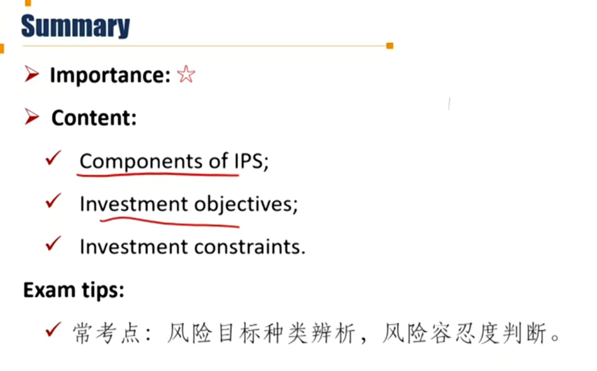
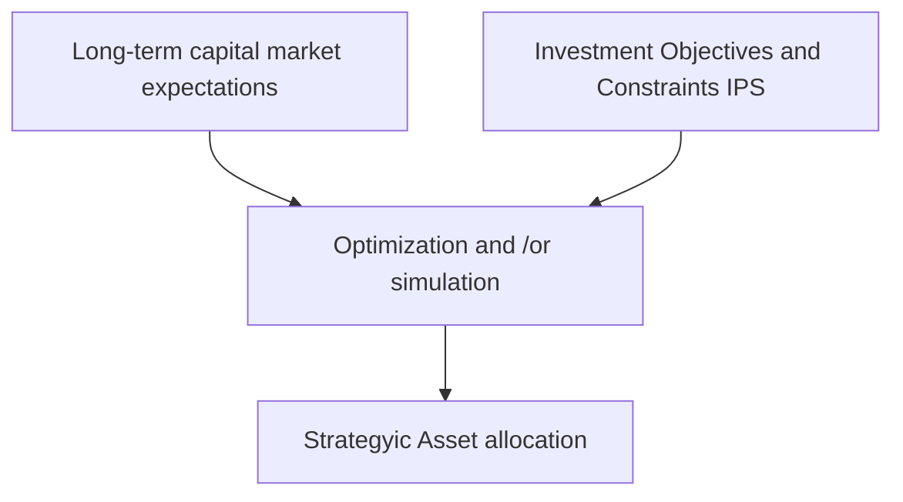
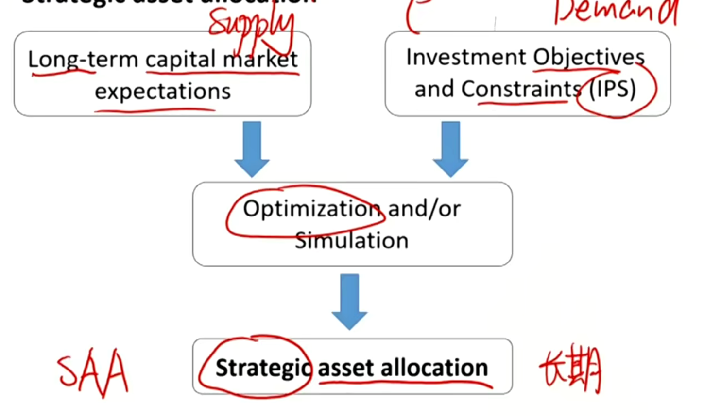
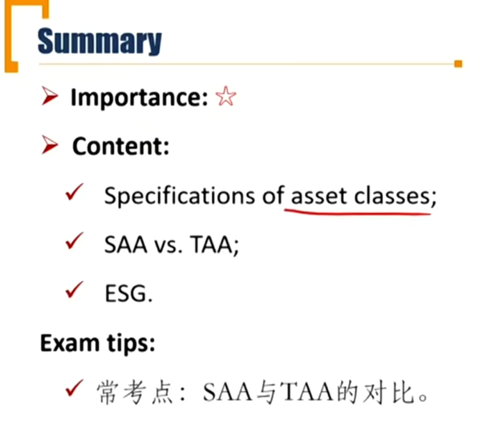

# M4 Portfolio Planing and Construction

Describe the major components of an IPS

Describe the reasons for a written IPS

Describe risk and return objectives and how they may be developed for a client

**Distinguish** between the willingness and the ability(capacity) to take risk in analyzing an investor's financial risk tolerance.

Describe the investment contraints

## Portfolio Planning

##### Major components of investment policy statement(IPS)

- Introduction
  - Describes the client
- Statemenf of purpose
- Statement of duties and responsibilities
- Procedures
  - Steps to update IPS and procedures to respond to contingencies
- **Investment objectives** (RRTTLLU)
  - Client's objectives in investing(return & risk)

- **Investment constraints**
  - The factors constrain the client in the investing
- Investment guidelines
  - Execution policy(e.g., use of leverage and derivatives) and assets that are allowed to invest
- Evaluation and review
  - Feedback on ivestment results
- Appendices 附录
  - Strategic asset allocation (SAA), rebalancing policy

##### Reasons for writing an IPS

- Identifies client objectives and constraints
- Clear statement of client risk tolerance and return requirements
- Imposes investment discipline on both client and manager
  - 基金经理以IPS为依据进行投资
- Serves as a guideline to assess the suitability of a particular investment.
- Identifies a benchmark portfolio consistent with client preferences.

##### Return objectives 

- Specify what return is required by the client
  - Absolute return objectives
    - 和固定的某个required return 比
  - Relative return objectives
    - 和大盘比，和通胀inflation比

**Risk Objectives**

- The **risk tolerance** of the client is specified.(风险目标取决于客户的风险承受能力)
  - Absolute risk objectives
    - 比如要求波动率不能超过某个值
  - Relative risk objectives
    - 和指数之间的差距的标准差不能太大（不能围绕指数波动太大）
    - tracking error, difference with CPI, difference with inflation
- Factors dependent upon:
  - Psychological factors
  - Personal factors: age, family situation, existing wealth, insurance coverage, cash reserves, income

- 客观因素**Ability to bear risk**: depends on inestment horizon, insurance, income, wealth, financial responsibilites(不仅看财富，也要看负债)
- 主观因素**Willingness to bear risk**: depens on attitudes and beliefs about investment risk.
  - if **willingness > ability**: advisor should go with ability
  - if **ability > willingness**: educate the investor about investment risk, but do not attempt to change personality/psychological characteristics.

##### Investment constraints (TTLLU)

- **Liquidity**: the potential need for cash
- **Legal and regulatory:** applies more to institutional investors, but also affects individual investors(e.g., IRA accounts).
- **Time horizon**: the time unitl the proceeds of the investment will be requried.
  - 投资时间长度，一般long-term，对于个人来说一般考虑multi-stage，多个阶段的需求。

- **Tax concerns:** is the account taxable, tax-deferred, or tax-exempt
  - 考虑税收优惠
- **Unique needs and preferences**: anything that does not fit into the above catogories.
  - 特殊投资癖好

- relative还是absolute
- ability还是willingness

## Portfolio Construction

Explain the specification of  asset classes in relation to asset allocation

Decribe the principles of portfolio construction and the role of asset allocation in relation to the IPS

Describe how ESG considerations may be integrated into portfolio planning and construction.

##### Strategic asset allocation

- SAA是长期资产配置
- Specifications of asset classes 资产分类
  - Correlations of returns of assets **within** an asset class should be relatively **high**
  - Correlations of returns **between** asset classes should be **low**

##### Steps of portfolio construction

- Use risk, return, and correlations among asset classes to construct an efficient frontier. 构建有效风险前沿（投资产品的supply）
- **Strategic asset alocation**: use objectives and constraints from IPS to select an optimal portfolio
- **Tactical asset allocation**(deviations from SAA), and security selection as permitted and approprate.
  - TAA和SAA的偏离是短期short-term，并且是小幅度的偏离。
- Security selection and rebalancing
- Risk budgeting风险预算: allocates permitted risk to strategic allcoation, tactical allcoation, and security selection.
  - 对有限可以承受的风险进行分配

##### ESG considerations

- **Environmental issues**
  - Carbon emissions, air pollution, biodiversity, etc.
- **Social issues**
  - Labor standards, human rights, community relations, etc.
- **Governance issues**
  - Board compositon, bribery and corruption, executive compensation, etc.
  - 这里是公司治理情况

##### ESG consideration implementation approaches

- Negative screening(exclusionary screening)
  - 逆向筛选，把不满足ESG的排除portfolio
- Best-in-class
  - Best-in-class vs. shareholder engagement

- Thematic investing
  - 主题投资
- ESG integration

