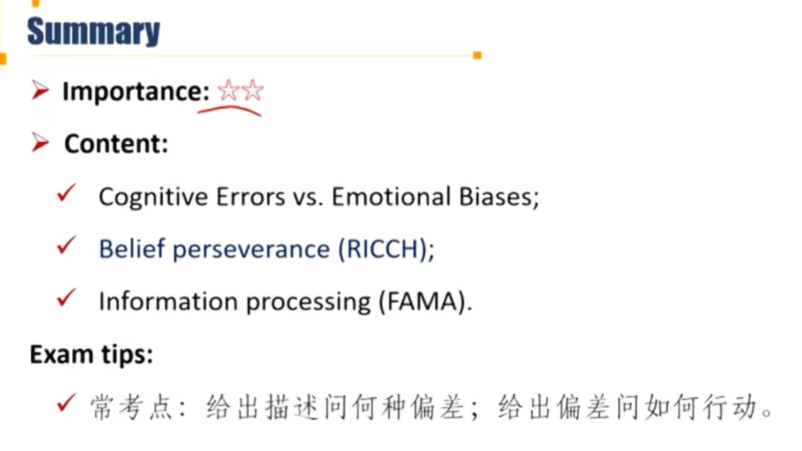
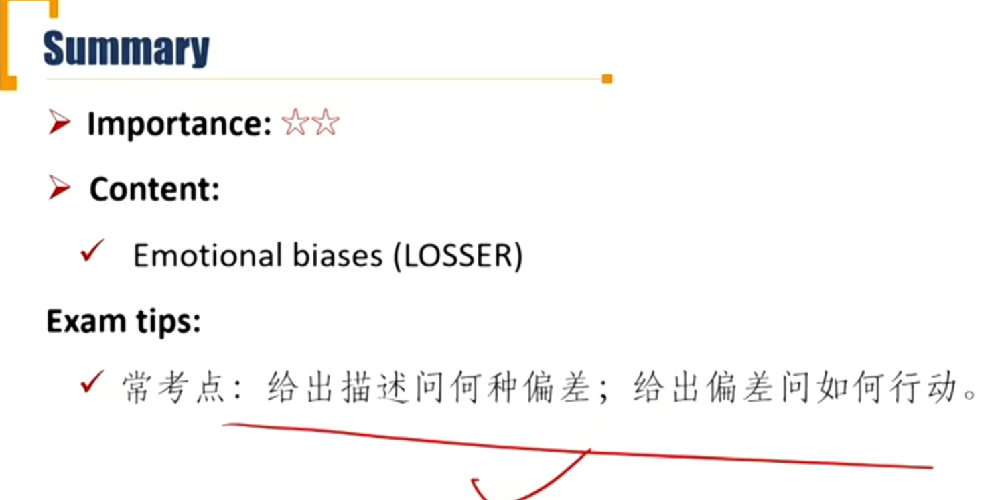
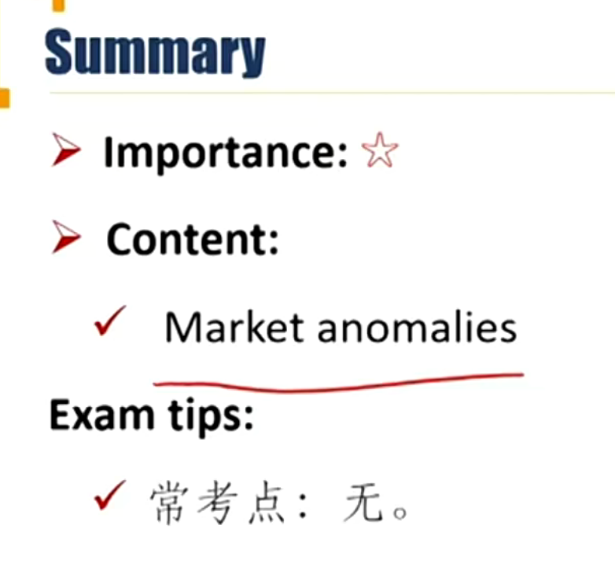

# M5 Behavior Biases of Individuals

## Cognitie Errors

**Compare** and **constrast** cognitive errors and emotional biases

**Discuss** commonly recognized behavioral biases and their implications for financial decision making

#### Coginitive Errors and emotional Biases

##### Behavioral biases and categorizations

- People often rely on **basic** judgments and preferences to **simplify** the situation rather than acting completely rationally

- Behavioral biases come in two forms

  - 认知错误可以被纠正，情感偏差是无意识的反应难以纠正
  - **Cognitive errors**: faulty cognitive reasoning
    - 包括分析信息能力、收集信息能力不足
    - Can be **corrected** or eliminated through education

  - **Emotional biases**: based on feelings or emotions
    - Arise **spontaneously** rather than through conscious effort
    - Are harder to correct and should be **adapted**.

- 9个cognitive erros, 6个emotional biases

### Cognitive Errors

Cognitive Errors 包括两个大类：Belief perseverance biases, information processing errors

#### Belief Perseverance Biases 固执己见

- Belief perseverance biases is the tendency to cling to one's previously held beliefs irrationally or illogically.(记忆：RICCH，rich的人才固执己见)
  - Representativeness bias
  - Illusion of control bias
  - Conservatism bias
  - Confirmation bias
  - Hindsight bias

##### Representativeness bias 代表性偏差

用某个A代表B

- **Definition**：the tendency to classify **new** information based on **past** experiences and classifications. 用过去的方法对新信息进行处理、分类
- **Two types**: 
  - Base-rate neglect; 用新信息代表了全部结果，忽略了原有的信息。
    - P(A|B) = P(B|A) / P(B) \* P(A)，比如新给了B信息，用P(B|A)以及P(B)，估计了P(A|B)而忽略了base-rateP(A)。e.g. A1 = 银行职员，A2 = 图书管理员，B=专业是文学；P(A1)显然大于P(A2)，但是由于base-rate neglect，很多人下意识就会认为文学专业应该去当图书管理员，导致估计错误。
  - sample-size neglect 样本量不够，用小样本代表总体
- **Consequences**: 代表性偏差导致的后果
  - Adopt a forecast based on individual, specific information or a small sample
    - 导致trade too much
  - Update beliefs using simple classifications rather than deal with complex data.

##### Illusion of control bias

- **Definition**: people tend to believe that they can control or influence outcomes when, infact, they cannot. 
  - 误以为自己可以产生影响力

- **Consequences**:
  - **Inadequately diversify** portfolios
    - under-diversified 
  - **Trade too often**
  - Construct financial models and forecasts that are overly detailed.
    - 预测的结果过于精确

##### Conservatism bias

- **Definition:** people maintain their prior views or forecasts by inadequately incorporating new, conflicting information.
  - cognitive cost: 认知成本，学习新信息的成本高的时候，会发生保守性偏差。cognitive cost和conservatism bias存在负相关关系，认知成本越高，越容易犯保守性偏差。
  - conservatism bias和base-rate neglect相反。conservatism bias不考虑新信息。
- **Consequences:**
  - Maintain or be **slow to update** a view or a forecast, even when presented with new information
  - **Maintain a prior belief** rather than deal with the mental stress of updateing beliefs given complex data（complex data means high cognitive cost）.

##### Confirmation bias确认偏差(Selection bias选择偏差) 

- **Definition**: then tendency to notice what confirms prior beliefs and to ignore whatever contradicts them
  - 和自己意见一致的会下意识接受，和自己意见不一样的会选择性轻视。
  - 上面的conservatism bias体现的是只重视旧信息，轻视新信息；这里confirmation bias体现的是不接受和自己意见不一致的信息。一个是新旧的维度，一个是自己意见一不一致的维度。
- **Consequences**:
  - Consider only the positive information and therefore **hold** investments **too long.**
  - Develop screening criteria to find what they want to see.
    - 根据自己的判断筛选掉部分股票
  - **Under-diversified** portfolio
  - Overly concentrate in the stock of their employer

##### Hindsight bias 后见之明，事后诸葛亮

- **Definition:** people tend to believe past events as having been predictable and reasonable to expect.
  - 高估了自己的预测能力
- **Consequences:**
  - **Overestimate** the degree to which they correctly predicted an investment outcome, which could reinforce an emotional overconfidence. 高估预测准确率
  - Overly critical of the performance of others.

##### RICCH

- R：Representative bias
- I: Illusion of control bias
- C: Conservatism Bias
- C: Confirmation bias
- H: Hindsight bias

#### Information Process Errors

##### Information process errors

- Information Processing describing how information may be processed adn used irrationally in financial decision making.
  - Framing bias
  - Availability bias
  - Mental accounting bias
  - Anchoring and adjustment bias

##### Framing bias 框架效应

- **Definition**: people tend to answer a question differently based on the way in which it is asked or framed
  - 比如：“屡败屡战”和“屡战屡败”
- **Consequences**:
  - **Misidentify risk tolerances** because of how questions about risk tolerance were framed.
    - 对风险进行积极地描述，会低估风险；消极方式表述的风险，会表现得过于保守。
  - Focus on short-term price fluctuations and **trade too often.**
    - 对风险错误估计，从而交易过多。

##### Availability Bias  可得性偏差

- **Definition**: people tend to estimate the probability of an outcome based on how easily information is recalled.
  - 用最容易获得记得信息来估计某件事发生的概率
- **Consequences**:
  - Limit their investment opportunity set.
  - Choose an investment based on **advertising** or the quantity of news coverage.
    - 根据广告进行决策
  - **Fail to diversify.**

##### Mental accounting bias 心理账户

- **Definition**: people tend to mentally **divide** money into "accounts" that influence decisions
  - 把钱分割到不同账户：比如捡到的钱随便挥霍，上班打工的血汗钱就不会乱花。
- **Consequences**:
  - **Fail to reduce risk** by combining assets with low correlations
    - 由于割裂不同账户考虑资产投资，不同账户间的资产correlation 没有考虑进去
  - Overemphasis on **income generating** assets, resulting in a lower total return.
    - 对于需要现金流的心理账户，投资的时候过分关注income（dividend cash flow），缺少关注capital gain. 导致total return降低。
  - 拓展：goal-based 投资方法基于mental account

##### Anchor and adjustment bias 锚定效应

- **Definition**: people tend to rely on an **initial** piece of information to make subsequent estimates and decisions.
  - 下锚：锚定客户的初始值。比如中介一开始带看房都是比价烂但很贵的房子，客户心理下意识就认为当下行情烂房子也很贵，然后遇到一个稍微好一点的房子，成交概率就很大。
- **Consequences**:
  - Stick too closely to their **original estimate ** when learning new information.

## Emotional Biases

- Emotional biases **harder to correct** for than cognitive errors because they originate from **impulse or intuition**.   
  - Loss-aversion bias 
  - Overconfidence bias 
  - Self-control bias 
  - Status quo bias 
  - Endowment bias 
  - Regret-aversion bias
  - 记忆：LOSSER，loser，心态崩溃，emotional biases 

##### Loss-aversion bias 

- **Definition**: tendency to strongly prefer avoiding losses to achieving gains.
  - 同样金额的损失，比同样金额的盈利，给人心理冲击更大。 
- **Consequences**:  
  - **Disposition effect**: 处置相应 :
    - **Hold investments** in a loss position **longer** than justified.       
      - 持有亏损头寸,too much risk
    - **Sell investments** in a gain position **earlier** than justified.
      - 过早卖掉，又持续追涨, trade too much 

##### Overconfidence bias 过度自信  

- **Definition:** peope demonstrate unwarranted(不合理的) faith in their own abilities.  

  - Intensified when combined with **self-attribution bias**(自我归因), in which people take too much credit for successes and assign responsibility to others for failures. 成功都在自己，失败都怪环境

  - 包括两个方面：
    - prediction overconfidence. 预测的范围过窄
    - certainty overconfidence. 高估某个事件的发生概率
      - certainty overconfidence时，一旦发生相反情况，就容易交易，发生trade too much

- **Consequence:** 
  - Underestimate risks and overestimate expected returns.
  - Hold **poorly diversified** portfolios.

##### Self-Control bias 自控能力不足

- **Definition**: people fail to act in pursuit of their long-term, overarching goals because of **lack of self-discipline.**
  - 自身知道long-term benefits的重要性，但是就是管不住自己。
- **Consequences**:
  - **Save insufficiently** for the future
  - **Borrow excessively** to finance present consumption.

##### Status quo bias 懒

- **Definition**: people choose to do nothing instead of making a change
  - 懒得改变现状。注意区别conservatism bias，保守性偏差是新旧信息判断的维度，是认知错误。
- **Consequence**:
  - Holding portfolios with inappropriate risk
  - Fail to explore other opportunities. 错失投资机会

##### Endowment bias 禀赋效应

- **Definition**: people value an asset more when they own it than when they do not. 自己拥有的东西认为价值更高。
- **Consequence**: 
  - **Failing to sell** an inappropriate asset resulting in inappropriate asset allocation.
    - 出现hold too long等后果
  - Holding things you are familiar with because they provide some intangible sense of comfort.
    - 熟悉的资产投资过久

##### Regret-aversion bias 后悔厌恶

- **Definition:** people tend to avoid making decisions out of fear that the decision will turn out poorly. 人都是倾向于不做决定，担心决定做错
  - **error of commission 过错**（这里的做错更倾向于这个概念）
  - error of omission，错过
  - 这里的making decisions指的是take no action的概念，指的是做了某件事，发生了error of commission，而不是没做某件事，后悔没有做。比如，持有了一支股票，人会倾向于不卖出（take no action）。
- **Consequences**:
  - Be **too conservative** in their investment choices as a result of poor outcomes in the past. 太保守，持有资产持有太久。
  - Engage in **herding behavior**.羊群效应
    - regret-aversion导致羊群效应。大家都买入，担心股票涨的时候，大家都赚钱，就我不赚钱，所以自己也跟着买入。
    - 所以这里的角度和上面不一样，是error of omission。担心错过大家都能够获得的一种结果。（从众效应）

## Market Behavior

Describe how behavioral biases of investors can lead to market characteristics that may not be explained by traditional finance.

#### Market Behavior

##### Defining market anomalies

- Anomalies are apparent deviations from the efficient market hypothesis, identified by **persistent** abnormal returns that differ from zero and are predictable in direction. 市场异常，长期赚到超额收益
- **Not every** deviation is anomalous. Misclassifications tend to stem from three sources:
  - Choice of asset pricing model
    - 计算超额收益时使用什么模型：CAPM，Fama French 3模型等
    - 并不是所有超额收益都是（$\alpha=R_p-(R_{theory\ expect})$）市场异常。有可能选错了估计理论收益率的模型，导致alpha算错。
  - Statistical issues.
    - 样本不够
  - Temporary disequilibria（失衡）.
    - 暂时性的失衡状态

观察到1具体的Market anomalies，尝试用行为金融学解释：

##### Momentum 动量

- Future price behavior correlates positively with that of the recent past.
  - auto correlation，自己和上一刻自己的相关系数不为零。（有效市场自相关系数等于0, 随机游走$\rho_{Y_{t-1},Y_t}= 0$）
  - 一般表现为：越强势的股票越涨，越差的股票越跌。
- Momentum can be partly explained by :
  - Availability bias
    - 不断关注自己关注的股票
  - Hindsight bias
    - 不断补仓

##### Bubbles and crashes

- There are several different types of behavior that are evident during bubbles
  - Overconfidence-> excessive trading and underestimation of risks.
  - Confirmation bias
    - 比如利空时，固执自己的看法不清仓
  - Self-attribution bias,
    - 自我归因，导致更多自信
  - Hindsight bias
    - 事后高估自己判断力，过度自信
  - Regret aversion bias
    - 比如股市大涨的时候，避免没有吃到泡沫，跟着买如
  - Anchoring bias.
    - 回调的时候，判断错价值，抄底过早。

##### Value 价值股

- Value stocks are typically with low price-to-earnings ratios(P/E), high book-to-market equity （B/P）. Growth stocks are the opposite. Fama and French found that value stocks historically outperformed growth stock, which could be explained by: 价值股跑赢成长股
  - **The halo effect**（光环效应，代表性偏差）, a company with a good growth record might be seen as a good investment, which is a form of **representativeness**. 投资者把成长股过去的高速成长，下意识代表了这是很好的投资，实际上不代表未来能保持高速成长速度，所以被高估。(overvalued) 反过来价值股不会被高估。
  - **Overconfidence** can also be involved in predicting growth rates, leading growth stocks to be overvalued. 投资者对成长股增长速度高估。

