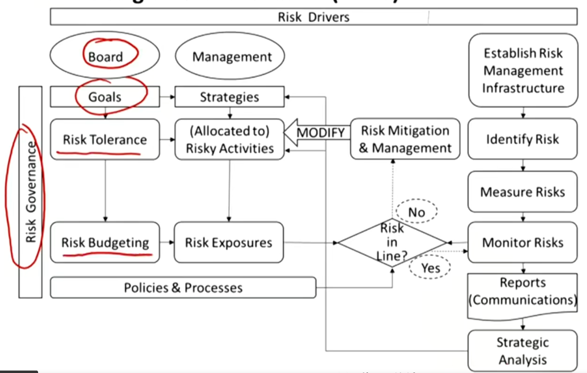
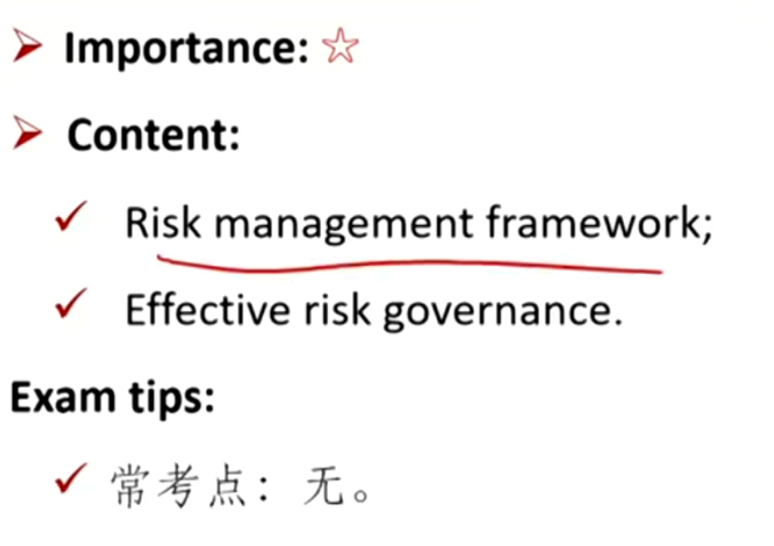
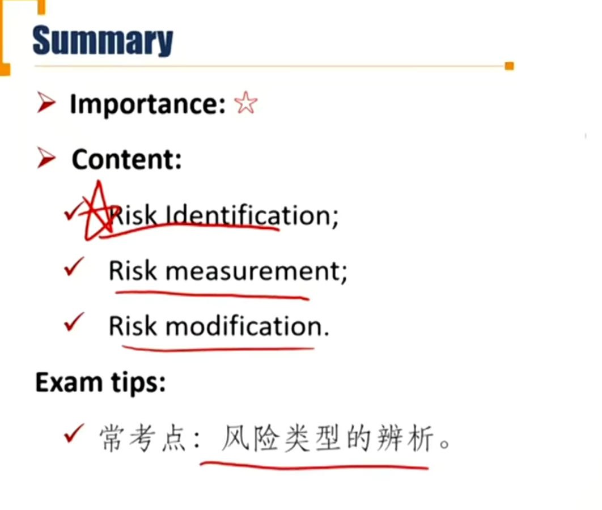

# M6 Risk Management

### 1. Risk Management

Define risk management

Describe features of a risk management framework

Define risk governance（风险治理） and describe elements of effective risk governance

Explain how risk tolerance（风险承受能力） affects risk management

Describe risk budgeting（风险预算） and its role in risk governance.

#### 1.1 Basics of Risk Management

##### Risk

- Broadly speaking, exposure to uncertainty
  - 分为上行风险和下行风险

##### Risk exposure 风险敞口

- Actual risk borne by a business or investor.

##### Risk management

- **Defines** the level of risk to be taken, **measures** the level of risk being taken, and **adjusts** the latter toward the former, to **maximize** the portfolio's value.
- 风险管理不是单纯减少风险，而是最大化portfolio的价值

- 持有的风险敞口太多，通过对冲减小；风险敞口太小，放杠杆。

##### Risk management framework

- The infrastructure, process, and analytics needed to support effective risk management in an organization.

  - **Risk governance**\*风险治理: the **top-down** process and guidance that directs risk management activities to the **overall** enterprise.
    - 董事会制定的大的企业层面的风险治理方针
  - **Risk identification and measurement**
  - **Risk infrastructure**\*: the **people** and **systems** required to track risk exposures and perform the quantitative risk analysis to assess the organization's risk profile.

  - **Policies and processes**: the extension of risk governance into both the day-to-day operation and decision-making processes of the organization.
  - **Risk monitoring, mitigation风险缓释, and management**
  - **Communication**沟通
  - **Strategic analysis and integration** 战略分析

##### Elements of effective risk governance

- **Enterprise risk management** 企业风险管理

  - Provides an **enterprise-view** of risk management. Focus risk activities on the **entire** organization 站在企业的角度考虑风控。
  - 比如，出口部门单行本币贬值风险，进口部门担心本币升值风险。从整个公司层面考虑，两个部门本身就形成了对冲。

- **Risk tolerance(risk appetite)**

  - Identifies the extent to which the entity is willing to experience losses or fail in meeting its objectives.

- **Risk budgeting**

  - Quantifies and allocates the tolerable risk by specific metrics.

  - 分配具体风险

##### Effects of risk tolerance on risk management

- Serve as the high-level guidance for management in its strategic selection of risks.
  - Delineates which risks are acceptable, which are unacceptable, and how much risk the overall organization can be exposed to .
  - Target where it should actively pursue risk and where it should mitigate or modify risk

##### Role of risk budgeting in risk governance

- Guides implementation of the risk tolerance decision at strategic level
  - A means of **bridging** from the high-level governance risk decision to the many management decisions, large and small, that result in the actual risk exposures.

### 2. Risk Management Process

Identify financial and non-financial sources of risk and describe how they may interact.

Describe methods for measuring and modifying risk exposures and factors to consider in choosing among the methods

#### 2.1 Risk management process

- **Identification of risk** \*\*
- Measurement of risk
- Modification of risk

#### 2.2 Identification of Risk

##### Financial Risk

- The risks that arise from events occurring in the financial markets.
  - e.g. changes, in prices or interest rates
- **Market risk**
  - Risks that arise from movements in interest rates, stock prices, exchange rates, and commodity pricers
- **Credit risk**
  - Risk of loss if one party fails to pay an amount owed on an obligation(e.g., bond, loan, derivative) to another party.
- **Liquidity risk**
  - Risk of a significant downward valuation adjustment when selling a financial asset.
  - 一个资产变现的能力

##### Non-financial risk

- The risks that emanate from outside the financial markets, such as actions within an entity, or from external origins.
  - E.g., environment, the community, regulators, politicians, suppliers, and customers.
- **Settlement risk**结算风险
  - Closely related to default risk but deals more with the settling of payments that **occur just before a default**. 想还钱但是还不了，一般是涉及bankruptcy的时候出现。
    - e.g. 德国发展银行和雷曼兄弟的外汇互换。
- **Legal risk**法务风险
  - The risk of **being sued** over a transaction or for that matter, anything an entity does or fails to do.
    - e.g. 宝洁起诉风控公司
- **Model risk**模型风险
  - The risk of a valuation error from **improperly using a model**
    - e.g. 次贷危机中的CDO，应用了李祥林的Copula模型

- **Tail risk** 尾部风险
  - More events in the tail of the distribution than would be expected by probability models.
    - 低估了尾部中极端的低收益率的发生概率
- **Operational risk** 操作风险
  - Risk that results from failure in internal procedures, as well as from some special external events.
    - e.g. 光大乌龙指
- **Solvency risk** 偿债风险
  - Risk that the entity does not survive because it **runs out of cash**, even though it might otherwise be solvent. 现金流断裂

- **Compliance risk**合规风险
  - Risks that deal with the matter of conforming to policies, laws, rules, and regulations.
    - Regulatory risk
    - Accounting risk
    - Tax risk

##### Interactions of risks

- Risks do not usually arise independently, but generally interact with one another, a problem that is even more critical in stressed market conditions.
  - e.g. 流动性风险导致结算风险、偿债风险等。一般市场行情不好时，多种风险会同时发生。

#### 2.3 Measurement of Risk

##### Measurement of market risk

- Probability
  - 复习：数量中shortfall 概率
- Standard deviation
- Sensitivity(Beta, Delta, Gamma, Vega, Rho, Duration)
- **Value at Risk(VaR) and Conditional VaR(CVaR) \*\*\*在险价值**
  - A measure of the **minimum** amount of loss expected for a **given period** at a **given level of probability**.
  - 在险价值VaR反映了时间、概率、损失。比如，1天内，95%可能性，亏损不会超过10万。
- Extreme value theory(EVT)
- Scenario analysis and stress testing

##### Measurement of credit risk

- Credit reating(Moody's, Fitch, S&P)
- Solvency ratios(e.g., current ratio)
- Profitability ratios(e.g., ROA, ROE)
- Leverage measures(e.g., debt-to-asset ratio)
- Credit VaR, probability of default, expected loss given default, and the probability of a credit rating change
- Ex ante(事前) risk cost(e.g., CDS, put options, exotic options, insurance contracts)

#### 2.4 Modification of Risk 风险修正

##### Methods of risk modification

- Risk prevention and avoidance
  - 当风险发生频率高，严重程度高采用
- Risk acceptance: self-insurance and diversification
  - 当风险发生频率低，严重程度低采用
- Risk transfer
  - 比如保险，进行风险转移
  - 风险频率比较低，严重程度比较高
- Risk shifting
  - 改变风险发生的概率密度曲线，比如使用衍生品
  - 频率发生高，严重程度低

##### Factor considering in choosing the methods

- Trade-off between costs and benefits

