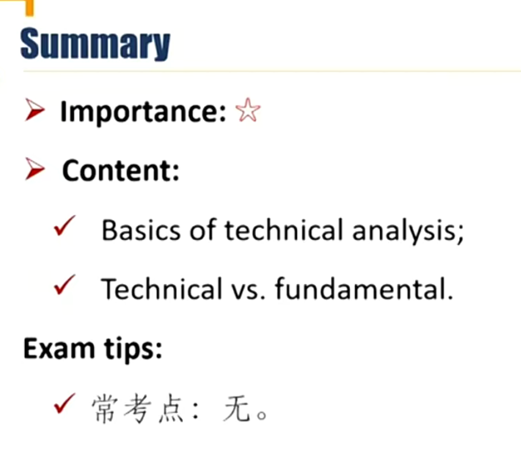
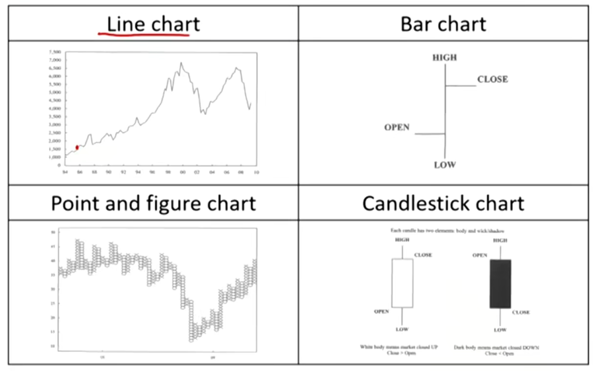
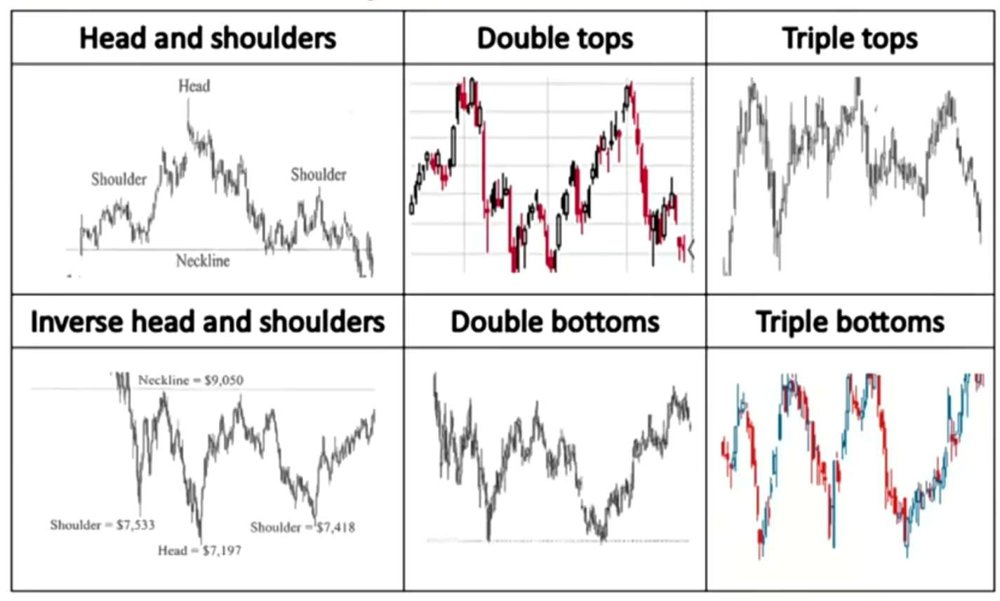
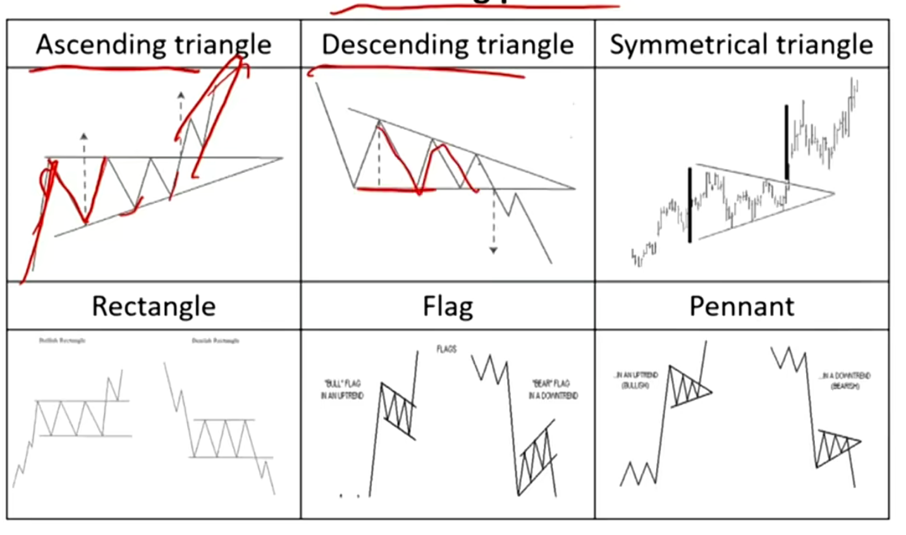
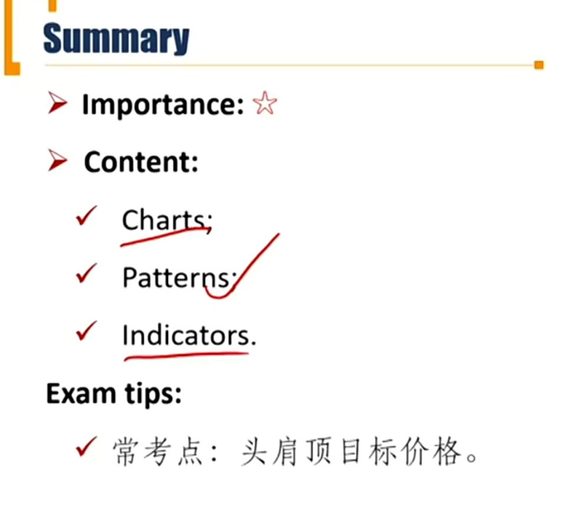
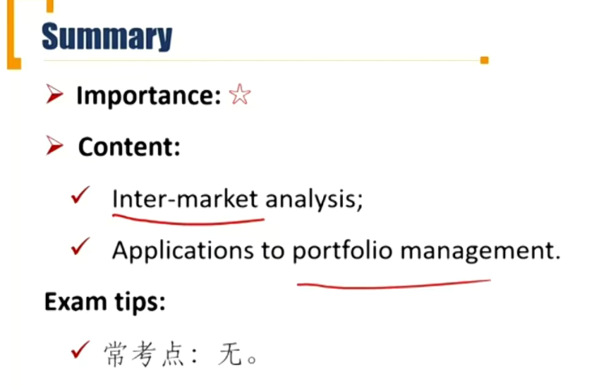

# M7 Basics of Technical Analysis

Explain principles and assumptions of technical analysis

Describe potential links between technical analysis and behavioral finance

Compare principles of technical analysis and fundamental analysis.

关注技术分析和传统分析的差异

### 1. Basics of Technical Analysis

##### Technical analysis

- Analyzed using **price** and **volume** data
  - 要求市场自由交易，量和价体现供需关系
- Prices are determined by supply and demand
  - 对比基本面分析：供求关系影响短期价格，价格长期回归到内在价值
- Past price action can be used to forecast future prices movement with charts and other technical tools.
  - 对比基本面：过去和未来没有关系

##### Principles and assumptions 三条假设

- The market discounts everything 价格反映了所有信息
  - Market price already reflects all known factors impacting a financial instrument
  - 市场价格反映了所有信息，通过分析市场价格、成交量可以挖掘信息。
- Prices move in trends and countertrends
- Price action is repetitive, and certain patterns tend to reoccur.

##### Technical analysis and behavioral finance

- Technical analysis is the study of collective investor psychology and thus has a direct connection with behavioral finance
- Technicians believe that:
  - Trades determine volume and price. 真实的交易最关键，影响价格
  - Buying and selling activities may be driven by motivations that are not rational. 买卖被非理性的动机所驱使
  - Market trends and patterns reflect irrational human behavior.
    - 基本面分析不考虑人的心理因素，假设市场中都是理性投资者

##### Technical analysis vs. Fundamental analysis

| Technical analysis                                           | Fundamental analysis                                         |
| ------------------------------------------------------------ | ------------------------------------------------------------ |
| Studying the price and volume data（优点：数据真实；劣势：只分析了过去，没有前瞻性研究） | Numerous estimates and assumptions are added in financial statements（劣势：输入都是假设的估计值；优势：对未来趋势进行了研究） |
| Trying to find the price it will trade                       | Trying to find the intrinsic value it should trade           |
| 适用情况：It works in liquid and deep market(e.g., commodity, currency) | It works for assets with cash flows.（要求市场的资产有现金流才可以进行基本面分析，所以不适用大宗商品、外汇市场） |

### 2. Patterns and Indicators

Describe the construction of different types of technical analysis charts and interpret them

Explain uses of trend, support, resistance lines, and change in polarity

Describe common chart patterns

Explain common technical indicators

#### Type of charts

- Bar chart额外反映了股价的波动率。bar越高波动越大。

- Point and figure chart, 圆圈是下跌，×是上涨。横轴不是等比例的交易时间，代表的是整个趋势的时间

#### Patterns of charts

- **Trend**
  - Uptrend: the price goes to higher highs and higher lows
    - 最高价和最低价都在不断上升
  - Downtrend: the price goes to lower lows and lower highs
- **Support line**支撑位
  - A low price range in which buying activity is sufficient to stop the decline in price
- **Resistance line**阻力位
  - A price range in which selling activity is sufficient to stop the rise in price.

- Change in polarity极性转换
  - Once support level is breached, it becomes resistance level
  - Once resistance level is breached, it becomes support level.

##### Pattern of charts - reverse patterns 反转趋势

- **head and shoulders** 头肩顶，两边shoulder较小的顶部，中间head顶部。交易量不断萎缩。
  - target price = neckline - (head - neckline)
- Double top双顶
- triple tops 三顶

##### Pattern -f charts -continuing patterns

- Pennant三角旗

##### Type of technical analysis indicators

| Price-based Indicators                   | Moving average(MA线) and Bollinger Bands                     |
| ---------------------------------------- | ------------------------------------------------------------ |
| Momentum Indicators （衡量买卖力量）     | ROC oscillator, RSI, Stochastic Oscillator, and MACD         |
| Sentiment Indicators（情绪指标）         | Opinion Pools, Put-call ratio, VIX, and short interest ratio |
| Flow of Funds Indicators（股票资金来源） | Arms Index, Margin Debt, Mutual Fund Cash Position, New Equity Issuance, and secondary Offerings |

- Bollinger Band：布林区间，MA线加减一个范围
- RSI: relative strenght Index: 100 - 100 / (1+RS), RS = 涨幅度 / 跌幅度
  -  RSI > 50的时候，涨；RSI < 50，跌。
- MACD:如两个移动平均的差，比如MA12 - MA26
- VIX：恐慌指数。对于未来市场波动率的预期
- Flow of Funds Indicator: 观察基金机构的仓位和现金储备。比如mutual fund资金多，市场上新股少，市场大概率上涨。

### 3.Intermarket Analysis

Describe principles of intermarket analysis

Explain technical analysis applications to portfolio management

##### Inter-market analysis

- Inter-market analysis is based on the principle that all markets are interrelated and influence each other
  - Involves the use of **relative strength** analysis（相对强度分析） for different groups of securities to make allocation decisions
  - e.g. stocks versus bonds, sectors in an economy, and securities from different countries.
  - 比如股票和债券的相对强弱，板块之间的对比， 不同国家的对比

#### Applications to Portfolio management

##### Top-down approach

- Start by analyzing **global benchmarks**, such as MSCI and FTSE. The relative performance of major indexes will reveal important investment themes for investors with a long-term focus. 更关注宏观指数

##### Bottom-up approach

- A bottom-up investing approach focuses on the analysis of **individual stocks**. A thorough technical analysis of individual stocks will reveal investment themes different sectors and industries. 更关注个股。

##### The role of the technical analyst

- A technical analyst can serve a supporting role in a team of investors
  - The key value-added input would be in the form of timing of the purchase or sale of that security. 技术分析帮助择时，可以辅助基本面分析
  - Technical analyst will typically not be directly involved in position sizing decisions. 技术分析无法决定买多少

