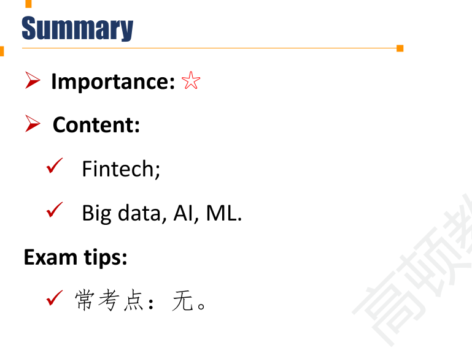
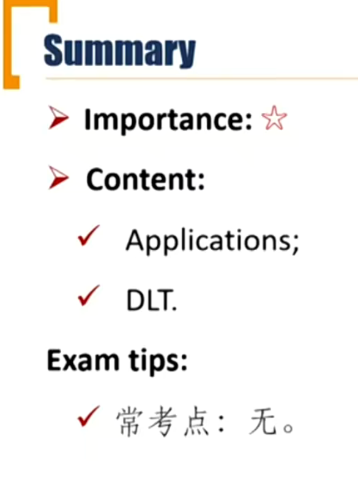

# M8 Basics of Fintech

Describe fintech

Describe Big Data, artificial intelligence, and machine learning.

### Basics of Fintech

##### Fintech

- Technological innovation in the design and delivery of financial services and products
  - Analysis of large datasets(big data)
  - Analytical tools(AI and Machine learning)
  - Automated advice(Robo-advisers)
  - Automated trading(Algorithms trading)
  - Financial record keeping(DLT) 分布式记账

##### Big Data

- **Traditional data:** stock exchanges, financial statements, economic indicators
- **Non-traditional data(alternative data)**: electronic devices, social media, sensor network, etc.
  - Individuals: social media posts, internet search logs, etc.
  - Business: normal course of doing business
  - Sensors: satellites, geolocation, Internet of Things, other sensors.

##### Big Data Characteristics

- **Volume**: many millions, or even billions, of data points
- **Velocity**: real-time or near-real-time 实时性数据
- **Variety**: structured data(e.g. SQL tables), semi-structured data(e.g. HTML), and unstructured data(e.g. videos) 多样化数据

##### Big data challenges

- Quality, volume, and appropriateness of the data
- Unstructured data are more often qualitative.
- Artificial intelligence and machine learning techniques have emerged.

##### Artificial intelligence(AI)

- Enable the development of computer systems that exhibit cognitive and decision-making ability **comparable or superior** to that of human beings.
  - **Neural networks**(Since the 1980s): based on brain learns and processes information to detect abnormal charges or claims in credit card fraud detection systems.

##### Machine Learning(ML)

- Able to "learn" how to complete tasks, improving their performance over time with experience.
- ML involves splitting the dataset into **training dataset, validation dataset, and test dataset**
  - ML still requires **human judgment** in understanding data and selecting the appropriate techniques for data analysis.
  - **Over-fitting** may lead to prediction errors and incorrect output forecasts

##### Types of machine learning

- **Supervised** learning
  - Inputs and outputs are labeled, or identified, for the algorithm
- **Unsupervised** learning
  - Only data from which the algorithm seeks to describe the data and their structure
- Deep learning(or deep learning nets)
  - Often with many hidden layers, to perform multistage, non-linear data processing to identify patterns.

### Fintech application

Describe fintech applications to investment management

Describe financial applications of distributed ledger technology

##### Text analytics

- Use of computer programs to analyze and derive meaning typically from large, unstructured text- or voice-based datasets to help **identify future performance**, such as consumer sentiment or economic trend.

- Natural language processing (NLP) is a field of research at the intersection of computer science, artificial intelligence, and linguistics that focuses on developing computer programs to **analyze and interpret human language**.

##### Robo-Advisory services

- Used on automated asset allocation, trade execution, portfolio optimization, tax-loss harvesting, and rebalancing. 资金量小，不想花太多成本的投资者会选择智能顾问。
- Robo-advice start with an **investor questionnaire**, but it do not incorporate the full range of available information into their recommendation.
- Most robo-advisers follow a **passive investment approach**通常采用被动投资
- Types of wealth management services 
  - Fully Automated digital wealth managers
  - Advisor-assisted digital wealth managers

##### Risk analysis 风险分析

- Big data may provide insights into **real-time** and changing market circumstances to help identify weakening market conditions and adverse trends in advance
- Stress testing, risk assessment, and scenario analysis
- ML help validate data quality by identify questionable data, potential errors, and data outliers before integration with traditional data for use in risk models and in risk management applications

##### Algorithmic trading

- It's the way to price the order and the most appropriate trading venue to route for execution
- High-frequency trading(HFT) algorithms decide what to buy or sell and where to execute on the basis of real-time prices and market conditions, seeking to earn a profit from intraday market mispricing. 高频交易

##### Distributed Ledger Technology(DLT) 分布式记账

- Create, exchange, and track ownership of financial assets on a **peer-to-peer basis**.
  - Blockchain is a type of DLT in which information, such as changes in ownership, is recorded sequentially within blocks that are then linked or "chained " together and secured using cryptographic methods
  - Permissionless network vs. permissioned networks
    - permissioned: 交易有限制

##### Applications of DLT

- Cryptocurrencies
  - A digital currency, allows near-real-time transactions between parties without an intermediary (bank)
- Initial coin offering(ICO)
  - Issue ditital tokens to investors for purchasing future products or services being developed by the issuer.
- Tokenization （上链）
  - Used on physical assets. Transactions can be improved by decentralized, paper-based records and multiple parties.

- Post-Trading clearing and settlement
  - Provides near-real-time trading verification, reduced the complexity, time and costs for processing transactions.
- Compliance 合规
  - Allow regulators and firms to maintain near-real-time review over transactions and compliance-related processes. 检验交易是否合规
  - Could help uncover fraudulent activity and reduce compliance costs associated with known-your-customer and anti-money-laundering regulations
  - 比如：钻石上链

