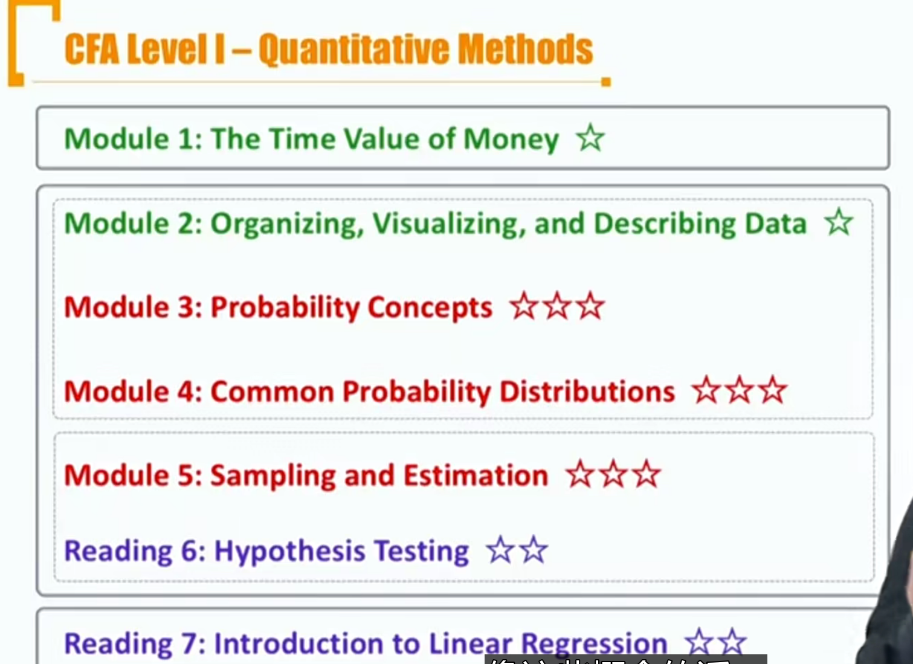
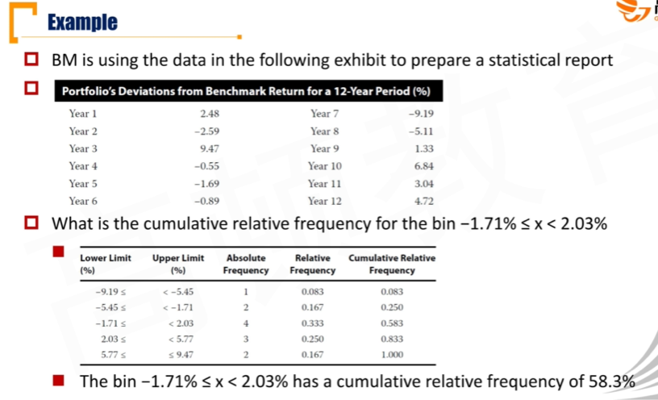
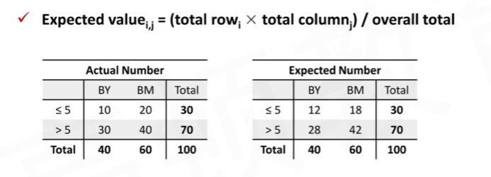
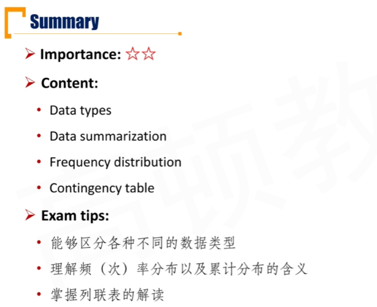
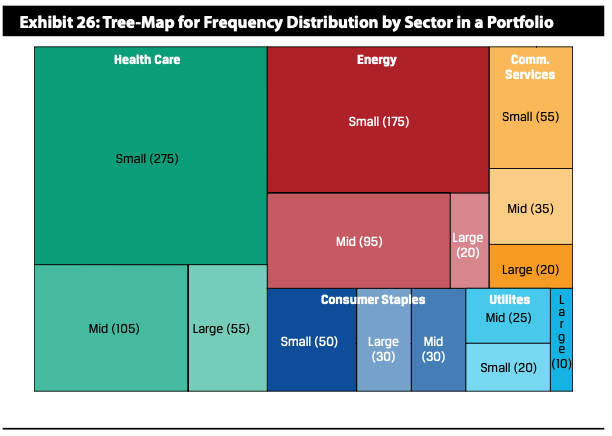
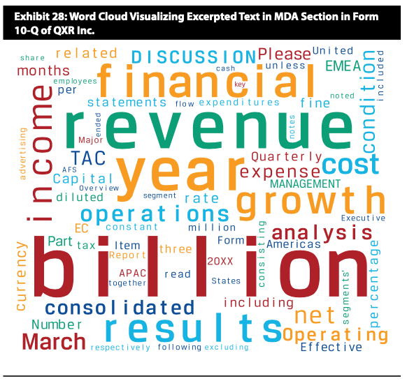
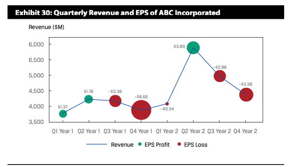
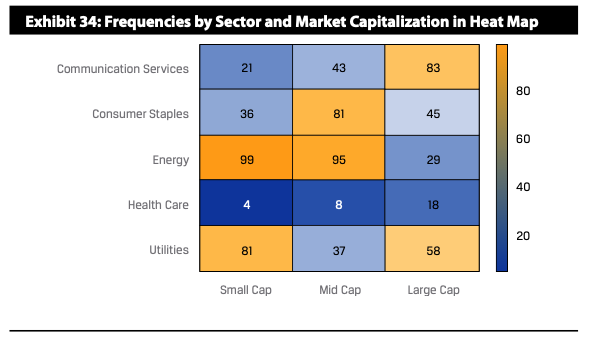
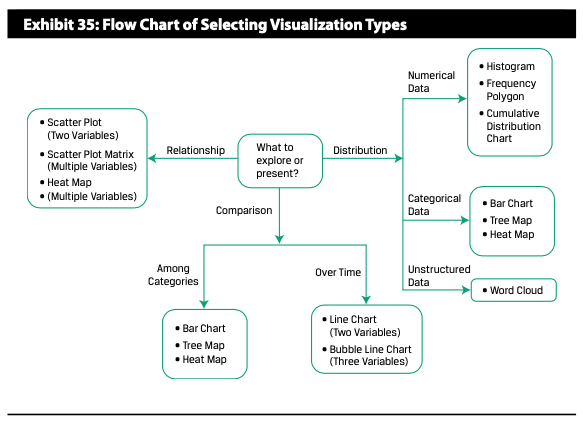
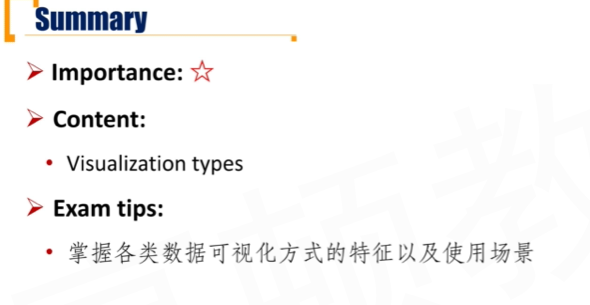

# M0 Introduction

# M1 Time Value of Money

Nominal Interest Rate = Nominal risk-free interest rate + Default risk premium + liquidity premium + maturity premium

Nominal risk-free interest rate = real risk-free interest rate + inflation rate

#### Effective Annual Rate(EAR)

$$
EAR = (1+Periodic\ interest\ rate)^m-1=(1+\frac{r_s}{m})^m-1\\
EAR_{continuous}=e^{r_s}-1
$$

- 如果是单利，就是（1+rn)-1

##### Annuity

Annuity is a set of constant sequential cash flows

Present value of perpetuity
$$
PV = \frac{A}{r}
$$
A is the periodic payment to be received forever等比数列求和

annuity due期初模式和ordinaty annuity期末模式区别

# M2 Organizing, Visualizing and Describing data

## 2.1 Organizing Data

#### Data Types 1

- **Numerical data**
  - continuous data
  - discrete data

- **categorical data(qualitative data)** mutual exclusive(互斥)
  - Nominal data
  - ordinal data
    - 数字之间间隔不一定一样

#### DataType2

- **Cross-sectional data**
  - 不同样本，同一时间
- **Time-series data**
  - 同一样本，不同时间
- **Panel Data**
  - 不同样本、不同时间

#### DataType3

- **Structural data结构化数据**
- **unstructured data**
  - alternative data(另类数据)
  - must transformed into structural data to be processed by model

#### Data summarization

- **Raw data** 原始数据
  - **One-dimensional array**
  - Two-dimensional rectangular array(data table)
    - comprised of cols and rows

#### Frequency Distribution

- A frequency distribution
  - absolute frequency（出现次数）, relative frequency（百分比）
  - cumulative absolute frequency, cumulative relative frequency
    - 累计频次，把之前的累加（积分）
- range极差
- bins，直方图个数
- bins width = range / bins

#### Contingency Table 列联表

contingency table：两个或更多的变量下的分布。

- joint frequencies 联合频次，频次除以总数
- marginal frequencies 边际频次，频次除以某个变量的和

- 列联表作用：
  - 构建分布，反映预期
  - Chi-Square检验

##### Expected value

## 2.2 Visualizing Data

#### Histogram and Frequency Polygon📊

- Histogram depicts shape, center and spread of the distribution of numerical data.
- frequency polygon折线图。把直方图顶点连线。
  - cumulative frequency distribution 累计频次分布

#### Bar Chart 条形图📊

- 用于categorical data
  - bar chart
  - grouped(clustered bar chart) 簇状条形图
  - stacked bar chart 堆积条形图

- Pareto Chart 特殊的条形图
  - 条形图按照频数降序排序，在上方画累计频率折线图
  - use to highlight dominant categories and most important groups

#### Tree Map

- displaying and comparing categorical data
- 适用于categorical data

#### Word Cloud

- unstructured textual data.
- 出现频率

#### Line Chart 折线图

- data series over time
  - bubble line chart: 体现第三维度的数据

#### Scatter Plot 散点图

- 两个维度 joint variation in two numerical variables. 可以体现潜在的分布
  - 体现potential association，正相关还是负相关
  - data range, extreme values，数据范围、和outlier
  - 体现趋势强弱（拟合的误差）

- 体现两个变量的关系。

#### Heat Map

joint frequency among categorial vairables

注意：heat map体现两个categorial data的关系，scatter plot体现的是两个numerical data的关系

- A heat map **differentiates high values from low values and reflect the correlation between variables, ** but does not help in making comparisons of variables over time.

#### Guide

#### Basic Concepts of statistics

- **Desciptive statistics描述性统计**
  - Study of how data can be summarized effectively to decribe the important aspects of large data sets 描述数据特征
- **Inferential statistics** 推断统计
  - Involves making forecasts, estimates, or judgements about a larger group from the smaller group actually abserved
- **Population总体**： all members of a specified group
  - Parameter 总体参数
- Sample 样本
  - Sample statistic 样本统计

#### Quantitative description of distribution

- central tendency
  - 中心趋势, where returns are centered 一阶矩

- dispersion 二阶矩
  - how far returns are dispersed from center

- skewness 三阶矩
  - 偏度 symmetrically shaped

- kurtosis 四阶矩
  - 峰度，更关注尾巴 fatty tail

