# M2 Organizing, Visualizding and Describing Data

## 2.3 Measures of Central Tendency：Means

#### Arithmetic Mean

- Population mean

$$
\mu=\frac{\sum X_i}{N}
$$

- Sample Mean

$$
\bar X = \frac{\sum X_i}{n}
$$

总体平均值，样本平均值（抽样后的均值）

- Arithmetic mean return focus on average **single-period** performance
  - 预测未来的一天，用过去的n天做算术平均

- Advantage
  - easy
  - use all information about size and magnitude
- Disadvantage
  - Sensitive to extreme value
  - 没有考虑每个数字的重要程度

#### Outliers

- A property and potential drawback of the arithmetic mean is its sensitivity to **extreme values or outliers.**
  - Outliers can be measured as the distance between the **mean** and **each outcome,** which is the deviation
  - It is always true that **the sum of the deviations around the mean equals zero**

$$
\sum(X_i-\bar X)=\sum X_i - \sum \bar X = \sum X_i - n \bar X = 0
$$

- how to **deal with extreme value**

  1. if values are legitimate, correct observations, and it is important reflect the whole of the sample distribution, then use the outliers **without any adjustment**

  2. The second option **excludes the extreme observations**
     - 切尾：One measure of central tendency in this case is the **trimmed mean**, which is computed by excluding a stated small percentage of the lowest and highest values and then computing an arithmetic mean of the remaining values. 对称切掉
     - What information can we derive from the relationship between "arithmetic mean" and "trimmed mean"?
       - 如果arithmetic mean < trimmed mean，则表示出现了极低的extreme value.
  3. The third option involves **substituting values for extreme values** 替换掉极端值，winsorized mean 缩尾调整
     - A measure of central tendency in this case is the **winsorized mean**

#### Weighted mean

- A mean in which different observations have different proportional influence on the means

$$
\bar X_w=\sum w_iX_i\\
\sum w_i=1
$$

- w其实不一定要限制0<w<1，小于0的时候，表示做空。大于1表示杠杆。复习：equity
- Weighted mean are mostly used to calculate the portfolio return, or the expected value based on probabilities（期望值就是加权平均）

#### Geometric Mean

- The n-th root of a set of observations

$$
G=\sqrt[n]{\prod X_i}
$$

- Used to calculate average periodic compound rate of return on investment
  - Geometric mean return focus on the profitability of an investment over a **multi-period** horizon 平均回报率，复利. 预测多期

$$
Periodic\ return_{compound}=\sqrt[n]{\prod (1+R_i)}-1
$$

其实就是$(1+r)^n=\prod (1+r_i)$

- 对比算数平均：
  - 算数平均，知道过去n期的收益率，预测未来一期的收益率（single period）
  - 几何平均，知道过去n期的收益率，预测未来多期的收益率（multi-period）

#### Harmonic Mean 调和平均数

$$
\bar X_{harmonic} = \frac{N}{\sum \frac{1}{X_i}}
$$

- Used to find the average cost per share of stock purchased over time in constant dollar amounts. 复习（市盈率）。用相同的金额买各个股票，计算平均成本。

- What is the difference between TWR and Geometric Mean?
  - 几何平均数预测未来multi-period的平均数时候，过去的样本的时间间隔需要一样。
  - 算数加权平均没有这个要求。

- What is the difference between the financial applications for the arithmetic mean and harmonic mean?
  - 算数平均数，portfolio中每只股票买的数量相同，求平均成本
  - 调和平均数，portfolio中每只股票买的金额相同，求平均成本

- When will Harmonic Mean cannot be used?
  - 几何平均数中，数字乘积不一定能开根号（比如根号负二）
  - 如果是0，就不可用调和平均
- **Comparison among different means**
  - **harmonic mean <= Geometric mean <= arithmetic Mean**
    - 当且仅当全部数据相等的时候，等号成立（高中数学证明，归纳法）
    - greater variability of the different observations, the more the arithmetic mean will exceed the geometric mean and harmonic mean as well
      - 数据越分散，算数平均数会越大于几何、调和平均数

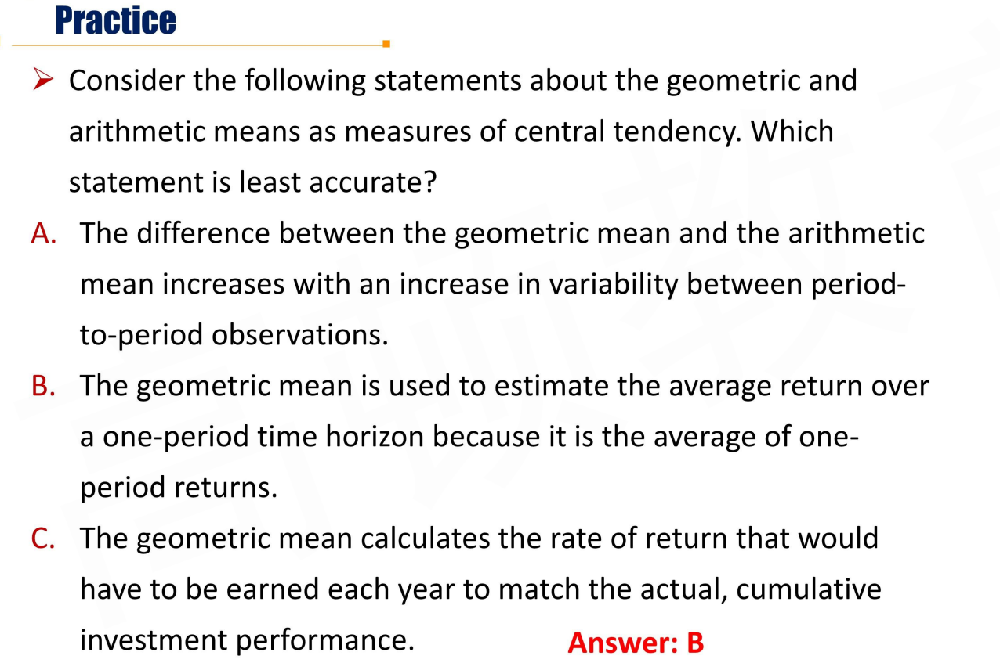

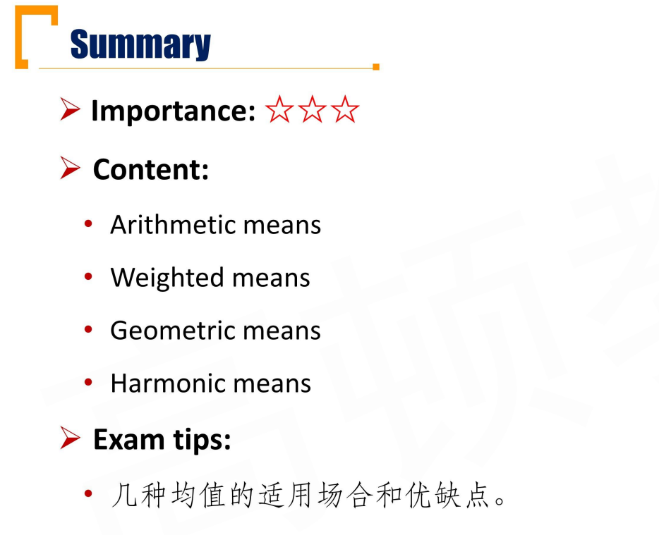

## 2.4 Measure of Central Tendency: Median and Mode

#### Median

- The value of the middle item of a set of items sorted in to ascending or descending order
  - **Odd** number of n items, median occupies the (n+1)/2 position
  - **Even** number of n items, median is equal to the mean of the items occupying the n/2 and (n+2)/2 positions 偶数时是中间两个数的算数平均
- **Advantage** not affected by extreme values(a.k.a. outliers) as arithmetic mean.
- **Disadvantage**: only one or two numbers are considered, rest is to be ignored.

#### Mode 众数

- Most frequently.
- The distribution could have more than one mode(bimodal双众数, trimodal三个众数, etc.), or even no mode. 不一定有众数，或者不一定只有一个众数

- Continuous distribution may not have **a modal outcome** 连续变量不一定有众数
- Grouped into bins, find **the modal interval(or intervals)** 连续变量可以用直方图（以区间为bin）

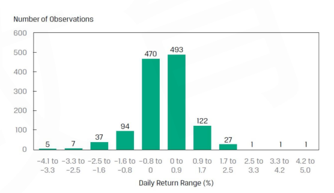

- The mode is **the only measure of central tendency** that can be used with **nominal data**(定性数据，categorical data，比如第一组、第二组)
  - For example, when we categorize investment funds into different styles and assign a number to each style, the mode of these categorized data is the most frequent investment fund style，投资风格归类

#### Quantile 分位数

- **Quantile(or fractile)** is an approach to describe the location of data that involves identifying values at or below which specified proportions of the data lie.
- Is quantile used to measure the central tendency?
  - 不一定，三分位数，不是在中间。如果是两分位数，就是median，衡量中心趋势
- A value at or below which a stated fraction of the data lies
  - **Quartiles**: the distribution divided into **quarters** 四分
  - **Quintiles**: the distribution divided into the **fifths** 五分
  - **Deciles**: the distribution divided into the **tenths** 十分
  - **Percentiles**: the distribution divided into the **hundredths**.
- Quantiles are often used to **rank** performance evaluation and investment research 用于业绩排序

- The formula for the position(or location ) of a percentile in an array with n entries sorted in **ascending order** is:

$$
L_y=(n+1)\times \frac{y}{100}
$$

- y is the **percentage point** at which we are dividing the distribution
- $L_y$ is the location of the percentile($P_y$) in the array sorted in ascending order

- As the sample size increases, the percent-ile location calculation become more accurate
- When $L_y$ is not a integer, $L_y$ lies between the two closest integer numbers(one above and one below), and we use **linear interpolation** between those two places to determine $P_y$
  - 线性插值法。比如第8.8个，用第8个和第9个插值

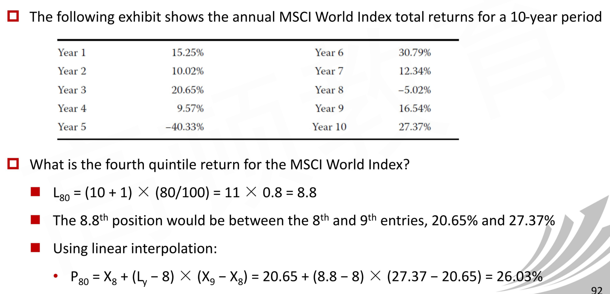

- 实际上就是直线上找点，求出$P_{80}$

$$
\frac{P_{80}-X_8}{L_y-8}=\frac{X_9-X_8}{9-8}
$$

- 1. 先找位置；2. 再找插值

##### Box and whisker plot 箱线图

- One way to visualize the dispersion of data across quartiles is to use a diagram, such as a **box and whisker plot**

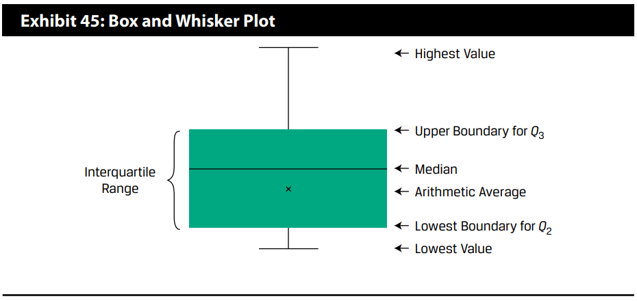

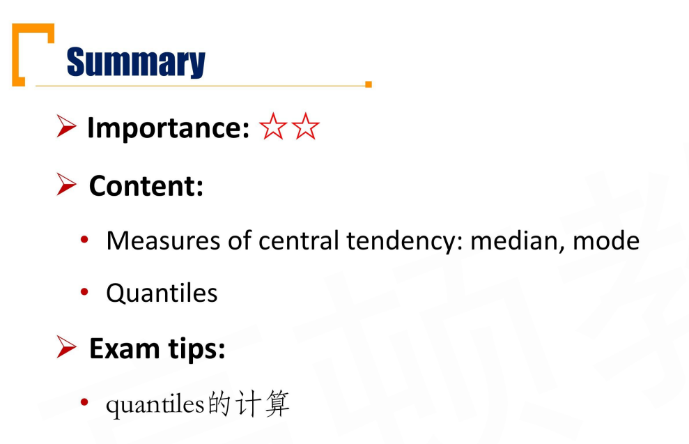

## R2.5 Measures of Dispersion: Range, MAD, Variance & Standard Deviation 

数据离散程度

#### Measures of Dispersion

- Dispersion describes the variability around the central tendency, usually used to address the risk 度量风险（不确定性：离散程度）
  - Range 极差
  - Mean absolute deviation 平均绝对差
  - Variance
  - Standard deviation

#### Range and MAD

- **Range = Maximum - Minimum**
- Easy for computation, but only use two numbers and tell nothing about the distribution of the data set.
  - 一种用法，结合分位数。看分位数的极差的变化趋势。
- **Mean Absolute Deviation(MAD)** 平均绝对差

$$
MAD= \frac{\sum |X_i-\bar{X}|}{n}
$$

- notice: $\bar X$ is sample mean, $n$ is observation number.
- MAD就是距离的算数平均数。

#### Variance

- Population

$$
\sigma^2=\frac{\sum(X_i-\mu)^2}{N}
$$

- Sample 

$$
s^2=\frac{\sum(X_i-\bar X)}{N-1}
$$

样本方差上分子上的平均值是样本均值。

样本方差分母上是N-1才是无偏估计。

#### Standard Deviation 

从方差平方后，能够恢复数据的数量级。

- Population

$$
\sigma=\sqrt{\frac{\sum(X_i-\mu)^2}{N}}
$$

- Sample

$$
s=\sqrt{\frac{\sum(X_i-\bar X)}{N-1}}
$$

#### Relationship

- The relationship between the arithmetic mean$\bar X$ and geometric mean $\bar X_G$ is 

$$
\bar X_G\approx\bar X - \frac{s^2}{2}
$$

- The larger the variance of the sample, the larger the gap between the geometric mean return and the arithmetic mean return
- 注意这里的是样本方差。

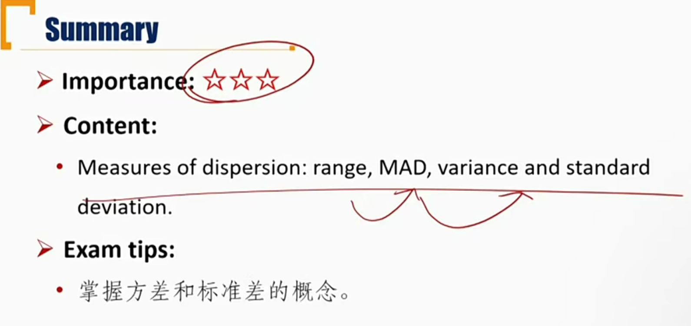

## R2.6 Downside Deviation and coefficient of variation

#### Downside risk

- Questions

  - What is the risk?
    - 不确定性

  - Why can we use variance or standard deviation to measure the risk?
    - 方差代表离散程度，离散程度越大代表不确定性越大

  - What kind of risks do investors really care about?
    - 只关注亏损的风险

- The target downside deviation(a.k.a target semi-deviation) is a mreasure of dispersion of the below the target
- Sample target semi-deviation formula

$$
s_{target}=\sqrt{\sum_{i\in [1,n],X_i\le B}{\frac{(X_i-B)^2}{n-1}}}
$$

- B is the target 
- n is the total number of sample observations
  - 注意，分母是所有样本数，而不是满足X<=B的样本数

##### Question

- When target(B) becomes higher, how does target semi-deviation changes?
  - B提高，$s_{target}$肯定提高。（引入了更多的样本，原有样本和B的距离也变大，分母不变）
- How does the target downside deviation relate to the sample standard deviation?
  - $B = \bar X$的时候，显然s_target < s。如果B很大，显然s_target > x，所以B在$\bar X$ 右边某个位置时，和s相等。

#### Coefficient of variation(CV) 变异系数

- The ratio of the standard deviation of a set of observations to their mean value

$$
CV = \frac{S}{\bar X}
$$

- CV has no units of measurement, so permits direct comparisons of dispersions across different data sets（不同数量级之间的离散程度比较）
- A measure of risk per unit of mean return, thus the lower is better
  - 含义：单位均值，承担多少风险
- 变异系数考虑的是相对离散程度，去除了样本的数量级

#### Sharpe Ratio 夏普比率

- The ratio of the mean excess return（超额收益） of portfolio P to the standard deviation of the returns of portfolio P

$$
Sharpe\ ratio=\frac{\bar R_p-\bar R_F}{\sigma_P}
$$

- 一单位风险，带来多少超额收益;
  - 对比CV：一单位收益，承担多少风险
- No units of measurement, so permits direct comparisons of dispersions across different data sets
- A measure of excess return per unit of risk, thus the higher is better(only valid for positive Sharpe ratio)

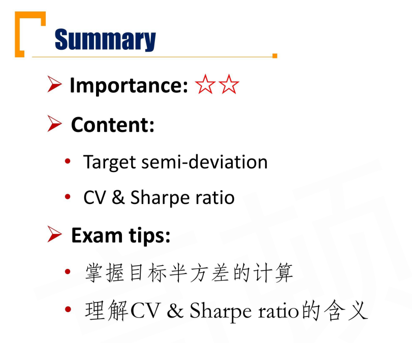

## R2.7 Skewness and Kurtosis 

偏度峰度

#### Skewness

- Indicating the degree of symmetry of return distributions

$$
Sample\ skewness(S_k)=[\frac{n}{(n-1)(n-2)}]\frac{\sum (X_i-\bar X)^3}{s^3}
$$

- Where: n is the sample size
  - s is the sample standard deviation

- $S_k = 0 \implies $ Symmetrical distribution 偏度等于0的时候，意思是对称分布

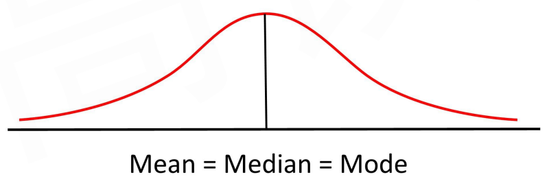

- $S_k > 0 \implies $ Positively (right) skewed distribution 右偏（正偏）
  - 有极端大的样本

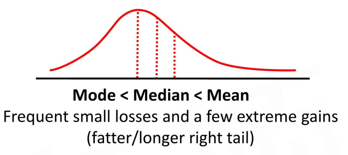

- $S_k < 0 \implies $ Negatively(left) skewed distribution 左偏（负偏）
  - 有极端小的样本

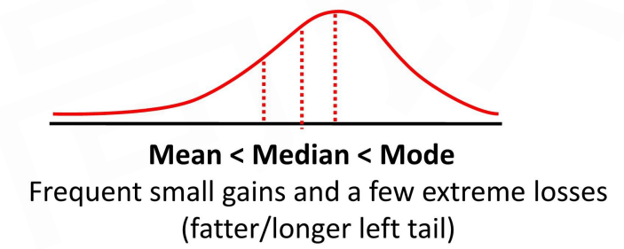

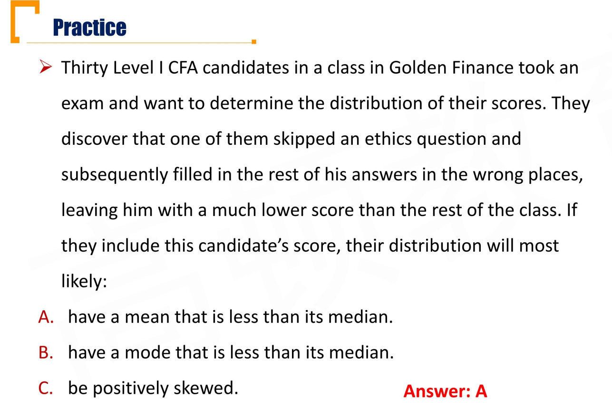

- 拉低了平均分。左偏。负偏。

#### Kurtosis 峰度

- Measuring the degree to which the distribution is **more or less peaked than normal distribution(正态分布)**

$$
Sample\ kurtosis(K) =[\frac{n(n+1)}{(n-1)(n-2)(n-3)}]\frac{\sum (X_i-\bar X)^4}{s^4}
$$

- **Excess kurtosis = kurtosis - 3**
  - 正态分布的kurtosis = 3.
- **Leptokurtic**
  - More peaked, fatter tailed than normal distribution
  - Kurtosis > 3, excess kurtosis > 0
  - 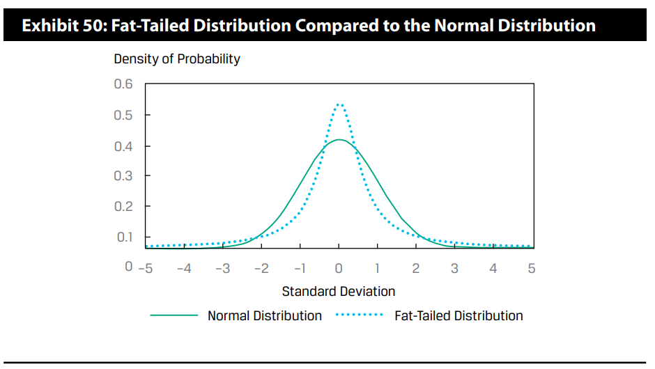
- **Mesokurtic**
  - Identical to normal distribution
  - Kurtosis = 3, excess kurtosis= 0

- **Platykurtic**
  - Less peaked, thinner tailed than normal distribution
    - Kurtosis < 3, excess kurtosis < 0

上面三个结论，这里其实有一个assumption: 一、二、三阶矩都相等的情况下，和正态分布对比。也就是均值、方差、偏度一致的情况下，才可以用kurtosis>3判断尖峰和肥尾。（和t分布对比：和正态分布方差不一样，导致没有尖峰但又有肥尾）

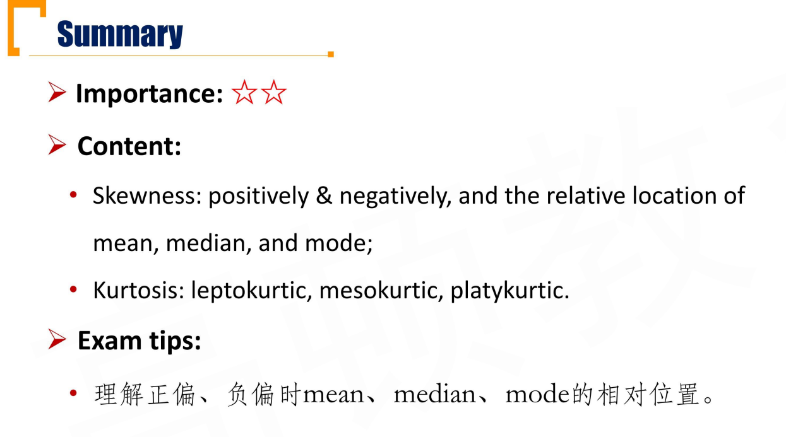

## R2.8 Covariance and Correlation\*\*\*

- covariance is a measure of how two **pair variables** **move together, and it measures the linear relationship ** between the two variables
  - 反映的是**线性关系**！
- **Auto-covariance自协方差** is equal to the **variance**
- **Sample covariance(Sxy)**

$$
s_{XY}=\frac{\sum_{i=1}^{n} (X_i-\bar X)(Y_i-\bar Y)}{n-1}
$$

- covariance values from negative infinity to positive infinity ($(-\infin,+\infin)$)

##### Covariance

- **Zero covariance**
  - $s_{xy}=0 \iff$**no linear relationship** between two variables
  - 只能推出没有线性关系，不能说没有关系（$Y = X^2$, (-1,1), (1,1)两个样本，显然样本协方差等于0，有关系，但没有线性关系）
- **Positive covariance**
  - Two variables **tend** to be above or below their mean value at the same time
  - Two variables **tend** to increase or decrease at the same time
- **Negative covariance**
  - One variable **tend** to be above its mean value when the other is below its expected value
  - One variable **tend** to increase when the other decreases.

#### Correlation

- **Correlation** is a standardized measure of **linear relationship** between two variables. 把数量级的因素去除，没有单位

$$
\rho_{i,j}=\frac{cov(R_i,R_j)}{\sigma_i\sigma_j}\\
r_{i,j}=\frac{cov(R_i,R_j)}{s_is_j}
$$

- Correlation values range from **$+1$(perfect positive correlation) and $-1$(perfect negative correlation)**
  - a correlation of 0 (uncorrelated variables) indicates an absence of any linear(that is, straight-line) relationship between the variables
  - a positive correlation close to $+1$ indicates a strong positive linear relationship
  - A negative correlation close to $-1$ indicates a strong negative (that is, inverse) linear relationship

##### Important question

-  $\rho=0$能否推出 no relationship（互为独立变量）?不可以
  - two variables has no relationship $\implies \rho=0$
  - 但是$\rho = 0$只能推出没有线性关系，不能推出没有关系
- $\rho > 0$ vs. $\rho <0$
  - tend to 的意思是整体趋势。比如$\rho >0$时，并不是所有样本都会正相关，也会出现相反的关系，只是整体趋势正相关。

- $\rho = 0.8$ vs. $\rho = 0.5$
  - 趋势性更明显相关系数越大

-  $\rho=1$
  - $\rho=1$时候，(x,y)所有样本构成一条斜向上的直线。（和斜率无关）
- $\rho=0$, 
  - 只要散点图没有趋势，都是$\rho=0$，和具体的分布无关

#### Limitations of correlation analysis 局限性

- Two variables can have a **strong nonlinear relation** and still have a **very low correlation** 不一定是线性相关
- The correlation may be **quite sensitive to outliers** 极端值影响
- Correlation **does not imply causation(因果)** 相关系数不能说明两个变量之间存在因果关系
- The term **spurious（虚假的） correlation** has been used to refer to: 
  - Correlation between two variables that reflects chance relationships in a particular dataset 某些条件下才有相关性（和数据集相关）
  - Correlation induced by a calculation that mixes each of two variables with a third variable 如果非线性变化后存在相关性，不能说明原来的变量有相关性（但是线性变化可以倒推）
  - Correlation between two variables arising not from a direct relation between them but from their relation to a third variable
    - 不存在传递性。比如下面两个正相关：年龄-身高，年龄-词汇量；不能推出身高和词汇量之间有关系。

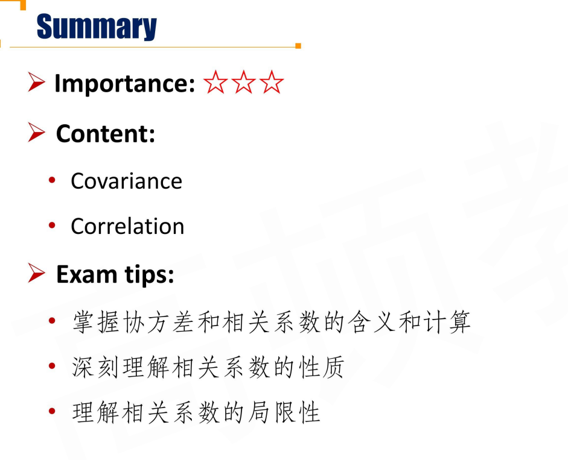

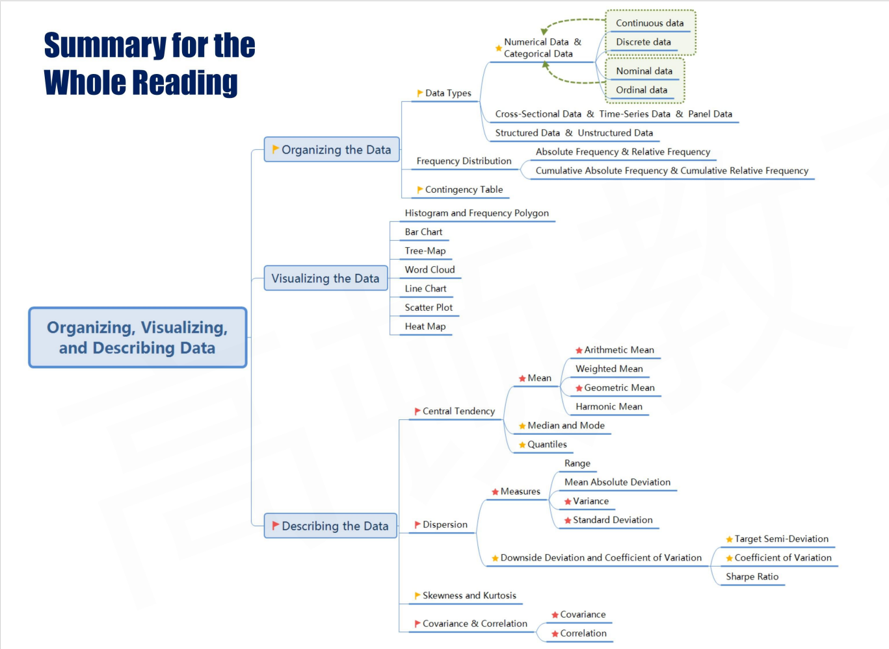

