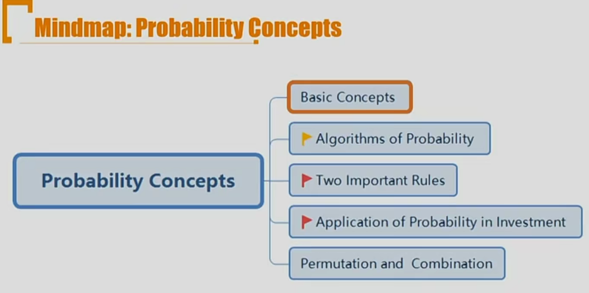
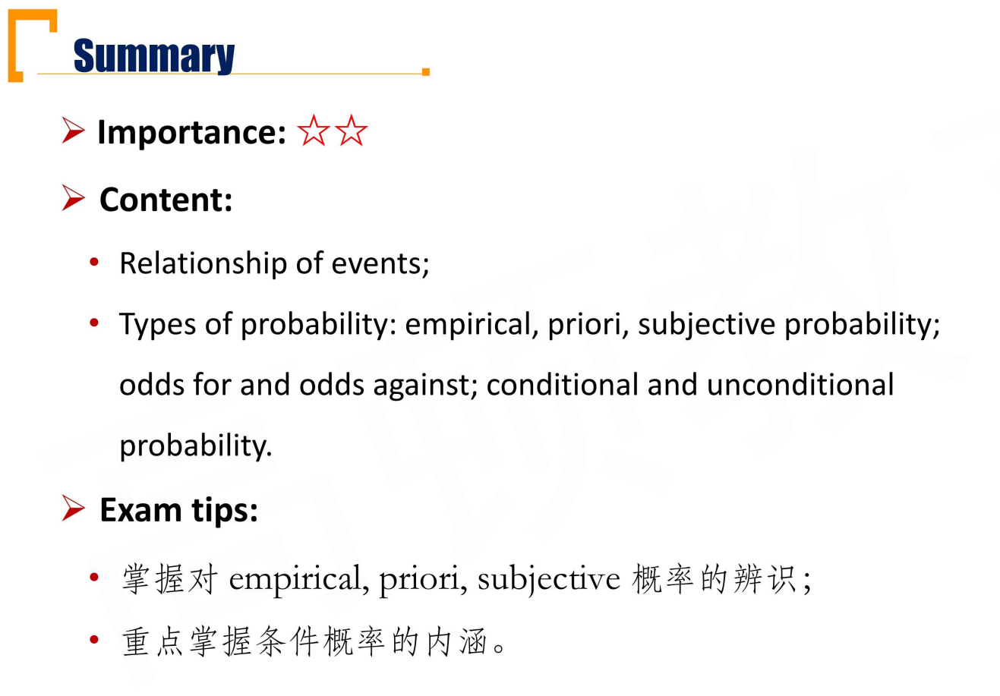
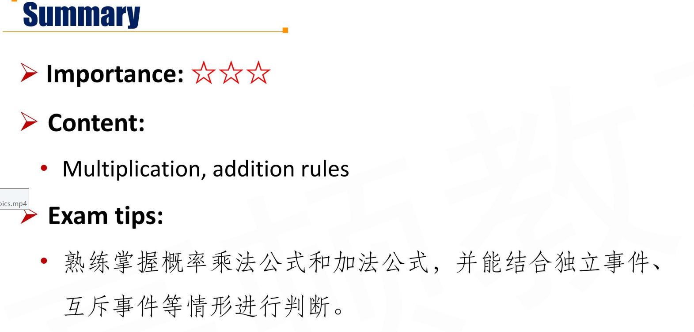
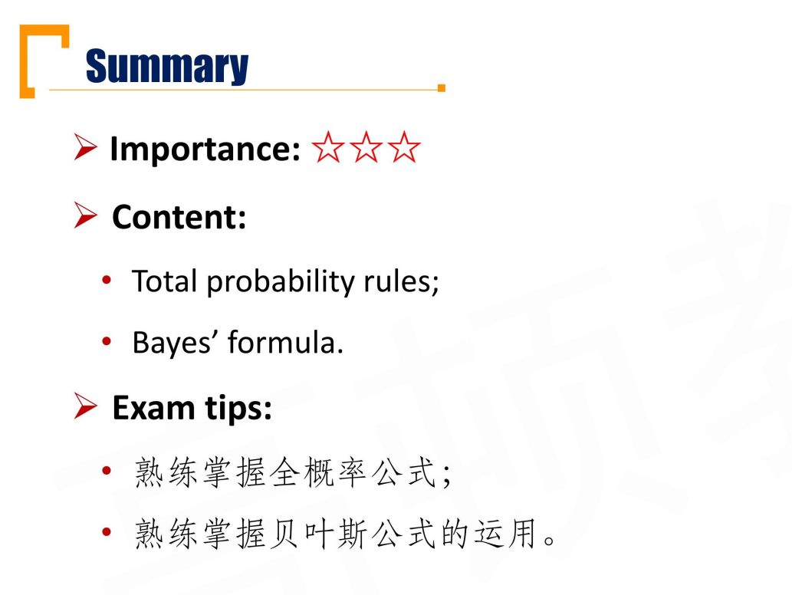
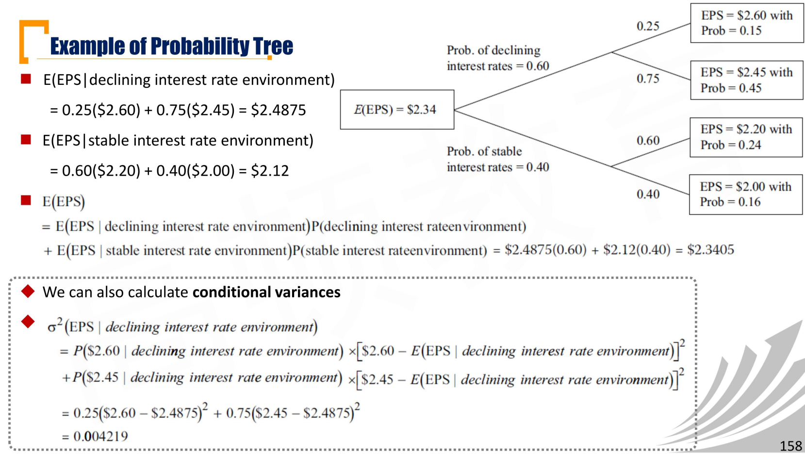
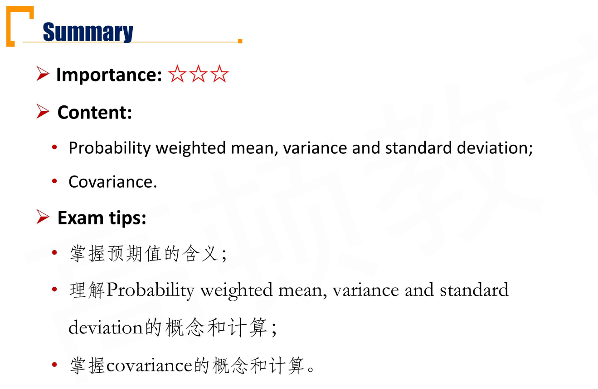
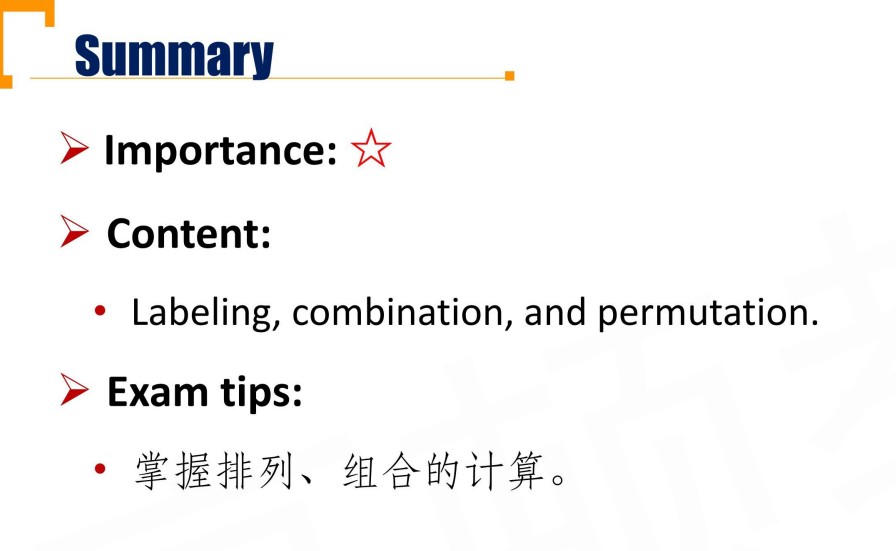
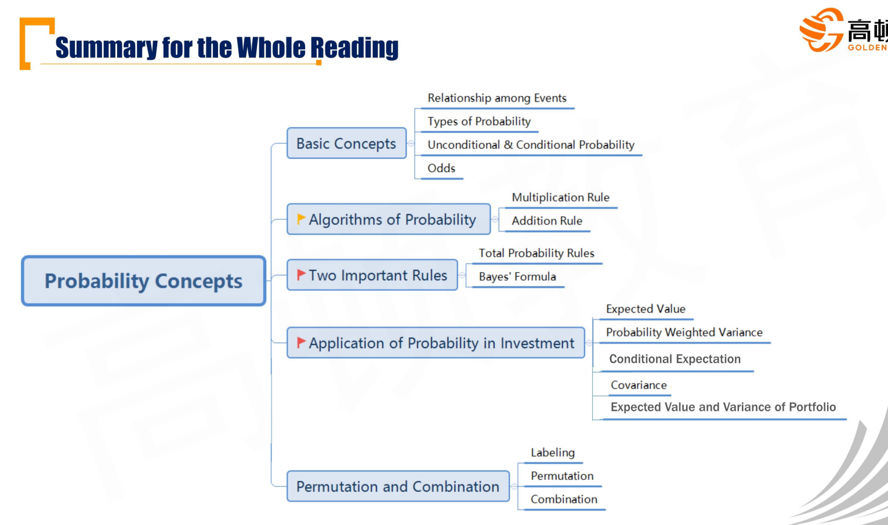

# M3 Probability Concepts

## R3.1 Basic Concepts

#### Terminology of Probability

- **Random variable**
  - A quantity whose possible values are uncertain
- **Outcomes**
  - The possible values of a random variable
- **Event**
  - A specified set of outcomes

#### Relationship among Events

- **Mutually exclusive events** 互斥事件
  - The events competing directly with each other that they would not happen at the same time
- **Exhaustive events** 遍历事件
  - Events cover all possible outcomes。
  - A和B的并集是全集，则A和B是exhaustive events
- **Independent events**独立事件
  - Occurrence of event A does not influence the occurrence of the event B, then A and B are independent

- **Dependent events**非独立事件
  - Occurrence of event A does influence the occurrence of the event B, then A and B are dependent
    - 注意，如果两个事件互斥，则两个事件是非独立事件。因为A发生，B肯定不发生。所以A和B之间有影响。

#### Two defining properties of a probability

- The probability for any event E 

$$
0\le P(E)\le1
$$

- For a set of events that are mutually exclusive and exhaustive, the sum of probabilities is 1. 互斥且互补（遍历）的所有事件，发生概率为1.

$$
\sum P(E_i)=1
$$

#### Types of probability

- Objective probability
  - **Empirical probability** 经验概率
    - Estimate the probability of an event based on historical data
    - 由过去的数据，推测未来

  - **Priori probability** 先验概率
    - Deduced based on logical analysis rather than on observation or personal judgment
    - 用过去的数据，计算某个过去事件的概率。

- **Subjective probability**
  - Drawing on personal or subjective judgment without reference to any particular data.
  - 对经验概率进行主观修正，就变成主观概率。

#### Unconditional and Conditional Probability

- **Unconditional probability(marginal probability)** 
  - Probability of an event (A) not conditioned on another event, denoted P(A)
  - e.g., probability of market will be up for the day
- **Conditional probability** 条件概率
  - Probability of an event(A) conditioned on another event(B), denote(P(A|B))
  - E.g., probability that the market will be up for the day, given that the Fed raises interest rates.
  - For independent events: $P(A|B) = P(A)$
    - 独立事件是相互的。只有上式子，不能推出AB独立，需要结合P(B|A) = P(B)才可以。

#### Odds 赔率

- **Odds for the event E**
  - P(E) / (1 - P(E)), given a probability P(E)

- **Odds against the event E**
  - (1-P(E))/P(E), given a probability P(E)

- Example:
  - Given P(horse will win the race) = 1/8, what are the odds for or against the horse will win the race?
  - odds for win: 1/8/(1-1/8)=1/7
  - odds against win: (1-1/8)/1/8=7

## R3.2 Algorithms of Probability

#### Joint Probability 联合概率

- joint probability is the probability of event A and B both happen, denoted P(AB)
- If mutually exclusive events?
  - P(AB) = 0 $\iff$ 互斥
- conditional probability for the above question?
  - P(A|B) = 0

#### Multiplication rule

$$
P(A|B)=P(AB)/P(B)
$$

- joint probability for event A and B, if they are independent?
  - P(AB) = P(A)P(B) $\iff$ A、B independent
- joint probability for event A and B, if mutually exclusive?
  - P(AB)=0 $\iff$ A、B互斥

#### Additional Rule

- Probability that at least one of two events occur, denoted as P(A or B) or P(A+B)

$$
P(A+B) = P(A)+P(B)-P(AB)
$$

- A、B， independent
  - P(A+B)=P(A)+P(B)-P(A)P(B)
- mutually exclusive
  - P(A+B)=P(A)+P(B)

- P(A+B+C)=P(A)+P(B)+P(C)-P(AB)-P(BC)-P(AC)+P(ABC)
  - inclusion-exclusion principle

## R3.3 Two Important Rules

#### Total probability rule

- Explains the unconditional probability of the event in terms of probabilities conditional on the scenarios

$$
P(A)=\sum_{i=1}^{n}P(A|S_i)P(S_i)
$$

- $S_i$ are the mutually exclusive and exhuastive

#### Bayes' Formula

- Given a **prior probabilities P(A)** for an event of interest, if you receive **new information(B),** the rule for updating your probability(**updated probability, P(A|B)**) of the event

$$
P(A|B)=\frac{P(B|A)P(A)}{P(B)}
$$

##### Questions

- What is the meaning behind bayes' formula?
  - 因果倒置. 
  - 新补充信息，对先验概率进行动态调整。
- combine with total probability rule?
  - 一般通过全概率公式，把P(B)求出来

##### Important Example

- BY asked BM if she had gone dancing in the square so that she forgot to cook. THe lie detector can be used to detect if BM lies or not.
  - probability that BM lies is 0.7
  - if BM lies, the probability that she test result is "lied" is 0.9
  - If BM doesn't lie, the probability that the test result is "lied " is 0.2
  - What is the probability that BM does lie given the test result is "lied"?
- Answer:
- A: BM lied, B: test result lied
- P(A) = 0.7, P(B|A)=0.9
- $P(B)=P(A)P(B|A)+P(\bar A)P(B|\bar A)=0.7*0.9+0.3*0.2=0.69$
- 求P(A|B)=P(B|A)P(A)/P(B),  所以，P(A|B)=0.9*0.7/0.69=0.91

- 另一个理解方法：二叉树：

## R3.4 Application of Probability in Investment \*\*\*

#### Expected Value(E(X))

- Expected value is the probability weighted average of the possible outcomes of the random variable(X)

$$
E(X)=\sum_{i=1}^{n} P(X_i)X_i
$$

- E(X) 是一个常数, $X_i$ is one of n possible outcomes of the random variable X.
- 拓展:和全概率公式结合在一起，引入条件期望

$$
E(X)=\sum P(S_i)E(X|S_i)
$$

#### Probability Weighted Variance and Standard Deviation

$$
Var(X)=\sigma^2(X)=\sum P(X_i)(X_i-E(X))^2
$$

- standard deviation: positive squared root of variance
- $Var(X) = E(X^2)-(EX)^2$

#### Conditional Expectation

- **Conditional expected value** is the expected value of a random variable X given an event or scenario S is denoted E(X|S) 条件期望

$$
E(X|S)=\sum_{i=1}^{n}P(X_i|S)X_i
$$

- **Total probability rule for expected value**

$$
E(X)=\sum_{i=1}^{n}{P(S_i)E(X|S_i)}
$$

- Where $S_i$ are mutually exclusive and exhaustive scenarios or events
  - 全集$\Omega=\{S_1,S_2,...,S_n\}$

#### Covariance

$$
Cov(X,Y)=E[(X-EX)(Y-EY)]=\\
	\sum_i\sum_j P(X_iY_j)(X_i-EX)(Y_i-EY)
$$

- 拓展：

$$
Cov(X,Y)=EXY-EXEY
$$

#### Expected Value and Variance of Portfolio

- **Expected return of portfolio**

$$
R(R_p)=E(\sum_i w_iR_i)=\sum_i w_i E(R_i)
$$

- **Variance of portfolio**

  - For Two assets \*\*\* 注意协方差上有系数2，通过展开Var(Rp)可以证明

- $$
  \sigma^2(R_p)=w_1^2\sigma^2(R_1)+w_2^2\sigma^2(R_2)+2w_1w_2cov(R_1, R_2)
  $$

  - For three assets

- $$
  \sigma^2(R_p)=w_1^2\sigma^2(R_1)+w_2^2\sigma^2(R_2)+w_3^2\sigma^2(R_3)+2w_1w_2cov(R_1, R_2)+2w_1w_3cov(R_1, R_3)+2w_2w_3cov(R_2, R_3)
  $$

  - For any size n 用数学归纳法证明，还可以用线性代数表达为协方差矩阵

- $$
  \sigma^2(R_p)=\sum_i\sum_j w_iw_jcov(R_i,R_j)\\
  =w^T\Sigma w
  $$

  

- 

## R3.5 Permutation and Combination

#### Labeling

- The number of ways that n objects can be labeled with k different labels, with n1 of the first type, n2 of the second type, and so on, with n1+n2+...+nk=n

$$
Number\ of\ labeling=\frac{n!}{\prod_{i=1}^kn_i!}
$$

- Proof:
  - 实际上就是按照n1, n2, n3, ..nk分组，所以

$$
Labeling\ numbers=C^{n1}_nC^{n2}_{n-n_1}...C^{nk}_{n-n_1-...-n_{k-1}}
$$

- 展开上面式子就得到分组个数

#### Permutation

- The number of ways that we can choose r objects fro a total of n objects, when the order in which the r objects are listed **does matter**. 有序抽取

$$
P_n^r=\frac{n!}{(n-r)!}
$$

#### Combination

- The number of ways that we can choose r objects from a total of n objects, when the order in which the r objects are listed **does not matter**

$$
C_n^r=\frac{n!}{(n-r)!r!}
$$

